# Report: string stability of learned car-following models

Generated by `python scripts/make_report.py` on 2026-10-08T19:22:28. Tables (CSV, LaTeX) in `tables/`, figures (PNG, PDF) in `figures/`, inputs, hashes and versions in `manifest.json`. Every number below is read from a table or from the run files.

## 1. Data and runs

Run directories found under the runs root (`<experiment>/<event set>/<model>/<split>_fold<k>_seed<s>`; trained: with metrics.json; configs: hash of the sorted config hashes of their metrics.json, as in manifest.json).

| experiment | event sets | models | folds | seeds | runs | trained | configs |
|---|---|---|---|---|---:|---:|---|
| e1 | follownet_highd | gru, idm, knn, lstm, mlp, newell, ovm, perl, persistence, pidl, residual_idm | 0, 1, 2, 3, 4 | 0, 1, 2, 3, 4 | 175 | 175 | `b5a45c4694a6` |
| e2_combined_j0.1 | follownet_highd | gru, lstm, perl | 0, 1, 2, 3, 4 | 0 | 11 | 11 | `260fb73808fb` |
| e2_combined_j1 | follownet_highd | gru, lstm, perl | 0, 1, 2, 3, 4 | 0 | 7 | 7 | `23f1b92c518e` |
| e2_existence | follownet_highd | gru, lstm, perl | 0, 1, 2, 3, 4 | 0 | 15 | 15 | `075c8c5f46a6` |
| e2_gain_long_w0.1 | follownet_highd | gru, lstm | 0 | 0 | 2 | 2 | `eb4ed8179e42` |
| e2_gain_w0.01 | follownet_highd | gru, lstm, perl | 0, 1, 2, 3, 4 | 0 | 15 | 15 | `8f9f693e0f17` |
| e2_gain_w0.1 | follownet_highd | gru, lstm, perl | 0, 1, 2, 3, 4 | 0, 1, 2, 3, 4 | 75 | 75 | `06fd5dac8440` |
| e2_gain_w1 | follownet_highd | gru, lstm, perl | 0, 1, 2, 3, 4 | 0 | 15 | 15 | `8eca95dd3108` |
| e2_gain_w10 | follownet_highd | gru, lstm, perl | 0, 1, 2, 3, 4 | 0 | 15 | 15 | `e547bc91b442` |
| e2_jacobian_w0.01 | follownet_highd | mlp, pidl, residual_idm | 0, 1, 2, 3, 4 | 0 | 15 | 15 | `608982216127` |
| e2_jacobian_w0.1 | follownet_highd | mlp, pidl, residual_idm | 0, 1, 2, 3, 4 | 0, 1, 2, 3, 4 | 35 | 35 | `aedda526af75` |
| e2_jacobian_w1 | follownet_highd | mlp, pidl, residual_idm | 0, 1, 2, 3, 4 | 0, 1, 2, 3, 4 | 35 | 35 | `104c575860fa` |
| e2_jacobian_w10 | follownet_highd | mlp, pidl, residual_idm | 0, 1, 2, 3, 4 | 0, 1, 2, 3, 4 | 35 | 35 | `7bc8f5c89a5b` |
| e2_monotone_w1 | follownet_highd | mlp, pidl, residual_idm | 0 | 0 | 3 | 3 | `866a6c60d127` |
| e3_reference | ngsim_i80 | idm | 0, 1, 2, 3, 4 | 0 | 5 | 5 | `eb36c9dd5e2c` |
| e4_free_ft | ngsim_i80 | mlp, residual_idm | 0, 1, 2, 3, 4 | 0, 1, 2, 3, 4 | 50 | 50 | `952c4724ad08` |
| e4_free_r0.3 | follownet_highd | residual_idm | 0, 1, 2, 3, 4 | 0, 1, 2, 3, 4 | 25 | 25 | `4da179549e35` |
| e4_free_r0.3_ft | ngsim_i80 | residual_idm | 0, 1, 2, 3, 4 | 0, 1, 2, 3, 4 | 25 | 25 | `8a57e8306f3b` |
| e4_margin_free_r0.3 | follownet_highd | residual_idm | 0, 1, 2, 3, 4 | 0, 1, 2, 3, 4 | 25 | 25 | `efde0c0d1832` |
| e4_margin_free_r0.3_ft | ngsim_i80 | residual_idm | 0, 1, 2, 3, 4 | 0, 1, 2, 3, 4 | 25 | 25 | `3b77e7670313` |
| e4_stable | follownet_highd | residual_idm | 0, 1, 2, 3, 4 | 0, 1, 2, 3, 4 | 25 | 25 | `626ff95b1393` |
| e4_stable_ft | ngsim_i80 | residual_idm | 0, 1, 2, 3, 4 | 0, 1, 2, 3, 4 | 25 | 25 | `8f3b0944c7d2` |
| e4_stable_ft_r0.1 | ngsim_i80 | residual_idm | 0, 1, 2, 3, 4 | 0, 1, 2, 3, 4 | 25 | 25 | `7d854840eb8f` |
| e4_stable_ft_r0.2 | ngsim_i80 | residual_idm | 0, 1, 2, 3, 4 | 0, 1, 2, 3, 4 | 25 | 25 | `421fd3204939` |
| e4_stable_ft_r0.5 | ngsim_i80 | residual_idm | 0, 1, 2, 3, 4 | 0, 1, 2, 3, 4 | 25 | 25 | `ee31a172e180` |
| e4_stable_r0.1 | follownet_highd | residual_idm | 0, 1, 2, 3, 4 | 0, 1, 2, 3, 4 | 25 | 25 | `ef265b352ebc` |
| e4_stable_r0.2 | follownet_highd | residual_idm | 0, 1, 2, 3, 4 | 0, 1, 2, 3, 4 | 25 | 25 | `86ddab1357b1` |
| e4_stable_r0.5 | follownet_highd | residual_idm | 0, 1, 2, 3, 4 | 0, 1, 2, 3, 4 | 25 | 25 | `24e83df84b30` |
| e5 | openacc_acc, openacc_human | gru, idm, lstm, mlp | 0, 1, 2, 3, 4 | 0 | 40 | 40 | `e59cda2e1931` |
| e5_gain_w0.1 | openacc_acc, openacc_human | gru, lstm | 0, 1, 2, 3, 4 | 0 | 20 | 20 | `30b76368cb9f` |
| e5_jacobian_w1 | openacc_acc, openacc_human | mlp | 0, 1, 2, 3, 4 | 0 | 10 | 10 | `1badc3f58e41` |
| m2 | follownet_highd | gru, idm, knn, lstm, mlp, newell, ovm, perl, persistence, pidl, residual_idm | 0 | 0 | 11 | 11 | `b42f0716d4d6` |
| m2_acc0 | follownet_highd | gru, mlp, residual_idm | 0 | 0 | 3 | 3 | `87368ccbb67a` |
| m2_acc01 | follownet_highd | residual_idm | 0 | 0 | 1 | 1 | `fe4a6a5c4410` |
| m2_epoch0 | follownet_highd | residual_idm | 0 | 0 | 1 | 1 | `08c4585251e5` |
| m3_jacobian | follownet_highd | mlp, residual_idm | 0 | 0 | 2 | 2 | `fd453372551c` |
| m3_linear_gain | follownet_highd | gru, lstm, mlp | 0 | 0 | 3 | 3 | `3ffb91a50adf` |
| m4_e4pilot_r0.1 | follownet_highd | residual_idm | 0 | 0 | 1 | 1 | `0af960008005` |
| m4_e4pilot_r0.2 | follownet_highd | residual_idm | 0 | 0 | 1 | 1 | `e533b234913d` |
| m4_e4pilot_r0.3 | follownet_highd | residual_idm | 0 | 0 | 1 | 1 | `03dc908c42a0` |
| m4_e4pilot_r0.5 | follownet_highd | residual_idm | 0 | 0 | 1 | 1 | `f4de5fb6e721` |
| m4_preview_existence | follownet_highd | gru, lstm | 0 | 0 | 2 | 2 | `a99c8f27dccf` |
| m4_preview_gain | follownet_highd | gru, lstm, perl | 0 | 0 | 3 | 3 | `6d5fd53f77d9` |
| m4_preview_jacobian | follownet_highd | mlp, residual_idm | 0 | 0 | 2 | 2 | `ed97923b7be7` |
| m4_preview_linear_gain | follownet_highd | gru, lstm, mlp | 0 | 0 | 3 | 3 | `b1d77b0a7892` |
| m5_ft | ngsim_i80 | gru, knn, lstm, perl, pidl | 0, 1, 2, 3, 4 | 0 | 25 | 25 | `8aaaddfcdde1` |
| m5_ft_gain_w0.1 | ngsim_i80 | gru, lstm | 0, 1, 2, 3, 4 | 0 | 10 | 10 | `4d31a8570440` |
| m5_ft_jacobian_w1 | ngsim_i80 | mlp | 0, 1, 2, 3, 4 | 0 | 5 | 5 | `c03876ebb091` |
| m7_smoke | follownet_highd | gru | 0 | 0 | 1 | 1 | `89fa52f8be15` |
| m8_smoke | follownet_highd, ngsim_i80_p0 | mlp, pidl, residual_idm | 0 | 0 | 5 | 5 | `41f0049666db` |
| m8_temporal_ft | ngsim_i80_p0 | gru, mlp | 0, 1, 2, 3, 4 | 0 | 10 | 10 | `0c54a5631073` |
| m8_temporal_stable_ft | ngsim_i80_p0 | residual_idm | 0, 1, 2, 3, 4 | 0 | 5 | 5 | `e7a9001bcefb` |
| m9_idm_margin_i80 | ngsim_i80 | idm | 0, 1, 2, 3, 4 | 0 | 5 | 5 | `8f2c4c3cf563` |
| m9_smoke | follownet_highd | gru, lstm | 0 | 0 | 2 | 2 | `f3240b8602b4` |
| smoke | follownet_highd | gru, mlp | 0 | 0 | 2 | 2 | `7a63f5b2f8fe` |

In all 983 run directories in 55 experiments, 983 with metrics.json.

Corridor runs (`<scenario>/<law>/seed<s>`):

| scenario | laws | runs | run.json | macro.json |
|---|---:|---:|---:|---:|
| i80_p0 | 22 | 220 | 220 | 220 |
| i80_p1 | 26 | 260 | 260 | 260 |
| i80_p1_gain0.01 | 3 | 15 | 15 | 15 |
| i80_p1_gain0.04 | 3 | 15 | 15 | 15 |
| i80_p1_lc_high | 3 | 15 | 15 | 15 |
| i80_p1_lc_low | 3 | 15 | 15 | 15 |
| i80_p1_nofeedback | 3 | 15 | 15 | 15 |
| i80_p2 | 26 | 260 | 260 | 260 |
| us101_p0 | 21 | 210 | 210 | 210 |
| us101_p1 | 21 | 210 | 210 | 210 |
| us101_p2 | 21 | 210 | 210 | 210 |

Config hashes of the macro.json files: 0223978e4c98, 33f3a0b2f5d4.

## 2. Verdicts of the hypotheses

Hypotheses of the experiments (M4; the low-frequency arm of E2 and H1.3 on the collision-free prefix of M7):

#### Verdicts of the hypotheses

- Verdicts of H1.1 (E1), H1.2 (E2), H1.2 (combined) (the low-frequency arm of E2, D110), H1.3 (E5, on the collision-free prefix of the platoons, D109) and H1.5 (E4) with their basis (configs/make_tables.yaml, bases); complete: drawn from every run of the design.

| hypothesis | unit | verdict | complete | basis |
|---|---|---|---|---|
| H1.1 | mlp | holds | yes | unstable among equilibria 0.94 [0.91, 0.97], RMSE vs idm -7.7 % [-8.9 %, -6.5 %] |
| H1.1 | gru | holds | yes | unstable among equilibria 0.86 [0.80, 0.91], RMSE vs idm -32.6 % [-33.7 %, -31.4 %] |
| H1.1 | lstm | holds | yes | unstable among equilibria 0.92 [0.89, 0.96], RMSE vs idm -29.0 % [-30.0 %, -28.0 %] |
| H1.1 | overall | holds | yes | holds for at least 2 of 3 |
| H1.2 | mlp | confirmed | yes | band share not stable 0.00 [0.00, 0.00], RMSE change -0.5 % [-0.9 %, -0.1 %] |
| H1.2 | pidl | confirmed | yes | band share not stable 0.00 [0.00, 0.00], RMSE change -0.3 % [-0.7 %, +0.0 %] |
| H1.2 | gru | refuted | yes | band share not stable 0.66 [0.55, 0.76], RMSE change +14.7 % [+13.2 %, +15.9 %] |
| H1.2 | lstm | refuted | yes | band share not stable 0.39 [0.31, 0.48], RMSE change +25.0 % [+23.7 %, +26.3 %] |
| H1.2 | perl | refuted | yes | band share not stable 1.00 [0.99, 1.00], RMSE change +26.9 % [+25.5 %, +28.3 %] |
| H1.2 | residual_idm | confirmed | yes | band share not stable 0.00 [0.00, 0.01], RMSE change +1.5 % [+1.1 %, +2.0 %] |
| H1.2 (combined) | gru | open | yes | weight 0.1 (no weight reaches stable >= 0.9: largest stable share): band share not stable 0.45 [0.25, 0.65], RMSE change +17.3 % [+15.1 %, +19.3 %] against E1 (seed 0) |
| H1.2 (combined) | lstm | refuted | yes | weight 0.1 (stable >= 0.9: smallest validation RMSE): band share not stable 0.50 [0.24, 0.76], RMSE change +29.0 % [+27.1 %, +30.6 %] against E1 (seed 0) |
| H1.2 (combined) | perl | refuted | yes | weight 1 (no weight reaches stable >= 0.9: largest stable share): band share not stable 0.97 [0.92, 1.00], RMSE change +28.3 % [+26.2 %, +30.2 %] against E1 (seed 0) |
| H1.5 | overall | holds | yes | certified, fine-tuned: band share unstable 0.00 [0.00, 0.00]; fine-tuned MLP: 0.98 [0.96, 0.99] |
| H1.3 | openacc_acc/mlp | refuted | yes | reduction -2.6 % [-29.1 %, +14.9 %] over 5 pairs (collision-free prefix); whole curves (D107) -30.9 % [-95.4 %, +1.4 %] over 2 pairs; collided profiles 7/10 without, 0/10 with penalty; first collided position 36.5 without, 51.0 with penalty |
| H1.3 | openacc_acc/gru | open | yes | reduction -2.2 % [-2.2 %, -2.2 %] over 1 pairs (collision-free prefix); whole curves (D107) n/a over 0 pairs; collided profiles 8/10 without, 10/10 with penalty; first collided position 14.2 without, 24.4 with penalty; open: fewer than 3 pairs |
| H1.3 | openacc_acc/lstm | open | yes | reduction +52.5 % [+52.5 %, +52.5 %] over 1 pairs (collision-free prefix); whole curves (D107) n/a over 0 pairs; collided profiles 8/10 without, 9/10 with penalty; first collided position 17.4 without, 23.7 with penalty; open: fewer than 3 pairs |
| H1.3 | openacc_acc/pooled | open | yes | reduction +12.7 % [-14.7 %, +34.3 %] over 7 pairs (collision-free prefix); whole curves (D107) -30.9 % [-95.4 %, +1.4 %] over 2 pairs; collided profiles 23/30 without, 19/30 with penalty |
| H1.3 | openacc_human/mlp | refuted | yes | reduction -48.2 % [-123.9 %, +3.2 %] over 5 pairs (collision-free prefix); whole curves (D107) n/a over 0 pairs; collided profiles 11/15 without, 13/15 with penalty; first collided position 18.0 without, 13.5 with penalty |
| H1.3 | openacc_human/gru | confirmed | yes | reduction +48.5 % [+11.5 %, +76.5 %] over 5 pairs (collision-free prefix); whole curves (D107) +29.9 % [+29.9 %, +29.9 %] over 1 pairs; collided profiles 13/15 without, 12/15 with penalty; first collided position 13.1 without, 13.9 with penalty |
| H1.3 | openacc_human/lstm | open | yes | reduction +38.4 % [-61.6 %, +68.1 %] over 5 pairs (collision-free prefix); whole curves (D107) -46.4 % [-46.4 %, -46.4 %] over 1 pairs; collided profiles 14/15 without, 13/15 with penalty; first collided position 9.9 without, 13.2 with penalty |
| H1.3 | openacc_human/pooled | open | yes | reduction +12.1 % [-31.1 %, +44.1 %] over 15 pairs (collision-free prefix); whole curves (D107) +16.3 % [-46.4 %, +29.9 %] over 2 pairs; collided profiles 38/45 without, 38/45 with penalty |

CSV: [tables/verdicts.csv](tables/verdicts.csv), LaTeX: [tables/verdicts.tex](tables/verdicts.tex).

Hypotheses of the corridor (H12.1-H12.3, D108):

#### Verdicts of H12.1-H12.3 (corridor)

- Verdicts of H12.1-H12.3 of Part A of the plan (D108) per network and corridor, overall (naming the corridors used), for the certified hybrid, and per correlation; complete: drawn from every run of the design on every corridor of the configuration.

| hypothesis | unit | corridors | verdict | complete | basis |
|---|---|---|---|---|---|
| H12.1 | mlp | I-80 | open | yes | degradation vs idm_global: throughput +0.147 [+0.135, +0.157] degraded; travel time +0.082 [+0.075, +0.091] degraded; wave speed +0.553 [+0.364, +0.809] degraded by >= 0.15 |
| H12.1 | gru | I-80 | open | yes | degradation vs idm_global: throughput +0.027 [+0.006, +0.051] degraded; travel time +0.078 [+0.050, +0.108] degraded; wave speed +0.126 [+0.005, +0.296] degraded |
| H12.1 | lstm | I-80 | confirmed | yes | degradation vs idm_global: throughput +0.754 [+0.688, +0.817] degraded by >= 0.15; travel time +0.710 [+0.556, +0.866] degraded by >= 0.15; wave speed +0.429 [+0.257, +0.656] degraded by >= 0.15 |
| H12.1 | mlp | US-101 | confirmed | yes | degradation vs idm_global: throughput +0.230 [+0.214, +0.248] degraded by >= 0.15; travel time +0.265 [+0.220, +0.313] degraded by >= 0.15; wave speed +0.559 [+0.191, +0.913] degraded by >= 0.15 |
| H12.1 | gru | US-101 | confirmed | yes | degradation vs idm_global: throughput +0.208 [+0.176, +0.249] degraded by >= 0.15; travel time +0.472 [+0.340, +0.631] degraded by >= 0.15; wave speed -0.131 [-0.359, +0.084] not degraded |
| H12.1 | lstm | US-101 | confirmed | yes | degradation vs idm_global: throughput +0.741 [+0.686, +0.790] degraded by >= 0.15; travel time +1.387 [+1.050, +1.751] degraded by >= 0.15; wave speed +0.156 [-0.114, +0.369] not degraded |
| H12.1 | overall | I-80 and US-101 | open | yes | confirmed for >= 2 of 3 networks on every corridor: I-80: mlp open, gru open, lstm confirmed; US-101: mlp confirmed, gru confirmed, lstm confirmed |
| H12.2 | residual_idm_certified | I-80 and US-101 | open | yes | fails: macro part (TOST) and micro part; macro (TOST +-10 %): I-80: throughput -1.1 % [-1.4 %, -0.7 %] equivalent, travel time -1.2 % [-1.5 %, -1.0 %] equivalent, wave speed +30.5 % [+23.1 %, +38.2 %] not equivalent (faster); US-101: throughput +0.0 % [-0.1 %, +0.2 %] equivalent, travel time -6.5 % [-7.2 %, -5.9 %] equivalent, wave speed -7.1 % [-25.0 %, +13.9 %] not equivalent (slower); micro: RMSE vs idm +4.8 % [+3.7 %, +5.9 %] over 5521 drivers, not superior |
| H12.3 | Spearman | I-80 | confirmed | yes | r +0.652 [+0.287, +0.834] over 15 laws, p (permutation) 0.0095 |
| H12.3 | Pearson (does not decide) | I-80 | open | yes | r +0.483 [+0.223, +0.789] over 15 laws, p (permutation) 0.0668 |
| H12.3 | Spearman, dynamic macro error (does not decide) | I-80 | open | yes | r +0.496 [+0.071, +0.762] over 15 laws, p (permutation) 0.0591 |
| H12.3 | Pearson, dynamic macro error (does not decide) | I-80 | open | yes | r +0.457 [+0.075, +0.734] over 15 laws, p (permutation) 0.0837 |
| H12.3 | Spearman | US-101 | confirmed | yes | r +0.744 [+0.372, +0.912] over 14 laws, p (permutation) 0.0030 |
| H12.3 | Pearson (does not decide) | US-101 | confirmed | yes | r +0.689 [+0.433, +0.928] over 14 laws, p (permutation) 0.0077 |
| H12.3 | Spearman, dynamic macro error (does not decide) | US-101 | confirmed | yes | r +0.733 [+0.366, +0.933] over 14 laws, p (permutation) 0.0037 |
| H12.3 | Pearson, dynamic macro error (does not decide) | US-101 | confirmed | yes | r +0.765 [+0.562, +0.951] over 14 laws, p (permutation) 0.0023 |
| H12.3 | overall | I-80 and US-101 | confirmed | yes | Spearman, r > 0.6, p < 0.05 and >= 10 laws on every corridor: I-80 confirmed, US-101 confirmed |

CSV: [tables/verdicts_h12.csv](tables/verdicts_h12.csv), LaTeX: [tables/verdicts_h12.tex](tables/verdicts_h12.tex).


## 3. E1: models without penalty (H1.1)

- H1.1, mlp: **holds**; unstable among equilibria 0.94 [0.91, 0.97], RMSE vs idm -7.7 % [-8.9 %, -6.5 %].
- H1.1, gru: **holds**; unstable among equilibria 0.86 [0.80, 0.91], RMSE vs idm -32.6 % [-33.7 %, -31.4 %].
- H1.1, lstm: **holds**; unstable among equilibria 0.92 [0.89, 0.96], RMSE vs idm -29.0 % [-30.0 %, -28.0 %].
- H1.1, overall: **holds**; holds for at least 2 of 3.

#### E1: models without penalty

- E1 on follownet_highd: 175 runs (5 folds x 5 seeds, baselines 5 folds). RMSE s: spacing RMSE of the test parts (m), unit driver; shares of the grid speeds in support, unit run; RMSE vs idm: relative difference, paired over drivers; 95 % percentile bootstrap intervals, 1000 resamples.

| model | runs | drivers | RMSE s (m) | collisions | RMSE vs idm | p | unstable among equilibria | stable | unstable | outside | none | not stable | max gain (median) | H1.1 |
|---|---:|---:|---:|---:|---:|---:|---:|---:|---:|---:|---:|---:|---:|---|
| mlp | 25 | 12512 | 2.85 [2.80, 2.89] | 0.0030 | -7.7 % [-8.9 %, -6.5 %] | <0.001 | 0.94 [0.91, 0.97] | 0.06 | 0.94 [0.91, 0.96] | 0.00 | 0.00 | 0.94 [0.91, 0.97] | 1.191 | holds |
| pidl | 25 | 12512 | 2.79 [2.75, 2.83] | 0.0003 | -9.5 % [-10.3 %, -8.8 %] | <0.001 | 0.84 [0.81, 0.88] | 0.16 | 0.84 [0.81, 0.88] | 0.00 | 0.00 | 0.84 [0.81, 0.88] | 1.224 |  |
| gru | 25 | 12512 | 2.08 [2.04, 2.12] | 0.0016 | -32.6 % [-33.7 %, -31.4 %] | <0.001 | 0.86 [0.80, 0.91] | 0.11 | 0.53 [0.47, 0.60] | 0.31 | 0.05 | 0.89 [0.84, 0.93] | 4.005 | holds |
| lstm | 25 | 12512 | 2.19 [2.16, 2.22] | 0.0015 | -29.0 % [-30.0 %, -28.0 %] | <0.001 | 0.92 [0.89, 0.96] | 0.05 | 0.43 [0.35, 0.51] | 0.39 | 0.12 | 0.95 [0.93, 0.97] | 14.159 | holds |
| perl | 25 | 12512 | 2.39 [2.36, 2.43] | 0.0009 | -22.4 % [-23.6 %, -21.2 %] | <0.001 | 0.95 [0.92, 0.98] | 0.03 | 0.66 [0.59, 0.74] | 0.30 | 0.02 | 0.97 [0.96, 0.99] | 28.054 |  |
| residual_idm | 25 | 12512 | 2.70 [2.66, 2.75] | 0.0000 | -12.3 % [-13.1 %, -11.6 %] | <0.001 | 0.31 [0.28, 0.34] | 0.69 | 0.31 [0.28, 0.34] | 0.00 | 0.00 | 0.31 [0.28, 0.34] | 1.040 |  |
| persistence | 5 | 12512 | 5.94 [5.82, 6.05] | 0.0822 | +92.7 % [+88.2 %, +96.9 %] | <0.001 | 0.00 [0.00, 0.00] | 0.00 | 0.00 [0.00, 0.00] | 0.00 | 0.00 | 1.00 [1.00, 1.00] | 0.000 |  |
| newell | 5 | 12512 | 3.44 [3.38, 3.49] | 0.0319 | +11.4 % [+9.1 %, +13.5 %] | <0.001 | 0.00 [0.00, 0.00] | 0.00 | 0.00 [0.00, 0.00] | 0.00 | 0.00 | 1.00 [1.00, 1.00] | 1.004 |  |
| ovm | 5 | 12512 | 8.00 [7.89, 8.12] | 0.0007 | +159.5 % [+155.1 %, +163.8 %] | <0.001 | 1.00 [1.00, 1.00] | 0.00 | 0.86 [0.86, 0.86] | 0.00 | 0.14 | 1.00 [1.00, 1.00] | 1.127 |  |
| idm | 5 | 12512 | 3.08 [3.04, 3.13] | 0.0000 |  |  | 0.15 [0.14, 0.17] | 0.80 | 0.14 [0.10, 0.17] | 0.06 | 0.00 | 0.20 [0.18, 0.22] | 1.039 |  |
| knn | 5 | 12512 | 3.08 [3.03, 3.13] | 0.0081 | +0.0 % [-1.5 %, +1.5 %] | 0.375 | 0.90 [0.87, 0.93] | 0.10 | 0.90 [0.87, 0.93] | 0.00 | 0.00 | 0.90 [0.87, 0.93] | 3.036 |  |

CSV: [tables/e1.csv](tables/e1.csv), LaTeX: [tables/e1.tex](tables/e1.tex).

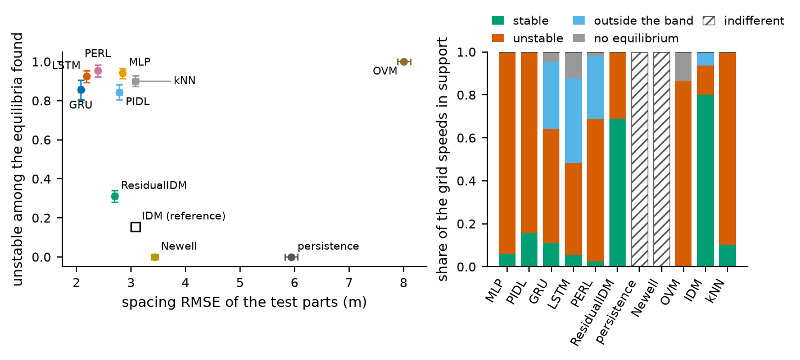

Figure `rmse_vs_instability`: E1: spacing RMSE against the share of unstable equilibria, and the band shares per model ([PDF](figures/rmse_vs_instability.pdf)).

## 4. E2: stability penalties (H1.2)

Chosen weights (D85, chosen_weights.json): mlp jacobian 1, pidl jacobian 10, gru gain 0.1, lstm gain 0.1, perl gain 0.1, residual_idm jacobian 0.1.

#### E2: sweep of the penalty weight

- E2 sweep: 120 runs (5 folds, seed 0, four weights per architecture). RMSE s (m): mean over the runs of the mean spacing RMSE of the validation and test events; stable: band share of the grid speeds in support; feasible: runs whose best epoch meets the penalty (D89); chosen: D85.

| architecture | penalty | weight | runs | val. RMSE s (m) | test RMSE s (m) | stable | feasible | chosen |
|---|---|---:|---:|---:|---:|---:|---:|---|
| mlp | jacobian | 0.01 | 5 | 2.84 | 2.84 | 0.12 | 0 |  |
| mlp | jacobian | 0.1 | 5 | 2.85 | 2.86 | 1.00 | 5 |  |
| mlp | jacobian | 1 | 5 | 2.80 | 2.80 | 1.00 | 5 | yes |
| mlp | jacobian | 10 | 5 | 2.94 | 2.94 | 1.00 | 5 |  |
| pidl | jacobian | 0.01 | 5 | 2.80 | 2.80 | 0.11 | 0 |  |
| pidl | jacobian | 0.1 | 5 | 2.79 | 2.81 | 0.48 | 1 |  |
| pidl | jacobian | 1 | 5 | 2.80 | 2.80 | 1.00 | 5 |  |
| pidl | jacobian | 10 | 5 | 2.78 | 2.78 | 1.00 | 5 | yes |
| gru | gain | 0.01 | 5 | 2.19 | 2.20 | 0.22 | 0 |  |
| gru | gain | 0.1 | 5 | 2.32 | 2.33 | 0.24 | 1 | yes |
| gru | gain | 1 | 5 | 2.91 | 2.91 | 0.00 | 5 |  |
| gru | gain | 10 | 5 | 2.69 | 2.69 | 0.04 | 5 |  |
| lstm | gain | 0.01 | 5 | 2.28 | 2.29 | 0.31 | 0 |  |
| lstm | gain | 0.1 | 5 | 2.73 | 2.74 | 0.55 | 0 | yes |
| lstm | gain | 1 | 5 | 2.69 | 2.70 | 0.10 | 4 |  |
| lstm | gain | 10 | 5 | 2.73 | 2.73 | 0.03 | 4 |  |
| perl | gain | 0.01 | 5 | 3.02 | 3.03 | 0.00 | 0 |  |
| perl | gain | 0.1 | 5 | 2.98 | 3.00 | 0.00 | 0 | yes |
| perl | gain | 1 | 5 | 3.06 | 3.03 | 0.00 | 0 |  |
| perl | gain | 10 | 5 | 3.30 | 3.30 | 0.00 | 0 |  |
| residual_idm | jacobian | 0.01 | 5 | 2.71 | 2.71 | 0.85 | 0 |  |
| residual_idm | jacobian | 0.1 | 5 | 2.74 | 2.74 | 0.99 | 0 | yes |
| residual_idm | jacobian | 1 | 5 | 3.39 | 3.39 | 0.87 | 0 |  |
| residual_idm | jacobian | 10 | 5 | 3.50 | 3.51 | 0.87 | 0 |  |

CSV: [tables/e2_sweep.csv](tables/e2_sweep.csv), LaTeX: [tables/e2_sweep.tex](tables/e2_sweep.tex).

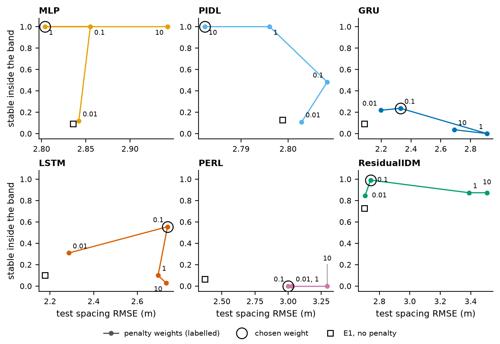

Figure `e2_tradeoff`: E2 sweep: test RMSE against the share stable inside the band, per architecture ([PDF](figures/e2_tradeoff.pdf)).

- H1.2, mlp: **confirmed**; band share not stable 0.00 [0.00, 0.00], RMSE change -0.5 % [-0.9 %, -0.1 %].
- H1.2, pidl: **confirmed**; band share not stable 0.00 [0.00, 0.00], RMSE change -0.3 % [-0.7 %, +0.0 %].
- H1.2, gru: **refuted**; band share not stable 0.66 [0.55, 0.76], RMSE change +14.7 % [+13.2 %, +15.9 %].
- H1.2, lstm: **refuted**; band share not stable 0.39 [0.31, 0.48], RMSE change +25.0 % [+23.7 %, +26.3 %].
- H1.2, perl: **refuted**; band share not stable 1.00 [0.99, 1.00], RMSE change +26.9 % [+25.5 %, +28.3 %].
- H1.2, residual_idm: **confirmed**; band share not stable 0.00 [0.00, 0.01], RMSE change +1.5 % [+1.1 %, +2.0 %].

#### E2: chosen weights against E1 (H1.2)

- E2 with the chosen weights: 150 runs against 150 of E1 (5 folds x 5 seeds). RMSE change: relative change of the spacing RMSE, unit driver, paired; p (Holm) over the architectures; shares, growth error and hysteresis area (m^2/s): unit run. Growth error (D109): per OpenACC profile on the collision-free prefix of the platoon (at least 3 positions), mean over the profiles of a run that have one; whole curve (D107): over the profiles whose platoon did not collide; each compared over the pairs of runs in which both have a value; collided: OpenACC profiles whose platoon collided (growth error) and runs whose first follower collided behind the braking pulse (hysteresis), summed over the runs; 95 % percentile bootstrap intervals, 1000 resamples.

| architecture | penalty | weight | runs | RMSE change | p (Holm) | not stable E1 | not stable E2 | unstable among eq. E1 | unstable among eq. E2 | growth pairs | collided E1 | collided E2 | growth error E1 | growth error E2 | growth change | whole-curve pairs | whole-curve change | hysteresis pairs | collided E1 | collided E2 | hysteresis E1 (m^2/s) | hysteresis E2 (m^2/s) | H1.2 |
|---|---|---:|---:|---:|---:|---:|---:|---:|---:|---:|---:|---:|---:|---:|---:|---:|---:|---:|---:|---:|---:|---:|---|
| mlp | jacobian | 1 | 25 | -0.5 % [-0.9 %, -0.1 %] | <0.001 | 0.94 [0.91, 0.97] | 0.00 [0.00, 0.00] | 0.94 [0.91, 0.97] | 0.00 [0.00, 0.00] | 25 | 38 | 74 | 0.178 | 0.140 | -21.7 % [-46.5 %, +13.3 %] | 25 | +3.9 % [-10.1 %, +21.0 %] | 25 | 0 | 0 | 54.2 | 68.6 | confirmed |
| pidl | jacobian | 10 | 25 | -0.3 % [-0.7 %, +0.0 %] | 0.836 | 0.84 [0.81, 0.88] | 0.00 [0.00, 0.00] | 0.84 [0.81, 0.88] | 0.00 [0.00, 0.00] | 25 | 36 | 2 | 0.296 | 0.177 | -40.1 % [-52.0 %, -23.6 %] | 25 | -44.1 % [-53.9 %, -30.3 %] | 25 | 0 | 0 | 79.2 | 85.7 | confirmed |
| gru | gain | 0.1 | 25 | +14.7 % [+13.2 %, +15.9 %] | <0.001 | 0.89 [0.84, 0.93] | 0.66 [0.55, 0.76] | 0.86 [0.80, 0.91] | 0.63 [0.53, 0.74] | 19 | 96 | 114 | 0.497 | 0.396 | -20.3 % [-54.4 %, +24.0 %] | 4 | +89.3 % [+49.2 %, +131.7 %] | 25 | 0 | 0 | 69.1 | 585.3 | refuted |
| lstm | gain | 0.1 | 25 | +25.0 % [+23.7 %, +26.3 %] | <0.001 | 0.95 [0.93, 0.97] | 0.39 [0.31, 0.48] | 0.92 [0.89, 0.96] | 0.33 [0.25, 0.43] | 20 | 95 | 96 | 0.607 | 0.194 | -68.1 % [-79.3 %, -51.5 %] | 15 | -74.2 % [-82.2 %, -61.7 %] | 25 | 0 | 0 | 55.0 | 115.2 | refuted |
| perl | gain | 0.1 | 25 | +26.9 % [+25.5 %, +28.3 %] | <0.001 | 0.97 [0.96, 0.99] | 1.00 [0.99, 1.00] | 0.95 [0.92, 0.98] | 0.98 [0.96, 1.00] | 15 | 121 | 124 | 0.140 | 0.273 | +94.8 % [+2.0 %, +278.7 %] | 0 |  | 22 | 0 | 3 | 107.6 | 123.7 | refuted |
| residual_idm | jacobian | 0.1 | 25 | +1.5 % [+1.1 %, +2.0 %] | <0.001 | 0.31 [0.28, 0.34] | 0.00 [0.00, 0.01] | 0.31 [0.28, 0.34] | 0.00 [0.00, 0.00] | 25 | 0 | 0 | 0.318 | 0.283 | -11.1 % [-20.1 %, -1.9 %] | 25 | -11.6 % [-20.5 %, -2.6 %] | 25 | 0 | 0 | 55.9 | 42.8 | confirmed |

CSV: [tables/e2.csv](tables/e2.csv), LaTeX: [tables/e2.tex](tables/e2.tex).

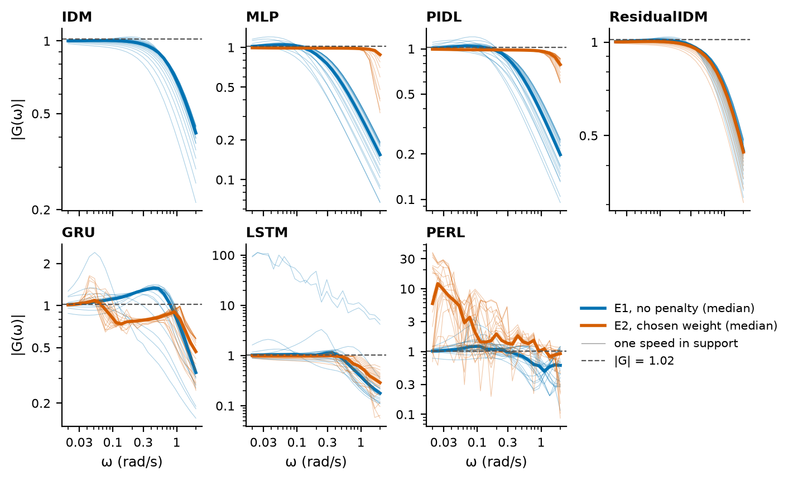

Figure `gain_curves`: |G(ω)| of the frequency response of the fold-0 runs, E1 and the chosen E2 weight ([PDF](figures/gain_curves.pdf)).

The existence arm (D93): the existence term alone, without stability terms.

#### E2: the existence term alone (D93)

- Arm e2_existence of E2: 15 runs (existence term only, 5 folds, seed 0) against E1 of seed 0. RMSE s (m): unit driver; RMSE vs E1: relative difference, paired over drivers; shares of the grid speeds in support, unit run; collided profiles: platoon profiles with a collision, mean over the runs; 95 % percentile bootstrap intervals, 1000 resamples.

| architecture | runs | drivers | RMSE s (m) | RMSE vs E1 | p | stable | unstable | outside | none | unstable among equilibria | max gain (median) | collided profiles |
|---|---:|---:|---:|---:|---:|---:|---:|---:|---:|---:|---:|---:|
| gru | 5 | 12512 | 2.12 [2.09, 2.16] | +1.8 % [+0.2 %, +3.3 %] | <0.001 | 0.00 | 1.00 | 0.00 | 0.00 | 1.00 [1.00, 1.00] | 64.15 | 5.2 |
| lstm | 5 | 12512 | 2.32 [2.28, 2.36] | +6.7 % [+5.1 %, +8.1 %] | <0.001 | 0.00 | 1.00 | 0.00 | 0.00 | 1.00 [1.00, 1.00] | 4.32 | 4.2 |
| perl | 5 | 12512 | 2.55 [2.51, 2.59] | +7.6 % [+6.1 %, +9.0 %] | <0.001 | 0.00 | 1.00 | 0.00 | 0.00 | 1.00 [1.00, 1.00] | 43.58 | 5.2 |

CSV: [tables/e2_existence.csv](tables/e2_existence.csv), LaTeX: [tables/e2_existence.tex](tables/e2_existence.tex).


The low-frequency arm (D110): the rollout gain penalty with the Jacobian penalty of the memoryless view and the needle guard for the recurrent models; the verdict of H1.2 above stays.

- H1.2 (combined), gru: **open**; weight 0.1 (no weight reaches stable >= 0.9: largest stable share): band share not stable 0.45 [0.25, 0.65], RMSE change +17.3 % [+15.1 %, +19.3 %] against E1 (seed 0).
- H1.2 (combined), lstm: **refuted**; weight 0.1 (stable >= 0.9: smallest validation RMSE): band share not stable 0.50 [0.24, 0.76], RMSE change +29.0 % [+27.1 %, +30.6 %] against E1 (seed 0).
- H1.2 (combined), perl: **refuted**; weight 1 (no weight reaches stable >= 0.9: largest stable share): band share not stable 0.97 [0.92, 1.00], RMSE change +28.3 % [+26.2 %, +30.2 %] against E1 (seed 0).

#### E2: combined penalty of the recurrent models (D110)

- Low-frequency arm of E2 (D110): 18 runs of the combined penalty (rollout gain penalty of E2, Jacobian penalty of the memoryless view, needle guard) per architecture and Jacobian weight (the pilot on fold 0, the chosen weight on all 5 folds, seed 0). RMSE s (m): unit driver; RMSE change against E1 of the same folds and seed, paired over drivers; shares of the grid speeds in support, unit run; H1.2 (combined): the rule of H1.2 on the chosen weight; 95 % percentile bootstrap intervals, 1000 resamples.

| architecture | Jacobian weight | chosen | runs | RMSE s (m) | RMSE change vs E1 | stable | not stable | unstable among equilibria | max gain (median) | collided | profiles | H1.2 (combined) |
|---|---:|---|---:|---:|---:|---:|---:|---:|---:|---:|---:|---|
| gru | 0.1 | yes | 5 | 2.45 [2.41, 2.49] | +17.3 % [+15.1 %, +19.3 %] | 0.55 | 0.45 [0.25, 0.65] | 0.34 [0.21, 0.53] | 1.234 | 19 | 25 | open |
| gru | 1 |  | 1 | 2.75 [2.65, 2.84] | +33.2 % [+29.1 %, +37.4 %] | 0.45 | 0.55 [0.55, 0.55] | 0.50 [0.50, 0.50] | 1.123 | 3 | 5 |  |
| lstm | 0.1 | yes | 5 | 2.81 [2.76, 2.85] | +29.0 % [+27.1 %, +30.6 %] | 0.50 | 0.50 [0.24, 0.76] | 0.42 [0.19, 0.70] | 1.237 | 18 | 25 | refuted |
| lstm | 1 |  | 1 | 2.83 [2.73, 2.93] | +27.1 % [+23.5 %, +30.7 %] | 0.32 | 0.68 [0.68, 0.68] | 0.47 [0.47, 0.47] | 1.737 | 4 | 5 |  |
| perl | 0.1 |  | 1 | 2.90 [2.78, 3.01] | +19.2 % [+15.5 %, +23.4 %] | 0.00 | 1.00 [1.00, 1.00] |  |  | 5 | 5 |  |
| perl | 1 | yes | 5 | 3.04 [2.99, 3.09] | +28.3 % [+26.2 %, +30.2 %] | 0.03 | 0.97 [0.92, 1.00] | 0.91 [0.82, 1.00] | 1.188 | 15 | 25 | refuted |

CSV: [tables/e2_lowfreq.csv](tables/e2_lowfreq.csv), LaTeX: [tables/e2_lowfreq.tex](tables/e2_lowfreq.tex).


## 5. E3: transfer to other data

#### E3: transfer to other data

- E3: models of seed 0 (5 folds) on all events of the targets; 255 evaluations. RMSE s (m) of the first 15 s and of the whole events, unit driver of the target; relative degradation against the source test RMSE; 95 % percentile bootstrap intervals, 1000 resamples.

| architecture | penalty | weight | target | drivers | source RMSE s (m) | RMSE s, 15 s (m) | RMSE s, whole (m) | degradation | with - without penalty |
|---|---|---:|---|---:|---:|---:|---:|---:|---:|
| mlp | none |  | ngsim_i80 | 5521 | 2.84 | 3.13 [3.07, 3.19] | 6.07 [5.97, 6.17] | +10.4 % [+8.2 %, +12.4 %] |  |
| mlp | none |  | ngsim_us101 | 5866 | 2.84 | 2.84 [2.79, 2.89] | 9.23 [9.05, 9.41] | +0.1 % [-1.7 %, +2.0 %] |  |
| mlp | none |  | waymo | 849 | 2.84 | 3.92 [3.66, 4.18] | 5.44 [5.05, 5.82] | +38.2 % [+29.2 %, +47.3 %] |  |
| mlp | chosen | 1 | ngsim_i80 | 5521 | 2.80 | 3.19 [3.13, 3.25] | 5.47 [5.38, 5.56] | +13.8 % [+11.6 %, +15.8 %] | +3.4 % [+3.0 %, +3.8 %] |
| mlp | chosen | 1 | ngsim_us101 | 5866 | 2.80 | 2.88 [2.83, 2.93] | 8.46 [8.31, 8.62] | +2.7 % [+0.8 %, +4.5 %] | +2.5 % [+2.2 %, +2.9 %] |
| mlp | chosen | 1 | waymo | 849 | 2.80 | 3.88 [3.63, 4.15] | 5.34 [4.95, 5.72] | +38.5 % [+29.5 %, +48.1 %] | +0.2 % [-1.2 %, +1.8 %] |
| pidl | none |  | ngsim_i80 | 5521 | 2.80 | 3.17 [3.11, 3.23] | 6.82 [6.69, 6.95] | +13.4 % [+11.1 %, +15.4 %] |  |
| pidl | none |  | ngsim_us101 | 5866 | 2.80 | 3.02 [2.96, 3.09] | 11.99 [11.72, 12.27] | +8.0 % [+5.9 %, +10.3 %] |  |
| pidl | none |  | waymo | 849 | 2.80 | 4.68 [4.32, 5.06] | 6.75 [6.16, 7.30] | +67.3 % [+54.3 %, +80.6 %] |  |
| pidl | chosen | 10 | ngsim_i80 | 5521 | 2.78 | 3.19 [3.13, 3.25] | 6.44 [6.33, 6.57] | +14.6 % [+12.3 %, +16.8 %] | +1.2 % [+0.8 %, +1.6 %] |
| pidl | chosen | 10 | ngsim_us101 | 5866 | 2.78 | 2.97 [2.91, 3.03] | 11.06 [10.81, 11.32] | +6.9 % [+4.7 %, +9.0 %] | -1.1 % [-1.5 %, -0.7 %] |
| pidl | chosen | 10 | waymo | 849 | 2.78 | 4.54 [4.18, 4.88] | 6.50 [5.94, 7.05] | +63.3 % [+50.4 %, +75.6 %] | -4.0 % [-5.7 %, -2.4 %] |
| gru | none |  | ngsim_i80 | 5521 | 2.09 | 5.51 [5.38, 5.63] | 22.48 [21.70, 23.27] | +163.9 % [+157.8 %, +169.9 %] |  |
| gru | none |  | ngsim_us101 | 5866 | 2.09 | 3.96 [3.89, 4.04] | 26.48 [25.51, 27.50] | +90.0 % [+86.3 %, +93.7 %] |  |
| gru | none |  | waymo | 849 | 2.09 | 4.33 [4.03, 4.65] | 6.72 [6.17, 7.29] | +107.2 % [+93.0 %, +123.0 %] |  |
| gru | chosen | 0.1 | ngsim_i80 | 5521 | 2.33 | 4.24 [4.15, 4.33] | 7.82 [7.65, 8.00] | +82.2 % [+78.0 %, +86.0 %] | -81.7 % [-85.6 %, -77.9 %] |
| gru | chosen | 0.1 | ngsim_us101 | 5866 | 2.33 | 3.11 [3.05, 3.16] | 10.07 [9.78, 10.36] | +33.3 % [+30.9 %, +35.6 %] | -56.7 % [-59.3 %, -54.2 %] |
| gru | chosen | 0.1 | waymo | 849 | 2.33 | 3.57 [3.36, 3.80] | 5.02 [4.69, 5.38] | +53.0 % [+44.1 %, +62.9 %] | -54.2 % [-65.0 %, -43.8 %] |
| lstm | none |  | ngsim_i80 | 5521 | 2.18 | 4.67 [4.55, 4.77] | 21.21 [20.39, 21.99] | +114.3 % [+109.1 %, +119.1 %] |  |
| lstm | none |  | ngsim_us101 | 5866 | 2.18 | 3.46 [3.39, 3.53] | 31.34 [30.08, 32.56] | +58.8 % [+55.8 %, +62.0 %] |  |
| lstm | none |  | waymo | 849 | 2.18 | 4.63 [4.28, 4.98] | 7.23 [6.63, 7.87] | +112.5 % [+96.7 %, +128.9 %] |  |
| lstm | chosen | 0.1 | ngsim_i80 | 5521 | 2.74 | 3.70 [3.64, 3.77] | 8.31 [8.15, 8.48] | +35.2 % [+32.8 %, +37.7 %] | -79.1 % [-83.0 %, -75.3 %] |
| lstm | chosen | 0.1 | ngsim_us101 | 5866 | 2.74 | 3.10 [3.03, 3.16] | 15.73 [15.19, 16.26] | +13.1 % [+10.8 %, +15.4 %] | -45.7 % [-47.9 %, -43.4 %] |
| lstm | chosen | 0.1 | waymo | 849 | 2.74 | 4.59 [4.26, 4.96] | 6.70 [6.17, 7.30] | +67.5 % [+55.4 %, +81.0 %] | -45.0 % [-55.8 %, -33.9 %] |
| perl | none |  | ngsim_i80 | 5521 | 2.37 | 5.64 [5.51, 5.77] | 11.42 [11.06, 11.79] | +138.0 % [+132.4 %, +143.6 %] |  |
| perl | none |  | ngsim_us101 | 5866 | 2.37 | 3.74 [3.67, 3.81] | 9.69 [9.45, 9.91] | +57.9 % [+55.0 %, +60.9 %] |  |
| perl | none |  | waymo | 849 | 2.37 | 3.50 [3.29, 3.77] | 4.85 [4.54, 5.24] | +47.6 % [+38.6 %, +58.9 %] |  |
| perl | chosen | 0.1 | ngsim_i80 | 5521 | 3.00 | 7.51 [7.37, 7.65] | 19.67 [19.21, 20.11] | +150.4 % [+145.6 %, +154.8 %] | +12.4 % [+9.1 %, +15.7 %] |
| perl | chosen | 0.1 | ngsim_us101 | 5866 | 3.00 | 5.00 [4.92, 5.08] | 16.17 [15.82, 16.52] | +66.5 % [+63.9 %, +69.1 %] | +8.6 % [+6.4 %, +10.7 %] |
| perl | chosen | 0.1 | waymo | 849 | 3.00 | 4.92 [4.60, 5.26] | 6.91 [6.44, 7.38] | +63.9 % [+53.3 %, +75.3 %] | +16.3 % [+8.4 %, +24.5 %] |
| residual_idm | none |  | ngsim_i80 | 5521 | 2.70 | 3.01 [2.95, 3.07] | 5.58 [5.47, 5.68] | +11.5 % [+9.3 %, +13.7 %] |  |
| residual_idm | none |  | ngsim_us101 | 5866 | 2.70 | 2.79 [2.73, 2.84] | 9.22 [9.04, 9.41] | +3.2 % [+1.1 %, +5.2 %] |  |
| residual_idm | none |  | waymo | 849 | 2.70 | 3.76 [3.50, 4.01] | 5.17 [4.80, 5.51] | +39.2 % [+29.5 %, +48.5 %] |  |
| residual_idm | chosen | 0.1 | ngsim_i80 | 5521 | 2.74 | 2.92 [2.86, 2.97] | 4.74 [4.66, 4.83] | +6.3 % [+4.2 %, +8.4 %] | -5.2 % [-6.0 %, -4.3 %] |
| residual_idm | chosen | 0.1 | ngsim_us101 | 5866 | 2.74 | 2.57 [2.52, 2.62] | 6.06 [5.96, 6.16] | -6.3 % [-8.1 %, -4.6 %] | -9.5 % [-10.5 %, -8.7 %] |
| residual_idm | chosen | 0.1 | waymo | 849 | 2.74 | 3.13 [2.93, 3.34] | 4.15 [3.86, 4.44] | +14.3 % [+7.0 %, +21.8 %] | -25.0 % [-29.2 %, -20.7 %] |
| persistence | none |  | ngsim_i80 | 5521 | 5.94 | 27.32 [26.60, 27.96] | 375.63 [349.33, 404.44] | +360.0 % [+347.8 %, +370.7 %] |  |
| persistence | none |  | ngsim_us101 | 5866 | 5.94 | 18.01 [17.62, 18.41] | 281.34 [269.99, 292.65] | +203.3 % [+196.7 %, +210.0 %] |  |
| persistence | none |  | waymo | 849 | 5.94 | 13.30 [12.56, 14.07] | 25.12 [23.76, 26.56] | +123.8 % [+111.5 %, +136.9 %] |  |
| newell | none |  | ngsim_i80 | 5521 | 3.44 | 8.68 [8.53, 8.82] | 38.59 [37.58, 39.55] | +152.7 % [+148.2 %, +156.8 %] |  |
| newell | none |  | ngsim_us101 | 5866 | 3.44 | 5.90 [5.81, 5.99] | 31.89 [31.23, 32.56] | +71.7 % [+69.1 %, +74.3 %] |  |
| newell | none |  | waymo | 849 | 3.44 | 5.94 [5.56, 6.35] | 8.76 [8.18, 9.40] | +73.0 % [+61.9 %, +84.8 %] |  |
| ovm | none |  | ngsim_i80 | 5521 | 8.00 | 5.90 [5.76, 6.05] | 6.72 [6.55, 6.88] | -26.2 % [-28.0 %, -24.4 %] |  |
| ovm | none |  | ngsim_us101 | 5866 | 8.00 | 5.61 [5.48, 5.75] | 7.59 [7.43, 7.77] | -29.8 % [-31.5 %, -28.1 %] |  |
| ovm | none |  | waymo | 849 | 8.00 | 6.76 [6.28, 7.28] | 7.54 [6.95, 8.19] | -15.5 % [-21.4 %, -9.1 %] |  |
| idm | none |  | ngsim_i80 | 5521 | 3.08 | 3.43 [3.36, 3.49] | 7.41 [7.24, 7.58] | +11.1 % [+8.9 %, +13.2 %] |  |
| idm | none |  | ngsim_us101 | 5866 | 3.08 | 3.26 [3.19, 3.33] | 14.58 [14.18, 14.99] | +5.8 % [+3.6 %, +8.0 %] |  |
| idm | none |  | waymo | 849 | 3.08 | 5.17 [4.74, 5.62] | 7.52 [6.86, 8.22] | +67.7 % [+53.7 %, +82.3 %] |  |
| knn | none |  | ngsim_i80 | 5521 | 3.08 | 3.62 [3.55, 3.69] | 11.28 [11.04, 11.50] | +17.5 % [+15.1 %, +19.5 %] |  |
| knn | none |  | ngsim_us101 | 5866 | 3.08 | 3.29 [3.23, 3.36] | 18.97 [18.43, 19.49] | +6.8 % [+4.7 %, +8.9 %] |  |
| knn | none |  | waymo | 849 | 3.08 | 5.16 [4.84, 5.52] | 7.56 [7.06, 8.10] | +67.4 % [+56.8 %, +78.9 %] |  |

CSV: [tables/e3.csv](tables/e3.csv), LaTeX: [tables/e3.tex](tables/e3.tex).


## 6. E4: certified hybrid (H1.5)

- H1.5, overall: **holds**; certified, fine-tuned: band share unstable 0.00 [0.00, 0.00]; fine-tuned MLP: 0.98 [0.96, 0.99].

#### E4: certified hybrid and fine-tuning (H1.5)

- E4: 150 runs (5 folds x 5 seeds per row). Certificates: runs in which it holds; shares of the grid speeds in support, unit run; RMSE s: spacing RMSE of the test part of the data of the run (m), unit driver; 95 % percentile bootstrap intervals, 1000 resamples.

| model | variant | data | runs | a priori holds | at equilibria holds | all equilibria certified | unstable | not stable | unstable among equilibria | RMSE s (m) |
|---|---|---|---:|---:|---:|---:|---:|---:|---:|---:|
| residual_idm | E1, free core | follownet_highd | 25 |  |  |  | 0.31 [0.28, 0.34] | 0.31 [0.28, 0.34] | 0.31 [0.28, 0.34] | 2.70 [2.66, 2.75] |
| residual_idm | fine-tuned, free core | ngsim_i80 | 25 | 0 | 0 | 0 | 0.04 [0.02, 0.06] | 0.04 [0.02, 0.06] | 0.04 [0.02, 0.06] | 4.49 [4.40, 4.58] |
| mlp | E1 | follownet_highd | 25 |  |  |  | 0.94 [0.91, 0.96] | 0.94 [0.91, 0.97] | 0.94 [0.91, 0.97] | 2.85 [2.80, 2.89] |
| mlp | fine-tuned | ngsim_i80 | 25 |  |  |  | 0.98 [0.96, 0.99] | 0.99 [0.97, 1.00] | 0.99 [0.97, 1.00] | 5.96 [5.87, 6.07] |
| residual_idm | certified | follownet_highd | 25 | 25 | 0 | 25 | 0.00 [0.00, 0.00] | 0.05 [0.05, 0.05] | 0.00 [0.00, 0.00] | 4.51 [4.45, 4.57] |
| residual_idm | certified, fine-tuned | ngsim_i80 | 25 | 25 | 25 | 25 | 0.00 [0.00, 0.00] | 0.00 [0.00, 0.00] | 0.00 [0.00, 0.00] | 5.16 [5.04, 5.28] |

CSV: [tables/e4.csv](tables/e4.csv), LaTeX: [tables/e4.tex](tables/e4.tex).

The residual amplitude of the certified hybrid (D111): certificate, accuracy and corridor.

#### E4: residual amplitude, certificate, accuracy and corridor (D111)

- Residual-amplitude sweep of the hybrid (D111): per r_max and core (0.1 certified, 0.2 certified, 0.3 certified, 0.5 certified, 0.3 free, 1 free) the runs on HighD and after fine-tuning on NGSIM I-80 (folds x seeds of the configuration): runs whose a priori certificate holds, unstable among equilibria (unit run), spacing RMSE of the test parts (m, unit driver), and the corridor numbers of the law (unit run: scenario and seed); 95 % percentile bootstrap intervals, 1000 resamples.

| corridor | r_max | core | runs HighD | a priori holds | runs NGSIM | after fine-tuning | unstable among eq. (NGSIM) | RMSE s HighD (m) | RMSE s NGSIM (m) | macro error | macro error (dynamic) | collisions / 1000 veh-km |
|---|---:|---|---:|---:|---:|---:|---:|---:|---:|---:|---:|---:|
| I-80 | 0.1 | certified | 25 | 25 | 25 | 25 | 0.00 [0.00, 0.00] | 4.54 [4.48, 4.61] | 5.38 [5.26, 5.52] | 0.197 [0.177, 0.218] | 0.301 [0.261, 0.346] | 0.000 |
| I-80 | 0.2 | certified | 25 | 25 | 25 | 25 | 0.00 [0.00, 0.00] | 4.51 [4.44, 4.58] | 5.26 [5.14, 5.39] | 0.181 [0.158, 0.204] | 0.277 [0.232, 0.322] | 0.000 |
| I-80 | 0.3 | certified | 25 | 25 | 25 | 25 | 0.00 [0.00, 0.00] | 4.51 [4.45, 4.57] | 5.16 [5.04, 5.28] | 0.125 [0.109, 0.144] | 0.190 [0.159, 0.228] | 0.000 |
| I-80 | 0.5 | certified | 25 | 25 | 25 | 25 | 0.00 [0.00, 0.00] | 4.54 [4.48, 4.60] | 5.07 [4.95, 5.18] | 0.108 [0.092, 0.126] | 0.164 [0.128, 0.202] | 0.110 |
| I-80 | 0.3 | free | 25 | 0 | 25 | 0 | 0.07 [0.07, 0.08] | 2.81 [2.77, 2.86] | 5.18 [5.09, 5.28] | 0.209 [0.176, 0.249] | 0.356 [0.289, 0.437] | 0.000 |
| I-80 | 1 | free | 25 |  | 25 | 0 | 0.04 [0.02, 0.06] | 2.70 [2.66, 2.75] | 4.49 [4.40, 4.58] | 0.158 [0.126, 0.207] | 0.268 [0.204, 0.369] | 0.000 |
| I-80 | 0 | certified core alone |  |  |  |  |  |  |  | 0.198 [0.174, 0.226] | 0.301 [0.254, 0.356] | 0.000 |
| I-80 | 0 | I-80 margin core |  |  |  |  |  |  |  | 0.239 [0.188, 0.298] | 0.479 [0.355, 0.624] | 0.000 |
| I-80 | 0.3 | margin, no certificate | 25 | 0 | 25 | 0 | 0.00 [0.00, 0.00] | 4.39 [4.32, 4.45] | 5.16 [5.04, 5.28] | 0.176 [0.150, 0.202] | 0.281 [0.229, 0.337] | 0.110 |
| US-101 | 0.1 | certified | 25 | 25 | 25 | 25 | 0.00 [0.00, 0.00] | 4.54 [4.48, 4.61] | 5.38 [5.26, 5.52] | 0.177 [0.166, 0.191] | 0.228 [0.210, 0.250] | 0.228 |
| US-101 | 0.2 | certified | 25 | 25 | 25 | 25 | 0.00 [0.00, 0.00] | 4.51 [4.44, 4.58] | 5.26 [5.14, 5.39] | 0.147 [0.139, 0.157] | 0.184 [0.169, 0.199] | 0.059 |
| US-101 | 0.3 | certified | 25 | 25 | 25 | 25 | 0.00 [0.00, 0.00] | 4.51 [4.45, 4.57] | 5.16 [5.04, 5.28] | 0.113 [0.107, 0.119] | 0.122 [0.107, 0.135] | 0.227 |
| US-101 | 0.5 | certified | 25 | 25 | 25 | 25 | 0.00 [0.00, 0.00] | 4.54 [4.48, 4.60] | 5.07 [4.95, 5.18] | 0.104 [0.096, 0.113] | 0.136 [0.119, 0.152] | 0.161 |
| US-101 | 0.3 | free | 25 | 0 | 25 | 0 | 0.07 [0.07, 0.08] | 2.81 [2.77, 2.86] | 5.18 [5.09, 5.28] | 0.194 [0.171, 0.217] | 0.312 [0.261, 0.363] | 0.035 |
| US-101 | 1 | free | 25 |  | 25 | 0 | 0.04 [0.02, 0.06] | 2.70 [2.66, 2.75] | 4.49 [4.40, 4.58] | 0.156 [0.135, 0.176] | 0.256 [0.213, 0.297] | 0.029 |
| US-101 | 0 | certified core alone |  |  |  |  |  |  |  | 0.177 [0.168, 0.185] | 0.222 [0.207, 0.237] | 0.422 |
| US-101 | 0 | I-80 margin core |  |  |  |  |  |  |  | 0.132 [0.115, 0.154] | 0.210 [0.179, 0.248] | 0.068 |
| US-101 | 0.3 | margin, no certificate | 25 | 0 | 25 | 0 | 0.00 [0.00, 0.00] | 4.39 [4.32, 4.45] | 5.16 [5.04, 5.28] | 0.147 [0.138, 0.155] | 0.189 [0.174, 0.203] | 0.296 |

CSV: [tables/e4_rmax.csv](tables/e4_rmax.csv), LaTeX: [tables/e4_rmax.tex](tables/e4_rmax.tex).


## 7. E5: OpenACC and the growth of oscillations (H1.3)

- H1.3, openacc_acc/mlp: **refuted**; reduction -2.6 % [-29.1 %, +14.9 %] over 5 pairs (collision-free prefix); whole curves (D107) -30.9 % [-95.4 %, +1.4 %] over 2 pairs; collided profiles 7/10 without, 0/10 with penalty; first collided position 36.5 without, 51.0 with penalty.
- H1.3, openacc_acc/gru: **open**; reduction -2.2 % [-2.2 %, -2.2 %] over 1 pairs (collision-free prefix); whole curves (D107) n/a over 0 pairs; collided profiles 8/10 without, 10/10 with penalty; first collided position 14.2 without, 24.4 with penalty; open: fewer than 3 pairs.
- H1.3, openacc_acc/lstm: **open**; reduction +52.5 % [+52.5 %, +52.5 %] over 1 pairs (collision-free prefix); whole curves (D107) n/a over 0 pairs; collided profiles 8/10 without, 9/10 with penalty; first collided position 17.4 without, 23.7 with penalty; open: fewer than 3 pairs.
- H1.3, openacc_acc/pooled: **open**; reduction +12.7 % [-14.7 %, +34.3 %] over 7 pairs (collision-free prefix); whole curves (D107) -30.9 % [-95.4 %, +1.4 %] over 2 pairs; collided profiles 23/30 without, 19/30 with penalty.
- H1.3, openacc_human/mlp: **refuted**; reduction -48.2 % [-123.9 %, +3.2 %] over 5 pairs (collision-free prefix); whole curves (D107) n/a over 0 pairs; collided profiles 11/15 without, 13/15 with penalty; first collided position 18.0 without, 13.5 with penalty.
- H1.3, openacc_human/gru: **confirmed**; reduction +48.5 % [+11.5 %, +76.5 %] over 5 pairs (collision-free prefix); whole curves (D107) +29.9 % [+29.9 %, +29.9 %] over 1 pairs; collided profiles 13/15 without, 12/15 with penalty; first collided position 13.1 without, 13.9 with penalty.
- H1.3, openacc_human/lstm: **open**; reduction +38.4 % [-61.6 %, +68.1 %] over 5 pairs (collision-free prefix); whole curves (D107) -46.4 % [-46.4 %, -46.4 %] over 1 pairs; collided profiles 14/15 without, 13/15 with penalty; first collided position 9.9 without, 13.2 with penalty.
- H1.3, openacc_human/pooled: **open**; reduction +12.1 % [-31.1 %, +44.1 %] over 15 pairs (collision-free prefix); whole curves (D107) +16.3 % [-46.4 %, +29.9 %] over 2 pairs; collided profiles 38/45 without, 38/45 with penalty.

#### E5: OpenACC views (H1.3)

- E5 on the OpenACC views: 70 runs (5 folds, seed 0). RMSE s (m): unit driver; shares of the grid speeds in support and growth error of the driving mode of the view, unit run; the growth error of a profile is taken on the collision-free prefix of its simulated platoon (D109: the followers ahead of the first collided position, at least 3), the growth error of a run is the mean over the profiles of the mode that have one (collided: of profiles, summed over the runs; first collided position: one past the last vehicle without collision; collision-free share of the profiles); reduction: 1 - growth error with / without penalty, paired by fold over the folds in which both runs have a growth error (pairs; H1.3 open with fewer than 3 pairs); whole curve: the same on the growth error of D107 (none after a collision); 95 % percentile bootstrap intervals, 1000 resamples.

| view | model | penalty | runs | RMSE s (m) | unstable among equilibria | not stable | max gain (median) | collided | profiles | first collided position | collision-free share | growth error | pairs | reduction | p | H1.3 | whole-curve pairs | whole-curve reduction |
|---|---|---|---:|---:|---:|---:|---:|---:|---:|---:|---:|---:|---:|---:|---:|---|---:|---:|
| openacc_acc | idm | none | 5 | 7.45 [6.58, 8.40] | 0.05 [0.01, 0.08] | 0.13 [0.06, 0.20] | 1.026 | 0 | 10 | 51.0 [51.0, 51.0] | 1.00 [1.00, 1.00] | 0.110 |  |  |  |  |  |  |
| openacc_acc | mlp | none | 5 | 7.56 [6.24, 9.00] | 1.00 [1.00, 1.00] | 1.00 [1.00, 1.00] | 1.860 | 7 | 10 | 36.5 [23.5, 48.4] | 0.30 [0.00, 0.60] | 0.092 |  |  |  |  |  |  |
| openacc_acc | gru | none | 5 | 8.45 [5.20, 12.61] | 0.96 [0.92, 1.00] | 0.97 [0.94, 1.00] | 1.536 | 8 | 10 | 14.2 [1.2, 34.0] | 0.20 [0.00, 0.60] | 0.097 |  |  |  |  |  |  |
| openacc_acc | lstm | none | 5 | 8.62 [6.46, 11.02] | 0.96 [0.93, 0.99] | 0.98 [0.97, 1.00] | 2.047 | 8 | 10 | 17.4 [1.0, 37.4] | 0.20 [0.00, 0.60] | 0.152 |  |  |  |  |  |  |
| openacc_acc | mlp | chosen | 5 | 7.84 [6.51, 9.36] | 0.00 [0.00, 0.00] | 0.00 [0.00, 0.00] | 0.996 | 0 | 10 | 51.0 [51.0, 51.0] | 1.00 [1.00, 1.00] | 0.094 | 5 | -2.6 % [-29.1 %, +14.9 %] | 0.625 | refuted | 2 | -30.9 % [-95.4 %, +1.4 %] |
| openacc_acc | gru | chosen | 5 | 7.18 [5.72, 8.83] | 0.57 [0.25, 0.88] | 0.62 [0.35, 0.90] | 1.069 | 10 | 10 | 24.4 [11.3, 36.2] | 0.00 [0.00, 0.00] | 0.096 | 1 | -2.2 % [-2.2 %, -2.2 %] | 1.000 | open | 0 |  |
| openacc_acc | lstm | chosen | 5 | 8.05 [5.51, 11.56] | 0.30 [0.03, 0.61] | 0.45 [0.17, 0.72] | 1.066 | 9 | 10 | 23.7 [8.0, 39.9] | 0.10 [0.00, 0.30] | 0.100 | 1 | +52.5 % [+52.5 %, +52.5 %] | 1.000 | open | 0 |  |
| openacc_acc | pooled | chosen |  |  |  |  |  | 19 | 30 |  |  |  | 7 | +12.7 % [-14.7 %, +34.3 %] | 0.469 | open | 2 | -30.9 % [-95.4 %, +1.4 %] |
| openacc_human | idm | none | 5 | 9.68 [7.80, 11.80] | 0.00 [0.00, 0.00] | 0.06 [0.05, 0.08] | 0.999 | 0 | 15 | 51.0 [51.0, 51.0] | 1.00 [1.00, 1.00] | 0.098 |  |  |  |  |  |  |
| openacc_human | mlp | none | 5 | 11.03 [8.92, 13.31] | 0.89 [0.69, 1.00] | 0.90 [0.71, 1.00] | 1.229 | 11 | 15 | 18.0 [10.6, 26.4] | 0.27 [0.07, 0.47] | 0.147 |  |  |  |  |  |  |
| openacc_human | gru | none | 5 | 10.02 [8.12, 12.23] | 0.92 [0.83, 1.00] | 0.95 [0.89, 1.00] | 1.296 | 13 | 15 | 13.1 [9.3, 16.9] | 0.13 [0.00, 0.27] | 0.176 |  |  |  |  |  |  |
| openacc_human | lstm | none | 5 | 10.22 [8.06, 12.69] | 0.79 [0.67, 0.91] | 0.88 [0.84, 0.94] | 1.293 | 14 | 15 | 9.9 [4.4, 15.2] | 0.07 [0.00, 0.20] | 0.092 |  |  |  |  |  |  |
| openacc_human | mlp | chosen | 5 | 11.61 [9.66, 13.73] | 0.80 [0.40, 1.00] | 0.80 [0.40, 1.00] | 1.149 | 13 | 15 | 13.5 [7.2, 24.5] | 0.13 [0.00, 0.40] | 0.218 | 5 | -48.2 % [-123.9 %, +3.2 %] | 0.312 | refuted | 0 |  |
| openacc_human | gru | chosen | 5 | 11.76 [9.28, 14.80] | 0.67 [0.47, 0.86] | 0.76 [0.62, 0.90] | 1.100 | 12 | 15 | 13.9 [4.9, 24.5] | 0.20 [0.00, 0.47] | 0.091 | 5 | +48.5 % [+11.5 %, +76.5 %] | 0.125 | confirmed | 1 | +29.9 % [+29.9 %, +29.9 %] |
| openacc_human | lstm | chosen | 5 | 10.09 [8.18, 12.41] | 0.71 [0.33, 0.98] | 0.87 [0.66, 1.00] | 1.059 | 13 | 15 | 13.2 [8.6, 17.8] | 0.13 [0.00, 0.27] | 0.057 | 5 | +38.4 % [-61.6 %, +68.1 %] | 0.812 | open | 1 | -46.4 % [-46.4 %, -46.4 %] |
| openacc_human | pooled | chosen |  |  |  |  |  | 38 | 45 |  |  |  | 15 | +12.1 % [-31.1 %, +44.1 %] | 0.524 | open | 2 | +16.3 % [-46.4 %, +29.9 %] |

CSV: [tables/e5.csv](tables/e5.csv), LaTeX: [tables/e5.tex](tables/e5.tex).

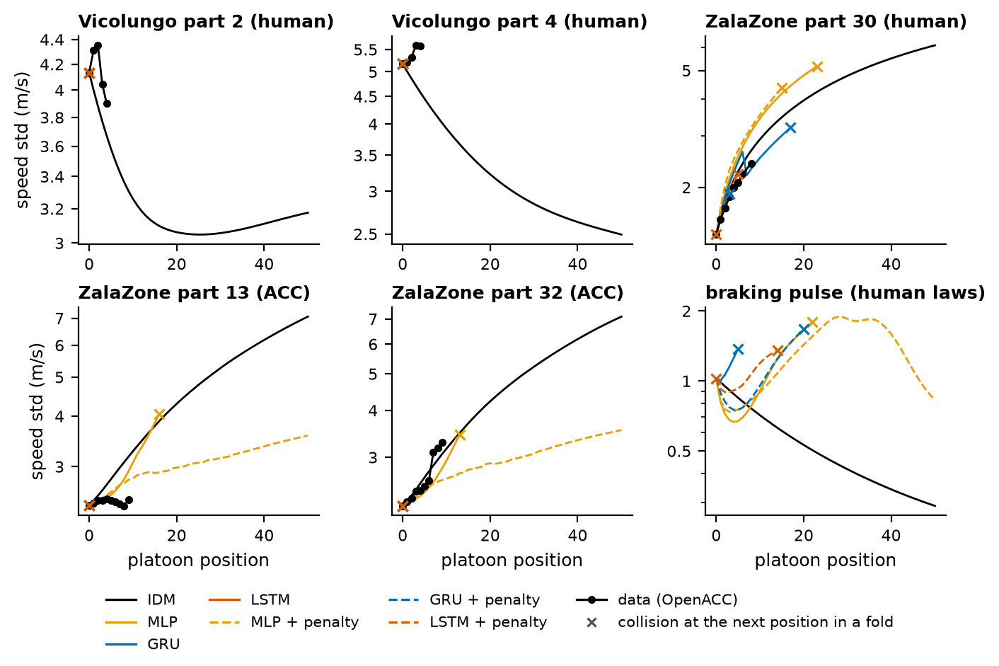

Figure `growth_curves`: platoon test: speed standard deviation per position, data and E5 laws of the matching driving mode, mean over the folds; a model curve ends at the first position whose gap reached zero in the platoon of a fold (130 of 210 simulated platoons collided) ([PDF](figures/growth_curves.pdf)).

## 8. Corridor (M5)

#### Corridor: macro error of the laws

- Corridor laws: 1370 runs (I-80: 26 of 26 laws with runs, 3 scenarios; US-101: 21 of 21 laws with runs, 3 scenarios; 10 seeds per scenario); unit run; 95 % percentile bootstrap intervals, 1000 resamples. Macro error: mean of the absolute relative components (dynamic: FD, wave speed, waves, wave amplitude); collisions per 1000 vehicle-km inside the analysis window.

| corridor | law | runs | scenarios | macro error | macro error (dynamic) | components | collisions / 1000 veh-km | runs with collisions | inserted |
|---|---|---:|---|---:|---:|---:|---:|---:|---:|
| I-80 | idm_global | 30 | all | 0.182 [0.176, 0.189] | 0.345 [0.326, 0.366] | 7.7 | 0.000 [0.000, 0.000] | 0 | 1.000 |
| I-80 | idm_heterogeneous | 30 | all | 0.302 [0.255, 0.357] | 0.520 [0.421, 0.632] | 7.6 | 0.000 [0.000, 0.000] | 0 | 1.000 |
| I-80 | knn | 30 | all | 0.490 [0.460, 0.522] | 0.508 [0.460, 0.559] | 8.0 | 2140.503 [2060.865, 2219.731] | 30 | 0.677 |
| I-80 | mlp | 30 | all | 0.308 [0.274, 0.349] | 0.485 [0.411, 0.576] | 7.9 | 912.508 [861.316, 960.673] | 30 | 0.992 |
| I-80 | pidl | 30 | all | 0.274 [0.245, 0.311] | 0.387 [0.332, 0.466] | 8.0 | 1800.653 [1628.086, 1980.362] | 30 | 0.993 |
| I-80 | gru | 30 | all | 0.192 [0.164, 0.223] | 0.312 [0.261, 0.373] | 7.8 | 205.968 [168.199, 248.966] | 30 | 0.989 |
| I-80 | lstm | 30 | all | 0.716 [0.662, 0.774] | 0.657 [0.577, 0.754] | 7.8 | 4664.165 [3293.537, 6246.488] | 30 | 0.335 |
| I-80 | perl | 30 | all | 0.431 [0.396, 0.464] | 0.652 [0.586, 0.718] | 7.3 | 11683.262 [11293.911, 12058.190] | 30 | 0.989 |
| I-80 | residual_idm | 30 | all | 0.158 [0.126, 0.207] | 0.268 [0.204, 0.369] | 8.0 | 0.000 [0.000, 0.000] | 0 | 1.000 |
| I-80 | residual_idm_certified | 30 | all | 0.125 [0.109, 0.144] | 0.190 [0.159, 0.228] | 8.0 | 0.000 [0.000, 0.000] | 0 | 1.000 |
| I-80 | mlp_penalty | 30 | all | 0.273 [0.254, 0.289] | 0.423 [0.386, 0.459] | 8.0 | 1588.453 [1483.237, 1697.856] | 30 | 0.997 |
| I-80 | gru_penalty | 30 | all | 0.235 [0.185, 0.296] | 0.363 [0.283, 0.462] | 8.0 | 730.579 [685.689, 777.085] | 30 | 0.988 |
| I-80 | lstm_penalty | 30 | all | 0.734 [0.673, 0.795] | 0.684 [0.601, 0.772] | 7.7 | 8041.715 [5640.841, 11400.164] | 30 | 0.295 |
| I-80 | idm_heterogeneous_all | 30 | all | 0.336 [0.276, 0.406] | 0.573 [0.433, 0.738] | 7.8 | 0.000 [0.000, 0.000] | 0 | 0.981 |
| I-80 | residual_idm_certified_het | 30 | all | 0.200 [0.176, 0.226] | 0.368 [0.303, 0.437] | 7.7 | 0.000 [0.000, 0.000] | 0 | 1.000 |
| I-80 | residual_idm_certified_r0.1 | 30 | all | 0.197 [0.177, 0.218] | 0.301 [0.261, 0.346] | 7.7 | 0.000 [0.000, 0.000] | 0 | 1.000 |
| I-80 | residual_idm_certified_r0.2 | 30 | all | 0.181 [0.158, 0.204] | 0.277 [0.232, 0.322] | 7.7 | 0.000 [0.000, 0.000] | 0 | 1.000 |
| I-80 | residual_idm_certified_r0.5 | 30 | all | 0.108 [0.092, 0.126] | 0.164 [0.128, 0.202] | 8.0 | 0.110 [0.000, 0.274] | 2 | 1.000 |
| I-80 | residual_idm_free_r0.3 | 30 | all | 0.209 [0.176, 0.249] | 0.356 [0.289, 0.437] | 8.0 | 0.000 [0.000, 0.000] | 0 | 1.000 |
| I-80 | idm_global_p0 | 20 | i80_p1, i80_p2 | 0.186 [0.172, 0.199] | 0.322 [0.296, 0.347] | 8.0 | 0.000 [0.000, 0.000] | 0 | 1.000 |
| I-80 | residual_idm_certified_p0 | 20 | i80_p1, i80_p2 | 0.173 [0.146, 0.202] | 0.282 [0.223, 0.344] | 8.0 | 0.000 [0.000, 0.000] | 0 | 1.000 |
| I-80 | mlp_p0 | 20 | i80_p1, i80_p2 | 0.230 [0.213, 0.249] | 0.338 [0.308, 0.372] | 8.0 | 687.094 [611.917, 771.215] | 20 | 1.000 |
| I-80 | gru_p0 | 20 | i80_p1, i80_p2 | 0.107 [0.092, 0.123] | 0.182 [0.148, 0.216] | 8.0 | 196.277 [185.055, 208.913] | 20 | 1.000 |
| I-80 | idm_core_margin | 30 | all | 0.198 [0.174, 0.226] | 0.301 [0.254, 0.356] | 7.7 | 0.000 [0.000, 0.000] | 0 | 1.000 |
| I-80 | idm_margin_i80 | 30 | all | 0.239 [0.188, 0.298] | 0.479 [0.355, 0.624] | 7.7 | 0.000 [0.000, 0.000] | 0 | 1.000 |
| I-80 | residual_idm_margin_free_r0.3 | 30 | all | 0.176 [0.150, 0.202] | 0.281 [0.229, 0.337] | 7.7 | 0.110 [0.000, 0.274] | 2 | 1.000 |
| US-101 | idm_global | 30 | all | 0.133 [0.110, 0.163] | 0.229 [0.183, 0.288] | 8.0 | 0.030 [0.000, 0.089] | 1 | 1.000 |
| US-101 | idm_heterogeneous | 30 | all | 0.125 [0.100, 0.150] | 0.196 [0.152, 0.243] | 8.0 | 0.155 [0.030, 0.321] | 4 | 0.999 |
| US-101 | knn | 30 | all | 0.628 [0.574, 0.690] | 0.583 [0.505, 0.682] | 8.0 | 1955.966 [1856.289, 2059.181] | 30 | 0.567 |
| US-101 | mlp | 30 | all | 0.428 [0.395, 0.464] | 0.651 [0.544, 0.775] | 7.7 | 725.901 [684.842, 768.837] | 30 | 0.896 |
| US-101 | pidl | 30 | all | 0.412 [0.367, 0.462] | 0.526 [0.452, 0.612] | 8.0 | 1293.825 [1183.088, 1407.045] | 30 | 0.903 |
| US-101 | gru | 30 | all | 0.421 [0.338, 0.515] | 0.517 [0.403, 0.652] | 8.0 | 211.229 [178.742, 263.555] | 30 | 0.909 |
| US-101 | lstm | 30 | all | 0.888 [0.784, 1.004] | 0.837 [0.698, 0.998] | 8.0 | 2857.501 [2446.115, 3282.118] | 30 | 0.382 |
| US-101 | perl | 30 | all | 0.661 [0.621, 0.704] | 0.685 [0.642, 0.734] | 7.2 | 13481.471 [13212.172, 13742.606] | 30 | 0.891 |
| US-101 | residual_idm | 30 | all | 0.156 [0.135, 0.176] | 0.256 [0.213, 0.297] | 8.0 | 0.029 [0.000, 0.088] | 1 | 1.000 |
| US-101 | residual_idm_certified | 30 | all | 0.113 [0.107, 0.119] | 0.122 [0.107, 0.135] | 7.7 | 0.227 [0.094, 0.389] | 7 | 1.000 |
| US-101 | mlp_penalty | 30 | all | 0.380 [0.334, 0.428] | 0.518 [0.440, 0.603] | 8.0 | 1160.574 [1070.326, 1253.877] | 30 | 0.938 |
| US-101 | gru_penalty | 30 | all | 0.347 [0.278, 0.428] | 0.458 [0.354, 0.581] | 8.0 | 752.931 [681.766, 817.216] | 30 | 0.950 |
| US-101 | lstm_penalty | 30 | all | 0.886 [0.785, 1.020] | 0.786 [0.663, 0.938] | 7.9 | 5540.222 [4961.324, 6174.337] | 30 | 0.308 |
| US-101 | residual_idm_certified_het | 30 | all | 0.174 [0.159, 0.189] | 0.266 [0.234, 0.300] | 8.0 | 0.671 [0.354, 1.028] | 13 | 1.000 |
| US-101 | residual_idm_certified_r0.1 | 30 | all | 0.177 [0.166, 0.191] | 0.228 [0.210, 0.250] | 7.0 | 0.228 [0.094, 0.382] | 7 | 1.000 |
| US-101 | residual_idm_certified_r0.2 | 30 | all | 0.147 [0.139, 0.157] | 0.184 [0.169, 0.199] | 7.1 | 0.059 [0.000, 0.147] | 2 | 1.000 |
| US-101 | residual_idm_certified_r0.5 | 30 | all | 0.104 [0.096, 0.113] | 0.136 [0.119, 0.152] | 8.0 | 0.161 [0.060, 0.292] | 5 | 1.000 |
| US-101 | residual_idm_free_r0.3 | 30 | all | 0.194 [0.171, 0.217] | 0.312 [0.261, 0.363] | 8.0 | 0.035 [0.000, 0.104] | 1 | 1.000 |
| US-101 | idm_core_margin | 30 | all | 0.177 [0.168, 0.185] | 0.222 [0.207, 0.237] | 7.0 | 0.422 [0.162, 0.748] | 8 | 1.000 |
| US-101 | idm_margin_i80 | 30 | all | 0.132 [0.115, 0.154] | 0.210 [0.179, 0.248] | 8.0 | 0.068 [0.000, 0.169] | 2 | 1.000 |
| US-101 | residual_idm_margin_free_r0.3 | 30 | all | 0.147 [0.138, 0.155] | 0.189 [0.174, 0.203] | 7.3 | 0.296 [0.128, 0.483] | 8 | 1.000 |

CSV: [tables/laws.csv](tables/laws.csv), LaTeX: [tables/laws.tex](tables/laws.tex).

#### Corridor: components of the macro error

- Components of the macro-error vector per law, signed relative errors against the ground truth (1370 runs (I-80: 26 of 26 laws with runs, 3 scenarios; US-101: 21 of 21 laws with runs, 3 scenarios; 10 seeds per scenario); unit run; 95 % percentile bootstrap intervals, 1000 resamples); anchored: follow the demand and the downstream boundary of the data; dynamic: decided by the law. FD: RMSE of the binned flow / mean flow of the truth; waves: (run - truth) / max(truth, 1); travel time: Wasserstein-1 / mean of the truth; wave speed: cross-correlation.

| corridor | law | throughput | mean speed | queue discharge | travel time (W1) | FD | wave speed (xcorr) | waves | wave amplitude |
|---|---|---:|---:|---:|---:|---:|---:|---:|---:|
| I-80 | idm_global | -0.019 [-0.027, -0.010] | 0.033 [0.027, 0.039] | -0.026 [-0.031, -0.022] | 0.072 [0.070, 0.074] | 0.106 [0.098, 0.115] | 0.217 [0.170, 0.257] | -0.736 [-0.809, -0.669] | 0.010 [-0.102, 0.123] |
| I-80 | idm_heterogeneous | -0.041 [-0.050, -0.032] | 0.210 [0.173, 0.250] | -0.046 [-0.055, -0.036] | 0.173 [0.156, 0.193] | 0.160 [0.146, 0.172] | 0.348 [0.041, 0.607] | -0.511 [-0.669, -0.353] | 0.683 [0.370, 1.012] |
| I-80 | knn | -0.432 [-0.443, -0.421] | -0.347 [-0.381, -0.315] | -0.431 [-0.442, -0.421] | 0.686 [0.612, 0.768] | 0.433 [0.425, 0.440] | 0.841 [0.696, 1.015] | -0.116 [-0.231, 0.009] | -0.443 [-0.530, -0.352] |
| I-80 | mlp | -0.166 [-0.180, -0.151] | -0.045 [-0.077, -0.010] | -0.165 [-0.179, -0.151] | 0.155 [0.147, 0.163] | 0.214 [0.200, 0.228] | 0.786 [0.611, 1.033] | -0.487 [-0.584, -0.396] | -0.024 [-0.183, 0.155] |
| I-80 | pidl | -0.152 [-0.177, -0.126] | -0.047 [-0.097, 0.007] | -0.152 [-0.177, -0.126] | 0.200 [0.178, 0.222] | 0.205 [0.192, 0.219] | 0.742 [0.582, 1.006] | -0.209 [-0.311, -0.096] | -0.074 [-0.218, 0.075] |
| I-80 | gru | -0.043 [-0.065, -0.025] | -0.045 [-0.090, -0.006] | -0.042 [-0.065, -0.024] | 0.150 [0.124, 0.179] | 0.125 [0.116, 0.136] | 0.263 [0.094, 0.433] | -0.458 [-0.573, -0.336] | 0.045 [-0.075, 0.152] |
| I-80 | lstm | -0.773 [-0.839, -0.706] | -0.737 [-0.815, -0.644] | -0.768 [-0.832, -0.703] | 0.782 [0.630, 0.937] | 0.627 [0.566, 0.693] | 0.661 [0.479, 0.894] | -0.073 [-0.271, 0.147] | -0.641 [-0.818, -0.400] |
| I-80 | perl | -0.041 [-0.057, -0.025] | -0.292 [-0.337, -0.252] | -0.041 [-0.057, -0.025] | 0.609 [0.516, 0.706] | 0.208 [0.190, 0.225] | 0.925 [0.655, 1.192] | -0.904 [-0.953, -0.856] | -0.157 [-0.330, 0.021] |
| I-80 | residual_idm | -0.018 [-0.025, -0.011] | 0.058 [0.050, 0.067] | -0.031 [-0.039, -0.024] | 0.082 [0.078, 0.087] | 0.119 [0.109, 0.129] | 0.472 [0.311, 0.915] | -0.204 [-0.304, -0.109] | 0.091 [-0.004, 0.193] |
| I-80 | residual_idm_certified | -0.029 [-0.041, -0.017] | 0.050 [0.042, 0.058] | -0.077 [-0.092, -0.059] | 0.080 [0.078, 0.081] | 0.113 [0.103, 0.123] | -0.023 [-0.064, 0.017] | -0.293 [-0.353, -0.236] | 0.162 [0.055, 0.290] |
| I-80 | mlp_penalty | -0.108 [-0.128, -0.086] | -0.012 [-0.057, 0.030] | -0.107 [-0.127, -0.085] | 0.165 [0.152, 0.178] | 0.195 [0.184, 0.206] | 0.526 [0.474, 0.570] | -0.433 [-0.518, -0.338] | 0.235 [0.046, 0.423] |
| I-80 | gru_penalty | -0.064 [-0.102, -0.034] | 0.040 [-0.014, 0.097] | -0.053 [-0.085, -0.028] | 0.180 [0.157, 0.208] | 0.157 [0.140, 0.177] | 0.494 [0.351, 0.683] | -0.360 [-0.460, -0.264] | 0.246 [0.040, 0.488] |
| I-80 | lstm_penalty | -0.805 [-0.884, -0.718] | -0.832 [-0.885, -0.770] | -0.807 [-0.885, -0.722] | 0.645 [0.507, 0.818] | 0.609 [0.525, 0.701] | 0.631 [0.380, 0.929] | 0.069 [-0.209, 0.338] | -0.790 [-0.887, -0.669] |
| I-80 | idm_heterogeneous_all | -0.131 [-0.143, -0.120] | 0.113 [0.077, 0.151] | -0.131 [-0.142, -0.119] | 0.140 [0.130, 0.151] | 0.218 [0.203, 0.235] | 0.992 [0.622, 1.452] | -0.436 [-0.580, -0.287] | 0.278 [0.054, 0.506] |
| I-80 | residual_idm_certified_het | -0.025 [-0.034, -0.015] | 0.095 [0.083, 0.108] | -0.018 [-0.024, -0.013] | 0.099 [0.092, 0.106] | 0.129 [0.116, 0.142] | -0.077 [-0.272, 0.078] | -0.609 [-0.733, -0.484] | 0.093 [-0.020, 0.207] |
| I-80 | residual_idm_certified_r0.1 | -0.031 [-0.043, -0.019] | 0.073 [0.064, 0.081] | -0.182 [-0.190, -0.175] | 0.089 [0.088, 0.090] | 0.149 [0.135, 0.163] | -0.044 [-0.098, 0.014] | -0.382 [-0.462, -0.302] | 0.112 [-0.106, 0.323] |
| I-80 | residual_idm_certified_r0.2 | -0.030 [-0.042, -0.018] | 0.062 [0.054, 0.071] | -0.178 [-0.188, -0.164] | 0.086 [0.084, 0.087] | 0.143 [0.130, 0.155] | -0.044 [-0.093, 0.009] | -0.420 [-0.493, -0.351] | 0.210 [0.028, 0.405] |
| I-80 | residual_idm_certified_r0.5 | -0.027 [-0.037, -0.017] | 0.058 [0.053, 0.063] | -0.034 [-0.047, -0.021] | 0.084 [0.080, 0.087] | 0.115 [0.106, 0.124] | -0.021 [-0.064, 0.023] | -0.038 [-0.184, 0.118] | 0.063 [-0.006, 0.138] |
| I-80 | residual_idm_free_r0.3 | -0.018 [-0.027, -0.009] | 0.081 [0.072, 0.091] | -0.030 [-0.037, -0.021] | 0.116 [0.110, 0.121] | 0.148 [0.134, 0.163] | 0.659 [0.461, 0.974] | -0.287 [-0.371, -0.193] | 0.255 [0.151, 0.362] |
| I-80 | idm_global_p0 | -0.027 [-0.036, -0.017] | 0.045 [0.038, 0.052] | -0.046 [-0.053, -0.040] | 0.083 [0.082, 0.085] | 0.131 [0.121, 0.142] | 0.310 [0.289, 0.330] | -0.647 [-0.683, -0.600] | -0.088 [-0.185, 0.014] |
| I-80 | residual_idm_certified_p0 | -0.043 [-0.057, -0.029] | 0.036 [0.031, 0.042] | -0.098 [-0.111, -0.084] | 0.078 [0.077, 0.080] | 0.127 [0.117, 0.138] | 0.030 [-0.013, 0.073] | -0.417 [-0.493, -0.347] | 0.416 [0.223, 0.637] |
| I-80 | mlp_p0 | -0.113 [-0.139, -0.090] | 0.028 [-0.023, 0.075] | -0.113 [-0.139, -0.089] | 0.155 [0.147, 0.162] | 0.221 [0.209, 0.233] | 0.519 [0.509, 0.528] | -0.333 [-0.377, -0.280] | 0.080 [-0.081, 0.255] |
| I-80 | gru_p0 | -0.021 [-0.028, -0.014] | -0.000 [-0.005, 0.003] | -0.021 [-0.028, -0.014] | 0.082 [0.072, 0.092] | 0.118 [0.109, 0.127] | 0.234 [0.225, 0.242] | -0.213 [-0.317, -0.107] | 0.120 [0.068, 0.179] |
| I-80 | idm_core_margin | -0.032 [-0.044, -0.019] | 0.082 [0.075, 0.090] | -0.184 [-0.196, -0.171] | 0.093 [0.091, 0.095] | 0.151 [0.136, 0.166] | -0.024 [-0.082, 0.034] | -0.369 [-0.460, -0.284] | 0.062 [-0.163, 0.316] |
| I-80 | idm_margin_i80 | -0.026 [-0.037, -0.016] | 0.018 [0.012, 0.024] | -0.027 [-0.031, -0.022] | 0.069 [0.062, 0.076] | 0.112 [0.101, 0.125] | 0.677 [0.316, 1.082] | -0.691 [-0.771, -0.613] | -0.022 [-0.117, 0.082] |
| I-80 | residual_idm_margin_free_r0.3 | -0.029 [-0.040, -0.017] | 0.054 [0.046, 0.063] | -0.117 [-0.131, -0.102] | 0.081 [0.080, 0.082] | 0.126 [0.113, 0.137] | -0.024 [-0.074, 0.030] | -0.436 [-0.504, -0.367] | 0.317 [0.111, 0.511] |
| US-101 | idm_global | -0.013 [-0.017, -0.010] | 0.054 [0.047, 0.063] | -0.011 [-0.016, -0.005] | 0.066 [0.062, 0.071] | 0.107 [0.098, 0.115] | -0.154 [-0.439, 0.071] | -0.140 [-0.244, 0.002] | 0.011 [-0.025, 0.051] |
| US-101 | idm_heterogeneous | -0.029 [-0.040, -0.020] | 0.025 [0.003, 0.045] | -0.019 [-0.040, 0.000] | 0.094 [0.081, 0.110] | 0.087 [0.081, 0.093] | 0.157 [0.118, 0.189] | 0.022 [-0.131, 0.233] | 0.197 [0.116, 0.278] |
| US-101 | knn | -0.527 [-0.538, -0.516] | -0.497 [-0.531, -0.466] | -0.513 [-0.524, -0.501] | 1.153 [0.985, 1.349] | 0.439 [0.431, 0.446] | 0.715 [0.546, 0.909] | 0.244 [-0.051, 0.567] | -0.486 [-0.567, -0.406] |
| US-101 | mlp | -0.244 [-0.259, -0.229] | -0.165 [-0.216, -0.113] | -0.220 [-0.241, -0.199] | 0.331 [0.283, 0.383] | 0.235 [0.226, 0.245] | 1.005 [0.754, 1.307] | -0.424 [-0.638, -0.167] | -0.498 [-0.550, -0.442] |
| US-101 | pidl | -0.260 [-0.273, -0.247] | -0.257 [-0.283, -0.230] | -0.246 [-0.263, -0.230] | 0.426 [0.373, 0.482] | 0.228 [0.219, 0.238] | 0.595 [0.578, 0.612] | 0.307 [-0.082, 0.730] | -0.390 [-0.458, -0.302] |
| US-101 | gru | -0.222 [-0.262, -0.191] | -0.338 [-0.391, -0.290] | -0.200 [-0.239, -0.169] | 0.538 [0.403, 0.700] | 0.211 [0.197, 0.226] | 0.315 [0.245, 0.423] | 0.887 [0.458, 1.393] | -0.502 [-0.568, -0.437] |
| US-101 | lstm | -0.755 [-0.803, -0.700] | -0.824 [-0.859, -0.783] | -0.735 [-0.779, -0.682] | 1.453 [1.116, 1.819] | 0.528 [0.483, 0.566] | 0.602 [0.504, 0.712] | 0.942 [0.311, 1.680] | -0.860 [-0.889, -0.827] |
| US-101 | perl | -0.279 [-0.289, -0.268] | -0.571 [-0.597, -0.545] | -0.258 [-0.269, -0.247] | 1.463 [1.304, 1.634] | 0.288 [0.278, 0.297] | 0.723 [0.544, 0.907] | -0.896 [-0.987, -0.751] | -0.702 [-0.762, -0.644] |
| US-101 | residual_idm | 0.003 [0.001, 0.005] | 0.084 [0.077, 0.092] | -0.002 [-0.022, 0.015] | 0.088 [0.083, 0.094] | 0.120 [0.115, 0.126] | 0.373 [0.361, 0.385] | -0.193 [-0.280, -0.100] | 0.335 [0.256, 0.413] |
| US-101 | residual_idm_certified | -0.013 [-0.016, -0.010] | 0.134 [0.120, 0.148] | 0.162 [0.136, 0.189] | 0.124 [0.114, 0.135] | 0.096 [0.092, 0.099] | -0.092 [-0.128, -0.063] | -0.071 [-0.158, 0.016] | -0.109 [-0.133, -0.085] |
| US-101 | mlp_penalty | -0.209 [-0.224, -0.194] | -0.200 [-0.242, -0.153] | -0.195 [-0.212, -0.177] | 0.349 [0.295, 0.401] | 0.196 [0.188, 0.204] | 0.719 [0.618, 0.861] | 0.113 [-0.198, 0.469] | -0.266 [-0.384, -0.139] |
| US-101 | gru_penalty | -0.159 [-0.189, -0.128] | -0.275 [-0.336, -0.213] | -0.134 [-0.167, -0.099] | 0.367 [0.255, 0.505] | 0.189 [0.176, 0.203] | 0.509 [0.300, 0.741] | 0.567 [0.264, 0.940] | -0.370 [-0.452, -0.268] |
| US-101 | lstm_penalty | -0.837 [-0.884, -0.783] | -0.884 [-0.911, -0.850] | -0.821 [-0.869, -0.768] | 1.486 [0.936, 2.338] | 0.516 [0.468, 0.565] | 0.497 [0.303, 0.752] | 0.924 [0.413, 1.591] | -0.881 [-0.933, -0.818] |
| US-101 | residual_idm_certified_het | -0.056 [-0.064, -0.049] | 0.113 [0.089, 0.136] | -0.024 [-0.037, -0.012] | 0.130 [0.113, 0.146] | 0.128 [0.124, 0.132] | -0.445 [-0.618, -0.310] | -0.251 [-0.342, -0.156] | 0.199 [0.153, 0.243] |
| US-101 | residual_idm_certified_r0.1 | -0.016 [-0.020, -0.011] | 0.165 [0.150, 0.180] |  | 0.146 [0.136, 0.158] | 0.142 [0.138, 0.145] | -0.339 [-0.459, -0.242] | -0.049 [-0.140, 0.044] | -0.227 [-0.259, -0.198] |
| US-101 | residual_idm_certified_r0.2 | -0.013 [-0.016, -0.010] | 0.151 [0.137, 0.166] | 0.099 [0.087, 0.112] | 0.137 [0.127, 0.148] | 0.124 [0.121, 0.126] | -0.239 [-0.317, -0.177] | -0.089 [-0.171, 0.002] | -0.186 [-0.221, -0.150] |
| US-101 | residual_idm_certified_r0.5 | -0.013 [-0.015, -0.010] | 0.100 [0.088, 0.113] | 0.076 [0.052, 0.104] | 0.102 [0.092, 0.113] | 0.064 [0.061, 0.068] | 0.010 [-0.020, 0.036] | -0.120 [-0.180, -0.060] | 0.293 [0.222, 0.360] |
| US-101 | residual_idm_free_r0.3 | -0.014 [-0.020, -0.008] | 0.087 [0.073, 0.101] | -0.067 [-0.093, -0.042] | 0.122 [0.116, 0.127] | 0.133 [0.122, 0.142] | 0.417 [0.389, 0.441] | -0.189 [-0.289, -0.089] | 0.487 [0.378, 0.593] |
| US-101 | idm_core_margin | -0.016 [-0.020, -0.011] | 0.176 [0.161, 0.192] |  | 0.155 [0.144, 0.167] | 0.150 [0.145, 0.156] | -0.292 [-0.361, -0.227] | -0.067 [-0.156, 0.031] | -0.247 [-0.278, -0.217] |
| US-101 | idm_margin_i80 | -0.019 [-0.022, -0.015] | 0.088 [0.073, 0.105] | -0.009 [-0.019, 0.000] | 0.090 [0.081, 0.100] | 0.100 [0.096, 0.105] | -0.309 [-0.525, -0.133] | -0.244 [-0.302, -0.180] | 0.036 [-0.001, 0.075] |
| US-101 | residual_idm_margin_free_r0.3 | -0.014 [-0.018, -0.010] | 0.135 [0.117, 0.153] | 0.080 [0.025, 0.111] | 0.129 [0.119, 0.140] | 0.111 [0.108, 0.113] | -0.276 [-0.354, -0.205] | -0.067 [-0.158, 0.024] | -0.171 [-0.201, -0.142] |

CSV: [tables/m5_components.csv](tables/m5_components.csv), LaTeX: [tables/m5_components.tex](tables/m5_components.tex).

#### Corridor: dynamic macro error

- Dynamic macro error per law: mean of the absolute dynamic components (FD, wave speed, waves, wave amplitude) with its interval (1370 runs (I-80: 26 of 26 laws with runs, 3 scenarios; US-101: 21 of 21 laws with runs, 3 scenarios; 10 seeds per scenario); unit run; 95 % percentile bootstrap intervals, 1000 resamples); instability of the members as in table instability.

| corridor | law | runs | unstable among equilibria | not stable | macro error (dynamic) | collides |
|---|---|---:|---:|---:|---:|---|
| I-80 | idm_global | 30 | 0.000 | 0.000 | 0.345 [0.326, 0.366] |  |
| I-80 | idm_heterogeneous | 30 | 0.092 |  | 0.520 [0.421, 0.632] |  |
| I-80 | knn | 30 | 0.924 | 0.924 | 0.508 [0.460, 0.559] | yes |
| I-80 | mlp | 30 | 0.957 | 0.957 | 0.485 [0.411, 0.576] | yes |
| I-80 | pidl | 30 | 0.908 | 0.923 | 0.387 [0.332, 0.466] | yes |
| I-80 | gru | 30 | 0.715 | 0.731 | 0.312 [0.261, 0.373] | yes |
| I-80 | lstm | 30 | 0.733 | 0.748 | 0.657 [0.577, 0.754] | yes |
| I-80 | perl | 30 | 0.940 | 0.940 | 0.652 [0.586, 0.718] | yes |
| I-80 | residual_idm | 30 | 0.030 | 0.030 | 0.268 [0.204, 0.369] |  |
| I-80 | residual_idm_certified | 30 | 0.000 | 0.000 | 0.190 [0.159, 0.228] |  |
| I-80 | mlp_penalty | 30 | 0.000 | 0.000 | 0.423 [0.386, 0.459] | yes |
| I-80 | gru_penalty | 30 | 0.359 | 0.359 | 0.363 [0.283, 0.462] | yes |
| I-80 | lstm_penalty | 30 | 0.499 | 0.499 | 0.684 [0.601, 0.772] | yes |
| I-80 | idm_heterogeneous_all | 30 | 0.165 |  | 0.573 [0.433, 0.738] |  |
| I-80 | residual_idm_certified_het | 30 | 0.000 |  | 0.368 [0.303, 0.437] |  |
| I-80 | idm_global_p0 | 20 | 0.000 |  | 0.322 [0.296, 0.347] |  |
| I-80 | residual_idm_certified_p0 | 20 | 0.000 | 0.000 | 0.282 [0.223, 0.344] |  |
| I-80 | mlp_p0 | 20 | 0.941 | 0.963 | 0.338 [0.308, 0.372] | yes |
| I-80 | gru_p0 | 20 | 0.791 | 0.812 | 0.182 [0.148, 0.216] | yes |
| I-80 | idm_core_margin | 30 | 0.000 |  | 0.301 [0.254, 0.356] |  |
| I-80 | idm_margin_i80 | 30 | 0.000 |  | 0.479 [0.355, 0.624] |  |
| I-80 | residual_idm_margin_free_r0.3 | 30 | 0.000 | 0.000 | 0.281 [0.229, 0.337] | yes |
| US-101 | idm_global | 30 | 0.000 | 0.000 | 0.229 [0.183, 0.288] | yes |
| US-101 | idm_heterogeneous | 30 | 0.092 |  | 0.196 [0.152, 0.243] | yes |
| US-101 | knn | 30 | 0.924 | 0.924 | 0.583 [0.505, 0.682] | yes |
| US-101 | mlp | 30 | 0.957 | 0.957 | 0.651 [0.544, 0.775] | yes |
| US-101 | pidl | 30 | 0.908 | 0.923 | 0.526 [0.452, 0.612] | yes |
| US-101 | gru | 30 | 0.715 | 0.731 | 0.517 [0.403, 0.652] | yes |
| US-101 | lstm | 30 | 0.733 | 0.748 | 0.837 [0.698, 0.998] | yes |
| US-101 | perl | 30 | 0.940 | 0.940 | 0.685 [0.642, 0.734] | yes |
| US-101 | residual_idm | 30 | 0.030 | 0.030 | 0.256 [0.213, 0.297] | yes |
| US-101 | residual_idm_certified | 30 | 0.000 | 0.000 | 0.122 [0.107, 0.135] | yes |
| US-101 | mlp_penalty | 30 | 0.000 | 0.000 | 0.518 [0.440, 0.603] | yes |
| US-101 | gru_penalty | 30 | 0.359 | 0.359 | 0.458 [0.354, 0.581] | yes |
| US-101 | lstm_penalty | 30 | 0.499 | 0.499 | 0.786 [0.663, 0.938] | yes |
| US-101 | residual_idm_certified_het | 30 | 0.000 |  | 0.266 [0.234, 0.300] | yes |
| US-101 | idm_core_margin | 30 | 0.000 |  | 0.222 [0.207, 0.237] | yes |
| US-101 | idm_margin_i80 | 30 | 0.000 |  | 0.210 [0.179, 0.248] | yes |
| US-101 | residual_idm_margin_free_r0.3 | 30 | 0.000 | 0.000 | 0.189 [0.174, 0.203] | yes |

CSV: [tables/macro_error_dynamic.csv](tables/macro_error_dynamic.csv), LaTeX: [tables/macro_error_dynamic.tex](tables/macro_error_dynamic.tex).

#### Corridor: raw metrics per law and the ground truth

- Raw metrics of the corridor: per law the mean over its runs (1370 runs (I-80: 26 of 26 laws with runs, 3 scenarios; US-101: 21 of 21 laws with runs, 3 scenarios; 10 seeds per scenario); unit run; 95 % percentile bootstrap intervals, 1000 resamples); ground truth: the data per scenario (no interval). Flows in veh/h at the throughput detector, speeds in m/s, travel time in s.

| corridor | law | scenario | runs | throughput (veh/h) | mean speed (m/s) | queue discharge (veh/h) | capacity drop | waves | wave speed, cross-correlation (m/s) | wave amplitude (m/s) | travel time mean (s) | collisions / 1000 veh-km |
|---|---|---|---:|---:|---:|---:|---:|---:|---:|---:|---:|---:|
| I-80 | idm_global | all | 30 | 7323 [7163, 7503] | 6.27 [5.85, 6.73] | 7257 [7149, 7377] | 0.154 [0.139, 0.168] | 1.1 [0.8, 1.5] | -4.28 [-4.54, -4.06] | 3.75 [3.48, 4.05] | 68.9 [64.8, 72.4] | 0.000 [0.000, 0.000] |
| I-80 | idm_heterogeneous | all | 30 | 7148 [7023, 7281] | 7.29 [6.86, 7.75] | 7111 [7001, 7222] | 0.126 [0.112, 0.140] | 2.1 [1.4, 2.9] | -3.56 [-5.23, -2.15] | 6.17 [5.26, 7.20] | 61.4 [57.7, 65.0] | 0.000 [0.000, 0.000] |
| I-80 | knn | all | 30 | 4235 [4159, 4308] | 3.89 [3.71, 4.09] | 4235 [4159, 4308] | 0.140 [0.124, 0.155] | 3.1 [2.7, 3.5] | -0.86 [-1.66, 0.09] | 2.34 [2.06, 2.66] | 121.6 [114.9, 128.5] | 2140.503 [2060.865, 2219.731] |
| I-80 | mlp | all | 30 | 6216 [6093, 6339] | 5.75 [5.43, 6.09] | 6219 [6096, 6342] | 0.113 [0.092, 0.132] | 1.9 [1.5, 2.2] | -1.18 [-2.14, 0.16] | 3.89 [3.44, 4.44] | 77.1 [73.5, 80.7] | 912.508 [861.316, 960.673] |
| I-80 | pidl | all | 30 | 6315 [6140, 6488] | 5.69 [5.38, 6.01] | 6312 [6135, 6487] | 0.112 [0.093, 0.130] | 2.7 [2.5, 3.0] | -1.42 [-2.29, 0.03] | 3.88 [3.54, 4.30] | 79.7 [75.1, 84.7] | 1800.653 [1628.086, 1980.362] |
| I-80 | gru | all | 30 | 7130 [6988, 7267] | 5.69 [5.43, 5.96] | 7130 [6988, 7267] | 0.163 [0.144, 0.182] | 2.1 [1.6, 2.7] | -4.03 [-4.95, -3.10] | 4.20 [3.86, 4.51] | 76.8 [74.4, 79.3] | 205.968 [168.199, 248.966] |
| I-80 | lstm | all | 30 | 1686 [1201, 2178] | 1.52 [1.10, 2.03] | 1725 [1261, 2214] | 0.432 [0.356, 0.514] | 3.0 [2.5, 3.6] | -1.87 [-2.85, -0.60] | 1.52 [0.80, 2.52] | 101.2 [83.9, 116.8] | 4664.165 [3293.537, 6246.488] |
| I-80 | perl | all | 30 | 7137 [7079, 7195] | 4.15 [4.08, 4.22] | 7137 [7079, 7195] | 0.120 [0.108, 0.133] | 0.4 [0.2, 0.5] | -0.40 [-1.89, 1.07] | 3.29 [2.75, 3.82] | 114.2 [112.0, 116.3] | 11683.262 [11293.911, 12058.190] |
| I-80 | residual_idm | all | 30 | 7327 [7176, 7500] | 6.44 [5.96, 6.94] | 7218 [7109, 7339] | 0.169 [0.149, 0.188] | 2.9 [2.5, 3.3] | -2.89 [-3.76, -0.49] | 4.72 [4.43, 5.03] | 67.8 [63.6, 71.4] | 0.000 [0.000, 0.000] |
| I-80 | residual_idm_certified | all | 30 | 7246 [7065, 7440] | 6.38 [5.93, 6.88] | 6896 [6684, 7148] | 0.206 [0.175, 0.233] | 2.6 [2.3, 2.9] | -5.59 [-5.79, -5.39] | 5.13 [4.62, 5.68] | 68.0 [63.9, 71.6] | 0.000 [0.000, 0.000] |
| I-80 | mlp_penalty | all | 30 | 6642 [6518, 6762] | 5.88 [5.64, 6.11] | 6648 [6523, 6768] | 0.124 [0.105, 0.143] | 2.0 [1.7, 2.2] | -2.59 [-2.88, -2.35] | 5.08 [4.56, 5.63] | 73.8 [71.2, 76.7] | 1588.453 [1483.237, 1697.856] |
| I-80 | gru_penalty | all | 30 | 6981 [6665, 7242] | 6.23 [5.86, 6.63] | 7066 [6781, 7296] | 0.182 [0.158, 0.208] | 2.4 [1.9, 2.9] | -2.78 [-3.56, -1.75] | 5.37 [4.50, 6.32] | 67.7 [63.6, 71.8] | 730.579 [685.689, 777.085] |
| I-80 | lstm_penalty | all | 30 | 1447 [862, 2096] | 0.97 [0.66, 1.30] | 1431 [855, 2073] | 0.529 [0.418, 0.630] | 3.5 [2.7, 4.3] | -2.04 [-3.41, -0.41] | 0.88 [0.46, 1.38] | 75.6 [57.7, 94.4] | 8041.715 [5640.841, 11400.164] |
| I-80 | idm_heterogeneous_all | all | 30 | 6476 [6367, 6591] | 6.68 [6.35, 7.03] | 6477 [6369, 6592] | 0.132 [0.120, 0.145] | 2.3 [1.6, 3.0] | -0.06 [-2.08, 2.45] | 4.94 [4.33, 5.57] | 66.4 [63.3, 69.5] | 0.000 [0.000, 0.000] |
| I-80 | residual_idm_certified_het | all | 30 | 7277 [7117, 7457] | 6.62 [6.23, 7.06] | 7323 [7182, 7488] | 0.139 [0.119, 0.156] | 1.7 [1.1, 2.4] | -5.89 [-6.94, -5.04] | 4.09 [3.78, 4.40] | 67.8 [64.3, 71.0] | 0.000 [0.000, 0.000] |
| I-80 | residual_idm_certified_r0.1 | all | 30 | 7233 [7054, 7426] | 6.52 [6.05, 7.03] | 5880 [5835, 5924] | 0.327 [0.318, 0.336] | 2.4 [1.9, 2.8] | -5.70 [-5.97, -5.40] | 4.58 [3.99, 5.21] | 67.4 [63.3, 70.9] | 0.000 [0.000, 0.000] |
| I-80 | residual_idm_certified_r0.2 | all | 30 | 7239 [7060, 7433] | 6.46 [5.99, 6.96] | 5914 [5845, 6007] | 0.323 [0.311, 0.334] | 2.2 [1.8, 2.6] | -5.70 [-5.95, -5.43] | 5.18 [4.60, 5.81] | 67.6 [63.6, 71.2] | 0.000 [0.000, 0.000] |
| I-80 | residual_idm_certified_r0.5 | all | 30 | 7262 [7095, 7449] | 6.41 [5.99, 6.87] | 7209 [7009, 7429] | 0.160 [0.136, 0.183] | 3.6 [2.9, 4.2] | -5.58 [-5.81, -5.36] | 4.69 [4.36, 5.02] | 67.5 [63.8, 70.8] | 0.110 [0.000, 0.274] |
| I-80 | residual_idm_free_r0.3 | all | 30 | 7329 [7157, 7527] | 6.58 [6.10, 7.11] | 7234 [7106, 7387] | 0.168 [0.151, 0.184] | 2.7 [2.2, 3.2] | -1.87 [-2.95, -0.17] | 5.51 [5.06, 5.97] | 65.5 [61.5, 69.0] | 0.000 [0.000, 0.000] |
| I-80 | idm_global_p0 | all | 20 | 6999 [6957, 7040] | 5.47 [5.42, 5.51] | 6859 [6819, 6899] | 0.201 [0.190, 0.212] | 1.4 [1.2, 1.6] | -3.79 [-3.92, -3.66] | 3.40 [3.14, 3.68] | 75.7 [74.9, 76.6] | 0.000 [0.000, 0.000] |
| I-80 | residual_idm_certified_p0 | all | 20 | 6880 [6804, 6956] | 5.42 [5.38, 5.46] | 6484 [6414, 6562] | 0.255 [0.239, 0.271] | 2.5 [1.9, 3.0] | -5.31 [-5.52, -5.10] | 5.27 [4.66, 5.96] | 75.7 [74.6, 76.7] | 0.000 [0.000, 0.000] |
| I-80 | mlp_p0 | all | 20 | 6372 [6211, 6518] | 5.38 [5.11, 5.64] | 6374 [6213, 6519] | 0.155 [0.142, 0.169] | 2.6 [2.4, 2.8] | -2.64 [-2.70, -2.58] | 4.02 [3.53, 4.58] | 78.1 [74.3, 82.4] | 687.094 [611.917, 771.215] |
| I-80 | gru_p0 | all | 20 | 7040 [7019, 7058] | 5.23 [5.20, 5.26] | 7040 [7019, 7058] | 0.184 [0.166, 0.202] | 3.3 [2.6, 4.0] | -4.20 [-4.25, -4.16] | 4.24 [4.05, 4.42] | 81.4 [80.7, 82.1] | 196.277 [185.055, 208.913] |
| I-80 | idm_core_margin | all | 30 | 7227 [7041, 7425] | 6.58 [6.11, 7.09] | 5874 [5760, 5989] | 0.329 [0.321, 0.337] | 2.4 [2.0, 2.8] | -5.59 [-5.89, -5.29] | 4.37 [3.73, 5.15] | 67.1 [63.0, 70.7] | 0.000 [0.000, 0.000] |
| I-80 | idm_margin_i80 | all | 30 | 7267 [7097, 7455] | 6.17 [5.77, 6.62] | 7260 [7115, 7418] | 0.152 [0.132, 0.170] | 1.3 [0.9, 1.7] | -1.79 [-3.75, 0.41] | 3.73 [3.48, 4.01] | 69.0 [65.3, 72.4] | 0.000 [0.000, 0.000] |
| I-80 | residual_idm_margin_free_r0.3 | all | 30 | 7250 [7071, 7445] | 6.41 [5.95, 6.91] | 6385 [6265, 6550] | 0.267 [0.244, 0.285] | 2.1 [1.8, 2.5] | -5.59 [-5.84, -5.31] | 5.64 [4.99, 6.26] | 68.0 [64.0, 71.6] | 0.110 [0.000, 0.274] |
| US-101 | idm_global | all | 30 | 7627 [7453, 7810] | 9.81 [9.19, 10.47] | 7428 [7275, 7597] | 0.129 [0.114, 0.144] | 2.2 [1.9, 2.6] | -6.66 [-8.43, -5.24] | 8.39 [7.62, 9.32] | 62.9 [58.6, 67.0] | 0.030 [0.000, 0.089] |
| US-101 | idm_heterogeneous | all | 30 | 7506 [7323, 7708] | 9.52 [8.95, 10.18] | 7362 [7162, 7582] | 0.174 [0.151, 0.196] | 2.6 [2.1, 3.0] | -4.78 [-5.08, -4.54] | 9.67 [8.92, 10.48] | 64.9 [60.3, 68.8] | 0.155 [0.030, 0.321] |
| US-101 | knn | all | 30 | 3644 [3592, 3697] | 4.55 [4.37, 4.74] | 3648 [3595, 3705] | 0.219 [0.202, 0.236] | 2.7 [2.3, 3.1] | -1.56 [-2.55, -0.41] | 4.03 [3.52, 4.55] | 139.1 [132.2, 146.6] | 1955.966 [1856.289, 2059.181] |
| US-101 | mlp | all | 30 | 5832 [5710, 5944] | 7.63 [7.22, 8.07] | 5842 [5723, 5949] | 0.129 [0.110, 0.145] | 1.0 [0.7, 1.3] | -0.03 [-1.43, 1.64] | 4.00 [3.73, 4.29] | 81.4 [76.3, 86.0] | 725.901 [684.842, 768.837] |
| US-101 | pidl | all | 30 | 5716 [5580, 5853] | 6.85 [6.48, 7.24] | 5653 [5523, 5789] | 0.187 [0.157, 0.219] | 2.4 [2.1, 2.7] | -2.29 [-2.42, -2.18] | 4.76 [4.41, 5.23] | 93.3 [87.4, 99.5] | 1293.825 [1183.088, 1407.045] |
| US-101 | gru | all | 30 | 5990 [5708, 6190] | 5.98 [5.58, 6.28] | 5989 [5704, 6190] | 0.159 [0.137, 0.194] | 3.9 [3.4, 4.4] | -3.85 [-4.27, -3.22] | 3.88 [3.47, 4.28] | 99.5 [93.2, 108.7] | 211.229 [178.742, 263.555] |
| US-101 | lstm | all | 30 | 1873 [1518, 2254] | 1.56 [1.29, 1.86] | 1972 [1654, 2341] | 0.503 [0.429, 0.573] | 3.4 [2.9, 4.0] | -2.25 [-2.81, -1.64] | 1.08 [0.89, 1.30] | 159.8 [141.0, 181.4] | 2857.501 [2446.115, 3282.118] |
| US-101 | perl | all | 30 | 5559 [5503, 5625] | 3.87 [3.83, 3.91] | 5559 [5503, 5625] | 0.166 [0.156, 0.179] | 0.2 [0.1, 0.5] | -1.53 [-2.52, -0.51] | 2.20 [1.72, 2.71] | 158.9 [157.1, 160.9] | 13481.471 [13212.172, 13742.606] |
| US-101 | residual_idm | all | 30 | 7747 [7598, 7901] | 10.09 [9.45, 10.77] | 7469 [7410, 7529] | 0.185 [0.168, 0.202] | 2.0 [1.7, 2.3] | -3.54 [-3.62, -3.47] | 10.77 [10.01, 11.62] | 61.2 [56.9, 65.2] | 0.029 [0.000, 0.088] |
| US-101 | residual_idm_certified | all | 30 | 7630 [7465, 7810] | 10.57 [9.86, 11.36] | 8418 [8280, 8556] | 0.022 [0.011, 0.032] | 2.5 [2.1, 2.9] | -6.19 [-6.48, -5.94] | 7.32 [6.74, 7.98] | 58.8 [54.5, 62.8] | 0.227 [0.094, 0.389] |
| US-101 | mlp_penalty | all | 30 | 6100 [5978, 6235] | 7.35 [6.92, 7.88] | 6030 [5919, 6153] | 0.194 [0.170, 0.220] | 2.0 [1.8, 2.3] | -1.57 [-2.17, -0.76] | 5.57 [4.93, 6.26] | 86.1 [80.2, 91.7] | 1160.574 [1070.326, 1253.877] |
| US-101 | gru_penalty | all | 30 | 6488 [6271, 6709] | 6.58 [6.14, 7.08] | 6486 [6269, 6705] | 0.196 [0.173, 0.217] | 3.6 [3.2, 4.1] | -2.74 [-3.94, -1.39] | 4.94 [4.37, 5.63] | 87.4 [81.7, 93.3] | 752.931 [681.766, 817.216] |
| US-101 | lstm_penalty | all | 30 | 1267 [897, 1676] | 1.08 [0.83, 1.36] | 1360 [993, 1768] | 0.549 [0.471, 0.624] | 4.1 [3.2, 5.0] | -2.88 [-3.99, -1.46] | 1.01 [0.56, 1.57] | 159.4 [123.3, 215.9] | 5540.222 [4961.324, 6174.337] |
| US-101 | residual_idm_certified_het | all | 30 | 7285 [7189, 7385] | 10.22 [9.84, 10.61] | 7312 [7222, 7404] | 0.089 [0.080, 0.097] | 2.0 [1.7, 2.4] | -8.26 [-9.41, -7.34] | 9.58 [9.10, 10.07] | 59.1 [56.9, 61.2] | 0.671 [0.354, 1.028] |
| US-101 | residual_idm_certified_r0.1 | all | 30 | 7608 [7434, 7798] | 10.87 [10.13, 11.69] |  |  | 2.6 [2.1, 3.0] | -7.63 [-8.42, -6.96] | 6.33 [5.83, 6.90] | 57.3 [53.1, 61.3] | 0.228 [0.094, 0.382] |
| US-101 | residual_idm_certified_r0.2 | all | 30 | 7627 [7460, 7810] | 10.74 [10.01, 11.54] | 8010 [7920, 8100] | 0.046 [0.032, 0.057] | 2.5 [2.1, 2.8] | -7.04 [-7.62, -6.58] | 6.69 [6.10, 7.36] | 57.9 [53.7, 61.9] | 0.059 [0.000, 0.147] |
| US-101 | residual_idm_certified_r0.5 | all | 30 | 7628 [7464, 7804] | 10.26 [9.57, 11.01] | 8059 [7897, 8219] | 0.084 [0.069, 0.096] | 2.4 [2.0, 2.8] | -5.61 [-5.87, -5.38] | 10.80 [9.57, 12.08] | 60.5 [56.0, 64.7] | 0.161 [0.060, 0.292] |
| US-101 | residual_idm_free_r0.3 | all | 30 | 7621 [7460, 7808] | 10.12 [9.48, 10.85] | 6995 [6802, 7177] | 0.244 [0.220, 0.269] | 2.0 [1.7, 2.3] | -3.30 [-3.51, -3.13] | 11.90 [11.12, 12.70] | 60.4 [56.1, 64.3] | 0.035 [0.000, 0.104] |
| US-101 | idm_core_margin | all | 30 | 7607 [7433, 7796] | 10.97 [10.22, 11.81] |  |  | 2.5 [2.1, 2.9] | -7.34 [-7.87, -6.88] | 6.18 [5.68, 6.74] | 56.8 [52.5, 60.8] | 0.422 [0.162, 0.748] |
| US-101 | idm_margin_i80 | all | 30 | 7585 [7413, 7770] | 10.15 [9.46, 10.93] | 7430 [7330, 7550] | 0.129 [0.121, 0.137] | 2.0 [1.7, 2.3] | -7.54 [-8.94, -6.40] | 8.58 [7.79, 9.47] | 61.2 [56.8, 65.3] | 0.068 [0.000, 0.169] |
| US-101 | residual_idm_margin_free_r0.3 | all | 30 | 7622 [7460, 7803] | 10.58 [9.88, 11.38] | 7851 [7420, 8093] | 0.065 [0.036, 0.118] | 2.5 [2.1, 2.9] | -7.25 [-7.84, -6.74] | 6.80 [6.26, 7.41] | 58.5 [54.3, 62.6] | 0.296 [0.128, 0.483] |
| I-80 | ground truth | i80_p0 |  | 7991 | 7.71 | 7984 | 0.079 | 3.0 | -5.43 | 5.92 | 57.4 | 0.000 |
| I-80 | ground truth | i80_p1 |  | 7118 | 5.25 | 7118 | 0.150 | 3.0 | -5.56 | 3.46 | 78.6 | 0.000 |
| I-80 | ground truth | i80_p2 |  | 7265 | 5.21 | 7265 | 0.209 | 5.0 | -5.41 | 4.14 | 82.4 | 0.000 |
| US-101 | ground truth | us101_p0 |  | 8308 | 11.34 | 8125 | 0.106 | 1.0 | -6.03 | 10.25 | 51.4 | 0.000 |
| US-101 | ground truth | us101_p1 |  | 7592 | 8.82 | 7113 | 0.204 | 3.0 | -5.50 | 7.85 | 69.8 | 0.000 |
| US-101 | ground truth | us101_p2 |  | 7274 | 7.66 | 7286 | 0.100 | 5.0 | -5.42 | 6.42 | 79.0 | 0.000 |

CSV: [tables/laws_raw.csv](tables/laws_raw.csv), LaTeX: [tables/laws_raw.tex](tables/laws_raw.tex).

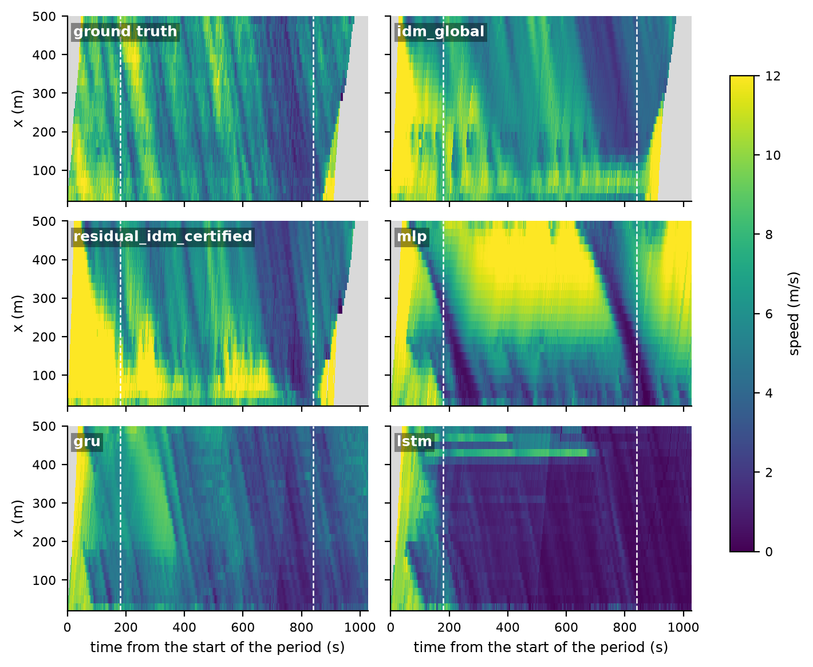

Figure `corridor_speed_contours`: speed fields of i80_p1, ground truth and laws (seed 0) ([PDF](figures/corridor_speed_contours.pdf)).

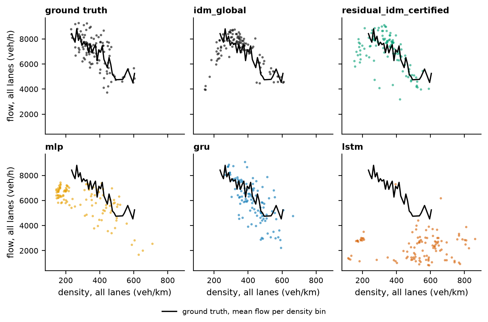

Figure `fundamental_diagrams`: fundamental diagrams of i80_p1 ([PDF](figures/fundamental_diagrams.pdf)).

#### Corridor: instability of the members and macro error

- Instability of the members of every law (audits of the member runs; idm_heterogeneous, idm_heterogeneous_all, the cores of residual_idm_certified_het and an IDM of calibrations without member runs: exact gain of their parameter sets) and the macro errors (1370 runs (I-80: 26 of 26 laws with runs, 3 scenarios; US-101: 21 of 21 laws with runs, 3 scenarios; 10 seeds per scenario); unit run; 95 % percentile bootstrap intervals, 1000 resamples); the residual amplitudes of D111 are in table e4_rmax; the temporal hold-out laws of D120 run on their scenarios only and are not in the correlations.

| corridor | law | members | audited | unstable among equilibria | not stable | runs | macro error | macro error (dynamic) | collisions / 1000 veh-km | collides | scenarios | in the correlation |
|---|---|---:|---:|---:|---:|---:|---:|---:|---:|---|---|---|
| I-80 | idm_global | 5 | 5 | 0.000 | 0.000 | 30 | 0.182 [0.176, 0.189] | 0.345 [0.326, 0.366] | 0.000 |  | all | yes |
| I-80 | idm_heterogeneous | 2840 | 2840 | 0.092 |  | 30 | 0.302 [0.255, 0.357] | 0.520 [0.421, 0.632] | 0.000 |  | all | yes |
| I-80 | knn | 5 | 5 | 0.924 | 0.924 | 30 | 0.490 [0.460, 0.522] | 0.508 [0.460, 0.559] | 2140.503 | yes | all | yes |
| I-80 | mlp | 5 | 5 | 0.957 | 0.957 | 30 | 0.308 [0.274, 0.349] | 0.485 [0.411, 0.576] | 912.508 | yes | all | yes |
| I-80 | pidl | 5 | 5 | 0.908 | 0.923 | 30 | 0.274 [0.245, 0.311] | 0.387 [0.332, 0.466] | 1800.653 | yes | all | yes |
| I-80 | gru | 5 | 5 | 0.715 | 0.731 | 30 | 0.192 [0.164, 0.223] | 0.312 [0.261, 0.373] | 205.968 | yes | all | yes |
| I-80 | lstm | 5 | 5 | 0.733 | 0.748 | 30 | 0.716 [0.662, 0.774] | 0.657 [0.577, 0.754] | 4664.165 | yes | all | yes |
| I-80 | perl | 5 | 5 | 0.940 | 0.940 | 30 | 0.431 [0.396, 0.464] | 0.652 [0.586, 0.718] | 11683.262 | yes | all | yes |
| I-80 | residual_idm | 5 | 5 | 0.030 | 0.030 | 30 | 0.158 [0.126, 0.207] | 0.268 [0.204, 0.369] | 0.000 |  | all | yes |
| I-80 | residual_idm_certified | 5 | 5 | 0.000 | 0.000 | 30 | 0.125 [0.109, 0.144] | 0.190 [0.159, 0.228] | 0.000 |  | all | yes |
| I-80 | mlp_penalty | 5 | 5 | 0.000 | 0.000 | 30 | 0.273 [0.254, 0.289] | 0.423 [0.386, 0.459] | 1588.453 | yes | all | yes |
| I-80 | gru_penalty | 5 | 5 | 0.359 | 0.359 | 30 | 0.235 [0.185, 0.296] | 0.363 [0.283, 0.462] | 730.579 | yes | all | yes |
| I-80 | lstm_penalty | 5 | 5 | 0.499 | 0.499 | 30 | 0.734 [0.673, 0.795] | 0.684 [0.601, 0.772] | 8041.715 | yes | all | yes |
| I-80 | idm_heterogeneous_all | 7651 | 7651 | 0.165 |  | 30 | 0.336 [0.276, 0.406] | 0.573 [0.433, 0.738] | 0.000 |  | all | yes |
| I-80 | residual_idm_certified_het | 3337 | 3337 | 0.000 |  | 30 | 0.200 [0.176, 0.226] | 0.368 [0.303, 0.437] | 0.000 |  | all | yes |
| I-80 | idm_global_p0 | 1 | 1 | 0.000 |  | 20 | 0.186 [0.172, 0.199] | 0.322 [0.296, 0.347] | 0.000 |  | i80_p1, i80_p2 |  |
| I-80 | residual_idm_certified_p0 | 5 | 5 | 0.000 | 0.000 | 20 | 0.173 [0.146, 0.202] | 0.282 [0.223, 0.344] | 0.000 |  | i80_p1, i80_p2 |  |
| I-80 | mlp_p0 | 5 | 5 | 0.941 | 0.963 | 20 | 0.230 [0.213, 0.249] | 0.338 [0.308, 0.372] | 687.094 | yes | i80_p1, i80_p2 |  |
| I-80 | gru_p0 | 5 | 5 | 0.791 | 0.812 | 20 | 0.107 [0.092, 0.123] | 0.182 [0.148, 0.216] | 196.277 | yes | i80_p1, i80_p2 |  |
| I-80 | idm_core_margin | 5 | 5 | 0.000 |  | 30 | 0.198 [0.174, 0.226] | 0.301 [0.254, 0.356] | 0.000 |  | all |  |
| I-80 | idm_margin_i80 | 5 | 5 | 0.000 |  | 30 | 0.239 [0.188, 0.298] | 0.479 [0.355, 0.624] | 0.000 |  | all |  |
| I-80 | residual_idm_margin_free_r0.3 | 5 | 5 | 0.000 | 0.000 | 30 | 0.176 [0.150, 0.202] | 0.281 [0.229, 0.337] | 0.110 | yes | all |  |
| US-101 | idm_global | 5 | 5 | 0.000 | 0.000 | 30 | 0.133 [0.110, 0.163] | 0.229 [0.183, 0.288] | 0.030 | yes | all | yes |
| US-101 | idm_heterogeneous | 2840 | 2840 | 0.092 |  | 30 | 0.125 [0.100, 0.150] | 0.196 [0.152, 0.243] | 0.155 | yes | all | yes |
| US-101 | knn | 5 | 5 | 0.924 | 0.924 | 30 | 0.628 [0.574, 0.690] | 0.583 [0.505, 0.682] | 1955.966 | yes | all | yes |
| US-101 | mlp | 5 | 5 | 0.957 | 0.957 | 30 | 0.428 [0.395, 0.464] | 0.651 [0.544, 0.775] | 725.901 | yes | all | yes |
| US-101 | pidl | 5 | 5 | 0.908 | 0.923 | 30 | 0.412 [0.367, 0.462] | 0.526 [0.452, 0.612] | 1293.825 | yes | all | yes |
| US-101 | gru | 5 | 5 | 0.715 | 0.731 | 30 | 0.421 [0.338, 0.515] | 0.517 [0.403, 0.652] | 211.229 | yes | all | yes |
| US-101 | lstm | 5 | 5 | 0.733 | 0.748 | 30 | 0.888 [0.784, 1.004] | 0.837 [0.698, 0.998] | 2857.501 | yes | all | yes |
| US-101 | perl | 5 | 5 | 0.940 | 0.940 | 30 | 0.661 [0.621, 0.704] | 0.685 [0.642, 0.734] | 13481.471 | yes | all | yes |
| US-101 | residual_idm | 5 | 5 | 0.030 | 0.030 | 30 | 0.156 [0.135, 0.176] | 0.256 [0.213, 0.297] | 0.029 | yes | all | yes |
| US-101 | residual_idm_certified | 5 | 5 | 0.000 | 0.000 | 30 | 0.113 [0.107, 0.119] | 0.122 [0.107, 0.135] | 0.227 | yes | all | yes |
| US-101 | mlp_penalty | 5 | 5 | 0.000 | 0.000 | 30 | 0.380 [0.334, 0.428] | 0.518 [0.440, 0.603] | 1160.574 | yes | all | yes |
| US-101 | gru_penalty | 5 | 5 | 0.359 | 0.359 | 30 | 0.347 [0.278, 0.428] | 0.458 [0.354, 0.581] | 752.931 | yes | all | yes |
| US-101 | lstm_penalty | 5 | 5 | 0.499 | 0.499 | 30 | 0.886 [0.785, 1.020] | 0.786 [0.663, 0.938] | 5540.222 | yes | all | yes |
| US-101 | residual_idm_certified_het | 3337 | 3337 | 0.000 |  | 30 | 0.174 [0.159, 0.189] | 0.266 [0.234, 0.300] | 0.671 | yes | all | yes |
| US-101 | idm_core_margin | 5 | 5 | 0.000 |  | 30 | 0.177 [0.168, 0.185] | 0.222 [0.207, 0.237] | 0.422 | yes | all |  |
| US-101 | idm_margin_i80 | 5 | 5 | 0.000 |  | 30 | 0.132 [0.115, 0.154] | 0.210 [0.179, 0.248] | 0.068 | yes | all |  |
| US-101 | residual_idm_margin_free_r0.3 | 5 | 5 | 0.000 | 0.000 | 30 | 0.147 [0.138, 0.155] | 0.189 [0.174, 0.203] | 0.296 | yes | all |  |

CSV: [tables/instability.csv](tables/instability.csv), LaTeX: [tables/instability.tex](tables/instability.tex).

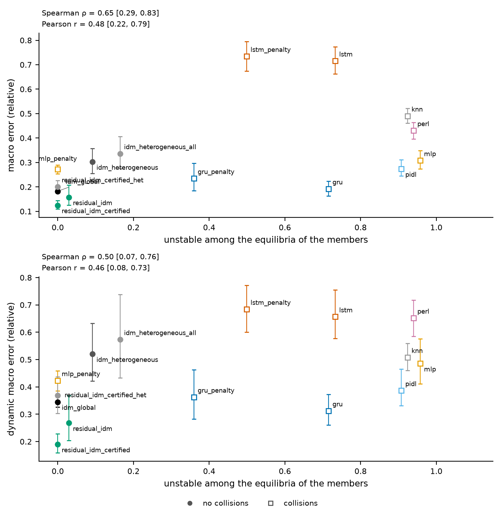

Figure `macro_error_vs_instability`: macro error against the instability of the members, per law (I-80) ([PDF](figures/macro_error_vs_instability.pdf)).

#### Corridor: correlation of instability and macro error

- Spearman and Pearson correlation per corridor over the laws of the mean macro error (all components or the dynamic ones) with the instability of the members; percentile bootstrap over the laws (1000 resamples), two-sided permutation p-value (10000 permutations of the instability over the laws, D108), all laws and the laws without collisions.

| corridor | error | instability | laws | method | n | correlation | valid resamples | p (permutation) |
|---|---|---|---|---|---:|---:|---:|---:|
| I-80 | macro error | unstable among equilibria | all laws | spearman | 15 | 0.652 [0.287, 0.834] | 1000 | 0.009 |
| I-80 | macro error | unstable among equilibria | all laws | pearson | 15 | 0.483 [0.223, 0.789] | 1000 | 0.067 |
| I-80 | macro error | unstable among equilibria | laws without collisions | spearman | 6 | 0.698 [-0.426, 1.000] | 980 | 0.172 |
| I-80 | macro error | unstable among equilibria | laws without collisions | pearson | 6 | 0.907 [-0.339, 0.995] | 980 | 0.024 |
| I-80 | macro error | band share not stable | all laws | spearman | 12 | 0.648 [0.177, 0.883] | 1000 | 0.026 |
| I-80 | macro error | band share not stable | all laws | pearson | 12 | 0.467 [0.072, 0.823] | 1000 | 0.125 |
| I-80 | macro error | band share not stable | laws without collisions | spearman | 3 | 0.000 [-1.000, 1.000] | 649 | 1.000 |
| I-80 | macro error | band share not stable | laws without collisions | pearson | 3 | 0.081 [-1.000, 1.000] | 649 | 1.000 |
| I-80 | macro error (dynamic) | unstable among equilibria | all laws | spearman | 15 | 0.496 [0.071, 0.762] | 1000 | 0.059 |
| I-80 | macro error (dynamic) | unstable among equilibria | all laws | pearson | 15 | 0.457 [0.075, 0.734] | 1000 | 0.084 |
| I-80 | macro error (dynamic) | unstable among equilibria | laws without collisions | spearman | 6 | 0.698 [-0.426, 1.000] | 980 | 0.172 |
| I-80 | macro error (dynamic) | unstable among equilibria | laws without collisions | pearson | 6 | 0.852 [-0.361, 0.997] | 980 | 0.024 |
| I-80 | macro error (dynamic) | band share not stable | all laws | spearman | 12 | 0.570 [0.074, 0.855] | 1000 | 0.056 |
| I-80 | macro error (dynamic) | band share not stable | all laws | pearson | 12 | 0.572 [0.169, 0.837] | 1000 | 0.055 |
| I-80 | macro error (dynamic) | band share not stable | laws without collisions | spearman | 3 | 0.000 [-1.000, 1.000] | 649 | 1.000 |
| I-80 | macro error (dynamic) | band share not stable | laws without collisions | pearson | 3 | 0.004 [-1.000, 1.000] | 649 | 1.000 |
| US-101 | macro error | unstable among equilibria | all laws | spearman | 14 | 0.744 [0.372, 0.912] | 1000 | 0.003 |
| US-101 | macro error | unstable among equilibria | all laws | pearson | 14 | 0.689 [0.433, 0.928] | 1000 | 0.008 |
| US-101 | macro error | unstable among equilibria | laws without collisions | spearman | 0 |  | 0 |  |
| US-101 | macro error | unstable among equilibria | laws without collisions | pearson | 0 |  | 0 |  |
| US-101 | macro error | band share not stable | all laws | spearman | 12 | 0.718 [0.261, 0.933] | 1000 | 0.012 |
| US-101 | macro error | band share not stable | all laws | pearson | 12 | 0.630 [0.246, 0.900] | 1000 | 0.033 |
| US-101 | macro error | band share not stable | laws without collisions | spearman | 0 |  | 0 |  |
| US-101 | macro error | band share not stable | laws without collisions | pearson | 0 |  | 0 |  |
| US-101 | macro error (dynamic) | unstable among equilibria | all laws | spearman | 14 | 0.733 [0.366, 0.933] | 1000 | 0.004 |
| US-101 | macro error (dynamic) | unstable among equilibria | all laws | pearson | 14 | 0.765 [0.562, 0.951] | 1000 | 0.002 |
| US-101 | macro error (dynamic) | unstable among equilibria | laws without collisions | spearman | 0 |  | 0 |  |
| US-101 | macro error (dynamic) | unstable among equilibria | laws without collisions | pearson | 0 |  | 0 |  |
| US-101 | macro error (dynamic) | band share not stable | all laws | spearman | 12 | 0.711 [0.297, 0.964] | 1000 | 0.013 |
| US-101 | macro error (dynamic) | band share not stable | all laws | pearson | 12 | 0.719 [0.384, 0.941] | 1000 | 0.011 |
| US-101 | macro error (dynamic) | band share not stable | laws without collisions | spearman | 0 |  | 0 |  |
| US-101 | macro error (dynamic) | band share not stable | laws without collisions | pearson | 0 |  | 0 |  |

CSV: [tables/instability_correlation.csv](tables/instability_correlation.csv), LaTeX: [tables/instability_correlation.tex](tables/instability_correlation.tex).

#### Corridor: correlation of instability and dynamic macro error

- Spearman and Pearson correlation per corridor over the laws of the dynamic macro error with the instability of the members, percentile bootstrap over the laws (1000 resamples), permutation p-value, all laws and the laws without collisions.

| corridor | instability | laws | method | n | correlation | valid resamples | p (permutation) |
|---|---|---|---|---:|---:|---:|---:|
| I-80 | unstable among equilibria | all laws | spearman | 15 | 0.496 [0.071, 0.762] | 1000 | 0.059 |
| I-80 | unstable among equilibria | all laws | pearson | 15 | 0.457 [0.075, 0.734] | 1000 | 0.084 |
| I-80 | unstable among equilibria | laws without collisions | spearman | 6 | 0.698 [-0.426, 1.000] | 980 | 0.172 |
| I-80 | unstable among equilibria | laws without collisions | pearson | 6 | 0.852 [-0.361, 0.997] | 980 | 0.024 |
| I-80 | band share not stable | all laws | spearman | 12 | 0.570 [0.074, 0.855] | 1000 | 0.056 |
| I-80 | band share not stable | all laws | pearson | 12 | 0.572 [0.169, 0.837] | 1000 | 0.055 |
| I-80 | band share not stable | laws without collisions | spearman | 3 | 0.000 [-1.000, 1.000] | 649 | 1.000 |
| I-80 | band share not stable | laws without collisions | pearson | 3 | 0.004 [-1.000, 1.000] | 649 | 1.000 |
| US-101 | unstable among equilibria | all laws | spearman | 14 | 0.733 [0.366, 0.933] | 1000 | 0.004 |
| US-101 | unstable among equilibria | all laws | pearson | 14 | 0.765 [0.562, 0.951] | 1000 | 0.002 |
| US-101 | unstable among equilibria | laws without collisions | spearman | 0 |  | 0 |  |
| US-101 | unstable among equilibria | laws without collisions | pearson | 0 |  | 0 |  |
| US-101 | band share not stable | all laws | spearman | 12 | 0.711 [0.297, 0.964] | 1000 | 0.013 |
| US-101 | band share not stable | all laws | pearson | 12 | 0.719 [0.384, 0.941] | 1000 | 0.011 |
| US-101 | band share not stable | laws without collisions | spearman | 0 |  | 0 |  |
| US-101 | band share not stable | laws without collisions | pearson | 0 |  | 0 |  |

CSV: [tables/macro_error_dynamic_correlation.csv](tables/macro_error_dynamic_correlation.csv), LaTeX: [tables/macro_error_dynamic_correlation.tex](tables/macro_error_dynamic_correlation.tex).

TOST: I-80: 7 of 17 metrics equivalent; US-101: 6 of 17 metrics equivalent.

#### Corridor: equivalence of residual_idm_certified and idm_global

- TOST of residual_idm_certified against idm_global per corridor, paired by scenario and seed (pairs); relative difference with its 95 % percentile bootstrap intervals; margin +-10 % of the mean of idm_global, alpha 0.05.

| corridor | metric | pairs | idm_global | residual_idm_certified | relative difference | p (Wilcoxon) | p (TOST) | equivalent |
|---|---|---:|---:|---:|---:|---:|---:|---|
| I-80 | throughput (veh/h) | 30 | 7323.273 | 7246.364 | -1.1 % [-1.4 %, -0.7 %] | <0.001 | <0.001 | yes |
| I-80 | mean speed (m/s) | 30 | 6.269 | 6.384 | +1.8 % [+1.4 %, +2.3 %] | <0.001 | <0.001 | yes |
| I-80 | queue discharge (veh/h) | 30 | 7256.654 | 6895.900 | -5.0 % [-6.7 %, -3.0 %] | <0.001 | <0.001 | yes |
| I-80 | peak 2-min flow (veh/h) | 30 | 8582.000 | 8691.000 | +1.3 % [+0.9 %, +1.6 %] | <0.001 | <0.001 | yes |
| I-80 | capacity drop | 30 | 0.154 | 0.206 | +33.7 % [+23.8 %, +41.7 %] | <0.001 | 1.000 |  |
| I-80 | congested share | 30 | 0.724 | 0.295 | -59.2 % [-63.1 %, -55.9 %] | <0.001 | 1.000 |  |
| I-80 | FD scatter (veh/h) | 30 | 581.827 | 893.092 | +53.5 % [+42.8 %, +64.7 %] | <0.001 | 1.000 |  |
| I-80 | waves | 30 | 1.100 | 2.600 | +136.4 % [+90.5 %, +220.8 %] | <0.001 | 1.000 |  |
| I-80 | wave speed, cross-correlation (m/s) | 30 | -4.282 | -5.589 | +30.5 % [+23.1 %, +38.2 %] | <0.001 | 1.000 |  |
| I-80 | wave speed, leading edges (m/s) | 20 | -7.037 | -8.277 | +17.6 % [-11.8 %, +57.8 %] | 0.202 | 0.669 |  |
| I-80 | wave amplitude (m/s) | 20 | 3.755 | 4.441 | +18.3 % [+7.0 %, +33.5 %] | 0.006 | 0.881 |  |
| I-80 | travel time mean (s) | 30 | 68.858 | 68.013 | -1.2 % [-1.5 %, -1.0 %] | <0.001 | <0.001 | yes |
| I-80 | travel time median (s) | 30 | 65.322 | 64.962 | -0.6 % [-1.4 %, +0.4 %] | 0.213 | <0.001 | yes |
| I-80 | collisions / 1000 veh-km | 30 | 0.000 | 0.000 |  |  |  |  |
| I-80 | vehicles in contact | 30 | 0.000 | 0.000 |  |  |  |  |
| I-80 | inserted share | 30 | 1.000 | 1.000 | +0.0 % [+0.0 %, +0.0 %] | 1.000 | <0.001 | yes |
| I-80 | insertion delay (s) | 30 | 0.243 | 0.240 | -1.6 % [-23.6 %, +21.0 %] | 0.871 | 0.236 |  |
| US-101 | throughput (veh/h) | 30 | 7627.231 | 7630.154 | +0.0 % [-0.1 %, +0.2 %] | 0.698 | <0.001 | yes |
| US-101 | mean speed (m/s) | 30 | 9.813 | 10.573 | +7.7 % [+7.1 %, +8.4 %] | <0.001 | <0.001 | yes |
| US-101 | queue discharge (veh/h) | 20 | 7201.070 | 8418.000 | +16.9 % [+13.4 %, +20.2 %] | <0.001 | 1.000 |  |
| US-101 | peak 2-min flow (veh/h) | 30 | 8531.000 | 8814.000 | +3.3 % [+3.0 %, +3.6 %] | <0.001 | <0.001 | yes |
| US-101 | capacity drop | 20 | 0.135 | 0.022 | -83.8 % [-92.4 %, -72.6 %] | <0.001 | 1.000 |  |
| US-101 | congested share | 30 | 0.445 | 0.027 | -93.9 % [-95.3 %, -92.6 %] | <0.001 | 1.000 |  |
| US-101 | FD scatter (veh/h) | 30 | 757.523 | 944.350 | +24.7 % [+20.1 %, +29.3 %] | <0.001 | 1.000 |  |
| US-101 | waves | 30 | 2.233 | 2.533 | +13.4 % [-1.4 %, +29.3 %] | 0.074 | 0.670 |  |
| US-101 | wave speed, cross-correlation (m/s) | 30 | -6.660 | -6.186 | -7.1 % [-25.0 %, +13.9 %] | 0.490 | 0.382 |  |
| US-101 | wave speed, leading edges (m/s) | 30 | -3.531 | -5.269 | +49.2 % [+39.7 %, +56.9 %] | <0.001 | 1.000 |  |
| US-101 | wave amplitude (m/s) | 30 | 8.392 | 7.319 | -12.8 % [-15.9 %, -9.9 %] | <0.001 | 0.953 |  |
| US-101 | travel time mean (s) | 30 | 62.858 | 58.788 | -6.5 % [-7.2 %, -5.9 %] | <0.001 | <0.001 | yes |
| US-101 | travel time median (s) | 30 | 60.652 | 56.236 | -7.3 % [-8.5 %, -6.2 %] | <0.001 | <0.001 | yes |
| US-101 | collisions / 1000 veh-km | 30 | 0.030 | 0.227 | +662.7 % | 0.028 | 0.993 |  |
| US-101 | vehicles in contact | 30 | 0.000 | 0.000 | +658.0 % | 0.028 | 0.993 |  |
| US-101 | inserted share | 30 | 1.000 | 1.000 | +0.0 % [+0.0 %, +0.0 %] | 1.000 | <0.001 | yes |
| US-101 | insertion delay (s) | 30 | 1.863 | 0.037 | -98.0 % [-98.3 %, -97.6 %] | <0.001 | 1.000 |  |

CSV: [tables/tost.csv](tables/tost.csv), LaTeX: [tables/tost.tex](tables/tost.tex).

Verdicts of the corridor hypotheses (D108):

- H12.1, mlp (I-80): **open**; degradation vs idm_global: throughput +0.147 [+0.135, +0.157] degraded; travel time +0.082 [+0.075, +0.091] degraded; wave speed +0.553 [+0.364, +0.809] degraded by >= 0.15.
- H12.1, gru (I-80): **open**; degradation vs idm_global: throughput +0.027 [+0.006, +0.051] degraded; travel time +0.078 [+0.050, +0.108] degraded; wave speed +0.126 [+0.005, +0.296] degraded.
- H12.1, lstm (I-80): **confirmed**; degradation vs idm_global: throughput +0.754 [+0.688, +0.817] degraded by >= 0.15; travel time +0.710 [+0.556, +0.866] degraded by >= 0.15; wave speed +0.429 [+0.257, +0.656] degraded by >= 0.15.
- H12.1, mlp (US-101): **confirmed**; degradation vs idm_global: throughput +0.230 [+0.214, +0.248] degraded by >= 0.15; travel time +0.265 [+0.220, +0.313] degraded by >= 0.15; wave speed +0.559 [+0.191, +0.913] degraded by >= 0.15.
- H12.1, gru (US-101): **confirmed**; degradation vs idm_global: throughput +0.208 [+0.176, +0.249] degraded by >= 0.15; travel time +0.472 [+0.340, +0.631] degraded by >= 0.15; wave speed -0.131 [-0.359, +0.084] not degraded.
- H12.1, lstm (US-101): **confirmed**; degradation vs idm_global: throughput +0.741 [+0.686, +0.790] degraded by >= 0.15; travel time +1.387 [+1.050, +1.751] degraded by >= 0.15; wave speed +0.156 [-0.114, +0.369] not degraded.
- H12.1, overall (I-80 and US-101): **open**; confirmed for >= 2 of 3 networks on every corridor: I-80: mlp open, gru open, lstm confirmed; US-101: mlp confirmed, gru confirmed, lstm confirmed.
- H12.2, residual_idm_certified (I-80 and US-101): **open**; fails: macro part (TOST) and micro part; macro (TOST +-10 %): I-80: throughput -1.1 % [-1.4 %, -0.7 %] equivalent, travel time -1.2 % [-1.5 %, -1.0 %] equivalent, wave speed +30.5 % [+23.1 %, +38.2 %] not equivalent (faster); US-101: throughput +0.0 % [-0.1 %, +0.2 %] equivalent, travel time -6.5 % [-7.2 %, -5.9 %] equivalent, wave speed -7.1 % [-25.0 %, +13.9 %] not equivalent (slower); micro: RMSE vs idm +4.8 % [+3.7 %, +5.9 %] over 5521 drivers, not superior.
- H12.3, Spearman (I-80): **confirmed**; r +0.652 [+0.287, +0.834] over 15 laws, p (permutation) 0.0095.
- H12.3, Pearson (does not decide) (I-80): **open**; r +0.483 [+0.223, +0.789] over 15 laws, p (permutation) 0.0668.
- H12.3, Spearman, dynamic macro error (does not decide) (I-80): **open**; r +0.496 [+0.071, +0.762] over 15 laws, p (permutation) 0.0591.
- H12.3, Pearson, dynamic macro error (does not decide) (I-80): **open**; r +0.457 [+0.075, +0.734] over 15 laws, p (permutation) 0.0837.
- H12.3, Spearman (US-101): **confirmed**; r +0.744 [+0.372, +0.912] over 14 laws, p (permutation) 0.0030.
- H12.3, Pearson (does not decide) (US-101): **confirmed**; r +0.689 [+0.433, +0.928] over 14 laws, p (permutation) 0.0077.
- H12.3, Spearman, dynamic macro error (does not decide) (US-101): **confirmed**; r +0.733 [+0.366, +0.933] over 14 laws, p (permutation) 0.0037.
- H12.3, Pearson, dynamic macro error (does not decide) (US-101): **confirmed**; r +0.765 [+0.562, +0.951] over 14 laws, p (permutation) 0.0023.
- H12.3, overall (I-80 and US-101): **confirmed**; Spearman, r > 0.6, p < 0.05 and >= 10 laws on every corridor: I-80 confirmed, US-101 confirmed.

#### Corridor: degradation of the macro triple by the pure networks (H12.1)

- H12.1 (D108): mlp, gru, lstm against idm_global per corridor; degradation |e_network| - |e_idm_global| of the signed relative errors of throughput, travel time (W1) and wave speed (cross-correlation), paired by scenario and seed (pairs), mean with its 95 % percentile bootstrap intervals; degraded: lower end > 0; degraded by >= 0.15: and the mean at least that.

| corridor | network | metric | pairs | |e| network | |e| idm_global | degradation | degraded | degraded by >= 0.15 | H12.1 |
|---|---|---|---:|---:|---:|---:|---|---|---|
| I-80 | mlp | throughput | 30 | 0.166 | 0.019 | 0.147 [0.135, 0.157] | yes |  | open |
| I-80 | mlp | travel time (W1) | 30 | 0.155 | 0.072 | 0.082 [0.075, 0.091] | yes |  | open |
| I-80 | mlp | wave speed (xcorr) | 30 | 0.786 | 0.233 | 0.553 [0.364, 0.809] | yes | yes | open |
| I-80 | gru | throughput | 30 | 0.046 | 0.019 | 0.027 [0.006, 0.051] | yes |  | open |
| I-80 | gru | travel time (W1) | 30 | 0.150 | 0.072 | 0.078 [0.050, 0.108] | yes |  | open |
| I-80 | gru | wave speed (xcorr) | 30 | 0.359 | 0.233 | 0.126 [0.005, 0.296] | yes |  | open |
| I-80 | lstm | throughput | 30 | 0.773 | 0.019 | 0.754 [0.688, 0.817] | yes | yes | confirmed |
| I-80 | lstm | travel time (W1) | 26 | 0.782 | 0.072 | 0.710 [0.556, 0.866] | yes | yes | confirmed |
| I-80 | lstm | wave speed (xcorr) | 30 | 0.662 | 0.233 | 0.429 [0.257, 0.656] | yes | yes | confirmed |
| US-101 | mlp | throughput | 30 | 0.244 | 0.014 | 0.230 [0.214, 0.248] | yes | yes | confirmed |
| US-101 | mlp | travel time (W1) | 30 | 0.331 | 0.066 | 0.265 [0.220, 0.313] | yes | yes | confirmed |
| US-101 | mlp | wave speed (xcorr) | 30 | 1.005 | 0.446 | 0.559 [0.191, 0.913] | yes | yes | confirmed |
| US-101 | gru | throughput | 30 | 0.222 | 0.014 | 0.208 [0.176, 0.249] | yes | yes | confirmed |
| US-101 | gru | travel time (W1) | 30 | 0.538 | 0.066 | 0.472 [0.340, 0.631] | yes | yes | confirmed |
| US-101 | gru | wave speed (xcorr) | 30 | 0.315 | 0.446 | -0.131 [-0.359, 0.084] |  |  | confirmed |
| US-101 | lstm | throughput | 30 | 0.755 | 0.014 | 0.741 [0.686, 0.790] | yes | yes | confirmed |
| US-101 | lstm | travel time (W1) | 29 | 1.453 | 0.066 | 1.387 [1.050, 1.751] | yes | yes | confirmed |
| US-101 | lstm | wave speed (xcorr) | 30 | 0.602 | 0.446 | 0.156 [-0.114, 0.369] |  |  | confirmed |

CSV: [tables/h12_1.csv](tables/h12_1.csv), LaTeX: [tables/h12_1.tex](tables/h12_1.tex).

#### NGSIM test parts: micro comparison with the IDM (H12.2)

- H12.2, micro part (D108): spacing RMSE of the test parts of ngsim_i80 (m), unit driver, residual_idm_certified (fine-tuned certified hybrid) and the reference rows against e3_reference idm of the same folds, paired over the drivers (pairs); superior: upper end of the relative difference below 0; mean over runs: of rmse_s_mean; 95 % percentile bootstrap intervals, 1000 resamples.

| role | experiment | model | runs | drivers | RMSE s (m) | mean over runs (m) | RMSE vs IDM | p | superior |
|---|---|---|---:|---:|---:|---:|---:|---:|---|
| reference | e3_reference | idm | 5 | 5521 | 4.92 [4.82, 5.02] | 4.66 |  |  |  |
| candidate | e4_stable_ft | residual_idm | 25 | 5521 | 5.16 [5.04, 5.28] | 4.89 | +4.8 % [+3.7 %, +5.9 %] | <0.001 |  |
| reference row | e4_free_ft | residual_idm | 25 | 5521 | 4.49 [4.40, 4.58] | 4.27 | -8.8 % [-9.8 %, -7.8 %] | <0.001 | yes |
| reference row | e4_free_ft | mlp | 25 | 5521 | 5.96 [5.87, 6.07] | 5.57 | +21.2 % [+19.4 %, +23.2 %] | <0.001 |  |

CSV: [tables/h12_2.csv](tables/h12_2.csv), LaTeX: [tables/h12_2.tex](tables/h12_2.tex).

Sensitivity to the downstream boundary and the lane-change model (D113).

Ranking residual_idm_certified < idm_global < gru by macro error: it holds in 0 of the 6 variants with runs of every law (baseline: residual_idm_certified < gru < idm_global, gain0.01: idm_global < gru < residual_idm_certified, gain0.04: idm_global < residual_idm_certified < gru, nofeedback: gru < idm_global < residual_idm_certified, lc_low: idm_global < residual_idm_certified < gru, lc_high: gru < idm_global < residual_idm_certified). The ranking does not survive every variant.

#### Corridor: sensitivity to the boundary and the lane-change model (D113)

- Variants of i80_p1 (D113) and the scenario itself (baseline, the same seeds): per variant and law the macro error, the macro triple (signed relative errors) and the collisions, unit run (seed); rank of the laws by macro error per variant and whether it is residual_idm_certified < idm_global < gru; 95 % percentile bootstrap intervals, 1000 resamples.

| variant | law | runs | macro error | throughput | travel time (W1) | wave speed (xcorr) | collisions / 1000 veh-km | rank | residual_idm_certified < idm_global < gru |
|---|---|---:|---:|---:|---:|---:|---:|---:|---|
| baseline | idm_global | 5 | 0.177 [0.169, 0.184] | -0.004 [-0.005, -0.004] | 0.072 [0.069, 0.076] | 0.208 [0.178, 0.241] | 0.000 | 3 |  |
| baseline | residual_idm_certified | 5 | 0.131 [0.098, 0.164] | -0.007 [-0.008, -0.007] | 0.079 [0.076, 0.082] | 0.112 [0.064, 0.168] | 0.000 | 1 |  |
| baseline | gru | 5 | 0.170 [0.161, 0.183] | -0.042 [-0.091, -0.010] | 0.146 [0.102, 0.207] | 0.272 [0.236, 0.321] | 173.325 | 2 |  |
| gain0.01 | idm_global | 5 | 0.165 [0.141, 0.178] | -0.004 [-0.004, -0.003] | 0.110 [0.106, 0.115] | 0.265 [0.254, 0.276] | 0.000 | 1 |  |
| gain0.01 | residual_idm_certified | 5 | 0.230 [0.198, 0.276] | -0.010 [-0.011, -0.009] | 0.122 [0.120, 0.124] | 0.176 [0.143, 0.211] | 0.000 | 3 |  |
| gain0.01 | gru | 5 | 0.183 [0.150, 0.212] | -0.026 [-0.047, -0.007] | 0.121 [0.083, 0.158] | 0.239 [0.236, 0.241] | 169.670 | 2 |  |
| gain0.04 | idm_global | 5 | 0.161 [0.153, 0.172] | -0.002 [-0.003, -0.002] | 0.063 [0.060, 0.068] | 0.278 [0.197, 0.355] | 0.000 | 1 |  |
| gain0.04 | residual_idm_certified | 5 | 0.197 [0.164, 0.224] | -0.005 [-0.006, -0.004] | 0.063 [0.061, 0.065] | 0.102 [0.007, 0.192] | 0.000 | 2 |  |
| gain0.04 | gru | 5 | 0.222 [0.205, 0.237] | -0.040 [-0.091, 0.008] | 0.149 [0.125, 0.174] | 0.271 [0.256, 0.293] | 176.914 | 3 |  |
| nofeedback | idm_global | 5 | 0.273 [0.271, 0.275] | 0.044 [0.042, 0.046] | 0.303 [0.295, 0.310] | 0.243 [0.230, 0.258] | 0.000 | 2 |  |
| nofeedback | residual_idm_certified | 5 | 0.369 [0.363, 0.375] | 0.042 [0.040, 0.044] | 0.444 [0.440, 0.449] | -0.072 [-0.105, -0.038] | 0.000 | 3 |  |
| nofeedback | gru | 5 | 0.202 [0.187, 0.220] | -0.058 [-0.080, -0.040] | 0.158 [0.113, 0.195] | 0.244 [0.224, 0.260] | 176.086 | 1 |  |
| lc_low | idm_global | 5 | 0.184 [0.173, 0.194] | -0.004 [-0.005, -0.004] | 0.146 [0.136, 0.157] | 0.319 [0.270, 0.369] | 0.000 | 1 |  |
| lc_low | residual_idm_certified | 5 | 0.227 [0.178, 0.273] | -0.009 [-0.010, -0.009] | 0.139 [0.132, 0.147] | 0.104 [-0.012, 0.219] | 0.000 | 2 |  |
| lc_low | gru | 5 | 0.252 [0.211, 0.306] | -0.091 [-0.184, -0.014] | 0.185 [0.176, 0.194] | 0.109 [-0.107, 0.321] | 133.160 | 3 |  |
| lc_high | idm_global | 5 | 0.156 [0.151, 0.160] | -0.005 [-0.005, -0.004] | 0.046 [0.043, 0.050] | 0.207 [0.162, 0.235] | 0.000 | 2 |  |
| lc_high | residual_idm_certified | 5 | 0.201 [0.164, 0.247] | -0.008 [-0.009, -0.007] | 0.060 [0.057, 0.061] | 0.189 [0.156, 0.222] | 0.000 | 3 |  |
| lc_high | gru | 5 | 0.156 [0.121, 0.192] | -0.029 [-0.049, -0.009] | 0.105 [0.085, 0.125] | 0.249 [0.230, 0.263] | 310.180 | 1 |  |

CSV: [tables/sensitivity.csv](tables/sensitivity.csv), LaTeX: [tables/sensitivity.tex](tables/sensitivity.tex).


## 9. Deviations from the specification

127 D-entries of `docs/decisions.md`, the first sentence of each decision, by milestone: the one of its section in the log, or a later one when the entry's number is at or above the first new entry that a later milestone report cites (the entries are numbered in time).

### M1 (data pipeline, IDM calibration, persistence baseline)

- D1 (2026-09-27): Positions are defined at the bumpers that face each other: `x_lead` = leader rear bumper, `x_follower` = follower front bumper, so `s = x_lead - x_follower` holds exactly.
- D2 (2026-09-27): For sources without a common longitudinal coordinate (OpenACC, FollowNet) `x_lead` is the trapezoidal integral of `v_lead` and `x_follower = x_lead - s`.
- D3 (2026-09-27): Stored speeds are the measured ones; the Savitzky-Golay filter is used only to compute the acceleration.
- D4 (2026-09-27): "Follower speed > 0" is evaluated as `v > 0.1` m/s.
- D5 (2026-09-27): Duration criterion is `n * dt >= 15` s: at least 150 samples at 10 Hz.
- D6 (2026-09-27): Samples with `s <= 0` or `s >= 120` m end a segment instead of discarding the whole pair.
- D7 (2026-09-27): Long runs are cut into chunks of at most `max_duration` (OpenACC: 60 s; other datasets: no limit).
- D8 (2026-09-27): One split per dataset and kind (seed 0); validation fold = test fold + 1.
- D9 (2026-09-27): NRMSE is RMSE divided by the root mean square of the observed series (Punzo et al.
- D10 (2026-09-27): Differential evolution is implemented in torch and batched over events (GPU), with the default settings of `scipy.optimize.differential_evolution` except for the final polishing step, which is omitted.
- D11 (2026-09-27): Collision during calibration: `J = 10 + share of samples with s <= 0`.
- D12 (2026-09-27): Global parameters minimise the NRMSE of spacing and speed pooled over all events plus `10 x collision rate`.
- D13 (2026-09-27): Persistence model derives `a(t)` from the state history as `(v[t] - v[t-dt]) / dt` (window 2).
- D14 (2026-09-27): Deviation from the specification text: OpenACC `IVS_i` is read as the gap between vehicle `i` and vehicle `i + 1` (spacing of follower `i + 1`), not as "the spacing between vehicle i and its leader".
- D15 (2026-09-27): OpenACC "driver" for the driver-level split is the pair (vehicle model, driving mode): `follower_id = openacc/<campaign>/<vehicle>:<ACC or Human or unknown>`.
- D16 (2026-09-27): Driving mode of an OpenACC sample comes from the `Driver<i>` column; if the column is absent, from the header flag (1 -> ACC, 0 -> Human, otherwise `unknown`).
- D17 (2026-09-27): FollowNet relative speed is negated at load time (`dv = v - v_lead = -(v_lead - v)`).
- D18 (2026-09-27): FollowNet NGSIM I-80 and Waymo spacing is reduced by a nominal vehicle length of 4.5 m (`spacing_offset`), HighD by 0.
- D19 (2026-09-27): FollowNet events have no identifiers: every event is its own driver (`follower_id = <dataset>/<site>/ev<index>`), one site per file.
- D20 (2026-09-27): FollowNet HighD is resampled from 25 Hz to 10 Hz by linear interpolation without an anti-aliasing filter.
- D21 (2026-09-27): Pickled FollowNet files (object arrays) are loaded only after their sha256 matches `SOURCES.json` written by `scripts/download_data.py`, and are cached as plain arrays (`.npz`, no pickle).
- D22 (2026-09-27): Deviation from the specification: raw highD is not available (no levelXdata agreement yet; confirmed by the user on 2026-09-27).
- D23 (2026-09-27): Waymo pairs: bumper positions are derived from the box centres and the vehicle lengths of the file; all Waymo events belong to one site (`all`); every event whose follower is the AV has the same driver id `waymo/all/AV`.
- D24 (2026-09-27): The Waymo pair files were downloaded with PowerShell `Invoke-WebRequest` (sha256 verified against the Mendeley API).
- D25 (2026-09-27): `resample_uniform` sorts the samples by time, keeps the first of repeated time stamps, never extrapolates; grid points inside a source gap longer than 0.35 s are NaN.
- D26 (2026-09-27): Savitzky-Golay window = odd number of samples nearest to `window_s / dt` (11 at 10 Hz); `central_diff` uses second-order one-sided differences at the ends.
- D27 (2026-09-27): The time grid has a gap where a step differs from `dt` by more than 0.1 %; event time is rebuilt as `k * dt`.
- D28 (2026-09-27): Measured speeds in (-0.1, 0) m/s are set to 0; speeds <= -0.1 m/s and NaN dataset accelerations invalidate the sample.
- D29 (2026-09-27): The acceleration is computed on each maximal valid run before chunking; the moving-fraction filter is applied to each chunk.
- D30 (2026-09-27): With `smooth_speeds=true` the stored speeds are smoothed over the whole run, the acceleration still comes from the measured speed.
- D31 (2026-09-27): `filter_event` keeps the acceleration of the pre-segmented event; ids get a suffix `_<j>` only when the event is split.
- D32 (2026-09-27): Split groups are sorted before shuffling; a group goes to the currently lightest fold (weight = samples).
- D33 (2026-09-27): `config_hash` of an extraction covers the data config and the effective extraction options, not the paths and not the split settings; numbers are hashed as floats (60 and 60.0 are the same setting).
- D34 (2026-09-27): Stopping rule of the differential evolution: per event `std(J) <= 1e-4 + 1e-3 *
- D35 (2026-09-27): The acceleration stored in an event is the instantaneous acceleration at the sample (central difference), while the rollout applies `a[k]` over `[k, k + 1]` (semi-implicit Euler).
- D36 (2026-09-27): Closed-loop metrics include the first sample (whose error is zero by construction); a model with window `W` is scored from index `W - 1`.
- D37 (2026-09-27): OpenACC data files are recognised by a first line starting with `Date` (skips the vehicle specification tables and the ZalaZone list of long-gap vehicles); an empty or unknown `Driver` cell is `unknown`.
- D38 (2026-09-27): highD: a 10 Hz sample that lies between two frames with different leaders or lanes gets no leader state, so states of two leaders are never interpolated.
- D39 (2026-09-27): Waymo pairs: both vehicles are put on one 10 Hz grid starting at the earlier first sample (the file has 584 steps of 0.09 or 0.11 s).
- D40 (2026-09-27): Batch `i` of the per-event calibration uses the seed `seed + i`; the result therefore depends on `batch_events`, which is part of the hashed config.
- D41 (2026-09-28): Deviation from the specification, decided by the user at the M1 review: `extraction.min_spacing = 0.5` m; a sample is valid when `0.5 < s < 120` m.
- D42 (2026-09-27): NGSIM reconstruction = constrained smoothing of the longitudinal positions, one quadratic programme per track (OSQP): least squares to the observed positions with Huber weights (threshold 1 m, 2 re-weighting iterations) plus a squared-jerk penalty whose weight puts the gain 1/2 of the smoother at 0.5 Hz; hard constraints speed >= 0, acceleration in [-8, 4] m/s^2,
- D43 (2026-09-27): Leader frames whose constraint would push the follower back by more than 5 m (`max_push`) are left unconstrained.
- D44 (2026-09-27): Reconstructed speed, acceleration and jerk are centred differences of the reconstructed positions (`v[k]` = mean of the two adjacent interval speeds, `a[k]` = second difference at `k`), so that the state and the acceleration refer to the same instant; `a_source = "reconstruction"`.
- D45 (2026-09-27): NGSIM period = rank of `global_time - 100 * frame_id`; track key (period, vehicle_id); event lane = lane of the follower at the start of the event; mainline lanes only (I-80: 1-6 including the HOV lane; US-101: 1-5).
- D46 (2026-09-27): Macroscopic validation of the reconstruction: Edie's flow, density and speed on a 50 m x 10 s grid per lane and over the lanes, computed from the raw and from the reconstructed trajectories (trajectories split exactly at the grid lines); reported: relative difference of total distance and total time, RMSE and correlation of the cell speeds, relative error of flow and density over the cells with at least 5 vehicle-seconds.
- D47 (2026-09-27): The optimiser is run 3 times with independent seeds (`calibration.restarts`), per event the run with the lowest objective is kept; same for the global fit.
- D48 (2026-09-28): Decided by the user at the M1 review: the heterogeneous IDM of the corridor (M5) keeps `v0` and `b` fixed and estimates `T, s0, a` per event.
- D49 (2026-09-28): Decided by the user at the M1 review: the IDM of the I-80 corridor is calibrated on the events of `ngsim_i80` (own reconstruction), not on highD.
- D50 (2026-09-28): Minimum net gap of the NGSIM reconstruction raised from 0.5 to 0.75 m.

### M2 (models and closed-loop evaluation)

- D51 (2026-09-28): Every model standardises its inputs inside (`InputScaler`): callers pass raw SI states, autograd differentiates through the whole model.
- D52 (2026-09-28): The physics of PERL is the adapted Newell model of the PERL paper (Long et al.
- D53 (2026-09-28): PIDL: collocation states uniform in the box of the 1 % - 99 % quantiles of the training states, as many as the batch has samples, `alpha = 1`; the IDM acceleration of the physics term is clipped to [-8, 4] m/s^2.
- D54 (2026-09-28): Learnable IDM parameters (PIDL, ResidualIDM) are stored as logits and mapped into the calibration bounds by a sigmoid.
- D55 (2026-09-28): ResidualIDM: `r = r_max * tanh(lipschitz * g(x / scale))`, spectral normalisation on every linear layer of `g`, residual exactly zero at initialisation (duplicated hidden units with opposite output weights).
- D56 (2026-09-28): kNN uses at most 200 000 training samples (seeded draw), brute-force search in torch.
- D57 (2026-09-28): Closed-loop scoring of every model starts at sample 29: the first 30 samples (3 s) are observed warm-up, given to the model as history.
- D58 (2026-09-28): Extra model `ovm` (not in the specification): `a = (min(v0, (s - s0) / tau) - v) / tau`, calibrated globally like the IDM.
- D59 (2026-09-28): Training: rollout loss `MSE(s) / var_s + MSE(v) / var_v` (variances of the training samples) with weight 1 by default; one epoch = one pass over the window ends, at most 300 steps of 4096 samples; gradient norm clipped at 10; float32; early stopping on the mean closed-loop spacing RMSE of the validation events, patience 10.
- D60 (2026-09-28): The global calibrations of the training part of a fold (IDM for `idm`, `pidl`, `residual_idm`; wave speed for `newell`, `perl`; OVM) are cached in `data/calibration/<event set>/` under a hash of the event ids and the settings; all seeds of a fold share them.
- D61 (2026-09-28): The initial weights take part in the model selection as epoch 0 (validation closed-loop spacing RMSE before the first step), except in a training with a stability penalty, where only trained epochs are eligible (otherwise the unpenalised physics of a hybrid wins every selection in which the penalty costs accuracy: ResidualIDM with the Jacobian penalty returned its IDM).
- D62 (2026-09-28): Option `train.acc_weight` (weight of the one-step acceleration MSE, default 1 = specification).

### M3 (stability module)

- D63 (2026-09-28): Decided by the user at the M2 review: (1) the audited architectures are trained with the loss of the specification (`acc_weight = 1`), ResidualIDM with the rollout loss only (`acc_weight = 0`, set in `configs/model/residual_idm.yaml` through `train_overrides`), and MLP, GRU, LSTM are trained once more with `acc_weight = 0` on one fold as a sensitivity analysis; (2) the compute budget of E1 (about 19 GPU hours sequentially) and E2 is accepted; (3) the vehicles of the heterogeneous IDM of the corridor are drawn from the per-event estimates of `T, s0, a` that lie inside the bounds.
- D64 (2026-09-28): Deviation from the specification: frequencies are 25 log-spaced values from 0.02 to 2.0 rad/s (`numpy.geomspace`; `logspace(0.02, 2.0, 25)` read literally would be 1.05-100 rad/s).
- D65 (2026-09-28): Three stability flags are reported side by side: numerical (largest measured gain > 1.02, the rule of the specification), analytic gain (largest gain of the exact linearisation on the same frequencies > 1.02) and sign criterion (`f_v^2 + 2 f_v f_dv - 2 f_s < 0`).
- D66 (2026-09-28): Windowed models are analysed with the exact linearisation of the law with its history (`history_jacobian`, `transfer_windowed`); the memoryless view (derivatives summed over the window) is reported but describes only the limit of zero frequency.
- D67 (2026-09-28): Equilibria are searched on a scan of 400 spacings in [1, 200] m, the first upward zero crossing is refined by bisection; a law that is zero for every constant state (Newell, persistence) is `indifferent` and is excited at the nominal gap `2 m + 1.5 s * v`.
- D68 (2026-09-28): kNN: partial derivatives by central differences with steps of 0.25 standard deviations; the numerical frequency response is the authority for this model.
- D69 (2026-09-28): Penalties: speeds of the equilibria come from their own generator (the batches of a run with penalty equal those of the run without); `n_equilibria` 16 (Jacobian, linear gain) or 3 (gain); speeds without equilibrium are skipped and counted; a law that is indifferent is penalised at the nominal gap.
- D70 (2026-09-28): `LinearGainPenalty` (not in the specification): `relu(
- D71 (2026-09-28): Certificate of ResidualIDM in two forms: at the equilibria of the hybrid (a posteriori), and over all spacings that can be an equilibrium of any residual with `
- D72 (2026-09-28): Option `calibration.stability_margin` of the global IDM fit: the objective carries 10 x the shortfall of the analytic string-stability margin over the speeds 5-30 m/s (closed-form IDM derivatives).
- D73 (2026-09-28): Platoon test: vehicles start at the time gap `2 m + 1.5 s * v` by default, not at the equilibrium of the model; all vehicles of all profiles are stepped together.
- D74 (2026-09-28): Deviation from the specification: every penalty carries an existence term, `relu(f(1 m, 0, v) + m_e) + relu(m_e - f(200 m, 0, v))` with `m_e = 0.1` m/s^2, at the sampled speeds that have no equilibrium and lie inside the speed range of the training data (`existence_weight = 1`; 0 restores the specification).
- D75 (2026-09-28): The primary stability numbers of a model are the shares of the grid speeds (inside the data range) with a stable equilibrium, with an unstable equilibrium, and without equilibrium; they sum to 1.
- D76 (2026-09-28): The linearised gain penalty is evaluated at the 25 frequencies of the audit (0.02-2.0 rad/s, log-spaced) with the margin `m_g(w) = 0.05 * min(1, (w / 0.1 rad/s)^2)`; mean over equilibria and frequencies.
- D77 (2026-09-29): `git_revision()` reads the commit hash from the files of `.git` (HEAD, loose reference, `packed-refs`, work trees), without a child process.

### M4 (experiments E1-E5)

- D78 (2026-09-29): Spacing band of the data: for every grid speed, the 5 %, 50 % and 95 % quantiles of the spacing of the training samples with `
- D79 (2026-09-29): Deviation from the specification: the equilibrium of a speed is searched inside the band of that speed; an equilibrium that exists only outside the band is reported as `outside`.
- D80 (2026-09-29): Deviation from the specification: existence term at the edges of the band: at every sampled speed with a band, `relu(f(s_low, 0, v) + m_e) + relu(m_e - f(s_high, 0, v))`, `m_e = 0.1 m/s^2`.
- D81 (2026-09-29): The linearised gain penalty takes the maximum over the frequencies at every equilibrium (`aggregate: max`), then the mean over the equilibria.
- D82 (2026-09-29): Deviation from the specification: the experiments are run by a queue of separate processes (`scripts/run_experiment.py`, plain YAML in `configs/queue/`), not by hydra multirun.
- D83 (2026-09-29): Hysteresis loop area: area enclosed by the trajectory of the first follower in the plane (gap, speed) over the whole run, closed by the straight line back to the start, in m^2/s; headline number: the braking pulse.
- D84 (2026-09-29): Transfer (E3): models of seed 0 of every fold, without penalty and with the chosen weight, are evaluated on all events of `ngsim_i80`, `ngsim_us101` and `waymo`.
- D85 (2026-09-29): Reduced design of E2 (accepted proposal 4): weights 0.01, 0.1, 1, 10 on the five folds with seed 0; seeds 1-4 only for the chosen weight.
- D86 (2026-09-29): E4 (accepted proposal 3): IDM core calibrated with a lower bound of 0.2 on the margin; residual amplitude `r_max` chosen by a pilot on fold 0 among 0.1, 0.2, 0.3 and 0.5 m/s^2 (smallest validation RMSE of the trained hybrid); `lipschitz = 0.9 * b / r_max` with `b` the largest product for which the a priori certificate holds on the whole grid at that `r_max`.
- D87 (2026-09-29): OpenACC models (E5 and, by accepted proposal 5, H1.3): views `openacc_acc` and `openacc_human` of the event set (driving mode of the follower), both without the five run files that give the leader profiles of the platoon test.
- D88 (2026-09-29): Statistics: for RMSE-type numbers the unit of the bootstrap and of the paired tests is the driver (mean over the events of the driver and over the seeds); for numbers of a model (stability shares, growth error, hysteresis) the unit is the run (fold and seed).
- D89 (2026-09-29): Deviation from the specification: under a penalty the best epoch is the feasible epoch (penalty at the grid speeds at most 0.01) with the smallest validation RMSE; while no epoch is feasible, the epoch with the smallest validation RMSE, as the specification says.
- D90 (2026-09-29): Change of the accepted proposal 2 of the M3 review, back to the specification: in E2 the recurrent models (GRU, LSTM, PERL) are trained with the rollout gain penalty of the specification (`kind: gain`), not with the linearised one.
- D91 (2026-09-29): Platoon test: every vehicle starts at the equilibrium of the law inside the band at the first speed of the leader (`start_gap: anchored`); at the time gap `2 m + 1.5 s * v` of D73 only where the start speed has no band or the law has no equilibrium inside it.
- D92 (2026-09-29): Verdict of H1.1: on the share of unstable equilibria among the equilibria of the model at the speeds in support (the equilibrium inside the band where there is one, the first equilibrium of `[1, 200]` m otherwise), numerical rule; the band shares (D79) are reported next to it.
- D93 (2026-09-29): New arm of E2, `e2_existence`: GRU, LSTM and PERL with the existence term alone (`kind: existence`: an equilibrium inside the band at every speed, no stability term), five folds, seed 0.

### M5 (I-80 corridor)

- D94 (2026-09-30): I-80 scenario: corridor coordinate of the reconstruction; edges `main_a` [20, 100] m with 6 lanes, `main_b` [100, 204] m with 7 lanes (right-most = auxiliary lane of the on-ramp), `main_c` [204, 500] m with 6 lanes, buffer `out` [500, 650] m; every track of a period is one vehicle, inserted at the time, lane, position and speed of its first sample, with its length and class; vehicle types with `minGap = 0`, `sigma = 0`, LC2013 with SUMO's defaults except `lcKeepRight = 0`.
- D95 (2026-09-30): Downstream boundary: on the buffer edge the speed of every vehicle is prescribed: the speed of the data (mean of the samples at 470-500 m of the lane within 2.5 s) times a factor `g = clip(1 - 0.02 * dN, 0.2, 1.5)`, where `dN` is the number of simulated vehicles that have left the section minus the number of data vehicles that have left it by that time; the speed of a buffer vehicle changes by at most -3 / +2 m/s^2.
- D96 (2026-09-30): Control loop: SUMO's Euler update (position advanced by the new speed) with `setSpeed` under speed mode 0 is the integration scheme of the project, so the ballistic update and `setPreviousSpeed` of the specification are not used.
- D97 (2026-09-30): Laws of the corridor (accepted proposal 1 of the M4 review): 13 laws, all fitted to NGSIM I-80: `idm_global` (five fold calibrations), `idm_heterogeneous` (interior per-event estimates, D48), `knn`, and the HighD models of seed 0 fine-tuned on the NGSIM folds: `mlp`, `pidl`, `gru`, `lstm`, `perl`, `residual_idm`, `residual_idm_certified`, `mlp_penalty`, `gru_penalty`, `lstm_penalty` (the penalised ones continue with their penalty).
- D98 (2026-09-30): Macroscopic metrics (definitions in `docs/m5_contract.md`, section 5): throughput at 450 m; Edie mean speed; fundamental diagram on cells of 100 m x 30 s; queue discharge flow and capacity drop from the detectors at 100 m and 450 m; stop waves as connected regions of the speed field below 40 % of the local median, wave speed from their leading edges; travel time between 30 m and 490 m.
- D99 (2026-09-30): Macro-error vector: relative errors of throughput, mean speed, queue discharge flow, fundamental diagram, wave speed, number of waves, wave amplitude, travel time (Wasserstein-1 over the mean of the truth); `macro_error` = mean of the absolute components that exist.
- D100 (2026-09-30): Statistics of M5: unit = run (scenario and seed) for the metrics of a law; correlation (Spearman, Pearson) between the mean macro error of a law and the unstable-equilibrium fraction of its members over the laws, bootstrap over the laws; TOST of the certified hybrid against `idm_global` on paired runs with a margin of 10 %.
- D101 (2026-09-30): The I-24 builder is not written: `corridor.i24.enabled` exists, is false, and with true the build stops with the message that the I-24 MOTION data are not on this machine.
- D102 (2026-09-30): Collisions in the corridor keep the vehicle (contact instead of removal): a follower whose net gap becomes <= 0 is counted once per contact episode (a new episode after the gap has exceeded 1 m), stays in the run, and while its gap is below 1 m its commanded speed is capped so that it cannot penetrate further; outside contact the law alone drives it.
- D103 (2026-09-30): NGSIM lane 1 is an HOV lane: vehicles that use lane 1 at any time in the data get the class `hov`; lane 1 of the main-line edges admits `hov` only.
- D104 (2026-09-30): Insertion: SUMO's default insertion checks with vehicle types of `tau = 1.0 s`, `decel = 8 m/s^2`, `emergencyDecel = 8 m/s^2`; the delay of the entries is reported.

### M6 (report generation)

- D105 (2026-10-01): The macro error of M5 is reported by components, the anchored ones (throughput, mean speed, queue discharge, travel time) marked as such, and a dynamic macro error (mean of the absolute errors of the fundamental diagram, the wave speed by cross-correlation, the number of waves and the wave amplitude) is reported with its own correlation to the instability.
- D106 (2026-10-01): `scripts/make_report.py` writes `runs/_report/`: every table of M4 and M5 as CSV (full precision) and LaTeX (booktabs, rounded), seven figures as PNG and PDF, the generated `report.md` with the numbers taken from the tables, and a manifest with run counts and hashes.
- D107 (2026-10-01): The growth error and the standard-deviation ratio of a platoon that collides are undefined; the means of a run are taken over the profiles without collision; H1.3 and the growth-error comparison of E2 use the pairs in which both runs have a value, with the numbers of pairs and of collided profiles reported, and the verdict is "open" below three pairs.

### M7 (revision arms)

- D108 (2026-10-05): Verdicts of H12.1-H12.3 (Part A of the plan) in `runs/_tables/m5/verdicts.md` (and `.csv`) with the tables `h12_1` (degradations) and `h12_2` (micro comparison) and a permutation p-value in `instability_correlation`.
- D109 (2026-10-05): H1.3 on the collision-free prefix of the platoon: the growth error of an OpenACC profile compares the followers 1..min(P, c - 1) (vehicle 0 is the leader; the OpenACC platoon has P followers, 4 on Vicolungo and 9 on ZalaZone; c = the lowest follower whose gap reached 0 during the run, 51 without collision, one past the last vehicle) at which the empirical curve has a value, when there are at least 3: RMSE between the model and the empirical curve over them divided by the largest empirical value among them; fewer than 3: undefined.
- D110 (2026-10-05): Low-frequency arm of E2, penalty `kind: combined` for GRU, LSTM and PERL: the rollout gain penalty of E2 with its existence term (five frequencies 0.05-0.8 rad/s, 16 speeds, on every 8th step times 8, weight `train.penalty.weight` = 0.1) plus `train.penalty.jacobian_weight` times the Jacobian part on every training step: the terms of the Jacobian penalty of the specification (`relu(0.5 - M) + relu(-f_s) + relu(f_dv) + relu(f_v + f_dv)`, mean over the equilibria anchored to the band as in E2) with the derivatives of the memoryless view (window filled with the constant state, derivatives with respect to a common shift of the whole window = sums over the window positions, the static gains), plus the needle guard `relu(|f_dv| - c) + relu(|f_v| - c)`, `c = train.penalty.guard` = 3 1/s, inside the Jacobian part (it shares its weight and needs `jacobian_weight > 0`).
- D111 (2026-10-05): Residual-amplitude sweep of the certified hybrid: E4 repeated at `r_max` = 0.1, 0.2 and 0.5 m/s^2, `e4_stable_r{r}` (`follownet_highd`, ResidualIDM, core with margin 0.2, certificate enforced: `lipschitz = 0.9 b / r_max` with the admissible budget `b` at that `r_max`, D86) and `e4_stable_ft_r{r}` (fine-tuned on `ngsim_i80` from the run of the same fold, seed and amplitude), five folds x five seeds each; control `e4_free_r0.3` (free core of E1, no certificate, `lipschitz` 1 of the model config, `r_max` 0.3) and `e4_free_r0.3_ft`.
- D111 (2026-10-05): Corridor laws of the residual-amplitude sweep: `residual_idm_certified_r0.1`, `residual_idm_certified_r0.2`, `residual_idm_certified_r0.5` (members `runs/e4_stable_ft_r{r}/ngsim_i80/residual_idm/driver_fold{0..4}_seed0`) and `residual_idm_free_r0.3` (`runs/e4_free_r0.3_ft/...`) in `configs/corridor/laws.yaml`, kind `models` on the CPU as `residual_idm_certified`.
- D112 (2026-10-05): Second corridor, NGSIM US-101 (`configs/corridor/us101.yaml`; the code of I-80 generalised in `cf_stability/corridor/scenario.py`, `loop.py`, `macro.py`).
- D113 (2026-10-05): Variants of a scenario, `<site>_p<period>_<variant>`: `scripts/build_corridor.py variant=<name>` with overrides of `corridor.<site>.<key>` on the command line (`+` for a key the site config lacks) builds the periods of the sites those overrides change; `scenario.json` records `variant` and `overrides` (keys relative to the site); the name of the variant is part of its hashed config, the base scenarios keep their hashes.
- D114 (2026-10-05): Law `idm_heterogeneous_all`: one parameter set per vehicle drawn from all 7 651 per-event estimates of `ngsim_i80` (`v0` and `b` fixed, D48), the 4 811 with a parameter on a bound included, against the 2 840 interior estimates of `idm_heterogeneous`; otherwise the same law (drawing per vehicle, speed support of the `idm_global` members, CPU).

### M8 (strengthening arms)

- D115 (2026-10-07): Low-frequency expansion check (item 1 of `docs/m8_contract.md`): table and figure `lowfreq_expansion` (`cf_stability/eval/figures_supplement.py`, `python scripts/make_figures_supplement.py`).
- D116 (2026-10-07): Certificate tightness (item 2): table and figure `certificate_tightness`.
- D117 (2026-10-07): RACER-type control of E2 (item 4 of `docs/m8_contract.md`): penalty `kind: monotone` = mean over the anchored equilibria of `relu(-f_s) + relu(f_dv) + relu(f_v)`, the rational constraints of RACER (Li, Halatsis and Stern, arXiv 2312.07003) in the convention `dv = v - v_lead` (the acceleration rises with the spacing and falls with the speed difference and with the own speed), with the derivatives of the memoryless view, the sampling of the Jacobian penalty (16 speeds per epoch in 5-30 m/s, the band of the data, equilibria anchored to it, D79) and the existence term of every penalty (D74, D80; `existence_weight: 0` switches it off); no string term and no margin.
- D118 (2026-10-07): Per-event IDM cores with a stability margin and their certificate (item 5, training side).
- D118 (2026-10-07): Heterogeneous certified hybrid in the corridor: law `residual_idm_certified_het`, kind `residual_heterogeneous` (`cf_stability/corridor/laws.py`, `configs/corridor/laws.yaml`).
- D119 (2026-10-07): Band sensitivity of the audit (item 6): the stored audits hold the equilibrium spacing per speed (`s`, `status`, `n_crossings`, the band edges), but they cannot be reclassified for another band, because the anchored search of D79 (first upward crossing inside the band, else the first one of [1, 200] m) makes the equilibrium itself depend on the band: a crossing between the 1 % and the 5 % quantile becomes the equilibrium of the wider band (PERL fold 0 seed 4, 5 m/s: 18.4 -> 4.4 m), a second crossing inside the wider band replaces the first one of [1, 200] m (GRU fold 3 seed 0, 16 m/s: outside at 7.4 m -> inside at 81.2 m), and an equilibrium outside the narrower band falls back to the first crossing of [1, 200] m, whose flag the audit never computed.
- D120 (2026-10-07): Temporal hold-out on I-80 (item 7, training side): filter key `follower_prefix` of the views of D87 (the view code moved from `scripts/train.py` to `cf_stability/data/views.py` unchanged; the rule of the D87 views keeps its form, the new key enters it only when set); data view `configs/data/ngsim_i80_p0.yaml` (events and splits of `ngsim_i80`, `follower_prefix: ngsim_i80/i80/p0_`: 2 635 of 7 651 events; fold 0 keeps 1 532 / 573 / 530 training / validation / test events, filtered in all three parts).
- D120 (2026-10-07): Temporal hold-out in the corridor: laws `idm_global_p0` = kind `idm` with `calibration: data/calibration/ngsim_i80_p0/idm_global.json` (the file of `calibrate_idm.py dataset=ngsim_i80_p0 per_event=false`; one member with the `params` of the file; a `{fold}` pattern would give one per fold; a missing or ambiguous file leaves the law out with a message), support of the speeds of `idm_global`, instability by the exact gain of its parameter set; `residual_idm_certified_p0` (`runs/m8_temporal_stable_ft/ngsim_i80_p0/residual_idm/driver_fold{k}_seed0`, CPU), `mlp_p0` (CPU) and `gru_p0` (CUDA, as `gru`) from `runs/m8_temporal_ft/ngsim_i80_p0/<model>/driver_fold{k}_seed0`.
- D121 (2026-10-07): Acceleration asymmetry and oscillation spectrum (`cf_stability/corridor/asymmetry.py`, `scripts/corridor_asymmetry.py`, settings `asymmetry` of `configs/corridor_metrics.yaml`): `asymmetry.json` next to every `macro.json` (the 1 125 runs, the 75 of the sensitivity variants included, and the 11 ground truths; 20 s with 4 processes).
- D122 (2026-10-07): Pooled correlation and power (tables `correlation_pooled` and `power` of `runs/_tables/m8`, written by `scripts/corridor_metrics.py tables=true`).
- D123 (2026-10-07): Supplementary figures (items 3 and 8).
- D124 (2026-10-07): Release files.

## 10. How to reproduce

The commands of every milestone in order, from the section "Commands run" of its report; then this report.

### M1

```powershell
py -3.11 -m venv .venv
.\.venv\Scripts\python.exe -m pip install torch==2.11.0 --index-url https://download.pytorch.org/whl/cu128
.\.venv\Scripts\python.exe -m pip install numpy pandas scipy pyarrow hydra-core matplotlib pytest osqp requests

.\.venv\Scripts\python.exe scripts\download_data.py follownet openacc
.\.venv\Scripts\python.exe scripts\download_data.py ngsim --locations i-80
.\.venv\Scripts\python.exe scripts\download_data.py ngsim --locations us-101
# Waymo pairs: PowerShell Invoke-WebRequest, sha256 checked against the Mendeley API (decision D24)

.\.venv\Scripts\python.exe scripts\extract_events.py data=synthetic
.\.venv\Scripts\python.exe scripts\extract_events.py data=openacc
.\.venv\Scripts\python.exe scripts\extract_events.py data=follownet_highd
.\.venv\Scripts\python.exe scripts\extract_events.py data=follownet_ngsim_i80
.\.venv\Scripts\python.exe scripts\extract_events.py data=follownet_waymo
.\.venv\Scripts\python.exe scripts\extract_events.py data=waymo
.\.venv\Scripts\python.exe scripts\describe_events.py openacc follownet_highd follownet_ngsim_i80 follownet_waymo waymo

# for each <name> of the five event sets
.\.venv\Scripts\python.exe scripts\calibrate_idm.py dataset=<name>
.\.venv\Scripts\python.exe scripts\persistence_baseline.py dataset=<name>

.\.venv\Scripts\python.exe -m pytest          # 136 passed
```

### M2

```powershell
.\.venv\Scripts\python.exe -m pytest                       # 231 passed (169 s on CPU)

# reference runs: every model, FollowNet HighD, driver split, fold 0, seed 0
powershell -ExecutionPolicy Bypass -File scripts\run_m2.ps1
#   = for each <model>:
.\.venv\Scripts\python.exe scripts\train.py data=follownet_highd model=<model> fold=0 seed=0 experiment=m2

# weight of the one-step acceleration term
.\.venv\Scripts\python.exe scripts\train.py data=follownet_highd model=residual_idm experiment=m2_acc0 train.acc_weight=0.0
.\.venv\Scripts\python.exe scripts\train.py data=follownet_highd model=residual_idm experiment=m2_acc01 train.acc_weight=0.1
.\.venv\Scripts\python.exe scripts\train.py data=follownet_highd model=mlp experiment=m2_acc0 train.acc_weight=0.0
.\.venv\Scripts\python.exe scripts\train.py data=follownet_highd model=gru experiment=m2_acc0 train.acc_weight=0.0
.\.venv\Scripts\python.exe scripts\train.py data=follownet_highd model=residual_idm experiment=m2_epoch0
```

### M3

```bash
./.venv/Scripts/python.exe -m pytest                       # 306 tests: 300 passed, 6 skipped (146 s)

# trainings with a penalty (lambda = 1), reference fold and seed
python scripts/train.py data=follownet_highd fold=0 seed=0 model=mlp          train.penalty.kind=jacobian    train.penalty.weight=1.0 experiment=m3_jacobian
python scripts/train.py data=follownet_highd fold=0 seed=0 model=residual_idm train.penalty.kind=jacobian    train.penalty.weight=1.0 experiment=m3_jacobian
python scripts/train.py data=follownet_highd fold=0 seed=0 model=mlp          train.penalty.kind=linear_gain train.penalty.weight=1.0 experiment=m3_linear_gain
python scripts/train.py data=follownet_highd fold=0 seed=0 model=gru          train.penalty.kind=linear_gain train.penalty.weight=1.0 experiment=m3_linear_gain
python scripts/train.py data=follownet_highd fold=0 seed=0 model=lstm         train.penalty.kind=linear_gain train.penalty.weight=1.0 experiment=m3_linear_gain

# audit of the penalised models and of the reference models of M2 (stability.json next to every model.pt)
python scripts/audit_stability.py experiment=m3_jacobian    data=follownet_highd force=true
python scripts/audit_stability.py experiment=m3_linear_gain data=follownet_highd force=true
python scripts/audit_stability.py experiment=m2_acc0        data=follownet_highd force=true
python scripts/audit_stability.py experiment=m2             data=follownet_highd force=true
```

### M4

```bash
./.venv/Scripts/python.exe -m pytest                     # 412 tests: 412 passed, 24 skipped (GPU variants)

# previews on the reference fold (fold 0, seed 0), before the experiments
python scripts/run_experiment.py configs/queue/preview.yaml            # anchored penalties, 5 runs
python scripts/run_experiment.py configs/queue/e4_pilot.yaml           # residual amplitude of the certified hybrid, 4 runs
python scripts/run_experiment.py configs/queue/preview_gain.yaml       # rollout penalty, 3 runs
python scripts/run_experiment.py configs/queue/preview_existence.yaml  # stand-in for the existence term, 2 runs

# experiments (restartable queues: complete steps are skipped, a second call retries failed jobs)
python scripts/run_experiment.py configs/queue/e1.yaml                 # 175 jobs
python scripts/run_experiment.py configs/queue/e2_sweep.yaml           # 120 jobs
python scripts/make_tables.py tables=[e2_sweep]                        # chosen weights (D85) -> e2_chosen.yaml, e5_penalised.yaml
python scripts/run_experiment.py configs/queue/e2_chosen.yaml          # 150 jobs
python scripts/run_experiment.py configs/queue/e2_existence.yaml       # 15 jobs
python scripts/run_experiment.py configs/queue/e4.yaml                 # 100 jobs
python scripts/run_experiment.py configs/queue/ngsim_idm.yaml          # 5 jobs
python scripts/run_experiment.py configs/queue/e5.yaml                 # 40 jobs
python scripts/run_experiment.py configs/queue/e5_penalised.yaml       # 30 jobs
python scripts/make_tables.py                                          # all tables and verdicts
```

### M5

```bash
./.venv/Scripts/python.exe -m pip install libsumo==1.27.1 eclipse-sumo==1.27.1   # E9, new packages only
./.venv/Scripts/python.exe -m pytest                                              # 475 tests: 475 passed, 20 skipped

python scripts/run_experiment.py configs/queue/m5_laws.yaml     # 40 jobs: laws fine-tuned on NGSIM I-80 (D97)
python scripts/build_corridor.py                                # scenarios i80_p0, i80_p1, i80_p2 and the 13 law files
python scripts/run_corridor.py scenarios=[i80_p0,i80_p1,i80_p2] laws=[...13 laws...] seeds=[0,...,9] workers=4   # 390 runs
python scripts/corridor_metrics.py                              # macro.json of every run and of the ground truth
python scripts/corridor_metrics.py compute=false tables=true    # runs/_tables/m5/
```

### M6

```bash
python scripts/make_report.py refresh=true    # reruns make_tables.py and corridor_metrics.py tables=true, then runs/_report/
python scripts/make_report.py                 # from the existing tables of runs/_tables/m4 and m5 (about 40 s)
./.venv/Scripts/python.exe -m pytest          # 511 tests: 491 passed, 20 skipped
```

### M7

```bash
python scripts/run_experiment.py configs/queue/e2_lowfreq_pilot.yaml            # 6 runs (D110)
python scripts/make_tables.py tables=[e2_lowfreq]                               # weights by D85 -> e2_lowfreq.yaml
python scripts/run_experiment.py configs/queue/e2_lowfreq.yaml                  # 12 further runs
python scripts/run_experiment.py configs/queue/e4_rmax.yaml                     # 200 runs (D111)
python scripts/run_corridor.py scenarios=[i80_p0,i80_p1,i80_p2] laws=[idm_heterogeneous_all] seeds=[0..9] workers=4   # 30 (D114)
python scripts/run_corridor.py scenarios=[i80_p1_gain0.01,i80_p1_gain0.04,i80_p1_nofeedback,i80_p1_lc_low,i80_p1_lc_high] \
    laws=[idm_global,residual_idm_certified,gru] seeds=[0..4] workers=4         # 75 (D113)
python scripts/run_corridor.py scenarios=[us101_p0,us101_p1,us101_p2] laws=[...13 laws...] seeds=[0..9] workers=4   # 390 (D112)
python scripts/build_corridor.py scenarios=false                                # r_max law files
python scripts/run_corridor.py scenarios=[i80_p0,i80_p1,i80_p2] laws=[residual_idm_certified_r0.1,residual_idm_certified_r0.2,residual_idm_certified_r0.5,residual_idm_free_r0.3] seeds=[0..9] workers=4   # 120
python scripts/run_corridor.py scenarios=[us101_p0,us101_p1,us101_p2] laws=[...the same 4...] seeds=[0..9] workers=4   # 120
python scripts/corridor_metrics.py                                              # macro.json of every new run
python scripts/make_tables.py; python scripts/corridor_metrics.py compute=false tables=true; python scripts/make_report.py
./.venv/Scripts/python.exe -m pytest                                            # 552 tests: 530 passed, 22 skipped (after the M7 code, before the runs)
```

### M8

```bash
python scripts/make_figures_supplement.py                                     # D115, D116, D123: 3 tables, 21 figures
python scripts/run_experiment.py configs/queue/e2_monotone.yaml                # 3 runs (D117)
python scripts/calibrate_idm.py dataset=ngsim_i80_p0 per_event=false           # global IDM of period 0 (D120)
python scripts/run_experiment.py configs/queue/m8_temporal.yaml                # 15 runs (D120)
python scripts/calibrate_idm.py dataset=ngsim_i80 per_event_margin=0.2 global_fit=false   # 7 651 cores with margin 0.2 (D118), 12 min
python scripts/certify_cores.py folds=[0,1,2,3,4]                              # 3 337 of 7 651 cores certified (43.6 %)
python scripts/run_experiment.py configs/queue/audit_bands.yaml                # 300 audits with the bands 1/99 and 10/90 (D119)
python scripts/analysis/band_sensitivity.py                                    # runs/_tables/m8/band_sensitivity
python scripts/build_corridor.py scenarios=false                               # laws *_p0 and residual_idm_certified_het
python scripts/run_corridor.py scenarios=[i80_p1,i80_p2] laws=[idm_global_p0,residual_idm_certified_p0,mlp_p0,gru_p0] seeds=[0..9] workers=4   # 80
python scripts/run_corridor.py scenarios=[i80_p0,i80_p1,i80_p2,us101_p0,us101_p1,us101_p2] laws=[residual_idm_certified_het] seeds=[0..9] workers=4   # 60
python scripts/corridor_metrics.py; python scripts/corridor_asymmetry.py workers=4           # D121: 1 276 asymmetry files
python scripts/make_tables.py; python scripts/corridor_metrics.py compute=false tables=true; python scripts/make_report.py
./.venv/Scripts/python.exe -m pytest                                           # 607 tests: 583 passed, 24 skipped (work package C2, after the M8 code)
```

### This report

```bash
python scripts/corridor_asymmetry.py workers=4   # asymmetry.json of every corridor run and ground truth (M8)
python scripts/export_fields.py                  # fields.npz of every corridor run (figures 5 and 6 without trajectories.npz)
python scripts/make_report.py refresh=true       # first rerun the table scripts (runs/_tables/m4, m5, m8)
python scripts/make_report.py                    # runs/_report/ from the existing tables
```

## 11. Supplement (M8)

Tables of `runs/_tables/m8/` (CSV and LaTeX in `tables/`) and the figures of `supplement/figures/` with their captions (docs/m8_contract.md). The loophole table of the theory notes is a document (`docs/theory_notes.md`), not a generated table.

#### Low-frequency expansion of the gain (D115)

- Low-frequency expansion of the gain (D115): fold-0 runs (seed 0, follownet_highd) of E1 and of the chosen E2 weight (D85, chosen_weights.json; idm: E1 only). Per grid speed with an equilibrium (status ok, multiple or outside: inside or outside the band) the numerical gain of the audit (stability.json, audit.equilibria[].gain) at the 3 lowest audit frequencies (0.02, 0.02423, 0.02936 rad/s) against the expansion |G| = sqrt(max(0, 1 - ω² M / f_s²)), M = f_v² + 2 f_v f_dv - 2 f_s, from the stored partial derivatives f_s, f_dv, f_v (the memoryless view: derivatives summed over the window, for GRU, LSTM and PERL; D66).

| architecture | arm | experiment | omega | equilibria | flagged | speeds | abs diff median | abs diff q90 | sign agreement | sign disagree | disagree blind | abs diff exact median | slow pole median | locally unstable | residual large |
|---|---|---|---:|---:|---:|---:|---:|---:|---:|---:|---:|---:|---:|---:|---:|
| idm | E1 | e1 | 0.020 | 25 | 0 | 25 | 0.000 | 0.057 | 0.960 | 1 | 1 | 0.000 | 0.045 | 0 | 0 |
| idm | E1 | e1 | 0.024 | 25 | 0 | 25 | 0.000 | 0.099 | 0.960 | 1 | 1 | 0.000 | 0.045 | 0 | 0 |
| idm | E1 | e1 | 0.029 | 25 | 0 | 25 | 0.001 | 0.172 | 0.960 | 1 | 1 | 0.000 | 0.045 | 0 | 0 |
| mlp | E1 | e1 | 0.020 | 26 | 0 | 26 | 0.010 | 0.045 | 1.000 | 0 | 0 | 0.000 | 0.029 | 0 | 0 |
| mlp | E1 | e1 | 0.024 | 26 | 0 | 26 | 0.019 | 0.076 | 1.000 | 0 | 0 | 0.000 | 0.029 | 0 | 0 |
| mlp | E1 | e1 | 0.029 | 26 | 0 | 26 | 0.033 | 0.125 | 1.000 | 0 | 0 | 0.000 | 0.029 | 0 | 0 |
| mlp | E2 | e2_jacobian_w1 | 0.020 | 26 | 0 | 26 | 0.008 | 0.050 | 1.000 | 0 | 0 | 0.000 | 0.018 | 0 | 0 |
| mlp | E2 | e2_jacobian_w1 | 0.024 | 26 | 0 | 26 | 0.015 | 0.083 | 1.000 | 0 | 0 | 0.000 | 0.018 | 0 | 0 |
| mlp | E2 | e2_jacobian_w1 | 0.029 | 26 | 0 | 26 | 0.024 | 0.135 | 1.000 | 0 | 0 | 0.000 | 0.018 | 0 | 0 |
| pidl | E1 | e1 | 0.020 | 26 | 0 | 26 | 0.002 | 0.050 | 1.000 | 0 | 0 | 0.000 | 0.040 | 0 | 0 |
| pidl | E1 | e1 | 0.024 | 26 | 0 | 26 | 0.004 | 0.091 | 1.000 | 0 | 0 | 0.000 | 0.040 | 0 | 0 |
| pidl | E1 | e1 | 0.029 | 26 | 0 | 26 | 0.008 | 0.158 | 1.000 | 0 | 0 | 0.000 | 0.040 | 0 | 0 |
| pidl | E2 | e2_jacobian_w10 | 0.020 | 26 | 0 | 26 | 0.007 | 0.015 | 1.000 | 0 | 0 | 0.000 | 0.021 | 0 | 0 |
| pidl | E2 | e2_jacobian_w10 | 0.024 | 26 | 0 | 26 | 0.013 | 0.026 | 1.000 | 0 | 0 | 0.000 | 0.021 | 0 | 0 |
| pidl | E2 | e2_jacobian_w10 | 0.029 | 26 | 0 | 26 | 0.022 | 0.045 | 1.000 | 0 | 0 | 0.000 | 0.021 | 0 | 0 |
| residual_idm | E1 | e1 | 0.020 | 26 | 0 | 26 | 0.001 | 0.005 | 1.000 | 0 | 0 | 0.000 | 0.037 | 0 | 0 |
| residual_idm | E1 | e1 | 0.024 | 26 | 0 | 26 | 0.002 | 0.008 | 1.000 | 0 | 0 | 0.000 | 0.037 | 0 | 0 |
| residual_idm | E1 | e1 | 0.029 | 26 | 0 | 26 | 0.003 | 0.013 | 1.000 | 0 | 0 | 0.000 | 0.037 | 0 | 0 |
| residual_idm | E2 | e2_jacobian_w0.1 | 0.020 | 24 | 0 | 24 | 0.001 | 0.010 | 1.000 | 0 | 0 | 0.000 | 0.033 | 0 | 0 |
| residual_idm | E2 | e2_jacobian_w0.1 | 0.024 | 24 | 0 | 24 | 0.001 | 0.017 | 0.958 | 1 | 0 | 0.000 | 0.033 | 0 | 0 |
| residual_idm | E2 | e2_jacobian_w0.1 | 0.029 | 24 | 0 | 24 | 0.002 | 0.028 | 0.958 | 1 | 1 | 0.000 | 0.033 | 0 | 0 |
| gru | E1 | e1 | 0.020 | 22 | 0 | 22 | 0.188 | 0.607 | 0.773 | 5 | 0 | 0.195 | 0.039 | 0 | 0 |
| gru | E1 | e1 | 0.024 | 22 | 0 | 22 | 0.266 | 0.797 | 0.773 | 5 | 1 | 0.256 | 0.039 | 0 | 1 |
| gru | E1 | e1 | 0.029 | 22 | 0 | 22 | 0.373 | 1.039 | 0.773 | 5 | 1 | 0.310 | 0.039 | 0 | 1 |
| gru | E2 | e2_gain_w0.1 | 0.020 | 26 | 0 | 26 | 0.023 | 0.039 | 1.000 | 0 | 0 | 0.023 | 0.146 | 2 | 3 |
| gru | E2 | e2_gain_w0.1 | 0.024 | 26 | 0 | 26 | 0.029 | 0.054 | 1.000 | 0 | 0 | 0.031 | 0.146 | 2 | 3 |
| gru | E2 | e2_gain_w0.1 | 0.029 | 26 | 0 | 26 | 0.042 | 0.076 | 1.000 | 0 | 0 | 0.045 | 0.146 | 2 | 3 |
| lstm | E1 | e1 | 0.020 | 21 | 3 | 18 | 0.279 | 0.446 | 0.722 | 5 | 0 | 0.144 | 0.030 | 3 | 3 |
| lstm | E1 | e1 | 0.024 | 21 | 3 | 18 | 0.397 | 0.610 | 0.722 | 5 | 0 | 0.170 | 0.030 | 3 | 3 |
| lstm | E1 | e1 | 0.029 | 21 | 3 | 18 | 0.586 | 0.832 | 0.722 | 5 | 0 | 0.135 | 0.030 | 3 | 3 |
| lstm | E2 | e2_gain_w0.1 | 0.020 | 26 | 0 | 26 | 0.008 | 0.152 | 0.962 | 1 | 0 | 0.000 | 0.022 | 0 | 2 |
| lstm | E2 | e2_gain_w0.1 | 0.024 | 26 | 0 | 26 | 0.013 | 0.276 | 0.962 | 1 | 0 | 0.000 | 0.022 | 0 | 2 |
| lstm | E2 | e2_gain_w0.1 | 0.029 | 26 | 0 | 26 | 0.022 | 0.545 | 0.962 | 1 | 0 | 0.000 | 0.022 | 0 | 2 |
| perl | E1 | e1 | 0.020 | 26 | 2 | 24 | 0.096 | 0.159 | 0.792 | 5 | 0 | 0.113 | 0.119 | 11 | 2 |
| perl | E1 | e1 | 0.024 | 26 | 2 | 24 | 0.137 | 0.222 | 0.792 | 5 | 1 | 0.173 | 0.119 | 11 | 2 |
| perl | E1 | e1 | 0.029 | 26 | 2 | 24 | 0.194 | 0.317 | 0.792 | 5 | 1 | 0.256 | 0.119 | 11 | 2 |
| perl | E2 | e2_gain_w0.1 | 0.020 | 24 | 11 | 13 | 0.304 | 19.162 | 0.615 | 5 | 0 | 0.283 | 0.030 | 11 | 11 |
| perl | E2 | e2_gain_w0.1 | 0.024 | 24 | 9 | 15 | 3.849 | 14.138 | 0.933 | 1 | 0 | 3.915 | 0.029 | 13 | 13 |
| perl | E2 | e2_gain_w0.1 | 0.029 | 24 | 10 | 14 | 6.741 | 8.461 | 1.000 | 0 | 0 | 6.894 | 0.029 | 13 | 13 |

CSV: [tables/lowfreq_expansion.csv](tables/lowfreq_expansion.csv), LaTeX: [tables/lowfreq_expansion.tex](tables/lowfreq_expansion.tex).

#### Tightness of the certificate of E4 (D116)

- Tightness of the certificate of E4 (D116): every run of e4_stable, e4_stable_ft and the r_max variants e4_stable_r{0.1,0.2,0.5}, e4_stable_ft_r{0.1,0.2,0.5} (ResidualIDM, core with margin 0.2, certified budget; folds [0, 1, 2, 3, 4] x seeds [0, 1, 2, 3, 4]; before fine-tuning on follownet_highd, after on ngsim_i80).

| r max | stage | bound | experiment | data | runs | speeds | certified median | audited median | slack median | slack q10 | slack min | negative | negative share |
|---:|---|---|---|---|---:|---:|---:|---:|---:|---:|---:|---:|---:|
| 0.100 | before | a priori | e4_stable_r0.1 | follownet_highd | 25 | 650 | 0.081 | 0.198 | 0.113 | 0.091 | 0.077 | 0 | 0.000 |
| 0.100 | before | at the equilibria | e4_stable_r0.1 | follownet_highd | 25 | 583 | 0.102 | 0.197 | 0.091 | 0.080 | 0.073 | 0 | 0.000 |
| 0.100 | after | a priori | e4_stable_ft_r0.1 | ngsim_i80 | 25 | 650 | 0.081 | 0.186 | 0.101 | 0.081 | 0.072 | 0 | 0.000 |
| 0.100 | after | at the equilibria | e4_stable_ft_r0.1 | ngsim_i80 | 25 | 650 | 0.081 | 0.186 | 0.101 | 0.081 | 0.072 | 0 | 0.000 |
| 0.200 | before | a priori | e4_stable_r0.2 | follownet_highd | 25 | 650 | 0.079 | 0.185 | 0.103 | 0.079 | 0.064 | 0 | 0.000 |
| 0.200 | before | at the equilibria | e4_stable_r0.2 | follownet_highd | 25 | 570 | 0.104 | 0.185 | 0.077 | 0.067 | 0.056 | 0 | 0.000 |
| 0.200 | after | a priori | e4_stable_ft_r0.2 | ngsim_i80 | 25 | 650 | 0.079 | 0.154 | 0.075 | 0.059 | 0.052 | 0 | 0.000 |
| 0.200 | after | at the equilibria | e4_stable_ft_r0.2 | ngsim_i80 | 25 | 650 | 0.080 | 0.154 | 0.075 | 0.059 | 0.052 | 0 | 0.000 |
| 0.300 | before | a priori | e4_stable | follownet_highd | 25 | 650 | 0.076 | 0.148 | 0.073 | 0.056 | 0.046 | 0 | 0.000 |
| 0.300 | before | at the equilibria | e4_stable | follownet_highd | 25 | 570 | 0.092 | 0.147 | 0.054 | 0.046 | 0.037 | 0 | 0.000 |
| 0.300 | after | a priori | e4_stable_ft | ngsim_i80 | 25 | 650 | 0.076 | 0.124 | 0.050 | 0.040 | 0.035 | 0 | 0.000 |
| 0.300 | after | at the equilibria | e4_stable_ft | ngsim_i80 | 25 | 650 | 0.076 | 0.124 | 0.050 | 0.040 | 0.035 | 0 | 0.000 |
| 0.500 | before | a priori | e4_stable_r0.5 | follownet_highd | 25 | 650 | 0.066 | 0.116 | 0.050 | 0.041 | 0.035 | 0 | 0.000 |
| 0.500 | before | at the equilibria | e4_stable_r0.5 | follownet_highd | 25 | 545 | 0.098 | 0.112 | 0.014 | 0.012 | 0.009 | 0 | 0.000 |
| 0.500 | after | a priori | e4_stable_ft_r0.5 | ngsim_i80 | 25 | 650 | 0.066 | 0.088 | 0.022 | 0.018 | 0.016 | 0 | 0.000 |
| 0.500 | after | at the equilibria | e4_stable_ft_r0.5 | ngsim_i80 | 25 | 650 | 0.075 | 0.088 | 0.013 | 0.010 | 0.008 | 0 | 0.000 |

CSV: [tables/certificate_tightness.csv](tables/certificate_tightness.csv), LaTeX: [tables/certificate_tightness.tex](tables/certificate_tightness.tex).

#### Relative width of the spacing band and per-driver dispersion (D123)

- Relative width of the spacing band and per-driver dispersion (D123). Spacing band of the data (D78, D123 part a): per grid speed the 5 %, 50 % and 95 % quantiles of the spacing of the near-steady samples of all events of the set (|dv| < 0.5 m/s, |a| < 0.3 m/s², speed within 0.5 m/s of the grid speed; cf_stability.train.tensors.spacing_band, dv = v - v_lead); a speed with fewer than 200 such samples has no band. relative width = (s95 - s5) / s50.

| data | v | samples | band | s low | s median | s high | relative width | drivers | driver std | driver std relative |
|---|---:|---:|---|---:|---:|---:|---:|---:|---:|---:|
| follownet_highd | 5.000 | 3090 | yes | 4.759 | 9.912 | 21.773 | 1.716 | 62 | 5.437 | 0.548 |
| follownet_highd | 6.000 | 4568 | yes | 5.420 | 11.460 | 23.050 | 1.538 | 78 | 6.413 | 0.560 |
| follownet_highd | 7.000 | 5589 | yes | 6.114 | 12.380 | 33.229 | 2.190 | 114 | 8.831 | 0.713 |
| follownet_highd | 8.000 | 4973 | yes | 6.623 | 13.940 | 27.357 | 1.487 | 92 | 6.508 | 0.467 |
| follownet_highd | 9.000 | 5737 | yes | 7.457 | 15.870 | 39.204 | 2.000 | 111 | 9.368 | 0.590 |
| follownet_highd | 10.000 | 7342 | yes | 8.370 | 17.665 | 35.624 | 1.543 | 133 | 9.475 | 0.536 |
| follownet_highd | 11.000 | 8777 | yes | 8.540 | 17.380 | 40.840 | 1.858 | 168 | 11.556 | 0.665 |
| follownet_highd | 12.000 | 9185 | yes | 8.566 | 18.940 | 43.640 | 1.852 | 173 | 11.484 | 0.606 |
| follownet_highd | 13.000 | 7662 | yes | 9.406 | 21.525 | 45.318 | 1.668 | 151 | 11.692 | 0.543 |
| follownet_highd | 14.000 | 8250 | yes | 9.225 | 21.913 | 53.093 | 2.002 | 169 | 14.153 | 0.646 |
| follownet_highd | 15.000 | 8392 | yes | 9.973 | 21.793 | 51.425 | 1.902 | 170 | 13.138 | 0.603 |
| follownet_highd | 16.000 | 7935 | yes | 10.200 | 22.115 | 49.775 | 1.790 | 141 | 13.406 | 0.606 |
| follownet_highd | 17.000 | 8260 | yes | 10.240 | 22.220 | 47.261 | 1.666 | 152 | 11.761 | 0.529 |
| follownet_highd | 18.000 | 14580 | yes | 11.640 | 26.190 | 77.245 | 2.505 | 259 | 19.364 | 0.739 |
| follownet_highd | 19.000 | 16349 | yes | 11.680 | 26.310 | 63.153 | 1.956 | 302 | 17.404 | 0.662 |
| follownet_highd | 20.000 | 25911 | yes | 12.500 | 28.740 | 62.558 | 1.742 | 483 | 16.141 | 0.562 |
| follownet_highd | 21.000 | 51293 | yes | 12.940 | 29.795 | 61.205 | 1.620 | 876 | 15.267 | 0.512 |
| follownet_highd | 22.000 | 115163 | yes | 13.485 | 30.690 | 58.070 | 1.453 | 1883 | 13.910 | 0.453 |
| follownet_highd | 23.000 | 175314 | yes | 13.630 | 29.510 | 52.200 | 1.307 | 2782 | 11.890 | 0.403 |
| follownet_highd | 24.000 | 150589 | yes | 12.370 | 25.625 | 43.480 | 1.214 | 2554 | 9.838 | 0.384 |
| follownet_highd | 25.000 | 83881 | yes | 10.905 | 21.645 | 37.130 | 1.212 | 1470 | 8.301 | 0.384 |
| follownet_highd | 26.000 | 22046 | yes | 10.180 | 17.990 | 31.130 | 1.165 | 420 | 6.162 | 0.343 |
| follownet_highd | 27.000 | 3137 | yes | 10.758 | 17.765 | 30.856 | 1.131 | 59 | 5.914 | 0.333 |
| follownet_highd | 28.000 | 287 | yes | 9.063 | 21.140 | 33.084 | 1.136 | 4 | 4.614 | 0.218 |
| follownet_highd | 29.000 | 356 | yes | 9.230 | 20.605 | 45.399 | 1.755 | 4 | 9.879 | 0.479 |
| follownet_highd | 30.000 | 121 |  |  |  |  |  | 2 | 5.731 |  |
| ngsim_i80 | 5.000 | 77496 | yes | 3.581 | 8.630 | 17.233 | 1.582 | 1404 | 4.353 | 0.504 |
| ngsim_i80 | 6.000 | 89785 | yes | 4.553 | 10.006 | 19.890 | 1.533 | 1635 | 4.947 | 0.494 |
| ngsim_i80 | 7.000 | 35518 | yes | 5.008 | 11.323 | 23.202 | 1.607 | 552 | 5.745 | 0.507 |
| ngsim_i80 | 8.000 | 55459 | yes | 5.690 | 12.389 | 25.914 | 1.632 | 1035 | 6.038 | 0.487 |
| ngsim_i80 | 9.000 | 42397 | yes | 6.633 | 13.680 | 28.886 | 1.627 | 789 | 7.064 | 0.516 |
| ngsim_i80 | 10.000 | 11187 | yes | 6.979 | 15.093 | 31.674 | 1.636 | 115 | 6.621 | 0.439 |
| ngsim_i80 | 11.000 | 15091 | yes | 7.977 | 16.125 | 35.412 | 1.701 | 243 | 8.316 | 0.516 |
| ngsim_i80 | 12.000 | 10327 | yes | 9.103 | 18.805 | 37.620 | 1.516 | 161 | 8.388 | 0.446 |
| ngsim_i80 | 13.000 | 2823 | yes | 8.790 | 20.899 | 38.968 | 1.444 | 19 | 7.248 | 0.347 |
| ngsim_i80 | 14.000 | 4067 | yes | 10.244 | 22.505 | 44.886 | 1.539 | 45 | 8.162 | 0.363 |
| ngsim_i80 | 15.000 | 3183 | yes | 11.538 | 23.580 | 56.334 | 1.900 | 30 | 10.428 | 0.442 |
| ngsim_i80 | 16.000 | 1640 | yes | 11.797 | 24.984 | 59.678 | 1.917 | 11 | 7.590 | 0.304 |
| ngsim_i80 | 17.000 | 2040 | yes | 12.142 | 27.582 | 64.120 | 1.884 | 23 | 13.623 | 0.494 |
| ngsim_i80 | 18.000 | 1017 | yes | 13.795 | 28.994 | 68.400 | 1.883 | 7 | 17.311 | 0.597 |
| ngsim_i80 | 19.000 | 418 | yes | 15.959 | 31.741 | 53.965 | 1.197 | 3 | 2.659 | 0.084 |
| ngsim_i80 | 20.000 | 426 | yes | 18.053 | 32.259 | 69.725 | 1.602 | 5 | 20.998 | 0.651 |
| ngsim_i80 | 21.000 | 282 | yes | 16.498 | 30.442 | 79.196 | 2.060 | 3 | 8.132 | 0.267 |
| ngsim_i80 | 22.000 | 152 |  |  |  |  |  | 0 |  |  |
| ngsim_i80 | 23.000 | 153 |  |  |  |  |  | 0 |  |  |
| ngsim_i80 | 24.000 | 75 |  |  |  |  |  | 0 |  |  |
| ngsim_i80 | 25.000 | 8 |  |  |  |  |  | 0 |  |  |
| ngsim_i80 | 26.000 | 3 |  |  |  |  |  | 0 |  |  |
| ngsim_i80 | 27.000 | 0 |  |  |  |  |  | 0 |  |  |
| ngsim_i80 | 28.000 | 0 |  |  |  |  |  | 0 |  |  |
| ngsim_i80 | 29.000 | 0 |  |  |  |  |  | 0 |  |  |
| ngsim_i80 | 30.000 | 0 |  |  |  |  |  | 0 |  |  |

CSV: [tables/band_width.csv](tables/band_width.csv), LaTeX: [tables/band_width.tex](tables/band_width.tex).

#### E2 control: monotonicity terms only (D117)

- Penalty kind monotone (relu(-f_s) + relu(f_dv) + relu(f_v) at the anchored equilibria of E2, no string term) next to E1 and the chosen E2 weight, fold 0, seed 0: spacing RMSE of the test part (m, unit driver) and its change against E1 paired over the drivers, band shares of the audit, unstable among equilibria, largest measured gain.

| architecture | arm | runs | RMSE s (m) | RMSE change vs E1 | p | stable | unstable | outside | none | not stable | unstable among equilibria | max gain | collided profiles |
|---|---|---:|---:|---:|---:|---:|---:|---:|---:|---:|---:|---:|---:|
| mlp | E1 | 1 | 2.84 [2.74, 2.93] |  |  | 0.09 | 0.91 | 0.00 | 0.00 | 0.91 | 0.91 | 1.202 | 1 |
| mlp | E2 (jacobian, weight 1) | 1 | 2.77 [2.67, 2.86] | -2.6 % [-3.6 %, -1.5 %] | <0.001 | 1.00 | 0.00 | 0.00 | 0.00 | 0.00 | 0.00 | 0.995 | 2 |
| mlp | monotone (D117) | 1 | 2.91 [2.80, 3.00] | +2.3 % [+1.6 %, +3.0 %] | <0.001 | 0.00 | 1.00 | 0.00 | 0.00 | 1.00 | 1.00 | 1.152 | 2 |
| pidl | E1 | 1 | 2.83 [2.73, 2.92] |  |  | 0.14 | 0.86 | 0.00 | 0.00 | 0.86 | 0.86 | 1.201 | 0 |
| pidl | E2 (jacobian, weight 10) | 1 | 2.80 [2.70, 2.90] | -0.9 % [-2.2 %, +0.3 %] | 0.212 | 1.00 | 0.00 | 0.00 | 0.00 | 0.00 | 0.00 | 0.996 | 0 |
| pidl | monotone (D117) | 1 | 2.86 [2.76, 2.95] | +1.1 % [+0.3 %, +1.9 %] | 0.004 | 0.05 | 0.95 | 0.00 | 0.00 | 0.95 | 0.95 | 1.380 | 1 |
| residual_idm | E1 | 1 | 2.71 [2.62, 2.80] |  |  | 0.73 | 0.27 | 0.00 | 0.00 | 0.27 | 0.27 | 1.040 | 0 |
| residual_idm | E2 (jacobian, weight 0.1) | 1 | 2.77 [2.68, 2.86] | +2.0 % [+0.8 %, +3.2 %] | <0.001 | 1.00 | 0.00 | 0.00 | 0.00 | 0.00 | 0.00 | 1.009 | 0 |
| residual_idm | monotone (D117) | 1 | 2.78 [2.69, 2.87] | +2.5 % [+1.6 %, +3.5 %] | <0.001 | 0.50 | 0.50 | 0.00 | 0.00 | 0.50 | 0.50 | 1.048 | 0 |

CSV: [tables/e2_monotone.csv](tables/e2_monotone.csv), LaTeX: [tables/e2_monotone.tex](tables/e2_monotone.tex).

#### Band sensitivity of the audit (D119)

- Band sensitivity of the audit (D119). Runs: e1 on follownet_highd, learned models, five folds x five seeds; one audit per band (1/99: stability_q01_99.json, 5/95: stability.json, the band of D78, 10/90: stability_q10_90.json).

| architecture | band | quantiles | runs | runs expected | stable | unstable | outside | none | indifferent | undefined | unstable eq | unstable eq change | pairs | h1 1 share rule |
|---|---|---|---:|---:|---:|---:|---:|---:|---:|---:|---:|---:|---:|---|
| mlp | 1/99 | 0.01/0.5/0.99 | 25 | 25 | 0.058 [0.035, 0.087] | 0.940 [0.911, 0.964] | 0.002 [0.000, 0.005] | 0.000 [0.000, 0.000] | 0.000 [0.000, 0.000] | 0.000 [0.000, 0.000] | 0.942 [0.913, 0.965] | 0.000 [0.000, 0.000] | 25 | met |
| mlp | 5/95 | 0.05/0.5/0.95 | 25 | 25 | 0.058 [0.035, 0.087] | 0.940 [0.911, 0.964] | 0.002 [0.000, 0.005] | 0.000 [0.000, 0.000] | 0.000 [0.000, 0.000] | 0.000 [0.000, 0.000] | 0.942 [0.913, 0.965] | 0.000 [0.000, 0.000] | 25 | met |
| mlp | 10/90 | 0.1/0.5/0.9 | 25 | 25 | 0.058 [0.035, 0.087] | 0.920 [0.891, 0.945] | 0.022 [0.007, 0.036] | 0.000 [0.000, 0.000] | 0.000 [0.000, 0.000] | 0.000 [0.000, 0.000] | 0.942 [0.913, 0.965] | 0.000 [0.000, 0.000] | 25 | met |
| pidl | 1/99 | 0.01/0.5/0.99 | 25 | 25 | 0.156 [0.116, 0.195] | 0.844 [0.805, 0.884] | 0.000 [0.000, 0.000] | 0.000 [0.000, 0.000] | 0.000 [0.000, 0.000] | 0.000 [0.000, 0.000] | 0.844 [0.805, 0.884] | 0.000 [0.000, 0.000] | 25 | met |
| pidl | 5/95 | 0.05/0.5/0.95 | 25 | 25 | 0.156 [0.116, 0.195] | 0.844 [0.805, 0.884] | 0.000 [0.000, 0.000] | 0.000 [0.000, 0.000] | 0.000 [0.000, 0.000] | 0.000 [0.000, 0.000] | 0.844 [0.805, 0.884] | 0.000 [0.000, 0.000] | 25 | met |
| pidl | 10/90 | 0.1/0.5/0.9 | 25 | 25 | 0.155 [0.116, 0.191] | 0.802 [0.756, 0.853] | 0.044 [0.024, 0.065] | 0.000 [0.000, 0.000] | 0.000 [0.000, 0.000] | 0.000 [0.000, 0.000] | 0.844 [0.805, 0.884] | 0.000 [0.000, 0.000] | 25 | met |
| residual_idm | 1/99 | 0.01/0.5/0.99 | 25 | 25 | 0.689 [0.658, 0.718] | 0.311 [0.282, 0.342] | 0.000 [0.000, 0.000] | 0.000 [0.000, 0.000] | 0.000 [0.000, 0.000] | 0.000 [0.000, 0.000] | 0.311 [0.282, 0.342] | 0.000 [0.000, 0.000] | 25 | not met |
| residual_idm | 5/95 | 0.05/0.5/0.95 | 25 | 25 | 0.689 [0.658, 0.718] | 0.311 [0.282, 0.342] | 0.000 [0.000, 0.000] | 0.000 [0.000, 0.000] | 0.000 [0.000, 0.000] | 0.000 [0.000, 0.000] | 0.311 [0.282, 0.342] | 0.000 [0.000, 0.000] | 25 | not met |
| residual_idm | 10/90 | 0.1/0.5/0.9 | 25 | 25 | 0.584 [0.535, 0.625] | 0.278 [0.244, 0.313] | 0.138 [0.093, 0.193] | 0.000 [0.000, 0.000] | 0.000 [0.000, 0.000] | 0.000 [0.000, 0.000] | 0.311 [0.282, 0.342] | 0.000 [0.000, 0.000] | 25 | not met |
| gru | 1/99 | 0.01/0.5/0.99 | 25 | 25 | 0.136 [0.089, 0.189] | 0.682 [0.625, 0.736] | 0.133 [0.089, 0.178] | 0.049 [0.024, 0.076] | 0.000 [0.000, 0.000] | 0.000 [0.000, 0.000] | 0.854 [0.802, 0.902] | -0.004 [-0.010, 0.000] | 25 | met |
| gru | 5/95 | 0.05/0.5/0.95 | 25 | 25 | 0.111 [0.067, 0.156] | 0.531 [0.465, 0.596] | 0.309 [0.244, 0.376] | 0.049 [0.024, 0.076] | 0.000 [0.000, 0.000] | 0.000 [0.000, 0.000] | 0.858 [0.804, 0.907] | 0.000 [0.000, 0.000] | 25 | met |
| gru | 10/90 | 0.1/0.5/0.9 | 25 | 25 | 0.084 [0.051, 0.116] | 0.420 [0.347, 0.493] | 0.447 [0.367, 0.524] | 0.049 [0.024, 0.076] | 0.000 [0.000, 0.000] | 0.000 [0.000, 0.000] | 0.858 [0.804, 0.907] | 0.000 [0.000, 0.000] | 25 | met |
| lstm | 1/99 | 0.01/0.5/0.99 | 25 | 25 | 0.060 [0.035, 0.087] | 0.549 [0.469, 0.625] | 0.267 [0.213, 0.320] | 0.124 [0.064, 0.185] | 0.000 [0.000, 0.000] | 0.000 [0.000, 0.000] | 0.925 [0.894, 0.955] | 0.000 [0.000, 0.000] | 25 | met |
| lstm | 5/95 | 0.05/0.5/0.95 | 25 | 25 | 0.053 [0.031, 0.075] | 0.429 [0.353, 0.511] | 0.395 [0.331, 0.464] | 0.124 [0.064, 0.185] | 0.000 [0.000, 0.000] | 0.000 [0.000, 0.000] | 0.925 [0.894, 0.955] | 0.000 [0.000, 0.000] | 25 | met |
| lstm | 10/90 | 0.1/0.5/0.9 | 25 | 25 | 0.049 [0.027, 0.071] | 0.375 [0.302, 0.449] | 0.453 [0.395, 0.518] | 0.124 [0.064, 0.185] | 0.000 [0.000, 0.000] | 0.000 [0.000, 0.000] | 0.925 [0.894, 0.955] | 0.000 [0.000, 0.000] | 25 | met |
| perl | 1/99 | 0.01/0.5/0.99 | 25 | 25 | 0.027 [0.011, 0.045] | 0.815 [0.758, 0.869] | 0.140 [0.095, 0.187] | 0.018 [0.005, 0.035] | 0.000 [0.000, 0.000] | 0.000 [0.000, 0.000] | 0.956 [0.923, 0.985] | 0.002 [0.000, 0.005] | 25 | met |
| perl | 5/95 | 0.05/0.5/0.95 | 25 | 25 | 0.025 [0.013, 0.040] | 0.660 [0.585, 0.738] | 0.296 [0.220, 0.373] | 0.018 [0.005, 0.035] | 0.000 [0.000, 0.000] | 0.000 [0.000, 0.000] | 0.954 [0.922, 0.984] | 0.000 [0.000, 0.000] | 25 | met |
| perl | 10/90 | 0.1/0.5/0.9 | 25 | 25 | 0.024 [0.011, 0.036] | 0.522 [0.445, 0.602] | 0.436 [0.355, 0.518] | 0.018 [0.005, 0.035] | 0.000 [0.000, 0.000] | 0.000 [0.000, 0.000] | 0.954 [0.922, 0.984] | 0.000 [-0.005, 0.005] | 25 | met |

CSV: [tables/band_sensitivity.csv](tables/band_sensitivity.csv), LaTeX: [tables/band_sensitivity.tex](tables/band_sensitivity.tex).

#### Temporal hold-out on I-80 (D120)

- Laws fine-tuned on period 0 only against the same laws of D97 (fine-tuned on all periods) on periods 1 and 2: macro error and dynamic macro error (unit run) and their paired difference (scenario and seed).

| law (period 0) | law of D97 | runs | macro error | macro error D97 | difference | relative | dynamic | dynamic D97 | collisions / 1000 veh-km | period 0 only |
|---|---|---:|---:|---:|---:|---:|---:|---:|---:|---|
| idm_global_p0 | idm_global | 20 | 0.186 [0.172, 0.199] | 0.174 [0.170, 0.178] | 0.013 [-0.002, 0.026] | +7.2 % [-1.1 %, +15.2 %] | 0.322 [0.296, 0.347] | 0.310 [0.301, 0.319] | 0.000 | no difference |
| residual_idm_certified_p0 | residual_idm_certified | 20 | 0.173 [0.146, 0.202] | 0.136 [0.116, 0.161] | 0.037 [0.010, 0.072] | +27.3 % [+6.8 %, +59.0 %] | 0.282 [0.223, 0.344] | 0.207 [0.165, 0.259] | 0.000 | worse |
| mlp_p0 | mlp | 20 | 0.230 [0.213, 0.249] | 0.259 [0.236, 0.282] | -0.029 [-0.052, -0.005] | -11.3 % [-18.7 %, -2.1 %] | 0.338 [0.308, 0.372] | 0.376 [0.335, 0.416] | 687.094 | better |
| gru_p0 | gru | 20 | 0.107 [0.092, 0.123] | 0.147 [0.132, 0.162] | -0.039 [-0.054, -0.025] | -26.8 % [-35.4 %, -17.4 %] | 0.182 [0.148, 0.216] | 0.240 [0.206, 0.270] | 196.277 | better |

CSV: [tables/temporal.csv](tables/temporal.csv), LaTeX: [tables/temporal.tex](tables/temporal.tex).

#### Acceleration asymmetry and oscillation spectrum (D121)

- Per corridor and law, unit run: asymmetry index (mean acceleration above 0.1 m/s^2 over the mean magnitude of the decelerations below -0.1 m/s^2, 1 s differences of the speeds), shares of the vehicle-seconds accelerating and decelerating, peak frequency and centroid in 0.002-0.05 Hz and band RMS of the Welch spectrum of the detector speeds (2 s samples, 128 s segments), signed relative errors against the ground truth of the run's scenario; ground truth per scenario.

| corridor | law | scenario | runs | asymmetry index | accelerating | decelerating | peak (Hz) | centroid (Hz) | band RMS (m/s) | error of the index | error of the peak | error of the centroid |
|---|---|---|---:|---:|---:|---:|---:|---:|---:|---:|---:|---:|
| I-80 | idm_global | all | 30 | 1.225 [1.213, 1.237] | 0.266 [0.261, 0.271] | 0.372 [0.354, 0.390] | 0.0078 | 0.0180 [0.0172, 0.0187] | 0.789 [0.767, 0.813] | +26.3 % [+25.3 %, +27.2 %] | +0.0 % | -8.9 % [-12.1 %, -5.8 %] |
| I-80 | idm_heterogeneous | all | 30 | 0.797 [0.781, 0.812] | 0.511 [0.497, 0.526] | 0.305 [0.296, 0.314] | 0.0078 | 0.0182 [0.0177, 0.0187] | 1.178 [1.148, 1.208] | -17.9 % [-19.1 %, -16.7 %] | +0.0 % | -7.4 % [-9.3 %, -5.5 %] |
| I-80 | knn | all | 30 | 0.367 [0.346, 0.389] | 0.369 [0.358, 0.379] | 0.140 [0.138, 0.143] | 0.0078 | 0.0167 [0.0162, 0.0173] | 1.010 [0.977, 1.042] | -62.3 % [-64.2 %, -60.3 %] | +0.0 % | -15.0 % [-17.3 %, -12.5 %] |
| I-80 | mlp | all | 30 | 0.359 [0.337, 0.378] | 0.591 [0.568, 0.615] | 0.162 [0.158, 0.166] | 0.0078 | 0.0156 [0.0147, 0.0165] | 0.837 [0.768, 0.907] | -63.1 % [-65.1 %, -61.4 %] | +0.0 % | -21.0 % [-24.9 %, -16.7 %] |
| I-80 | pidl | all | 30 | 0.376 [0.355, 0.398] | 0.574 [0.553, 0.594] | 0.152 [0.146, 0.157] | 0.0086 | 0.0163 [0.0148, 0.0179] | 1.136 [1.037, 1.233] | -61.2 % [-63.4 %, -59.0 %] | +10.0 % | -17.5 % [-24.5 %, -10.0 %] |
| I-80 | gru | all | 30 | 0.377 [0.357, 0.397] | 0.560 [0.547, 0.570] | 0.194 [0.188, 0.201] | 0.0078 | 0.0147 [0.0141, 0.0153] | 0.892 [0.853, 0.927] | -61.2 % [-63.1 %, -59.4 %] | +0.0 % | -25.4 % [-28.4 %, -22.3 %] |
| I-80 | lstm | all | 30 | 0.610 [0.583, 0.636] | 0.175 [0.137, 0.213] | 0.123 [0.101, 0.145] | 0.0078 | 0.0158 [0.0148, 0.0169] | 1.306 [1.085, 1.637] | -37.1 % [-39.9 %, -34.6 %] | +0.0 % | -19.3 % [-24.6 %, -13.6 %] |
| I-80 | perl | all | 30 | 0.584 [0.578, 0.589] | 0.579 [0.577, 0.580] | 0.332 [0.331, 0.334] | 0.0091 | 0.0187 [0.0183, 0.0191] | 1.212 [1.184, 1.239] | -39.8 % [-40.3 %, -39.3 %] | +16.7 % | -5.0 % [-6.7 %, -3.3 %] |
| I-80 | residual_idm | all | 30 | 0.651 [0.630, 0.671] | 0.427 [0.423, 0.431] | 0.334 [0.324, 0.345] | 0.0078 | 0.0171 [0.0166, 0.0176] | 0.982 [0.961, 1.002] | -32.9 % [-34.6 %, -31.3 %] | +0.0 % | -13.1 % [-14.8 %, -11.4 %] |
| I-80 | residual_idm_certified | all | 30 | 1.281 [1.248, 1.310] | 0.289 [0.287, 0.291] | 0.429 [0.422, 0.437] | 0.0078 | 0.0208 [0.0201, 0.0215] | 1.103 [1.071, 1.135] | +31.9 % [+29.6 %, +34.2 %] | +0.0 % | +5.8 % [+3.2 %, +8.4 %] |
| I-80 | mlp_penalty | all | 30 | 0.350 [0.333, 0.369] | 0.577 [0.555, 0.598] | 0.138 [0.135, 0.142] | 0.0078 | 0.0155 [0.0148, 0.0162] | 1.136 [1.023, 1.245] | -63.9 % [-65.6 %, -62.1 %] | +0.0 % | -21.0 % [-24.5 %, -17.5 %] |
| I-80 | gru_penalty | all | 30 | 0.410 [0.394, 0.428] | 0.588 [0.569, 0.606] | 0.222 [0.212, 0.230] | 0.0078 | 0.0149 [0.0144, 0.0154] | 1.134 [1.088, 1.186] | -57.8 % [-59.3 %, -56.2 %] | +0.0 % | -24.1 % [-27.2 %, -20.9 %] |
| I-80 | lstm_penalty | all | 30 | 0.698 [0.666, 0.729] | 0.139 [0.099, 0.182] | 0.105 [0.081, 0.128] | 0.0078 | 0.0159 [0.0148, 0.0170] | 1.671 [1.456, 1.915] | -28.1 % [-31.2 %, -25.0 %] | +0.0 % | -19.1 % [-24.4 %, -13.8 %] |
| I-80 | idm_heterogeneous_all | all | 30 | 0.637 [0.623, 0.650] | 0.539 [0.528, 0.550] | 0.239 [0.232, 0.246] | 0.0081 | 0.0197 [0.0190, 0.0205] | 1.189 [1.160, 1.215] | -34.4 % [-35.5 %, -33.4 %] | +3.3 % | +0.2 % [-2.8 %, +3.5 %] |
| I-80 | residual_idm_certified_het | all | 30 | 0.985 [0.957, 1.010] | 0.357 [0.351, 0.365] | 0.270 [0.267, 0.273] | 0.0078 | 0.0162 [0.0154, 0.0171] | 0.880 [0.849, 0.912] | +1.4 % [-0.9 %, +3.7 %] | +0.0 % | -17.8 % [-21.1 %, -14.2 %] |
| I-80 | residual_idm_certified_r0.1 | all | 30 | 1.276 [1.248, 1.302] | 0.268 [0.266, 0.270] | 0.416 [0.410, 0.424] | 0.0078 | 0.0200 [0.0193, 0.0207] | 1.169 [1.129, 1.209] | +31.4 % [+29.5 %, +33.3 %] | +0.0 % | +1.4 % [-1.3 %, +4.4 %] |
| I-80 | residual_idm_certified_r0.2 | all | 30 | 1.285 [1.252, 1.314] | 0.276 [0.274, 0.278] | 0.422 [0.416, 0.430] | 0.0078 | 0.0207 [0.0200, 0.0215] | 1.129 [1.094, 1.161] | +32.3 % [+29.9 %, +34.6 %] | +0.0 % | +5.3 % [+2.2 %, +8.2 %] |
| I-80 | residual_idm_certified_r0.5 | all | 30 | 1.242 [1.216, 1.266] | 0.324 [0.321, 0.327] | 0.425 [0.418, 0.433] | 0.0078 | 0.0200 [0.0194, 0.0208] | 1.077 [1.060, 1.094] | +27.9 % [+26.0 %, +29.8 %] | +0.0 % | +1.7 % [-0.8 %, +4.5 %] |
| I-80 | residual_idm_free_r0.3 | all | 30 | 0.625 [0.609, 0.640] | 0.450 [0.446, 0.455] | 0.343 [0.334, 0.353] | 0.0078 | 0.0182 [0.0179, 0.0184] | 1.162 [1.130, 1.193] | -35.6 % [-36.8 %, -34.5 %] | +0.0 % | -7.6 % [-9.2 %, -6.0 %] |
| I-80 | idm_global_p0 | all | 20 | 1.249 [1.239, 1.259] | 0.243 [0.242, 0.244] | 0.346 [0.344, 0.347] | 0.0078 | 0.0169 [0.0161, 0.0179] | 0.743 [0.713, 0.771] | +26.7 % [+25.5 %, +28.0 %] | +0.0 % | -13.1 % [-16.5 %, -9.4 %] |
| I-80 | residual_idm_certified_p0 | all | 20 | 1.338 [1.325, 1.352] | 0.286 [0.283, 0.289] | 0.414 [0.412, 0.417] | 0.0078 | 0.0197 [0.0191, 0.0203] | 1.135 [1.084, 1.188] | +35.8 % [+34.1 %, +37.4 %] | +0.0 % | +1.5 % [-0.5 %, +3.4 %] |
| I-80 | mlp_p0 | all | 20 | 0.433 [0.424, 0.441] | 0.541 [0.528, 0.554] | 0.173 [0.170, 0.177] | 0.0078 | 0.0147 [0.0140, 0.0154] | 1.015 [0.945, 1.095] | -56.1 % [-57.0 %, -55.2 %] | +0.0 % | -24.4 % [-27.6 %, -21.0 %] |
| I-80 | gru_p0 | all | 20 | 0.429 [0.419, 0.439] | 0.533 [0.528, 0.538] | 0.220 [0.217, 0.224] | 0.0078 | 0.0155 [0.0146, 0.0163] | 0.882 [0.852, 0.912] | -56.5 % [-57.5 %, -55.4 %] | +0.0 % | -20.6 % [-24.2 %, -16.9 %] |
| I-80 | idm_core_margin | all | 30 | 1.284 [1.256, 1.310] | 0.265 [0.263, 0.268] | 0.417 [0.410, 0.424] | 0.0078 | 0.0202 [0.0194, 0.0210] | 1.226 [1.182, 1.271] | +32.3 % [+30.3 %, +34.1 %] | +0.0 % | +2.6 % [-0.5 %, +5.9 %] |
| I-80 | idm_margin_i80 | all | 30 | 1.312 [1.288, 1.338] | 0.222 [0.218, 0.226] | 0.311 [0.297, 0.326] | 0.0078 | 0.0188 [0.0174, 0.0202] | 0.822 [0.795, 0.849] | +35.3 % [+32.6 %, +38.0 %] | +0.0 % | -5.0 % [-11.3 %, +1.5 %] |
| I-80 | residual_idm_margin_free_r0.3 | all | 30 | 1.268 [1.236, 1.296] | 0.276 [0.274, 0.278] | 0.417 [0.408, 0.425] | 0.0078 | 0.0208 [0.0200, 0.0216] | 1.068 [1.036, 1.101] | +30.6 % [+28.2 %, +32.7 %] | +0.0 % | +5.7 % [+2.4 %, +8.9 %] |
| I-80 | ground truth | i80_p0 |  | 0.940 | 0.399 | 0.394 | 0.0078 | 0.0201 | 1.038 |  |  |  |
| I-80 | ground truth | i80_p1 |  | 0.981 | 0.370 | 0.353 | 0.0078 | 0.0200 | 1.027 |  |  |  |
| I-80 | ground truth | i80_p2 |  | 0.990 | 0.375 | 0.358 | 0.0078 | 0.0188 | 0.977 |  |  |  |
| I-80 | ground truth | mean |  | 0.970 | 0.381 | 0.368 | 0.0078 | 0.0197 | 1.014 |  |  |  |
| US-101 | idm_global | all | 30 | 1.128 [1.044, 1.205] | 0.405 [0.370, 0.445] | 0.312 [0.280, 0.339] | 0.0078 | 0.0103 [0.0101, 0.0104] | 1.151 [1.114, 1.184] | +11.5 % [+3.4 %, +18.8 %] | +0.0 % | -11.5 % [-12.3 %, -10.7 %] |
| US-101 | idm_heterogeneous | all | 30 | 0.778 [0.753, 0.803] | 0.530 [0.517, 0.544] | 0.289 [0.276, 0.300] | 0.0078 | 0.0112 [0.0110, 0.0115] | 1.467 [1.396, 1.531] | -23.0 % [-25.5 %, -20.7 %] | +0.0 % | -3.2 % [-4.8 %, -1.3 %] |
| US-101 | knn | all | 30 | 0.326 [0.316, 0.337] | 0.349 [0.337, 0.360] | 0.129 [0.122, 0.136] | 0.0078 | 0.0160 [0.0156, 0.0164] | 1.282 [1.237, 1.333] | -67.7 % [-68.8 %, -66.6 %] | +0.0 % | +37.7 % [+34.4 %, +41.1 %] |
| US-101 | mlp | all | 30 | 0.274 [0.261, 0.286] | 0.649 [0.623, 0.679] | 0.119 [0.115, 0.123] | 0.0078 | 0.0122 [0.0117, 0.0127] | 0.858 [0.759, 0.942] | -72.9 % [-74.1 %, -71.8 %] | +0.0 % | +4.9 % [+0.4 %, +9.6 %] |
| US-101 | pidl | all | 30 | 0.291 [0.280, 0.301] | 0.583 [0.558, 0.608] | 0.115 [0.109, 0.120] | 0.0078 | 0.0115 [0.0113, 0.0119] | 1.423 [1.348, 1.493] | -71.2 % [-72.3 %, -70.1 %] | +0.0 % | -0.6 % [-2.7 %, +1.8 %] |
| US-101 | gru | all | 30 | 0.319 [0.302, 0.341] | 0.587 [0.558, 0.611] | 0.172 [0.169, 0.176] | 0.0078 | 0.0131 [0.0128, 0.0134] | 1.004 [0.967, 1.042] | -68.4 % [-70.1 %, -66.1 %] | +0.0 % | +12.6 % [+10.4 %, +15.0 %] |
| US-101 | lstm | all | 30 | 0.619 [0.594, 0.642] | 0.203 [0.175, 0.234] | 0.147 [0.133, 0.159] | 0.0078 | 0.0148 [0.0144, 0.0152] | 0.983 [0.924, 1.033] | -38.8 % [-41.2 %, -36.5 %] | +0.0 % | +27.3 % [+23.5 %, +31.2 %] |
| US-101 | perl | all | 30 | 0.594 [0.590, 0.597] | 0.572 [0.571, 0.574] | 0.341 [0.339, 0.343] | 0.0089 | 0.0186 [0.0183, 0.0189] | 1.486 [1.456, 1.518] | -41.3 % [-41.7 %, -40.8 %] | +13.3 % | +60.4 % [+57.7 %, +63.3 %] |
| US-101 | residual_idm | all | 30 | 0.496 [0.470, 0.522] | 0.599 [0.578, 0.621] | 0.263 [0.248, 0.277] | 0.0078 | 0.0103 [0.0101, 0.0104] | 1.416 [1.362, 1.467] | -51.0 % [-53.4 %, -48.6 %] | +0.0 % | -11.5 % [-12.4 %, -10.5 %] |
| US-101 | residual_idm_certified | all | 30 | 1.488 [1.472, 1.502] | 0.319 [0.310, 0.329] | 0.509 [0.504, 0.515] | 0.0078 | 0.0116 [0.0115, 0.0117] | 1.590 [1.541, 1.637] | +47.2 % [+45.8 %, +48.5 %] | +0.0 % | -0.1 % [-0.9 %, +0.8 %] |
| US-101 | mlp_penalty | all | 30 | 0.283 [0.272, 0.295] | 0.594 [0.565, 0.628] | 0.101 [0.094, 0.108] | 0.0078 | 0.0120 [0.0116, 0.0125] | 1.331 [1.248, 1.408] | -72.0 % [-73.2 %, -70.7 %] | +0.0 % | +3.3 % [-0.0 %, +7.3 %] |
| US-101 | gru_penalty | all | 30 | 0.344 [0.326, 0.359] | 0.647 [0.625, 0.671] | 0.191 [0.184, 0.198] | 0.0078 | 0.0128 [0.0126, 0.0129] | 1.263 [1.194, 1.335] | -66.0 % [-67.7 %, -64.6 %] | +0.0 % | +9.9 % [+8.5 %, +11.2 %] |
| US-101 | lstm_penalty | all | 30 | 0.686 [0.662, 0.709] | 0.165 [0.133, 0.204] | 0.122 [0.103, 0.143] | 0.0078 | 0.0144 [0.0137, 0.0151] | 1.172 [1.116, 1.231] | -32.2 % [-34.6 %, -29.9 %] | +0.0 % | +23.5 % [+17.0 %, +29.9 %] |
| US-101 | residual_idm_certified_het | all | 30 | 0.796 [0.764, 0.829] | 0.536 [0.518, 0.556] | 0.202 [0.187, 0.216] | 0.0078 | 0.0120 [0.0115, 0.0126] | 1.187 [1.119, 1.250] | -21.3 % [-24.3 %, -18.3 %] | +0.0 % | +3.5 % [-0.4 %, +7.6 %] |
| US-101 | residual_idm_certified_r0.1 | all | 30 | 1.396 [1.388, 1.403] | 0.316 [0.307, 0.326] | 0.497 [0.484, 0.510] | 0.0078 | 0.0125 [0.0123, 0.0126] | 1.565 [1.515, 1.617] | +38.2 % [+36.9 %, +39.3 %] | +0.0 % | +7.3 % [+5.8 %, +8.7 %] |
| US-101 | residual_idm_certified_r0.2 | all | 30 | 1.460 [1.450, 1.469] | 0.314 [0.305, 0.324] | 0.506 [0.497, 0.515] | 0.0078 | 0.0120 [0.0119, 0.0122] | 1.570 [1.518, 1.618] | +44.4 % [+43.3 %, +45.5 %] | +0.0 % | +3.7 % [+2.9 %, +4.5 %] |
| US-101 | residual_idm_certified_r0.5 | all | 30 | 1.500 [1.485, 1.515] | 0.330 [0.324, 0.338] | 0.493 [0.490, 0.496] | 0.0078 | 0.0109 [0.0107, 0.0110] | 1.676 [1.601, 1.746] | +48.4 % [+46.9 %, +50.0 %] | +0.0 % | -6.5 % [-7.4 %, -5.3 %] |
| US-101 | residual_idm_free_r0.3 | all | 30 | 0.525 [0.511, 0.538] | 0.579 [0.564, 0.595] | 0.277 [0.267, 0.289] | 0.0078 | 0.0110 [0.0108, 0.0112] | 1.488 [1.437, 1.539] | -48.1 % [-49.4 %, -46.9 %] | +0.0 % | -5.2 % [-7.0 %, -3.4 %] |
| US-101 | idm_core_margin | all | 30 | 1.376 [1.368, 1.383] | 0.317 [0.307, 0.328] | 0.495 [0.481, 0.509] | 0.0078 | 0.0126 [0.0123, 0.0128] | 1.604 [1.555, 1.655] | +36.1 % [+35.0 %, +37.3 %] | +0.0 % | +8.1 % [+6.6 %, +9.6 %] |
| US-101 | idm_margin_i80 | all | 30 | 1.121 [1.060, 1.180] | 0.388 [0.356, 0.425] | 0.287 [0.273, 0.300] | 0.0078 | 0.0107 [0.0105, 0.0108] | 1.255 [1.245, 1.266] | +10.8 % [+4.9 %, +16.5 %] | +0.0 % | -8.1 % [-9.1 %, -7.0 %] |
| US-101 | residual_idm_margin_free_r0.3 | all | 30 | 1.441 [1.432, 1.449] | 0.315 [0.306, 0.324] | 0.493 [0.484, 0.502] | 0.0078 | 0.0117 [0.0116, 0.0119] | 1.534 [1.487, 1.578] | +42.6 % [+41.6 %, +43.6 %] | +0.0 % | +1.1 % [-0.1 %, +2.3 %] |
| US-101 | ground truth | us101_p0 |  | 1.005 | 0.487 | 0.351 | 0.0078 | 0.0118 | 1.420 |  |  |  |
| US-101 | ground truth | us101_p1 |  | 1.000 | 0.420 | 0.375 | 0.0078 | 0.0116 | 1.592 |  |  |  |
| US-101 | ground truth | us101_p2 |  | 1.027 | 0.407 | 0.375 | 0.0078 | 0.0115 | 1.909 |  |  |  |
| US-101 | ground truth | mean |  | 1.011 | 0.438 | 0.367 | 0.0078 | 0.0116 | 1.640 |  |  |  |

CSV: [tables/asymmetry.csv](tables/asymmetry.csv), LaTeX: [tables/asymmetry.tex](tables/asymmetry.tex).

#### Asymmetry: penalised and certified laws against the free laws (D121)

- Paired by scenario and seed: differences (law - free law) of the asymmetry index, of the distance of the index to the ground truth (|e_law| - |e_free|, negative: closer), of the accelerating share, of the spectral centroid and of the band RMS.

| corridor | law | free law | pairs | index difference | changed | |error| difference | to the truth | accelerating share | centroid (Hz) | band RMS (m/s) |
|---|---|---|---:|---:|---|---:|---|---:|---:|---:|
| I-80 | mlp_penalty | mlp | 30 | -0.008 [-0.027, 0.011] |  | 0.008 [-0.012, 0.027] | no difference | -0.014 [-0.023, -0.005] | -0.0000 [-0.0010, 0.0010] | 0.299 [0.214, 0.383] |
| I-80 | gru_penalty | gru | 30 | 0.033 [0.020, 0.050] | yes | -0.035 [-0.052, -0.021] | closer | 0.028 [0.011, 0.048] | 0.0002 [-0.0005, 0.0010] | 0.243 [0.187, 0.313] |
| I-80 | lstm_penalty | lstm | 30 | 0.087 [0.053, 0.122] | yes | -0.090 [-0.125, -0.054] | closer | -0.036 [-0.099, 0.028] | 0.0001 [-0.0025, 0.0026] | 0.316 [-0.436, 0.887] |
| I-80 | residual_idm_certified | residual_idm | 30 | 0.630 [0.616, 0.642] | yes | -0.010 [-0.049, 0.028] | no difference | -0.138 [-0.143, -0.133] | 0.0037 [0.0031, 0.0043] | 0.121 [0.083, 0.158] |
| I-80 | residual_idm_certified | residual_idm_free_r0.3 | 30 | 0.656 [0.639, 0.672] | yes | -0.037 [-0.072, -0.005] | closer | -0.161 [-0.166, -0.156] | 0.0027 [0.0021, 0.0033] | -0.059 [-0.106, -0.010] |
| US-101 | mlp_penalty | mlp | 30 | 0.009 [-0.009, 0.030] |  | -0.009 [-0.030, 0.009] | no difference | -0.055 [-0.085, -0.026] | -0.0002 [-0.0008, 0.0005] | 0.472 [0.376, 0.567] |
| US-101 | gru_penalty | gru | 30 | 0.024 [-0.007, 0.050] |  | -0.024 [-0.049, 0.007] | no difference | 0.060 [0.023, 0.103] | -0.0003 [-0.0006, -0.0000] | 0.259 [0.181, 0.332] |
| US-101 | lstm_penalty | lstm | 30 | 0.067 [0.039, 0.095] | yes | -0.066 [-0.094, -0.039] | closer | -0.038 [-0.073, -0.002] | 0.0001 [-0.0007, 0.0010] | 0.181 [0.121, 0.241] |
| US-101 | residual_idm_certified | residual_idm | 30 | 0.992 [0.975, 1.010] | yes | -0.038 [-0.072, -0.006] | closer | -0.280 [-0.293, -0.268] | 0.0013 [0.0012, 0.0014] | 0.174 [0.152, 0.199] |
| US-101 | residual_idm_certified | residual_idm_free_r0.3 | 30 | 0.963 [0.955, 0.972] | yes | -0.008 [-0.035, 0.015] | no difference | -0.260 [-0.268, -0.252] | 0.0006 [0.0004, 0.0008] | 0.102 [0.070, 0.131] |

CSV: [tables/asymmetry_contrasts.csv](tables/asymmetry_contrasts.csv), LaTeX: [tables/asymmetry_contrasts.tex](tables/asymmetry_contrasts.tex).

#### H12.3 over all laws, per corridor and pooled (D122)

- Spearman correlation of the mean macro error of a law with the share of unstable equilibria of its members, per corridor over the laws and pooled with the corridor as a stratum (ranks within the corridor), bootstrap over the laws within the corridors, permutation p-value within the corridors; all laws with runs (D122) and the laws of the verdicts of H12.3 (D108).

| corridor | error | laws | n | Spearman | p (permutation) | rule of H12.3 |
|---|---|---|---:|---:|---:|---|
| I-80 | macro error | all laws with runs (D122) | 19 | 0.734 [0.462, 0.869] | <0.001 | confirmed |
| US-101 | macro error | all laws with runs (D122) | 18 | 0.777 [0.534, 0.902] | <0.001 | confirmed |
| pooled (corridor as stratum) | macro error | all laws with runs (D122) | 37 | 0.755 [0.546, 0.850] | <0.001 | confirmed |
| I-80 | macro error (dynamic) | all laws with runs (D122) | 19 | 0.651 [0.338, 0.820] | 0.003 | confirmed |
| US-101 | macro error (dynamic) | all laws with runs (D122) | 18 | 0.788 [0.535, 0.925] | <0.001 | confirmed |
| pooled (corridor as stratum) | macro error (dynamic) | all laws with runs (D122) | 37 | 0.718 [0.503, 0.828] | <0.001 | confirmed |
| I-80 | macro error | laws of H12.3 (D108) | 15 | 0.652 [0.287, 0.834] | 0.009 | confirmed |
| US-101 | macro error | laws of H12.3 (D108) | 14 | 0.744 [0.372, 0.912] | 0.003 | confirmed |
| pooled (corridor as stratum) | macro error | laws of H12.3 (D108) | 29 | 0.697 [0.462, 0.819] | <0.001 | confirmed |
| I-80 | macro error (dynamic) | laws of H12.3 (D108) | 15 | 0.496 [0.071, 0.762] | 0.059 | open |
| US-101 | macro error (dynamic) | laws of H12.3 (D108) | 14 | 0.733 [0.366, 0.933] | 0.004 | confirmed |
| pooled (corridor as stratum) | macro error (dynamic) | laws of H12.3 (D108) | 29 | 0.610 [0.338, 0.780] | <0.001 | confirmed |

CSV: [tables/correlation_pooled.csv](tables/correlation_pooled.csv), LaTeX: [tables/correlation_pooled.tex](tables/correlation_pooled.tex).

#### The laws of the pooled correlation (D122)

- Per corridor and law the values of the pooled correlation: share of unstable equilibria among the equilibria of the members (audits; exact gain of the parameter sets for the closed-form IDM laws) and the mean macro errors over the runs.

| corridor | law | unstable among equilibria | macro error | macro error (dynamic) |
|---|---|---:|---:|---:|
| I-80 | idm_global | 0.000 | 0.182 | 0.345 |
| I-80 | idm_heterogeneous | 0.092 | 0.302 | 0.520 |
| I-80 | knn | 0.924 | 0.490 | 0.508 |
| I-80 | mlp | 0.957 | 0.308 | 0.485 |
| I-80 | pidl | 0.908 | 0.274 | 0.387 |
| I-80 | gru | 0.715 | 0.192 | 0.312 |
| I-80 | lstm | 0.733 | 0.716 | 0.657 |
| I-80 | perl | 0.940 | 0.431 | 0.652 |
| I-80 | residual_idm | 0.030 | 0.158 | 0.268 |
| I-80 | residual_idm_certified | 0.000 | 0.125 | 0.190 |
| I-80 | mlp_penalty | 0.000 | 0.273 | 0.423 |
| I-80 | gru_penalty | 0.359 | 0.235 | 0.363 |
| I-80 | lstm_penalty | 0.499 | 0.734 | 0.684 |
| I-80 | idm_heterogeneous_all | 0.165 | 0.336 | 0.573 |
| I-80 | residual_idm_certified_het | 0.000 | 0.200 | 0.368 |
| I-80 | residual_idm_certified_r0.1 | 0.000 | 0.197 | 0.301 |
| I-80 | residual_idm_certified_r0.2 | 0.000 | 0.181 | 0.277 |
| I-80 | residual_idm_certified_r0.5 | 0.000 | 0.108 | 0.164 |
| I-80 | residual_idm_free_r0.3 | 0.075 | 0.209 | 0.356 |
| US-101 | idm_global | 0.000 | 0.133 | 0.229 |
| US-101 | idm_heterogeneous | 0.092 | 0.125 | 0.196 |
| US-101 | knn | 0.924 | 0.628 | 0.583 |
| US-101 | mlp | 0.957 | 0.428 | 0.651 |
| US-101 | pidl | 0.908 | 0.412 | 0.526 |
| US-101 | gru | 0.715 | 0.421 | 0.517 |
| US-101 | lstm | 0.733 | 0.888 | 0.837 |
| US-101 | perl | 0.940 | 0.661 | 0.685 |
| US-101 | residual_idm | 0.030 | 0.156 | 0.256 |
| US-101 | residual_idm_certified | 0.000 | 0.113 | 0.122 |
| US-101 | mlp_penalty | 0.000 | 0.380 | 0.518 |
| US-101 | gru_penalty | 0.359 | 0.347 | 0.458 |
| US-101 | lstm_penalty | 0.499 | 0.886 | 0.786 |
| US-101 | residual_idm_certified_het | 0.000 | 0.174 | 0.266 |
| US-101 | residual_idm_certified_r0.1 | 0.000 | 0.177 | 0.228 |
| US-101 | residual_idm_certified_r0.2 | 0.000 | 0.147 | 0.184 |
| US-101 | residual_idm_certified_r0.5 | 0.000 | 0.104 | 0.136 |
| US-101 | residual_idm_free_r0.3 | 0.075 | 0.194 | 0.312 |

CSV: [tables/correlation_pooled_laws.csv](tables/correlation_pooled_laws.csv), LaTeX: [tables/correlation_pooled_laws.tex](tables/correlation_pooled_laws.tex).

#### Seed-to-seed spread and power (D122)

- Two laws paired by seed within every scenario: standard deviation over the seeds within a scenario (pooled over the scenarios), seeds needed to detect a 10 % difference at alpha 0.05 with power 0.8 (paired t-test), power of the design and the smallest difference it detects, and the observed difference.

| corridor | metric | pairs | mean (idm_global) | mean (residual_idm_certified) | SD (idm_global) | SD (residual_idm_certified) | SD of the difference | seeds, one scenario | seeds per scenario | power of the design | detectable | observed difference |
|---|---|---:|---:|---:|---:|---:|---:|---:|---:|---:|---:|---:|
| I-80 | macro error | 30 | 0.182 | 0.125 | 0.0144 | 0.0461 | 0.0480 | 79 | 27 | 0.393 | +16.6 % | -31.6 % [-40.6 %, -19.8 %] |
| I-80 | throughput (veh/h) | 30 | 7323.273 | 7246.364 | 11.5470 | 14.0169 | 17.0593 | 2 | 2 | 1.000 | +0.1 % | -1.1 % [-1.4 %, -0.7 %] |
| I-80 | travel time mean (s) | 30 | 68.858 | 68.013 | 0.3608 | 0.3030 | 0.4256 | 3 | 2 | 1.000 | +0.3 % | -1.2 % [-1.5 %, -1.0 %] |
| US-101 | macro error | 30 | 0.133 | 0.113 | 0.0639 | 0.0155 | 0.0647 | 219 | 73 | 0.171 | +27.9 % | -15.2 % [-32.1 %, +2.9 %] |
| US-101 | throughput (veh/h) | 30 | 7627.231 | 7630.154 | 24.2131 | 8.0138 | 21.0663 | 2 | 2 | 1.000 | +0.1 % | +0.0 % [-0.1 %, +0.2 %] |
| US-101 | travel time mean (s) | 30 | 62.858 | 58.788 | 0.3121 | 0.0897 | 0.3182 | 3 | 3 | 1.000 | +0.3 % | -6.5 % [-7.2 %, -5.9 %] |

CSV: [tables/power.csv](tables/power.csv), LaTeX: [tables/power.tex](tables/power.tex).

Sentences for the paper:

- On I-80, the seed-to-seed standard deviation of the macro error within a scenario is 0.0144 for idm_global and 0.0461 for residual_idm_certified (of the paired difference: 0.0480); detecting a 10 % difference (0.0154) between two laws at alpha 0.05 with power 0.8, paired by seed, needs 79 seeds in one scenario or 27 seeds per scenario over the 3 scenarios of the corridor; the 10 seeds per scenario of the design detect 16.6 % with power 0.8 (power 0.39 for 10 %).
- On I-80, the seed-to-seed standard deviation of the throughput (veh/h) within a scenario is 11.5 for idm_global and 14.0 for residual_idm_certified (of the paired difference: 17.1); detecting a 10 % difference (728.5) between two laws at alpha 0.05 with power 0.8, paired by seed, needs 2 seeds in one scenario or 2 seeds per scenario over the 3 scenarios of the corridor; the 10 seeds per scenario of the design detect 0.1 % with power 0.8 (power 1.00 for 10 %).
- On I-80, the seed-to-seed standard deviation of the travel time mean (s) within a scenario is 0.36 for idm_global and 0.30 for residual_idm_certified (of the paired difference: 0.43); detecting a 10 % difference (6.84) between two laws at alpha 0.05 with power 0.8, paired by seed, needs 3 seeds in one scenario or 2 seeds per scenario over the 3 scenarios of the corridor; the 10 seeds per scenario of the design detect 0.3 % with power 0.8 (power 1.00 for 10 %).
- On US-101, the seed-to-seed standard deviation of the macro error within a scenario is 0.0639 for idm_global and 0.0155 for residual_idm_certified (of the paired difference: 0.0647); detecting a 10 % difference (0.0123) between two laws at alpha 0.05 with power 0.8, paired by seed, needs 219 seeds in one scenario or 73 seeds per scenario over the 3 scenarios of the corridor; the 10 seeds per scenario of the design detect 27.9 % with power 0.8 (power 0.17 for 10 %).
- On US-101, the seed-to-seed standard deviation of the throughput (veh/h) within a scenario is 24.2 for idm_global and 8.0 for residual_idm_certified (of the paired difference: 21.1); detecting a 10 % difference (762.9) between two laws at alpha 0.05 with power 0.8, paired by seed, needs 2 seeds in one scenario or 2 seeds per scenario over the 3 scenarios of the corridor; the 10 seeds per scenario of the design detect 0.1 % with power 0.8 (power 1.00 for 10 %).
- On US-101, the seed-to-seed standard deviation of the travel time mean (s) within a scenario is 0.31 for idm_global and 0.09 for residual_idm_certified (of the paired difference: 0.32); detecting a 10 % difference (6.08) between two laws at alpha 0.05 with power 0.8, paired by seed, needs 3 seeds in one scenario or 3 seeds per scenario over the 3 scenarios of the corridor; the 10 seeds per scenario of the design detect 0.3 % with power 0.8 (power 1.00 for 10 %).

#### Factorial ablation of the certified hybrid: paired differences between its variants (review of M8)

- Factorial ablation of the certified hybrid: paired differences between its variants (review of M8). Runs: 1370 of 1370 expected runs have a macro.json (I-80: 22 laws x 3 scenarios x 10 seeds + 4 laws (idm_global_p0, residual_idm_certified_p0, mlp_p0, gru_p0) x 2 scenarios (i80_p1, i80_p2) x 10 seeds; US-101: 21 laws x 3 scenarios x 10 seeds); missing runs, files and values: missing.txt.

| corridor | pair | candidate | reference | metric | header | pairs | mean candidate | mean reference | difference | relative | wilcoxon p | outcome |
|---|---|---|---|---|---|---:|---:|---:|---:|---:|---:|---|
| I-80 | E - D | residual_idm_certified | residual_idm_margin_free_r0.3 | macro_error | macro error | 30 | 0.125 | 0.176 | -0.051 [-0.073, -0.028] | -0.290 [-0.384, -0.178] | 0.000 | lower |
| I-80 | E - D | residual_idm_certified | residual_idm_margin_free_r0.3 | macro_error_dynamic | macro error (dynamic) | 30 | 0.190 | 0.281 | -0.092 [-0.137, -0.045] | -0.326 [-0.437, -0.189] | 0.000 | lower |
| I-80 | E - D | residual_idm_certified | residual_idm_margin_free_r0.3 | collisions_per_1000_vkm | collisions / 1000 veh-km | 30 | 0.000 | 0.110 | -0.110 [-0.274, 0.000] | -1.000 | 0.180 | no difference |
| I-80 | E - C | residual_idm_certified | residual_idm_free_r0.3 | macro_error | macro error | 30 | 0.125 | 0.209 | -0.084 [-0.130, -0.043] | -0.403 [-0.527, -0.242] | 0.000 | lower |
| I-80 | E - C | residual_idm_certified | residual_idm_free_r0.3 | macro_error_dynamic | macro error (dynamic) | 30 | 0.190 | 0.356 | -0.166 [-0.254, -0.086] | -0.467 [-0.601, -0.284] | 0.000 | lower |
| I-80 | E - C | residual_idm_certified | residual_idm_free_r0.3 | collisions_per_1000_vkm | collisions / 1000 veh-km | 30 | 0.000 | 0.000 | 0.000 [0.000, 0.000] |  | 1.000 | no difference |
| I-80 | E - B | residual_idm_certified | idm_core_margin | macro_error | macro error | 30 | 0.125 | 0.198 | -0.073 [-0.103, -0.044] | -0.369 [-0.468, -0.246] | 0.000 | lower |
| I-80 | E - B | residual_idm_certified | idm_core_margin | macro_error_dynamic | macro error (dynamic) | 30 | 0.190 | 0.301 | -0.111 [-0.171, -0.056] | -0.370 [-0.495, -0.206] | 0.000 | lower |
| I-80 | E - B | residual_idm_certified | idm_core_margin | collisions_per_1000_vkm | collisions / 1000 veh-km | 30 | 0.000 | 0.000 | 0.000 [0.000, 0.000] |  | 1.000 | no difference |
| I-80 | D - C | residual_idm_margin_free_r0.3 | residual_idm_free_r0.3 | macro_error | macro error | 30 | 0.176 | 0.209 | -0.033 [-0.082, 0.009] | -0.160 [-0.342, 0.051] | 0.360 | no difference |
| I-80 | D - C | residual_idm_margin_free_r0.3 | residual_idm_free_r0.3 | macro_error_dynamic | macro error (dynamic) | 30 | 0.281 | 0.356 | -0.074 [-0.170, 0.010] | -0.209 [-0.409, 0.032] | 0.177 | no difference |
| I-80 | D - C | residual_idm_margin_free_r0.3 | residual_idm_free_r0.3 | collisions_per_1000_vkm | collisions / 1000 veh-km | 30 | 0.110 | 0.000 | 0.110 [0.000, 0.274] |  | 0.180 | no difference |
| I-80 | D - B | residual_idm_margin_free_r0.3 | idm_core_margin | macro_error | macro error | 30 | 0.176 | 0.198 | -0.022 [-0.049, 0.002] | -0.111 [-0.229, 0.014] | 0.045 | no difference |
| I-80 | D - B | residual_idm_margin_free_r0.3 | idm_core_margin | macro_error_dynamic | macro error (dynamic) | 30 | 0.281 | 0.301 | -0.020 [-0.075, 0.031] | -0.065 [-0.223, 0.110] | 0.205 | no difference |
| I-80 | D - B | residual_idm_margin_free_r0.3 | idm_core_margin | collisions_per_1000_vkm | collisions / 1000 veh-km | 30 | 0.110 | 0.000 | 0.110 [0.000, 0.274] |  | 0.180 | no difference |
| I-80 | B - A | idm_core_margin | idm_global | macro_error | macro error | 30 | 0.198 | 0.182 | 0.015 [-0.013, 0.047] | 0.085 [-0.071, 0.261] | 0.968 | no difference |
| I-80 | B - A | idm_core_margin | idm_global | macro_error_dynamic | macro error (dynamic) | 30 | 0.301 | 0.345 | -0.044 [-0.105, 0.022] | -0.128 [-0.291, 0.066] | 0.040 | no difference |
| I-80 | B - A | idm_core_margin | idm_global | collisions_per_1000_vkm | collisions / 1000 veh-km | 30 | 0.000 | 0.000 | 0.000 [0.000, 0.000] |  | 1.000 | no difference |
| I-80 | B' - A | idm_margin_i80 | idm_global | macro_error | macro error | 30 | 0.239 | 0.182 | 0.057 [0.010, 0.112] | 0.313 [0.054, 0.603] | 0.824 | higher |
| I-80 | B' - A | idm_margin_i80 | idm_global | macro_error_dynamic | macro error (dynamic) | 30 | 0.479 | 0.345 | 0.134 [0.024, 0.265] | 0.390 [0.069, 0.736] | 0.919 | higher |
| I-80 | B' - A | idm_margin_i80 | idm_global | collisions_per_1000_vkm | collisions / 1000 veh-km | 30 | 0.000 | 0.000 | 0.000 [0.000, 0.000] |  | 1.000 | no difference |
| US-101 | E - D | residual_idm_certified | residual_idm_margin_free_r0.3 | macro_error | macro error | 30 | 0.113 | 0.147 | -0.034 [-0.043, -0.024] | -0.231 [-0.284, -0.175] | 0.000 | lower |
| US-101 | E - D | residual_idm_certified | residual_idm_margin_free_r0.3 | macro_error_dynamic | macro error (dynamic) | 30 | 0.122 | 0.189 | -0.067 [-0.085, -0.051] | -0.355 [-0.432, -0.280] | 0.000 | lower |
| US-101 | E - D | residual_idm_certified | residual_idm_margin_free_r0.3 | collisions_per_1000_vkm | collisions / 1000 veh-km | 30 | 0.227 | 0.296 | -0.069 [-0.271, 0.123] | -0.233 [-0.685, 0.776] | 0.388 | no difference |
| US-101 | E - C | residual_idm_certified | residual_idm_free_r0.3 | macro_error | macro error | 30 | 0.113 | 0.194 | -0.081 [-0.103, -0.059] | -0.419 [-0.479, -0.342] | 0.000 | lower |
| US-101 | E - C | residual_idm_certified | residual_idm_free_r0.3 | macro_error_dynamic | macro error (dynamic) | 30 | 0.122 | 0.312 | -0.190 [-0.232, -0.146] | -0.609 [-0.656, -0.544] | 0.000 | lower |
| US-101 | E - C | residual_idm_certified | residual_idm_free_r0.3 | collisions_per_1000_vkm | collisions / 1000 veh-km | 30 | 0.227 | 0.035 | 0.192 [0.064, 0.345] | 5.540 | 0.028 | higher |
| US-101 | E - B | residual_idm_certified | idm_core_margin | macro_error | macro error | 30 | 0.113 | 0.177 | -0.064 [-0.074, -0.053] | -0.361 [-0.405, -0.312] | 0.000 | lower |
| US-101 | E - B | residual_idm_certified | idm_core_margin | macro_error_dynamic | macro error (dynamic) | 30 | 0.122 | 0.222 | -0.100 [-0.118, -0.083] | -0.451 [-0.516, -0.385] | 0.000 | lower |
| US-101 | E - B | residual_idm_certified | idm_core_margin | collisions_per_1000_vkm | collisions / 1000 veh-km | 30 | 0.227 | 0.422 | -0.195 [-0.550, 0.123] | -0.463 [-0.828, 0.676] | 0.463 | no difference |
| US-101 | D - C | residual_idm_margin_free_r0.3 | residual_idm_free_r0.3 | macro_error | macro error | 30 | 0.147 | 0.194 | -0.047 [-0.073, -0.021] | -0.244 [-0.340, -0.123] | 0.014 | lower |
| US-101 | D - C | residual_idm_margin_free_r0.3 | residual_idm_free_r0.3 | macro_error_dynamic | macro error (dynamic) | 30 | 0.189 | 0.312 | -0.123 [-0.174, -0.071] | -0.393 [-0.484, -0.268] | 0.001 | lower |
| US-101 | D - C | residual_idm_margin_free_r0.3 | residual_idm_free_r0.3 | collisions_per_1000_vkm | collisions / 1000 veh-km | 30 | 0.296 | 0.035 | 0.261 [0.093, 0.444] | 7.531 | 0.017 | higher |
| US-101 | D - B | residual_idm_margin_free_r0.3 | idm_core_margin | macro_error | macro error | 30 | 0.147 | 0.177 | -0.030 [-0.042, -0.018] | -0.169 [-0.233, -0.106] | 0.000 | lower |
| US-101 | D - B | residual_idm_margin_free_r0.3 | idm_core_margin | macro_error_dynamic | macro error (dynamic) | 30 | 0.189 | 0.222 | -0.033 [-0.055, -0.013] | -0.148 [-0.235, -0.061] | 0.008 | lower |
| US-101 | D - B | residual_idm_margin_free_r0.3 | idm_core_margin | collisions_per_1000_vkm | collisions / 1000 veh-km | 30 | 0.296 | 0.422 | -0.126 [-0.525, 0.220] | -0.299 [-0.758, 1.167] | 0.776 | no difference |
| US-101 | B - A | idm_core_margin | idm_global | macro_error | macro error | 30 | 0.177 | 0.133 | 0.043 [0.014, 0.066] | 0.326 [0.087, 0.589] | 0.001 | higher |
| US-101 | B - A | idm_core_margin | idm_global | macro_error_dynamic | macro error (dynamic) | 30 | 0.222 | 0.229 | -0.006 [-0.069, 0.040] | -0.028 [-0.239, 0.213] | 0.088 | no difference |
| US-101 | B - A | idm_core_margin | idm_global | collisions_per_1000_vkm | collisions / 1000 veh-km | 30 | 0.422 | 0.030 | 0.392 [0.132, 0.717] | 13.195 | 0.017 | higher |
| US-101 | B' - A | idm_margin_i80 | idm_global | macro_error | macro error | 30 | 0.132 | 0.133 | -0.001 [-0.018, 0.018] | -0.006 [-0.124, 0.152] | 0.177 | no difference |
| US-101 | B' - A | idm_margin_i80 | idm_global | macro_error_dynamic | macro error (dynamic) | 30 | 0.210 | 0.229 | -0.019 [-0.053, 0.017] | -0.083 [-0.201, 0.089] | 0.033 | no difference |
| US-101 | B' - A | idm_margin_i80 | idm_global | collisions_per_1000_vkm | collisions / 1000 veh-km | 30 | 0.068 | 0.030 | 0.038 [-0.059, 0.140] | 1.282 | 0.285 | no difference |

CSV: [tables/ablation_pairs.csv](tables/ablation_pairs.csv), LaTeX: [tables/ablation_pairs.tex](tables/ablation_pairs.tex).

#### Contact episodes with their exposure and the demand shortfall (review of M8)

- Contact episodes with their exposure and the demand shortfall (review of M8). Runs: 1370 of 1370 expected runs have a macro.json (I-80: 22 laws x 3 scenarios x 10 seeds + 4 laws (idm_global_p0, residual_idm_certified_p0, mlp_p0, gru_p0) x 2 scenarios (i80_p1, i80_p2) x 10 seeds; US-101: 21 laws x 3 scenarios x 10 seeds); missing runs, files and values: missing.txt.

| corridor | law | runs | runs expected | scenario set | runs with contacts | collision episodes | vehicles in contact share | vehicles in contact | n vehicles window | vehicle km | vehicle km ratio | collisions per 1000 vkm | rate pooled | n planned window | inserted share | shortfall window | n planned run | shortfall run | depart delay window | depart delay run |
|---|---|---:|---:|---|---:|---:|---:|---:|---:|---:|---:|---:|---:|---:|---:|---:|---:|---:|---:|---:|
| I-80 | idm_global | 30.000 | 30.000 | all | 0.000 | 0.000 [0.000, 0.000] | 0.000 [0.000, 0.000] | 0.000 [0.000, 0.000] | 1530.767 [1509.528, 1554.435] | 647.007 [633.955, 661.387] | 0.994 [0.988, 1.000] | 0.000 [0.000, 0.000] | 0.000 [0.000, 0.000] | 1405.667 [1380.533, 1431.200] | 1.000 [1.000, 1.000] | 0.000 [0.000, 0.000] | 1892.667 [1855.122, 1934.827] | 0.000 [0.000, 0.000] | 0.243 [0.195, 0.297] | 0.223 [0.192, 0.258] |
| I-80 | idm_heterogeneous | 30.000 | 30.000 | all | 0.000 | 0.000 [0.000, 0.000] | 0.000 [0.000, 0.000] | 0.000 [0.000, 0.000] | 1460.467 [1448.400, 1474.600] | 619.242 [610.220, 629.026] | 0.952 [0.944, 0.960] | 0.000 [0.000, 0.000] | 0.000 [0.000, 0.000] | 1405.667 [1380.533, 1431.200] | 1.000 [1.000, 1.000] | 0.000 [0.000, 0.000] | 1892.667 [1855.122, 1934.827] | 3.933 [1.299, 6.935] | 29.400 [26.538, 32.292] | 23.803 [21.781, 25.833] |
| I-80 | knn | 30.000 | 30.000 | all | 30.000 | 777.400 [753.157, 801.161] | 0.705 [0.678, 0.735] | 661.767 [637.458, 686.733] | 939.900 [928.633, 950.502] | 364.101 [358.841, 369.447] | 0.561 [0.548, 0.573] | 2140.503 [2060.865, 2219.731] | 2135.122 [2056.836, 2213.903] | 1405.667 [1380.533, 1431.200] | 0.677 [0.657, 0.697] | 455.567 [423.533, 487.033] | 1892.667 [1855.122, 1934.827] | 589.500 [556.262, 626.239] | 220.496 [213.582, 227.344] | 166.434 [161.879, 171.134] |
| I-80 | mlp | 30.000 | 30.000 | all | 30.000 | 486.933 [461.298, 513.939] | 0.354 [0.332, 0.376] | 463.233 [434.365, 493.868] | 1308.967 [1291.399, 1327.136] | 534.489 [523.608, 545.285] | 0.822 [0.808, 0.838] | 912.508 [861.316, 960.673] | 911.026 [859.449, 959.178] | 1405.667 [1380.533, 1431.200] | 0.992 [0.989, 0.995] | 10.900 [7.066, 15.368] | 1892.667 [1855.122, 1934.827] | 82.467 [69.264, 95.800] | 92.081 [87.544, 96.076] | 75.679 [70.897, 80.033] |
| I-80 | pidl | 30.000 | 30.000 | all | 30.000 | 973.233 [902.398, 1047.405] | 0.630 [0.579, 0.680] | 835.933 [782.588, 889.973] | 1340.900 [1316.694, 1365.256] | 550.374 [537.783, 563.744] | 0.848 [0.824, 0.874] | 1800.653 [1628.086, 1980.362] | 1768.312 [1603.435, 1947.933] | 1405.667 [1380.533, 1431.200] | 0.993 [0.987, 0.997] | 10.933 [4.665, 18.668] | 1892.667 [1855.122, 1934.827] | 67.933 [48.667, 88.038] | 77.879 [72.554, 83.711] | 64.635 [59.855, 69.488] |
| I-80 | gru | 30.000 | 30.000 | all | 30.000 | 128.300 [103.566, 155.871] | 0.083 [0.067, 0.101] | 123.800 [99.594, 151.235] | 1491.733 [1468.667, 1512.136] | 620.011 [607.678, 631.247] | 0.955 [0.932, 0.973] | 205.968 [168.199, 248.966] | 206.932 [168.306, 249.812] | 1405.667 [1380.533, 1431.200] | 0.989 [0.978, 0.996] | 16.933 [5.233, 32.803] | 1892.667 [1855.122, 1934.827] | 27.300 [10.698, 49.708] | 32.788 [24.589, 42.524] | 27.027 [20.584, 34.897] |
| I-80 | lstm | 30.000 | 30.000 | all | 30.000 | 458.233 [394.394, 516.925] | 0.406 [0.367, 0.444] | 235.033 [201.982, 266.553] | 597.467 [518.358, 679.180] | 178.977 [140.069, 219.863] | 0.276 [0.214, 0.339] | 4664.165 [3293.537, 6246.488] | 2560.285 [2112.080, 3132.052] | 1405.667 [1380.533, 1431.200] | 0.335 [0.260, 0.411] | 936.333 [827.933, 1044.938] | 1892.667 [1855.122, 1934.827] | 1083.000 [956.931, 1207.727] | 188.362 [160.233, 217.469] | 137.364 [118.482, 159.640] |
| I-80 | perl | 30.000 | 30.000 | all | 30.000 | 7214.100 [6991.519, 7428.669] | 0.912 [0.904, 0.919] | 1368.100 [1349.766, 1387.267] | 1499.300 [1487.300, 1512.069] | 618.062 [614.084, 622.332] | 0.952 [0.937, 0.966] | 11683.262 [11293.911, 12058.190] | 11672.135 [11279.509, 12047.839] | 1405.667 [1380.533, 1431.200] | 0.989 [0.983, 0.994] | 16.567 [8.667, 25.534] | 1892.667 [1855.122, 1934.827] | 35.000 [21.892, 50.801] | 37.623 [32.645, 42.737] | 31.702 [27.901, 35.724] |
| I-80 | residual_idm | 30.000 | 30.000 | all | 0.000 | 0.000 [0.000, 0.000] | 0.000 [0.000, 0.000] | 0.000 [0.000, 0.000] | 1531.567 [1511.033, 1552.834] | 645.611 [631.485, 660.064] | 0.992 [0.987, 0.997] | 0.000 [0.000, 0.000] | 0.000 [0.000, 0.000] | 1405.667 [1380.533, 1431.200] | 1.000 [1.000, 1.000] | 0.000 [0.000, 0.000] | 1892.667 [1855.122, 1934.827] | 0.000 [0.000, 0.000] | 0.379 [0.263, 0.498] | 0.316 [0.230, 0.405] |
| I-80 | residual_idm_certified | 30.000 | 30.000 | all | 0.000 | 0.000 [0.000, 0.000] | 0.000 [0.000, 0.000] | 0.000 [0.000, 0.000] | 1513.500 [1488.896, 1540.735] | 640.163 [626.498, 655.767] | 0.983 [0.976, 0.990] | 0.000 [0.000, 0.000] | 0.000 [0.000, 0.000] | 1405.667 [1380.533, 1431.200] | 1.000 [1.000, 1.000] | 0.000 [0.000, 0.000] | 1892.667 [1855.122, 1934.827] | 0.000 [0.000, 0.000] | 0.240 [0.173, 0.309] | 0.235 [0.171, 0.302] |
| I-80 | mlp_penalty | 30.000 | 30.000 | all | 30.000 | 907.500 [858.269, 954.972] | 0.599 [0.562, 0.636] | 831.100 [787.963, 871.922] | 1394.567 [1375.428, 1414.072] | 575.688 [566.015, 584.498] | 0.887 [0.864, 0.910] | 1588.453 [1483.237, 1697.856] | 1576.376 [1470.681, 1685.964] | 1405.667 [1380.533, 1431.200] | 0.997 [0.996, 0.999] | 3.933 [1.965, 6.401] | 1892.667 [1855.122, 1934.827] | 38.133 [25.664, 51.438] | 55.540 [48.554, 62.997] | 46.608 [40.607, 52.838] |
| I-80 | gru_penalty | 30.000 | 30.000 | all | 30.000 | 452.267 [420.857, 484.742] | 0.239 [0.224, 0.255] | 351.567 [324.658, 379.310] | 1462.300 [1414.661, 1503.638] | 619.231 [594.751, 639.979] | 0.951 [0.919, 0.978] | 730.579 [685.689, 777.085] | 730.368 [685.527, 776.976] | 1405.667 [1380.533, 1431.200] | 0.988 [0.973, 0.998] | 16.100 [3.166, 36.642] | 1892.667 [1855.122, 1934.827] | 25.567 [8.067, 52.207] | 45.540 [28.297, 66.324] | 39.588 [24.333, 58.343] |
| I-80 | lstm_penalty | 30.000 | 30.000 | all | 30.000 | 748.367 [599.633, 896.013] | 0.570 [0.527, 0.612] | 325.167 [264.116, 388.468] | 568.900 [464.702, 683.898] | 156.026 [109.372, 208.813] | 0.241 [0.168, 0.322] | 8041.715 [5640.841, 11400.164] | 4796.418 [4065.462, 5882.234] | 1405.667 [1380.533, 1431.200] | 0.295 [0.209, 0.388] | 991.467 [863.200, 1113.142] | 1892.667 [1855.122, 1934.827] | 1155.433 [1006.683, 1296.922] | 152.269 [125.510, 176.530] | 128.547 [105.332, 150.814] |
| I-80 | idm_heterogeneous_all | 30.000 | 30.000 | all | 0.000 | 0.000 [0.000, 0.000] | 0.000 [0.000, 0.000] | 0.000 [0.000, 0.000] | 1334.900 [1321.497, 1348.473] | 559.800 [551.183, 569.302] | 0.861 [0.849, 0.873] | 0.000 [0.000, 0.000] | 0.000 [0.000, 0.000] | 1405.667 [1380.533, 1431.200] | 0.981 [0.974, 0.987] | 28.200 [19.065, 37.836] | 1892.667 [1855.122, 1934.827] | 56.833 [41.628, 73.568] | 77.270 [73.299, 80.780] | 61.737 [58.555, 64.537] |
| I-80 | residual_idm_certified_het | 30.000 | 30.000 | all | 0.000 | 0.000 [0.000, 0.000] | 0.000 [0.000, 0.000] | 0.000 [0.000, 0.000] | 1509.733 [1489.967, 1532.668] | 634.532 [621.952, 649.391] | 0.975 [0.968, 0.982] | 0.000 [0.000, 0.000] | 0.000 [0.000, 0.000] | 1405.667 [1380.533, 1431.200] | 1.000 [1.000, 1.000] | 0.000 [0.000, 0.000] | 1892.667 [1855.122, 1934.827] | 0.000 [0.000, 0.000] | 13.473 [12.437, 14.503] | 11.358 [10.541, 12.221] |
| I-80 | residual_idm_certified_r0.1 | 30.000 | 30.000 | all | 0.000 | 0.000 [0.000, 0.000] | 0.000 [0.000, 0.000] | 0.000 [0.000, 0.000] | 1510.200 [1485.262, 1536.973] | 642.495 [629.003, 658.042] | 0.987 [0.980, 0.994] | 0.000 [0.000, 0.000] | 0.000 [0.000, 0.000] | 1405.667 [1380.533, 1431.200] | 1.000 [1.000, 1.000] | 0.000 [0.000, 0.000] | 1892.667 [1855.122, 1934.827] | 0.000 [0.000, 0.000] | 0.044 [0.036, 0.053] | 0.040 [0.034, 0.047] |
| I-80 | residual_idm_certified_r0.2 | 30.000 | 30.000 | all | 0.000 | 0.000 [0.000, 0.000] | 0.000 [0.000, 0.000] | 0.000 [0.000, 0.000] | 1512.500 [1487.698, 1539.041] | 641.834 [628.176, 657.343] | 0.986 [0.979, 0.993] | 0.000 [0.000, 0.000] | 0.000 [0.000, 0.000] | 1405.667 [1380.533, 1431.200] | 1.000 [1.000, 1.000] | 0.000 [0.000, 0.000] | 1892.667 [1855.122, 1934.827] | 0.000 [0.000, 0.000] | 0.087 [0.063, 0.112] | 0.076 [0.058, 0.095] |
| I-80 | residual_idm_certified_r0.5 | 30.000 | 30.000 | all | 2.000 | 0.067 [0.000, 0.167] | 0.000 [0.000, 0.000] | 0.067 [0.000, 0.167] | 1512.333 [1489.699, 1538.268] | 635.911 [622.424, 650.911] | 0.977 [0.970, 0.984] | 0.110 [0.000, 0.274] | 0.105 [0.000, 0.264] | 1405.667 [1380.533, 1431.200] | 1.000 [1.000, 1.000] | 0.000 [0.000, 0.000] | 1892.667 [1855.122, 1934.827] | 0.000 [0.000, 0.000] | 3.929 [2.994, 4.781] | 3.338 [2.560, 4.047] |
| I-80 | residual_idm_free_r0.3 | 30.000 | 30.000 | all | 0.000 | 0.000 [0.000, 0.000] | 0.000 [0.000, 0.000] | 0.000 [0.000, 0.000] | 1521.567 [1499.891, 1547.068] | 646.283 [631.633, 662.080] | 0.993 [0.986, 0.999] | 0.000 [0.000, 0.000] | 0.000 [0.000, 0.000] | 1405.667 [1380.533, 1431.200] | 1.000 [1.000, 1.000] | 0.000 [0.000, 0.000] | 1892.667 [1855.122, 1934.827] | 0.000 [0.000, 0.000] | 0.625 [0.386, 0.885] | 0.561 [0.361, 0.783] |
| I-80 | idm_global_p0 | 20.000 | 20.000 | i80_p1, i80_p2 | 0.000 | 0.000 [0.000, 0.000] | 0.000 [0.000, 0.000] | 0.000 [0.000, 0.000] | 1483.150 [1479.950, 1486.400] | 621.518 [620.199, 622.821] | 0.992 [0.985, 0.999] | 0.000 [0.000, 0.000] | 0.000 [0.000, 0.000] | 1355.000 [1354.200, 1355.800] | 1.000 [1.000, 1.000] | 0.000 [0.000, 0.000] | 1813.000 [1803.800, 1822.200] | 0.000 [0.000, 0.000] | 0.106 [0.091, 0.125] | 0.101 [0.092, 0.114] |
| I-80 | residual_idm_certified_p0 | 20.000 | 20.000 | i80_p1, i80_p2 | 0.000 | 0.000 [0.000, 0.000] | 0.000 [0.000, 0.000] | 0.000 [0.000, 0.000] | 1463.500 [1454.293, 1472.555] | 610.588 [608.516, 612.606] | 0.974 [0.966, 0.982] | 0.000 [0.000, 0.000] | 0.000 [0.000, 0.000] | 1355.000 [1354.200, 1355.800] | 1.000 [1.000, 1.000] | 0.000 [0.000, 0.000] | 1813.000 [1803.800, 1822.200] | 0.000 [0.000, 0.000] | 0.353 [0.285, 0.423] | 0.335 [0.271, 0.403] |
| I-80 | mlp_p0 | 20.000 | 20.000 | i80_p1, i80_p2 | 20.000 | 370.600 [337.090, 407.805] | 0.260 [0.234, 0.291] | 347.450 [318.639, 380.053] | 1352.700 [1318.737, 1383.356] | 547.208 [533.265, 559.476] | 0.874 [0.848, 0.897] | 687.094 [611.917, 771.215] | 677.257 [603.168, 762.888] | 1355.000 [1354.200, 1355.800] | 1.000 [1.000, 1.000] | 0.000 [0.000, 0.000] | 1813.000 [1803.800, 1822.200] | 22.350 [13.949, 32.354] | 64.462 [57.748, 71.852] | 55.391 [48.158, 63.247] |
| I-80 | gru_p0 | 20.000 | 20.000 | i80_p1, i80_p2 | 20.000 | 120.800 [113.949, 128.550] | 0.075 [0.070, 0.079] | 111.200 [105.200, 117.700] | 1492.850 [1488.599, 1496.700] | 615.549 [614.419, 616.623] | 0.982 [0.977, 0.987] | 196.277 [185.055, 208.913] | 196.248 [185.025, 208.893] | 1355.000 [1354.200, 1355.800] | 1.000 [1.000, 1.000] | 0.000 [0.000, 0.000] | 1813.000 [1803.800, 1822.200] | 0.000 [0.000, 0.000] | 3.612 [3.305, 3.908] | 3.351 [3.024, 3.667] |
| I-80 | idm_core_margin | 30.000 | 30.000 | all | 0.000 | 0.000 [0.000, 0.000] | 0.000 [0.000, 0.000] | 0.000 [0.000, 0.000] | 1506.900 [1481.492, 1535.034] | 642.742 [629.321, 658.230] | 0.987 [0.980, 0.995] | 0.000 [0.000, 0.000] | 0.000 [0.000, 0.000] | 1405.667 [1380.533, 1431.200] | 1.000 [1.000, 1.000] | 0.000 [0.000, 0.000] | 1892.667 [1855.122, 1934.827] | 0.000 [0.000, 0.000] | 0.035 [0.031, 0.040] | 0.032 [0.029, 0.036] |
| I-80 | idm_margin_i80 | 30.000 | 30.000 | all | 0.000 | 0.000 [0.000, 0.000] | 0.000 [0.000, 0.000] | 0.000 [0.000, 0.000] | 1524.267 [1501.162, 1549.469] | 640.994 [628.056, 655.941] | 0.985 [0.978, 0.991] | 0.000 [0.000, 0.000] | 0.000 [0.000, 0.000] | 1405.667 [1380.533, 1431.200] | 1.000 [1.000, 1.000] | 0.000 [0.000, 0.000] | 1892.667 [1855.122, 1934.827] | 0.000 [0.000, 0.000] | 1.354 [1.145, 1.564] | 1.045 [0.878, 1.208] |
| I-80 | residual_idm_margin_free_r0.3 | 30.000 | 30.000 | all | 2.000 | 0.067 [0.000, 0.167] | 0.000 [0.000, 0.000] | 0.067 [0.000, 0.167] | 1516.067 [1491.897, 1542.112] | 641.751 [628.373, 657.213] | 0.986 [0.979, 0.993] | 0.110 [0.000, 0.274] | 0.104 [0.000, 0.265] | 1405.667 [1380.533, 1431.200] | 1.000 [1.000, 1.000] | 0.000 [0.000, 0.000] | 1892.667 [1855.122, 1934.827] | 0.000 [0.000, 0.000] | 0.089 [0.067, 0.112] | 0.079 [0.061, 0.097] |
| I-80 | ground truth |  |  | mean of the scenarios |  |  |  |  | 1558.333 | 650.713 |  |  |  | 1405.667 |  |  | 1892.667 |  |  |  |
| US-101 | idm_global | 30.000 | 30.000 | all | 1.000 | 0.033 [0.000, 0.100] | 0.000 [0.000, 0.000] | 0.033 [0.000, 0.100] | 1855.467 [1819.267, 1893.215] | 1034.573 [1010.913, 1059.686] | 0.994 [0.992, 0.998] | 0.030 [0.000, 0.089] | 0.032 [0.000, 0.097] | 1753.667 [1717.438, 1791.963] | 1.000 [1.000, 1.000] | 0.000 [0.000, 0.000] | 2033.667 [1998.092, 2070.973] | 0.000 [0.000, 0.000] | 1.863 [1.315, 2.509] | 1.754 [1.269, 2.315] |
| US-101 | idm_heterogeneous | 30.000 | 30.000 | all | 4.000 | 0.167 [0.033, 0.334] | 0.000 [0.000, 0.000] | 0.167 [0.033, 0.334] | 1822.867 [1779.708, 1871.645] | 1012.724 [986.487, 1041.293] | 0.973 [0.961, 0.984] | 0.155 [0.030, 0.321] | 0.165 [0.033, 0.337] | 1753.667 [1717.438, 1791.963] | 0.999 [0.998, 1.000] | 1.400 [0.000, 4.200] | 2033.667 [1998.092, 2070.973] | 3.267 [0.000, 9.400] | 8.619 [5.303, 12.491] | 8.390 [5.303, 12.059] |
| US-101 | knn | 30.000 | 30.000 | all | 30.000 | 951.867 [907.499, 997.048] | 0.783 [0.765, 0.802] | 757.467 [740.899, 773.735] | 968.433 [954.130, 982.503] | 488.189 [480.817, 495.604] | 0.471 [0.458, 0.484] | 1955.966 [1856.289, 2059.181] | 1949.793 [1851.815, 2052.248] | 1753.667 [1717.438, 1791.963] | 0.567 [0.548, 0.585] | 764.800 [717.725, 814.637] | 2033.667 [1998.092, 2070.973] | 845.133 [807.526, 883.473] | 231.190 [221.438, 241.452] | 192.742 [184.100, 201.579] |
| US-101 | mlp | 30.000 | 30.000 | all | 30.000 | 561.167 [532.033, 592.210] | 0.383 [0.363, 0.405] | 549.433 [519.966, 581.303] | 1434.167 [1408.264, 1457.935] | 775.373 [758.774, 790.581] | 0.747 [0.731, 0.762] | 725.901 [684.842, 768.837] | 723.738 [682.041, 767.710] | 1753.667 [1717.438, 1791.963] | 0.896 [0.875, 0.915] | 187.033 [150.462, 228.567] | 2033.667 [1998.092, 2070.973] | 253.033 [224.622, 283.175] | 127.937 [121.742, 135.261] | 113.560 [108.603, 119.333] |
| US-101 | pidl | 30.000 | 30.000 | all | 30.000 | 980.900 [910.524, 1053.808] | 0.591 [0.557, 0.628] | 839.300 [798.793, 881.603] | 1428.800 [1402.327, 1454.877] | 767.706 [751.392, 784.274] | 0.739 [0.728, 0.750] | 1293.825 [1183.088, 1407.045] | 1277.703 [1168.499, 1390.675] | 1753.667 [1717.438, 1791.963] | 0.903 [0.884, 0.921] | 173.867 [139.397, 207.817] | 2033.667 [1998.092, 2070.973] | 240.667 [213.182, 269.169] | 114.713 [108.378, 120.993] | 101.833 [96.686, 106.677] |
| US-101 | gru | 30.000 | 30.000 | all | 30.000 | 161.400 [147.065, 180.181] | 0.099 [0.089, 0.113] | 146.767 [136.127, 158.808] | 1514.667 [1465.947, 1550.638] | 809.358 [775.776, 833.544] | 0.781 [0.745, 0.810] | 211.229 [178.742, 263.555] | 199.417 [177.845, 230.699] | 1753.667 [1717.438, 1791.963] | 0.909 [0.872, 0.938] | 163.033 [110.272, 230.143] | 2033.667 [1998.092, 2070.973] | 205.467 [151.215, 278.023] | 106.120 [96.164, 116.754] | 94.638 [86.201, 103.701] |
| US-101 | lstm | 30.000 | 30.000 | all | 30.000 | 753.067 [704.227, 804.071] | 0.459 [0.438, 0.482] | 342.733 [315.564, 370.772] | 759.267 [687.397, 835.104] | 308.249 [262.335, 357.019] | 0.299 [0.252, 0.350] | 2857.501 [2446.115, 3282.118] | 2443.050 [2097.624, 2826.027] | 1753.667 [1717.438, 1791.963] | 0.382 [0.333, 0.440] | 1088.433 [977.421, 1185.585] | 2033.667 [1998.092, 2070.973] | 1179.400 [1073.860, 1268.052] | 155.443 [136.012, 176.891] | 119.448 [105.470, 135.870] |
| US-101 | perl | 30.000 | 30.000 | all | 30.000 | 10648.367 [10408.705, 10867.674] | 0.947 [0.944, 0.950] | 1451.267 [1435.483, 1468.902] | 1532.533 [1519.199, 1547.207] | 789.871 [783.549, 796.809] | 0.761 [0.750, 0.773] | 13481.471 [13212.172, 13742.606] | 13481.139 [13214.706, 13740.754] | 1753.667 [1717.438, 1791.963] | 0.891 [0.877, 0.903] | 195.167 [169.760, 223.803] | 2033.667 [1998.092, 2070.973] | 229.433 [208.132, 252.275] | 95.908 [88.347, 103.595] | 84.622 [78.251, 90.941] |
| US-101 | residual_idm | 30.000 | 30.000 | all | 1.000 | 0.033 [0.000, 0.100] | 0.000 [0.000, 0.000] | 0.033 [0.000, 0.100] | 1873.400 [1838.263, 1910.902] | 1046.724 [1024.372, 1069.756] | 1.006 [1.005, 1.008] | 0.029 [0.000, 0.088] | 0.032 [0.000, 0.096] | 1753.667 [1717.438, 1791.963] | 1.000 [1.000, 1.000] | 0.000 [0.000, 0.000] | 2033.667 [1998.092, 2070.973] | 0.000 [0.000, 0.000] | 0.441 [0.282, 0.629] | 0.397 [0.261, 0.559] |
| US-101 | residual_idm_certified | 30.000 | 30.000 | all | 7.000 | 0.233 [0.100, 0.400] | 0.000 [0.000, 0.000] | 0.233 [0.100, 0.400] | 1846.467 [1809.664, 1885.770] | 1037.995 [1014.763, 1062.753] | 0.998 [0.996, 1.000] | 0.227 [0.094, 0.389] | 0.225 [0.095, 0.386] | 1753.667 [1717.438, 1791.963] | 1.000 [1.000, 1.000] | 0.000 [0.000, 0.000] | 2033.667 [1998.092, 2070.973] | 0.000 [0.000, 0.000] | 0.037 [0.031, 0.043] | 0.036 [0.030, 0.041] |
| US-101 | mlp_penalty | 30.000 | 30.000 | all | 30.000 | 938.400 [874.890, 1004.521] | 0.575 [0.544, 0.603] | 856.467 [819.060, 893.389] | 1497.300 [1472.529, 1526.476] | 814.713 [799.232, 832.744] | 0.785 [0.769, 0.800] | 1160.574 [1070.326, 1253.877] | 1151.816 [1059.642, 1246.775] | 1753.667 [1717.438, 1791.963] | 0.938 [0.920, 0.956] | 112.367 [78.897, 147.902] | 2033.667 [1998.092, 2070.973] | 163.200 [130.895, 195.976] | 99.838 [90.006, 110.449] | 89.303 [81.322, 97.855] |
| US-101 | gru_penalty | 30.000 | 30.000 | all | 30.000 | 656.167 [610.852, 698.202] | 0.307 [0.285, 0.327] | 499.433 [470.493, 528.279] | 1640.267 [1599.384, 1684.205] | 887.062 [860.359, 914.973] | 0.855 [0.827, 0.883] | 752.931 [681.766, 817.216] | 739.707 [672.127, 802.214] | 1753.667 [1717.438, 1791.963] | 0.950 [0.931, 0.969] | 89.433 [55.793, 123.903] | 2033.667 [1998.092, 2070.973] | 113.067 [75.429, 152.968] | 57.951 [47.095, 69.737] | 52.252 [42.845, 62.109] |
| US-101 | lstm_penalty | 30.000 | 30.000 | all | 30.000 | 1088.933 [932.107, 1269.001] | 0.652 [0.632, 0.674] | 409.600 [358.060, 464.457] | 634.600 [547.192, 724.072] | 233.638 [183.119, 287.773] | 0.225 [0.175, 0.277] | 5540.222 [4961.324, 6174.337] | 4660.776 [4221.875, 5238.072] | 1753.667 [1717.438, 1791.963] | 0.308 [0.254, 0.368] | 1215.100 [1106.364, 1311.822] | 2033.667 [1998.092, 2070.973] | 1306.500 [1195.928, 1406.581] | 158.609 [125.840, 203.330] | 119.498 [92.499, 154.945] |
| US-101 | residual_idm_certified_het | 30.000 | 30.000 | all | 13.000 | 0.633 [0.333, 0.967] | 0.000 [0.000, 0.001] | 0.633 [0.333, 0.967] | 1756.633 [1736.793, 1777.702] | 978.924 [965.428, 992.845] | 0.943 [0.934, 0.950] | 0.671 [0.354, 1.028] | 0.647 [0.339, 0.998] | 1753.667 [1717.438, 1791.963] | 1.000 [1.000, 1.000] | 0.167 [0.000, 0.500] | 2033.667 [1998.092, 2070.973] | 0.567 [0.033, 1.367] | 36.363 [30.766, 42.741] | 33.503 [28.515, 39.160] |
| US-101 | residual_idm_certified_r0.1 | 30.000 | 30.000 | all | 7.000 | 0.233 [0.100, 0.400] | 0.000 [0.000, 0.000] | 0.233 [0.100, 0.400] | 1836.000 [1797.433, 1877.844] | 1038.433 [1014.341, 1064.226] | 0.998 [0.995, 1.002] | 0.228 [0.094, 0.382] | 0.225 [0.095, 0.378] | 1753.667 [1717.438, 1791.963] | 1.000 [1.000, 1.000] | 0.000 [0.000, 0.000] | 2033.667 [1998.092, 2070.973] | 0.000 [0.000, 0.000] | 0.023 [0.020, 0.028] | 0.023 [0.020, 0.027] |
| US-101 | residual_idm_certified_r0.2 | 30.000 | 30.000 | all | 2.000 | 0.067 [0.000, 0.167] | 0.000 [0.000, 0.000] | 0.067 [0.000, 0.167] | 1843.433 [1807.358, 1882.573] | 1038.691 [1014.911, 1064.189] | 0.998 [0.996, 1.002] | 0.059 [0.000, 0.147] | 0.064 [0.000, 0.160] | 1753.667 [1717.438, 1791.963] | 1.000 [1.000, 1.000] | 0.000 [0.000, 0.000] | 2033.667 [1998.092, 2070.973] | 0.000 [0.000, 0.000] | 0.028 [0.024, 0.034] | 0.028 [0.023, 0.033] |
| US-101 | residual_idm_certified_r0.5 | 30.000 | 30.000 | all | 5.000 | 0.167 [0.067, 0.300] | 0.000 [0.000, 0.000] | 0.167 [0.067, 0.300] | 1851.233 [1814.900, 1890.074] | 1035.274 [1012.981, 1058.871] | 0.995 [0.994, 0.997] | 0.161 [0.060, 0.292] | 0.161 [0.063, 0.290] | 1753.667 [1717.438, 1791.963] | 1.000 [1.000, 1.000] | 0.000 [0.000, 0.000] | 2033.667 [1998.092, 2070.973] | 0.000 [0.000, 0.000] | 0.275 [0.166, 0.410] | 0.260 [0.156, 0.390] |
| US-101 | residual_idm_free_r0.3 | 30.000 | 30.000 | all | 1.000 | 0.033 [0.000, 0.100] | 0.000 [0.000, 0.000] | 0.033 [0.000, 0.100] | 1861.967 [1825.266, 1900.872] | 1032.667 [1010.096, 1058.714] | 0.993 [0.986, 0.999] | 0.035 [0.000, 0.104] | 0.032 [0.000, 0.099] | 1753.667 [1717.438, 1791.963] | 1.000 [1.000, 1.000] | 0.000 [0.000, 0.000] | 2033.667 [1998.092, 2070.973] | 0.000 [0.000, 0.000] | 2.044 [1.173, 2.934] | 2.169 [1.469, 2.848] |
| US-101 | idm_core_margin | 30.000 | 30.000 | all | 8.000 | 0.433 [0.167, 0.767] | 0.000 [0.000, 0.000] | 0.433 [0.167, 0.767] | 1833.733 [1795.688, 1875.344] | 1038.489 [1014.371, 1064.474] | 0.998 [0.995, 1.002] | 0.422 [0.162, 0.748] | 0.417 [0.159, 0.739] | 1753.667 [1717.438, 1791.963] | 1.000 [1.000, 1.000] | 0.000 [0.000, 0.000] | 2033.667 [1998.092, 2070.973] | 0.000 [0.000, 0.000] | 0.022 [0.018, 0.026] | 0.022 [0.019, 0.025] |
| US-101 | idm_margin_i80 | 30.000 | 30.000 | all | 2.000 | 0.067 [0.000, 0.167] | 0.000 [0.000, 0.000] | 0.067 [0.000, 0.167] | 1841.500 [1805.463, 1879.505] | 1028.046 [1004.282, 1053.352] | 0.988 [0.985, 0.991] | 0.068 [0.000, 0.169] | 0.065 [0.000, 0.163] | 1753.667 [1717.438, 1791.963] | 1.000 [1.000, 1.000] | 0.000 [0.000, 0.000] | 2033.667 [1998.092, 2070.973] | 0.000 [0.000, 0.000] | 4.357 [3.928, 4.869] | 4.039 [3.691, 4.469] |
| US-101 | residual_idm_margin_free_r0.3 | 30.000 | 30.000 | all | 8.000 | 0.300 [0.133, 0.500] | 0.000 [0.000, 0.000] | 0.300 [0.133, 0.500] | 1845.667 [1809.733, 1884.043] | 1037.257 [1014.369, 1062.297] | 0.997 [0.992, 1.001] | 0.296 [0.128, 0.483] | 0.289 [0.128, 0.477] | 1753.667 [1717.438, 1791.963] | 1.000 [1.000, 1.000] | 0.000 [0.000, 0.000] | 2033.667 [1998.092, 2070.973] | 0.000 [0.000, 0.000] | 0.086 [0.030, 0.191] | 0.150 [0.030, 0.385] |
| US-101 | ground truth |  |  | mean of the scenarios |  |  |  |  | 1883.333 | 1039.868 |  |  |  | 1753.667 |  |  | 2033.667 |  |  |  |

CSV: [tables/contacts_absolute.csv](tables/contacts_absolute.csv), LaTeX: [tables/contacts_absolute.tex](tables/contacts_absolute.tex).

#### H12.3 with clustered inference: laws and architecture families as units (review of M8)

- H12.3 with clustered inference: laws and architecture families as units (review of M8). Clustered inference of H12.3 (review of M8): the rows of correlation_pooled, one per law and corridor (the share of unstable equilibria among the equilibria of the law's members against its mean macro error over its runs; correlation_pooled_laws), are not independent: a law has the same instability on both corridors, and the variants of one architecture (penalised, certified, residual amplitudes) are related. Spearman: as correlation_pooled (ranks within every corridor scaled to (0, 1), Pearson of the pooled ranks; per corridor: the Spearman correlation over its laws).

| scope | error | subset | left out | n | n laws | n families | n strata | estimate | law low | law high | law valid | family low | family high | family valid | pairs low | pairs high | pairs valid | p linked | h12 3 rule | law interval | family interval | pairs interval | law list | family list |
|---|---|---|---|---:|---:|---:|---:|---:|---:|---:|---:|---:|---:|---:|---:|---:|---:|---:|---|---|---|---|---|---|
| I-80 | macro error | all laws with runs |  | 19 | 19 | 8 | 1 | 0.734 | 0.451 | 0.868 | 5000 | 0.029 | 0.850 | 5000 | 0.457 | 0.870 | 5000 | 0.000 | confirmed | [0.451, 0.868] | [0.029, 0.850] | [0.457, 0.870] | idm_global, idm_heterogeneous, knn, mlp, pidl, gru, lstm, perl, residual_idm, residual_idm_certified, mlp_penalty, gru_penalty, lstm_penalty, idm_heterogeneous_all, residual_idm_certified_het, residual_idm_certified_r0.1, residual_idm_certified_r0.2, residual_idm_certified_r0.5, residual_idm_free_r0.3 | IDM, k-NN, MLP, PIDL, GRU, LSTM, PERL, ResidualIDM |
| I-80 | macro error | without IDM | IDM | 16 | 16 | 7 | 1 | 0.713 | 0.375 | 0.875 | 5000 | -0.392 | 0.842 | 5000 | 0.380 | 0.874 | 5000 | 0.003 | confirmed | [0.375, 0.875] | [-0.392, 0.842] | [0.380, 0.874] | knn, mlp, pidl, gru, lstm, perl, residual_idm, residual_idm_certified, mlp_penalty, gru_penalty, lstm_penalty, residual_idm_certified_het, residual_idm_certified_r0.1, residual_idm_certified_r0.2, residual_idm_certified_r0.5, residual_idm_free_r0.3 | k-NN, MLP, PIDL, GRU, LSTM, PERL, ResidualIDM |
| I-80 | macro error | without k-NN | k-NN | 18 | 18 | 7 | 1 | 0.716 | 0.414 | 0.869 | 5000 | 0.060 | 0.852 | 5000 | 0.416 | 0.871 | 5000 | 0.001 | confirmed | [0.414, 0.869] | [0.060, 0.852] | [0.416, 0.871] | idm_global, idm_heterogeneous, mlp, pidl, gru, lstm, perl, residual_idm, residual_idm_certified, mlp_penalty, gru_penalty, lstm_penalty, idm_heterogeneous_all, residual_idm_certified_het, residual_idm_certified_r0.1, residual_idm_certified_r0.2, residual_idm_certified_r0.5, residual_idm_free_r0.3 | IDM, MLP, PIDL, GRU, LSTM, PERL, ResidualIDM |
| I-80 | macro error | without MLP | MLP | 17 | 17 | 7 | 1 | 0.770 | 0.479 | 0.908 | 5000 | -0.148 | 0.883 | 5000 | 0.475 | 0.910 | 5000 | 0.000 | confirmed | [0.479, 0.908] | [-0.148, 0.883] | [0.475, 0.910] | idm_global, idm_heterogeneous, knn, pidl, gru, lstm, perl, residual_idm, residual_idm_certified, gru_penalty, lstm_penalty, idm_heterogeneous_all, residual_idm_certified_het, residual_idm_certified_r0.1, residual_idm_certified_r0.2, residual_idm_certified_r0.5, residual_idm_free_r0.3 | IDM, k-NN, PIDL, GRU, LSTM, PERL, ResidualIDM |
| I-80 | macro error | without PIDL | PIDL | 18 | 18 | 7 | 1 | 0.733 | 0.427 | 0.884 | 5000 | 0.046 | 0.876 | 5000 | 0.433 | 0.886 | 5000 | 0.001 | confirmed | [0.427, 0.884] | [0.046, 0.876] | [0.433, 0.886] | idm_global, idm_heterogeneous, knn, mlp, gru, lstm, perl, residual_idm, residual_idm_certified, mlp_penalty, gru_penalty, lstm_penalty, idm_heterogeneous_all, residual_idm_certified_het, residual_idm_certified_r0.1, residual_idm_certified_r0.2, residual_idm_certified_r0.5, residual_idm_free_r0.3 | IDM, k-NN, MLP, GRU, LSTM, PERL, ResidualIDM |
| I-80 | macro error | without GRU | GRU | 17 | 17 | 7 | 1 | 0.795 | 0.553 | 0.901 | 5000 | -0.321 | 0.883 | 5000 | 0.537 | 0.899 | 5000 | 0.001 | confirmed | [0.553, 0.901] | [-0.321, 0.883] | [0.537, 0.899] | idm_global, idm_heterogeneous, knn, mlp, pidl, lstm, perl, residual_idm, residual_idm_certified, mlp_penalty, lstm_penalty, idm_heterogeneous_all, residual_idm_certified_het, residual_idm_certified_r0.1, residual_idm_certified_r0.2, residual_idm_certified_r0.5, residual_idm_free_r0.3 | IDM, k-NN, MLP, PIDL, LSTM, PERL, ResidualIDM |
| I-80 | macro error | without LSTM | LSTM | 17 | 17 | 7 | 1 | 0.737 | 0.396 | 0.894 | 5000 | 0.301 | 0.876 | 5000 | 0.394 | 0.893 | 5000 | 0.001 | confirmed | [0.396, 0.894] | [0.301, 0.876] | [0.394, 0.893] | idm_global, idm_heterogeneous, knn, mlp, pidl, gru, perl, residual_idm, residual_idm_certified, mlp_penalty, gru_penalty, idm_heterogeneous_all, residual_idm_certified_het, residual_idm_certified_r0.1, residual_idm_certified_r0.2, residual_idm_certified_r0.5, residual_idm_free_r0.3 | IDM, k-NN, MLP, PIDL, GRU, PERL, ResidualIDM |
| I-80 | macro error | without PERL | PERL | 18 | 18 | 7 | 1 | 0.716 | 0.413 | 0.873 | 5000 | 0.056 | 0.850 | 5000 | 0.408 | 0.868 | 5000 | 0.002 | confirmed | [0.413, 0.873] | [0.056, 0.850] | [0.408, 0.868] | idm_global, idm_heterogeneous, knn, mlp, pidl, gru, lstm, residual_idm, residual_idm_certified, mlp_penalty, gru_penalty, lstm_penalty, idm_heterogeneous_all, residual_idm_certified_het, residual_idm_certified_r0.1, residual_idm_certified_r0.2, residual_idm_certified_r0.5, residual_idm_free_r0.3 | IDM, k-NN, MLP, PIDL, GRU, LSTM, ResidualIDM |
| I-80 | macro error | without ResidualIDM | ResidualIDM | 12 | 12 | 7 | 1 | 0.473 | -0.090 | 0.796 | 5000 | -0.342 | 0.852 | 5000 | -0.088 | 0.794 | 5000 | 0.121 | open | [-0.090, 0.796] | [-0.342, 0.852] | [-0.088, 0.794] | idm_global, idm_heterogeneous, knn, mlp, pidl, gru, lstm, perl, mlp_penalty, gru_penalty, lstm_penalty, idm_heterogeneous_all | IDM, k-NN, MLP, PIDL, GRU, LSTM, PERL |
| I-80 | macro error | learned laws only (without IDM, ResidualIDM) | IDM, ResidualIDM | 9 | 9 | 6 | 1 | 0.317 | -0.590 | 0.795 | 5000 | -0.852 | 0.875 | 5000 | -0.615 | 0.810 | 5000 | 0.407 | open | [-0.590, 0.795] | [-0.852, 0.875] | [-0.615, 0.810] | knn, mlp, pidl, gru, lstm, perl, mlp_penalty, gru_penalty, lstm_penalty | k-NN, MLP, PIDL, GRU, LSTM, PERL |
| US-101 | macro error | all laws with runs |  | 18 | 18 | 8 | 1 | 0.777 | 0.509 | 0.896 | 5000 | 0.155 | 0.901 | 5000 | 0.510 | 0.905 | 5000 | 0.000 | confirmed | [0.509, 0.896] | [0.155, 0.901] | [0.510, 0.905] | idm_global, idm_heterogeneous, knn, mlp, pidl, gru, lstm, perl, residual_idm, residual_idm_certified, mlp_penalty, gru_penalty, lstm_penalty, residual_idm_certified_het, residual_idm_certified_r0.1, residual_idm_certified_r0.2, residual_idm_certified_r0.5, residual_idm_free_r0.3 | IDM, k-NN, MLP, PIDL, GRU, LSTM, PERL, ResidualIDM |
| US-101 | macro error | without IDM | IDM | 16 | 16 | 7 | 1 | 0.809 | 0.555 | 0.928 | 5000 | -0.185 | 0.945 | 5000 | 0.564 | 0.931 | 5000 | 0.000 | confirmed | [0.555, 0.928] | [-0.185, 0.945] | [0.564, 0.931] | knn, mlp, pidl, gru, lstm, perl, residual_idm, residual_idm_certified, mlp_penalty, gru_penalty, lstm_penalty, residual_idm_certified_het, residual_idm_certified_r0.1, residual_idm_certified_r0.2, residual_idm_certified_r0.5, residual_idm_free_r0.3 | k-NN, MLP, PIDL, GRU, LSTM, PERL, ResidualIDM |
| US-101 | macro error | without k-NN | k-NN | 17 | 17 | 7 | 1 | 0.764 | 0.431 | 0.904 | 5000 | 0.226 | 0.888 | 5000 | 0.438 | 0.902 | 5000 | 0.001 | confirmed | [0.431, 0.904] | [0.226, 0.888] | [0.438, 0.902] | idm_global, idm_heterogeneous, mlp, pidl, gru, lstm, perl, residual_idm, residual_idm_certified, mlp_penalty, gru_penalty, lstm_penalty, residual_idm_certified_het, residual_idm_certified_r0.1, residual_idm_certified_r0.2, residual_idm_certified_r0.5, residual_idm_free_r0.3 | IDM, MLP, PIDL, GRU, LSTM, PERL, ResidualIDM |
| US-101 | macro error | without MLP | MLP | 16 | 16 | 7 | 1 | 0.814 | 0.533 | 0.936 | 5000 | -0.012 | 0.960 | 5000 | 0.539 | 0.939 | 5000 | 0.000 | confirmed | [0.533, 0.936] | [-0.012, 0.960] | [0.539, 0.939] | idm_global, idm_heterogeneous, knn, pidl, gru, lstm, perl, residual_idm, residual_idm_certified, gru_penalty, lstm_penalty, residual_idm_certified_het, residual_idm_certified_r0.1, residual_idm_certified_r0.2, residual_idm_certified_r0.5, residual_idm_free_r0.3 | IDM, k-NN, PIDL, GRU, LSTM, PERL, ResidualIDM |
| US-101 | macro error | without PIDL | PIDL | 17 | 17 | 7 | 1 | 0.764 | 0.436 | 0.907 | 5000 | 0.253 | 0.901 | 5000 | 0.438 | 0.904 | 5000 | 0.001 | confirmed | [0.436, 0.907] | [0.253, 0.901] | [0.438, 0.904] | idm_global, idm_heterogeneous, knn, mlp, gru, lstm, perl, residual_idm, residual_idm_certified, mlp_penalty, gru_penalty, lstm_penalty, residual_idm_certified_het, residual_idm_certified_r0.1, residual_idm_certified_r0.2, residual_idm_certified_r0.5, residual_idm_free_r0.3 | IDM, k-NN, MLP, GRU, LSTM, PERL, ResidualIDM |
| US-101 | macro error | without GRU | GRU | 16 | 16 | 7 | 1 | 0.722 | 0.370 | 0.867 | 5000 | -0.161 | 0.871 | 5000 | 0.381 | 0.865 | 5000 | 0.002 | confirmed | [0.370, 0.867] | [-0.161, 0.871] | [0.381, 0.865] | idm_global, idm_heterogeneous, knn, mlp, pidl, lstm, perl, residual_idm, residual_idm_certified, mlp_penalty, lstm_penalty, residual_idm_certified_het, residual_idm_certified_r0.1, residual_idm_certified_r0.2, residual_idm_certified_r0.5, residual_idm_free_r0.3 | IDM, k-NN, MLP, PIDL, LSTM, PERL, ResidualIDM |
| US-101 | macro error | without LSTM | LSTM | 16 | 16 | 7 | 1 | 0.771 | 0.352 | 0.942 | 5000 | 0.428 | 0.960 | 5000 | 0.356 | 0.943 | 5000 | 0.001 | confirmed | [0.352, 0.942] | [0.428, 0.960] | [0.356, 0.943] | idm_global, idm_heterogeneous, knn, mlp, pidl, gru, perl, residual_idm, residual_idm_certified, mlp_penalty, gru_penalty, residual_idm_certified_het, residual_idm_certified_r0.1, residual_idm_certified_r0.2, residual_idm_certified_r0.5, residual_idm_free_r0.3 | IDM, k-NN, MLP, PIDL, GRU, PERL, ResidualIDM |
| US-101 | macro error | without PERL | PERL | 17 | 17 | 7 | 1 | 0.764 | 0.433 | 0.903 | 5000 | 0.228 | 0.888 | 5000 | 0.446 | 0.902 | 5000 | 0.001 | confirmed | [0.433, 0.903] | [0.228, 0.888] | [0.446, 0.902] | idm_global, idm_heterogeneous, knn, mlp, pidl, gru, lstm, residual_idm, residual_idm_certified, mlp_penalty, gru_penalty, lstm_penalty, residual_idm_certified_het, residual_idm_certified_r0.1, residual_idm_certified_r0.2, residual_idm_certified_r0.5, residual_idm_free_r0.3 | IDM, k-NN, MLP, PIDL, GRU, LSTM, ResidualIDM |
| US-101 | macro error | without ResidualIDM | ResidualIDM | 11 | 11 | 7 | 1 | 0.638 | 0.014 | 0.888 | 5000 | -0.185 | 0.966 | 5000 | 0.014 | 0.888 | 5000 | 0.038 | confirmed | [0.014, 0.888] | [-0.185, 0.966] | [0.014, 0.888] | idm_global, idm_heterogeneous, knn, mlp, pidl, gru, lstm, perl, mlp_penalty, gru_penalty, lstm_penalty | IDM, k-NN, MLP, PIDL, GRU, LSTM, PERL |
| US-101 | macro error | learned laws only (without IDM, ResidualIDM) | IDM, ResidualIDM | 9 | 9 | 6 | 1 | 0.417 | -0.431 | 0.878 | 5000 | -0.580 | 1.000 | 5000 | -0.500 | 0.879 | 5000 | 0.269 | open | [-0.431, 0.878] | [-0.580, 1.000] | [-0.500, 0.879] | knn, mlp, pidl, gru, lstm, perl, mlp_penalty, gru_penalty, lstm_penalty | k-NN, MLP, PIDL, GRU, LSTM, PERL |
| pooled (corridor as stratum) | macro error | all laws with runs |  | 37 | 19 | 8 | 2 | 0.755 | 0.534 | 0.859 | 5000 | 0.123 | 0.843 | 5000 | 0.563 | 0.843 | 5000 | 0.000 | confirmed | [0.534, 0.859] | [0.123, 0.843] | [0.563, 0.843] | idm_global, idm_heterogeneous, knn, mlp, pidl, gru, lstm, perl, residual_idm, residual_idm_certified, mlp_penalty, gru_penalty, lstm_penalty, idm_heterogeneous_all, residual_idm_certified_het, residual_idm_certified_r0.1, residual_idm_certified_r0.2, residual_idm_certified_r0.5, residual_idm_free_r0.3 | IDM, k-NN, MLP, PIDL, GRU, LSTM, PERL, ResidualIDM |
| pooled (corridor as stratum) | macro error | without IDM | IDM | 32 | 16 | 7 | 2 | 0.761 | 0.490 | 0.894 | 5000 | -0.275 | 0.869 | 5000 | 0.543 | 0.856 | 5000 | 0.000 | confirmed | [0.490, 0.894] | [-0.275, 0.869] | [0.543, 0.856] | knn, mlp, pidl, gru, lstm, perl, residual_idm, residual_idm_certified, mlp_penalty, gru_penalty, lstm_penalty, residual_idm_certified_het, residual_idm_certified_r0.1, residual_idm_certified_r0.2, residual_idm_certified_r0.5, residual_idm_free_r0.3 | k-NN, MLP, PIDL, GRU, LSTM, PERL, ResidualIDM |
| pooled (corridor as stratum) | macro error | without k-NN | k-NN | 35 | 18 | 7 | 2 | 0.739 | 0.498 | 0.861 | 5000 | 0.171 | 0.814 | 5000 | 0.524 | 0.842 | 5000 | 0.000 | confirmed | [0.498, 0.861] | [0.171, 0.814] | [0.524, 0.842] | idm_global, idm_heterogeneous, mlp, pidl, gru, lstm, perl, residual_idm, residual_idm_certified, mlp_penalty, gru_penalty, lstm_penalty, idm_heterogeneous_all, residual_idm_certified_het, residual_idm_certified_r0.1, residual_idm_certified_r0.2, residual_idm_certified_r0.5, residual_idm_free_r0.3 | IDM, MLP, PIDL, GRU, LSTM, PERL, ResidualIDM |
| pooled (corridor as stratum) | macro error | without MLP | MLP | 33 | 17 | 7 | 2 | 0.791 | 0.562 | 0.899 | 5000 | -0.075 | 0.873 | 5000 | 0.588 | 0.885 | 5000 | 0.000 | confirmed | [0.562, 0.899] | [-0.075, 0.873] | [0.588, 0.885] | idm_global, idm_heterogeneous, knn, pidl, gru, lstm, perl, residual_idm, residual_idm_certified, gru_penalty, lstm_penalty, idm_heterogeneous_all, residual_idm_certified_het, residual_idm_certified_r0.1, residual_idm_certified_r0.2, residual_idm_certified_r0.5, residual_idm_free_r0.3 | IDM, k-NN, PIDL, GRU, LSTM, PERL, ResidualIDM |
| pooled (corridor as stratum) | macro error | without PIDL | PIDL | 35 | 18 | 7 | 2 | 0.748 | 0.507 | 0.859 | 5000 | 0.198 | 0.807 | 5000 | 0.534 | 0.852 | 5000 | 0.000 | confirmed | [0.507, 0.859] | [0.198, 0.807] | [0.534, 0.852] | idm_global, idm_heterogeneous, knn, mlp, gru, lstm, perl, residual_idm, residual_idm_certified, mlp_penalty, gru_penalty, lstm_penalty, idm_heterogeneous_all, residual_idm_certified_het, residual_idm_certified_r0.1, residual_idm_certified_r0.2, residual_idm_certified_r0.5, residual_idm_free_r0.3 | IDM, k-NN, MLP, GRU, LSTM, PERL, ResidualIDM |
| pooled (corridor as stratum) | macro error | without GRU | GRU | 33 | 17 | 7 | 2 | 0.759 | 0.522 | 0.855 | 5000 | -0.253 | 0.846 | 5000 | 0.545 | 0.842 | 5000 | 0.000 | confirmed | [0.522, 0.855] | [-0.253, 0.846] | [0.545, 0.842] | idm_global, idm_heterogeneous, knn, mlp, pidl, lstm, perl, residual_idm, residual_idm_certified, mlp_penalty, lstm_penalty, idm_heterogeneous_all, residual_idm_certified_het, residual_idm_certified_r0.1, residual_idm_certified_r0.2, residual_idm_certified_r0.5, residual_idm_free_r0.3 | IDM, k-NN, MLP, PIDL, LSTM, PERL, ResidualIDM |
| pooled (corridor as stratum) | macro error | without LSTM | LSTM | 33 | 17 | 7 | 2 | 0.753 | 0.448 | 0.894 | 5000 | 0.523 | 0.873 | 5000 | 0.499 | 0.874 | 5000 | 0.000 | confirmed | [0.448, 0.894] | [0.523, 0.873] | [0.499, 0.874] | idm_global, idm_heterogeneous, knn, mlp, pidl, gru, perl, residual_idm, residual_idm_certified, mlp_penalty, gru_penalty, idm_heterogeneous_all, residual_idm_certified_het, residual_idm_certified_r0.1, residual_idm_certified_r0.2, residual_idm_certified_r0.5, residual_idm_free_r0.3 | IDM, k-NN, MLP, PIDL, GRU, PERL, ResidualIDM |
| pooled (corridor as stratum) | macro error | without PERL | PERL | 35 | 18 | 7 | 2 | 0.739 | 0.505 | 0.860 | 5000 | 0.171 | 0.814 | 5000 | 0.521 | 0.839 | 5000 | 0.000 | confirmed | [0.505, 0.860] | [0.171, 0.814] | [0.521, 0.839] | idm_global, idm_heterogeneous, knn, mlp, pidl, gru, lstm, residual_idm, residual_idm_certified, mlp_penalty, gru_penalty, lstm_penalty, idm_heterogeneous_all, residual_idm_certified_het, residual_idm_certified_r0.1, residual_idm_certified_r0.2, residual_idm_certified_r0.5, residual_idm_free_r0.3 | IDM, k-NN, MLP, PIDL, GRU, LSTM, ResidualIDM |
| pooled (corridor as stratum) | macro error | without ResidualIDM | ResidualIDM | 23 | 12 | 7 | 2 | 0.552 | -0.004 | 0.802 | 5000 | -0.245 | 0.839 | 5000 | 0.160 | 0.764 | 5000 | 0.052 | open | [-0.004, 0.802] | [-0.245, 0.839] | [0.160, 0.764] | idm_global, idm_heterogeneous, knn, mlp, pidl, gru, lstm, perl, mlp_penalty, gru_penalty, lstm_penalty, idm_heterogeneous_all | IDM, k-NN, MLP, PIDL, GRU, LSTM, PERL |
| pooled (corridor as stratum) | macro error | learned laws only (without IDM, ResidualIDM) | IDM, ResidualIDM | 18 | 9 | 6 | 2 | 0.367 | -0.513 | 0.810 | 5000 | -0.703 | 0.870 | 5000 | -0.226 | 0.719 | 5000 | 0.307 | open | [-0.513, 0.810] | [-0.703, 0.870] | [-0.226, 0.719] | knn, mlp, pidl, gru, lstm, perl, mlp_penalty, gru_penalty, lstm_penalty | k-NN, MLP, PIDL, GRU, LSTM, PERL |
| I-80 | macro error (dynamic) | all laws with runs |  | 19 | 19 | 8 | 1 | 0.651 | 0.328 | 0.817 | 5000 | -0.065 | 0.802 | 5000 | 0.345 | 0.818 | 5000 | 0.003 | confirmed | [0.328, 0.817] | [-0.065, 0.802] | [0.345, 0.818] | idm_global, idm_heterogeneous, knn, mlp, pidl, gru, lstm, perl, residual_idm, residual_idm_certified, mlp_penalty, gru_penalty, lstm_penalty, idm_heterogeneous_all, residual_idm_certified_het, residual_idm_certified_r0.1, residual_idm_certified_r0.2, residual_idm_certified_r0.5, residual_idm_free_r0.3 | IDM, k-NN, MLP, PIDL, GRU, LSTM, PERL, ResidualIDM |
| I-80 | macro error (dynamic) | without IDM | IDM | 16 | 16 | 7 | 1 | 0.679 | 0.334 | 0.864 | 5000 | -0.376 | 0.855 | 5000 | 0.340 | 0.858 | 5000 | 0.004 | confirmed | [0.334, 0.864] | [-0.376, 0.855] | [0.340, 0.858] | knn, mlp, pidl, gru, lstm, perl, residual_idm, residual_idm_certified, mlp_penalty, gru_penalty, lstm_penalty, residual_idm_certified_het, residual_idm_certified_r0.1, residual_idm_certified_r0.2, residual_idm_certified_r0.5, residual_idm_free_r0.3 | k-NN, MLP, PIDL, GRU, LSTM, PERL, ResidualIDM |
| I-80 | macro error (dynamic) | without k-NN | k-NN | 18 | 18 | 7 | 1 | 0.645 | 0.286 | 0.832 | 5000 | -0.072 | 0.812 | 5000 | 0.310 | 0.832 | 5000 | 0.005 | confirmed | [0.286, 0.832] | [-0.072, 0.812] | [0.310, 0.832] | idm_global, idm_heterogeneous, mlp, pidl, gru, lstm, perl, residual_idm, residual_idm_certified, mlp_penalty, gru_penalty, lstm_penalty, idm_heterogeneous_all, residual_idm_certified_het, residual_idm_certified_r0.1, residual_idm_certified_r0.2, residual_idm_certified_r0.5, residual_idm_free_r0.3 | IDM, MLP, PIDL, GRU, LSTM, PERL, ResidualIDM |
| I-80 | macro error (dynamic) | without MLP | MLP | 17 | 17 | 7 | 1 | 0.710 | 0.391 | 0.874 | 5000 | -0.196 | 0.865 | 5000 | 0.392 | 0.873 | 5000 | 0.002 | confirmed | [0.391, 0.874] | [-0.196, 0.865] | [0.392, 0.873] | idm_global, idm_heterogeneous, knn, pidl, gru, lstm, perl, residual_idm, residual_idm_certified, gru_penalty, lstm_penalty, idm_heterogeneous_all, residual_idm_certified_het, residual_idm_certified_r0.1, residual_idm_certified_r0.2, residual_idm_certified_r0.5, residual_idm_free_r0.3 | IDM, k-NN, PIDL, GRU, LSTM, PERL, ResidualIDM |
| I-80 | macro error (dynamic) | without PIDL | PIDL | 18 | 18 | 7 | 1 | 0.667 | 0.333 | 0.831 | 5000 | -0.047 | 0.811 | 5000 | 0.342 | 0.833 | 5000 | 0.004 | confirmed | [0.333, 0.831] | [-0.047, 0.811] | [0.342, 0.833] | idm_global, idm_heterogeneous, knn, mlp, gru, lstm, perl, residual_idm, residual_idm_certified, mlp_penalty, gru_penalty, lstm_penalty, idm_heterogeneous_all, residual_idm_certified_het, residual_idm_certified_r0.1, residual_idm_certified_r0.2, residual_idm_certified_r0.5, residual_idm_free_r0.3 | IDM, k-NN, MLP, GRU, LSTM, PERL, ResidualIDM |
| I-80 | macro error (dynamic) | without GRU | GRU | 17 | 17 | 7 | 1 | 0.719 | 0.439 | 0.855 | 5000 | -0.346 | 0.845 | 5000 | 0.435 | 0.853 | 5000 | 0.002 | confirmed | [0.439, 0.855] | [-0.346, 0.845] | [0.435, 0.853] | idm_global, idm_heterogeneous, knn, mlp, pidl, lstm, perl, residual_idm, residual_idm_certified, mlp_penalty, lstm_penalty, idm_heterogeneous_all, residual_idm_certified_het, residual_idm_certified_r0.1, residual_idm_certified_r0.2, residual_idm_certified_r0.5, residual_idm_free_r0.3 | IDM, k-NN, MLP, PIDL, LSTM, PERL, ResidualIDM |
| I-80 | macro error (dynamic) | without LSTM | LSTM | 17 | 17 | 7 | 1 | 0.640 | 0.260 | 0.845 | 5000 | 0.011 | 0.858 | 5000 | 0.263 | 0.844 | 5000 | 0.007 | confirmed | [0.260, 0.845] | [0.011, 0.858] | [0.263, 0.844] | idm_global, idm_heterogeneous, knn, mlp, pidl, gru, perl, residual_idm, residual_idm_certified, mlp_penalty, gru_penalty, idm_heterogeneous_all, residual_idm_certified_het, residual_idm_certified_r0.1, residual_idm_certified_r0.2, residual_idm_certified_r0.5, residual_idm_free_r0.3 | IDM, k-NN, MLP, PIDL, GRU, PERL, ResidualIDM |
| I-80 | macro error (dynamic) | without PERL | PERL | 18 | 18 | 7 | 1 | 0.618 | 0.274 | 0.806 | 5000 | -0.122 | 0.771 | 5000 | 0.280 | 0.806 | 5000 | 0.009 | confirmed | [0.274, 0.806] | [-0.122, 0.771] | [0.280, 0.806] | idm_global, idm_heterogeneous, knn, mlp, pidl, gru, lstm, residual_idm, residual_idm_certified, mlp_penalty, gru_penalty, lstm_penalty, idm_heterogeneous_all, residual_idm_certified_het, residual_idm_certified_r0.1, residual_idm_certified_r0.2, residual_idm_certified_r0.5, residual_idm_free_r0.3 | IDM, k-NN, MLP, PIDL, GRU, LSTM, ResidualIDM |
| I-80 | macro error (dynamic) | without ResidualIDM | ResidualIDM | 12 | 12 | 7 | 1 | 0.235 | -0.326 | 0.685 | 5000 | -0.324 | 0.726 | 5000 | -0.321 | 0.674 | 5000 | 0.462 | refuted | [-0.326, 0.685] | [-0.324, 0.726] | [-0.321, 0.674] | idm_global, idm_heterogeneous, knn, mlp, pidl, gru, lstm, perl, mlp_penalty, gru_penalty, lstm_penalty, idm_heterogeneous_all | IDM, k-NN, MLP, PIDL, GRU, LSTM, PERL |
| I-80 | macro error (dynamic) | learned laws only (without IDM, ResidualIDM) | IDM, ResidualIDM | 9 | 9 | 6 | 1 | 0.250 | -0.561 | 0.735 | 5000 | -0.800 | 0.962 | 5000 | -0.572 | 0.722 | 5000 | 0.519 | refuted | [-0.561, 0.735] | [-0.800, 0.962] | [-0.572, 0.722] | knn, mlp, pidl, gru, lstm, perl, mlp_penalty, gru_penalty, lstm_penalty | k-NN, MLP, PIDL, GRU, LSTM, PERL |
| US-101 | macro error (dynamic) | all laws with runs |  | 18 | 18 | 8 | 1 | 0.788 | 0.530 | 0.920 | 5000 | 0.185 | 0.942 | 5000 | 0.532 | 0.932 | 5000 | 0.000 | confirmed | [0.530, 0.920] | [0.185, 0.942] | [0.532, 0.932] | idm_global, idm_heterogeneous, knn, mlp, pidl, gru, lstm, perl, residual_idm, residual_idm_certified, mlp_penalty, gru_penalty, lstm_penalty, residual_idm_certified_het, residual_idm_certified_r0.1, residual_idm_certified_r0.2, residual_idm_certified_r0.5, residual_idm_free_r0.3 | IDM, k-NN, MLP, PIDL, GRU, LSTM, PERL, ResidualIDM |
| US-101 | macro error (dynamic) | without IDM | IDM | 16 | 16 | 7 | 1 | 0.809 | 0.556 | 0.950 | 5000 | -0.147 | 0.980 | 5000 | 0.556 | 0.952 | 5000 | 0.000 | confirmed | [0.556, 0.950] | [-0.147, 0.980] | [0.556, 0.952] | knn, mlp, pidl, gru, lstm, perl, residual_idm, residual_idm_certified, mlp_penalty, gru_penalty, lstm_penalty, residual_idm_certified_het, residual_idm_certified_r0.1, residual_idm_certified_r0.2, residual_idm_certified_r0.5, residual_idm_free_r0.3 | k-NN, MLP, PIDL, GRU, LSTM, PERL, ResidualIDM |
| US-101 | macro error (dynamic) | without k-NN | k-NN | 17 | 17 | 7 | 1 | 0.772 | 0.459 | 0.927 | 5000 | 0.242 | 0.925 | 5000 | 0.484 | 0.921 | 5000 | 0.000 | confirmed | [0.459, 0.927] | [0.242, 0.925] | [0.484, 0.921] | idm_global, idm_heterogeneous, mlp, pidl, gru, lstm, perl, residual_idm, residual_idm_certified, mlp_penalty, gru_penalty, lstm_penalty, residual_idm_certified_het, residual_idm_certified_r0.1, residual_idm_certified_r0.2, residual_idm_certified_r0.5, residual_idm_free_r0.3 | IDM, MLP, PIDL, GRU, LSTM, PERL, ResidualIDM |
| US-101 | macro error (dynamic) | without MLP | MLP | 16 | 16 | 7 | 1 | 0.847 | 0.604 | 0.958 | 5000 | 0.068 | 0.991 | 5000 | 0.603 | 0.955 | 5000 | 0.000 | confirmed | [0.604, 0.958] | [0.068, 0.991] | [0.603, 0.955] | idm_global, idm_heterogeneous, knn, pidl, gru, lstm, perl, residual_idm, residual_idm_certified, gru_penalty, lstm_penalty, residual_idm_certified_het, residual_idm_certified_r0.1, residual_idm_certified_r0.2, residual_idm_certified_r0.5, residual_idm_free_r0.3 | IDM, k-NN, PIDL, GRU, LSTM, PERL, ResidualIDM |
| US-101 | macro error (dynamic) | without PIDL | PIDL | 17 | 17 | 7 | 1 | 0.772 | 0.459 | 0.926 | 5000 | 0.286 | 0.924 | 5000 | 0.484 | 0.921 | 5000 | 0.000 | confirmed | [0.459, 0.926] | [0.286, 0.924] | [0.484, 0.921] | idm_global, idm_heterogeneous, knn, mlp, gru, lstm, perl, residual_idm, residual_idm_certified, mlp_penalty, gru_penalty, lstm_penalty, residual_idm_certified_het, residual_idm_certified_r0.1, residual_idm_certified_r0.2, residual_idm_certified_r0.5, residual_idm_free_r0.3 | IDM, k-NN, MLP, GRU, LSTM, PERL, ResidualIDM |
| US-101 | macro error (dynamic) | without GRU | GRU | 16 | 16 | 7 | 1 | 0.758 | 0.448 | 0.897 | 5000 | -0.142 | 0.928 | 5000 | 0.452 | 0.889 | 5000 | 0.002 | confirmed | [0.448, 0.897] | [-0.142, 0.928] | [0.452, 0.889] | idm_global, idm_heterogeneous, knn, mlp, pidl, lstm, perl, residual_idm, residual_idm_certified, mlp_penalty, lstm_penalty, residual_idm_certified_het, residual_idm_certified_r0.1, residual_idm_certified_r0.2, residual_idm_certified_r0.5, residual_idm_free_r0.3 | IDM, k-NN, MLP, PIDL, LSTM, PERL, ResidualIDM |
| US-101 | macro error (dynamic) | without LSTM | LSTM | 16 | 16 | 7 | 1 | 0.786 | 0.392 | 0.974 | 5000 | 0.500 | 0.991 | 5000 | 0.385 | 0.971 | 5000 | 0.001 | confirmed | [0.392, 0.974] | [0.500, 0.991] | [0.385, 0.971] | idm_global, idm_heterogeneous, knn, mlp, pidl, gru, perl, residual_idm, residual_idm_certified, mlp_penalty, gru_penalty, residual_idm_certified_het, residual_idm_certified_r0.1, residual_idm_certified_r0.2, residual_idm_certified_r0.5, residual_idm_free_r0.3 | IDM, k-NN, MLP, PIDL, GRU, PERL, ResidualIDM |
| US-101 | macro error (dynamic) | without PERL | PERL | 17 | 17 | 7 | 1 | 0.775 | 0.463 | 0.930 | 5000 | 0.286 | 0.934 | 5000 | 0.483 | 0.926 | 5000 | 0.000 | confirmed | [0.463, 0.930] | [0.286, 0.934] | [0.483, 0.926] | idm_global, idm_heterogeneous, knn, mlp, pidl, gru, lstm, residual_idm, residual_idm_certified, mlp_penalty, gru_penalty, lstm_penalty, residual_idm_certified_het, residual_idm_certified_r0.1, residual_idm_certified_r0.2, residual_idm_certified_r0.5, residual_idm_free_r0.3 | IDM, k-NN, MLP, PIDL, GRU, LSTM, ResidualIDM |
| US-101 | macro error (dynamic) | without ResidualIDM | ResidualIDM | 11 | 11 | 7 | 1 | 0.633 | 0.090 | 0.924 | 5000 | -0.148 | 0.991 | 5000 | 0.088 | 0.934 | 5000 | 0.042 | confirmed | [0.090, 0.924] | [-0.148, 0.991] | [0.088, 0.934] | idm_global, idm_heterogeneous, knn, mlp, pidl, gru, lstm, perl, mlp_penalty, gru_penalty, lstm_penalty | IDM, k-NN, MLP, PIDL, GRU, LSTM, PERL |
| US-101 | macro error (dynamic) | learned laws only (without IDM, ResidualIDM) | IDM, ResidualIDM | 9 | 9 | 6 | 1 | 0.433 | -0.339 | 0.945 | 5000 | -0.580 | 1.000 | 5000 | -0.421 | 0.947 | 5000 | 0.247 | open | [-0.339, 0.945] | [-0.580, 1.000] | [-0.421, 0.947] | knn, mlp, pidl, gru, lstm, perl, mlp_penalty, gru_penalty, lstm_penalty | k-NN, MLP, PIDL, GRU, LSTM, PERL |
| pooled (corridor as stratum) | macro error (dynamic) | all laws with runs |  | 37 | 19 | 8 | 2 | 0.718 | 0.463 | 0.847 | 5000 | 0.098 | 0.834 | 5000 | 0.513 | 0.829 | 5000 | 0.000 | confirmed | [0.463, 0.847] | [0.098, 0.834] | [0.513, 0.829] | idm_global, idm_heterogeneous, knn, mlp, pidl, gru, lstm, perl, residual_idm, residual_idm_certified, mlp_penalty, gru_penalty, lstm_penalty, idm_heterogeneous_all, residual_idm_certified_het, residual_idm_certified_r0.1, residual_idm_certified_r0.2, residual_idm_certified_r0.5, residual_idm_free_r0.3 | IDM, k-NN, MLP, PIDL, GRU, LSTM, PERL, ResidualIDM |
| pooled (corridor as stratum) | macro error (dynamic) | without IDM | IDM | 32 | 16 | 7 | 2 | 0.744 | 0.452 | 0.898 | 5000 | -0.255 | 0.910 | 5000 | 0.520 | 0.855 | 5000 | 0.001 | confirmed | [0.452, 0.898] | [-0.255, 0.910] | [0.520, 0.855] | knn, mlp, pidl, gru, lstm, perl, residual_idm, residual_idm_certified, mlp_penalty, gru_penalty, lstm_penalty, residual_idm_certified_het, residual_idm_certified_r0.1, residual_idm_certified_r0.2, residual_idm_certified_r0.5, residual_idm_free_r0.3 | k-NN, MLP, PIDL, GRU, LSTM, PERL, ResidualIDM |
| pooled (corridor as stratum) | macro error (dynamic) | without k-NN | k-NN | 35 | 18 | 7 | 2 | 0.707 | 0.427 | 0.851 | 5000 | 0.150 | 0.811 | 5000 | 0.479 | 0.828 | 5000 | 0.000 | confirmed | [0.427, 0.851] | [0.150, 0.811] | [0.479, 0.828] | idm_global, idm_heterogeneous, mlp, pidl, gru, lstm, perl, residual_idm, residual_idm_certified, mlp_penalty, gru_penalty, lstm_penalty, idm_heterogeneous_all, residual_idm_certified_het, residual_idm_certified_r0.1, residual_idm_certified_r0.2, residual_idm_certified_r0.5, residual_idm_free_r0.3 | IDM, MLP, PIDL, GRU, LSTM, PERL, ResidualIDM |
| pooled (corridor as stratum) | macro error (dynamic) | without MLP | MLP | 33 | 17 | 7 | 2 | 0.776 | 0.556 | 0.888 | 5000 | -0.038 | 0.923 | 5000 | 0.576 | 0.874 | 5000 | 0.000 | confirmed | [0.556, 0.888] | [-0.038, 0.923] | [0.576, 0.874] | idm_global, idm_heterogeneous, knn, pidl, gru, lstm, perl, residual_idm, residual_idm_certified, gru_penalty, lstm_penalty, idm_heterogeneous_all, residual_idm_certified_het, residual_idm_certified_r0.1, residual_idm_certified_r0.2, residual_idm_certified_r0.5, residual_idm_free_r0.3 | IDM, k-NN, PIDL, GRU, LSTM, PERL, ResidualIDM |
| pooled (corridor as stratum) | macro error (dynamic) | without PIDL | PIDL | 35 | 18 | 7 | 2 | 0.718 | 0.445 | 0.847 | 5000 | 0.161 | 0.811 | 5000 | 0.497 | 0.830 | 5000 | 0.000 | confirmed | [0.445, 0.847] | [0.161, 0.811] | [0.497, 0.830] | idm_global, idm_heterogeneous, knn, mlp, gru, lstm, perl, residual_idm, residual_idm_certified, mlp_penalty, gru_penalty, lstm_penalty, idm_heterogeneous_all, residual_idm_certified_het, residual_idm_certified_r0.1, residual_idm_certified_r0.2, residual_idm_certified_r0.5, residual_idm_free_r0.3 | IDM, k-NN, MLP, GRU, LSTM, PERL, ResidualIDM |
| pooled (corridor as stratum) | macro error (dynamic) | without GRU | GRU | 33 | 17 | 7 | 2 | 0.738 | 0.503 | 0.844 | 5000 | -0.249 | 0.838 | 5000 | 0.529 | 0.831 | 5000 | 0.001 | confirmed | [0.503, 0.844] | [-0.249, 0.838] | [0.529, 0.831] | idm_global, idm_heterogeneous, knn, mlp, pidl, lstm, perl, residual_idm, residual_idm_certified, mlp_penalty, lstm_penalty, idm_heterogeneous_all, residual_idm_certified_het, residual_idm_certified_r0.1, residual_idm_certified_r0.2, residual_idm_certified_r0.5, residual_idm_free_r0.3 | IDM, k-NN, MLP, PIDL, LSTM, PERL, ResidualIDM |
| pooled (corridor as stratum) | macro error (dynamic) | without LSTM | LSTM | 33 | 17 | 7 | 2 | 0.710 | 0.376 | 0.888 | 5000 | 0.356 | 0.910 | 5000 | 0.449 | 0.858 | 5000 | 0.000 | confirmed | [0.376, 0.888] | [0.356, 0.910] | [0.449, 0.858] | idm_global, idm_heterogeneous, knn, mlp, pidl, gru, perl, residual_idm, residual_idm_certified, mlp_penalty, gru_penalty, idm_heterogeneous_all, residual_idm_certified_het, residual_idm_certified_r0.1, residual_idm_certified_r0.2, residual_idm_certified_r0.5, residual_idm_free_r0.3 | IDM, k-NN, MLP, PIDL, GRU, PERL, ResidualIDM |
| pooled (corridor as stratum) | macro error (dynamic) | without PERL | PERL | 35 | 18 | 7 | 2 | 0.694 | 0.424 | 0.841 | 5000 | 0.120 | 0.805 | 5000 | 0.467 | 0.815 | 5000 | 0.001 | confirmed | [0.424, 0.841] | [0.120, 0.805] | [0.467, 0.815] | idm_global, idm_heterogeneous, knn, mlp, pidl, gru, lstm, residual_idm, residual_idm_certified, mlp_penalty, gru_penalty, lstm_penalty, idm_heterogeneous_all, residual_idm_certified_het, residual_idm_certified_r0.1, residual_idm_certified_r0.2, residual_idm_certified_r0.5, residual_idm_free_r0.3 | IDM, k-NN, MLP, PIDL, GRU, LSTM, ResidualIDM |
| pooled (corridor as stratum) | macro error (dynamic) | without ResidualIDM | ResidualIDM | 23 | 12 | 7 | 2 | 0.425 | -0.064 | 0.740 | 5000 | -0.228 | 0.819 | 5000 | 0.029 | 0.693 | 5000 | 0.140 | open | [-0.064, 0.740] | [-0.228, 0.819] | [0.029, 0.693] | idm_global, idm_heterogeneous, knn, mlp, pidl, gru, lstm, perl, mlp_penalty, gru_penalty, lstm_penalty, idm_heterogeneous_all | IDM, k-NN, MLP, PIDL, GRU, LSTM, PERL |
| pooled (corridor as stratum) | macro error (dynamic) | learned laws only (without IDM, ResidualIDM) | IDM, ResidualIDM | 18 | 9 | 6 | 2 | 0.342 | -0.445 | 0.826 | 5000 | -0.679 | 0.981 | 5000 | -0.202 | 0.689 | 5000 | 0.351 | open | [-0.445, 0.826] | [-0.679, 0.981] | [-0.202, 0.689] | knn, mlp, pidl, gru, lstm, perl, mlp_penalty, gru_penalty, lstm_penalty | k-NN, MLP, PIDL, GRU, LSTM, PERL |

CSV: [tables/correlation_clustered.csv](tables/correlation_clustered.csv), LaTeX: [tables/correlation_clustered.tex](tables/correlation_clustered.tex).

#### H12.2 on the errors: residual_idm_certified against idm_global (exploratory, review of M8)

- H12.2 on the errors: residual_idm_certified against idm_global (exploratory, review of M8). Runs: 1370 of 1370 expected runs have a macro.json (I-80: 22 laws x 3 scenarios x 10 seeds + 4 laws (idm_global_p0, residual_idm_certified_p0, mlp_p0, gru_p0) x 2 scenarios (i80_p1, i80_p2) x 10 seeds; US-101: 21 laws x 3 scenarios x 10 seeds); missing runs, files and values: missing.txt.

| corridor | component | header | kind | in triple | pairs | abs error reference | abs error candidate | difference | relative | wilcoxon p | wilcoxon p holm | outcome |
|---|---|---|---|---|---:|---:|---:|---:|---:|---:|---:|---|
| I-80 | throughput | throughput | anchored | yes | 30 | 0.019 | 0.029 | 0.010 [0.006, 0.013] | 0.501 [0.447, 0.595] | 0.000 | 0.000 | larger error |
| I-80 | travel_time | travel time (W1) | anchored | yes | 30 | 0.072 | 0.080 | 0.007 [0.005, 0.010] | 0.102 [0.061, 0.148] | 0.000 | 0.000 | larger error |
| I-80 | wave_speed | wave speed (xcorr) | dynamic | yes | 30 | 0.233 | 0.100 | -0.132 [-0.175, -0.086] | -0.569 [-0.663, -0.433] | 0.000 | 0.000 | smaller error |
| I-80 | mean_speed | mean speed | anchored |  | 30 | 0.033 | 0.050 | 0.017 [0.013, 0.021] | 0.516 [0.392, 0.654] | 0.000 | 0.000 | larger error |
| I-80 | queue_discharge_flow | queue discharge | anchored |  | 30 | 0.026 | 0.081 | 0.055 [0.040, 0.068] | 2.082 [1.375, 2.906] | 0.000 | 0.000 | larger error |
| I-80 | fd | FD | dynamic |  | 30 | 0.106 | 0.113 | 0.007 [0.000, 0.013] | 0.063 [0.001, 0.124] | 0.064 | 0.127 | larger error |
| I-80 | n_waves | waves | dynamic |  | 30 | 0.736 | 0.293 | -0.442 [-0.531, -0.349] | -0.601 [-0.681, -0.506] | 0.000 | 0.000 | smaller error |
| I-80 | wave_amplitude | wave amplitude | dynamic |  | 20 | 0.250 | 0.322 | 0.072 [-0.036, 0.217] | 0.288 [-0.147, 0.944] | 0.571 | 0.571 | no difference |
| I-80 | macro_error | macro error | summary |  | 30 | 0.182 | 0.125 | -0.058 [-0.075, -0.036] | -0.316 [-0.406, -0.198] | 0.000 |  | smaller error |
| I-80 | macro_error_dynamic | macro error (dynamic) | summary |  | 30 | 0.345 | 0.190 | -0.155 [-0.196, -0.109] | -0.450 [-0.547, -0.325] | 0.000 |  | smaller error |
| US-101 | throughput | throughput | anchored | yes | 30 | 0.014 | 0.013 | -0.001 [-0.003, 0.001] | -0.078 [-0.182, 0.049] | 0.201 | 0.201 | no difference |
| US-101 | travel_time | travel time (W1) | anchored | yes | 30 | 0.066 | 0.124 | 0.058 [0.051, 0.065] | 0.875 [0.802, 0.948] | 0.000 | 0.000 | larger error |
| US-101 | wave_speed | wave speed (xcorr) | dynamic | yes | 30 | 0.446 | 0.092 | -0.354 [-0.586, -0.203] | -0.794 [-0.868, -0.696] | 0.000 | 0.000 | smaller error |
| US-101 | mean_speed | mean speed | anchored |  | 30 | 0.054 | 0.134 | 0.080 [0.073, 0.087] | 1.463 [1.309, 1.658] | 0.000 | 0.000 | larger error |
| US-101 | queue_discharge_flow | queue discharge | anchored |  | 20 | 0.016 | 0.162 | 0.146 [0.122, 0.171] | 9.180 [7.341, 12.440] | 0.000 | 0.000 | larger error |
| US-101 | fd | FD | dynamic |  | 30 | 0.107 | 0.096 | -0.011 [-0.019, -0.003] | -0.103 [-0.168, -0.029] | 0.043 | 0.171 | smaller error |
| US-101 | n_waves | waves | dynamic |  | 30 | 0.273 | 0.182 | -0.091 [-0.211, -0.002] | -0.333 [-0.599, -0.011] | 0.063 | 0.189 | smaller error |
| US-101 | wave_amplitude | wave amplitude | dynamic |  | 30 | 0.089 | 0.119 | 0.030 [-0.002, 0.062] | 0.341 [-0.018, 0.884] | 0.067 | 0.189 | no difference |
| US-101 | macro_error | macro error | summary |  | 30 | 0.133 | 0.113 | -0.020 [-0.053, 0.003] | -0.152 [-0.321, 0.029] | 0.871 |  | no difference |
| US-101 | macro_error_dynamic | macro error (dynamic) | summary |  | 30 | 0.229 | 0.122 | -0.106 [-0.170, -0.059] | -0.466 [-0.604, -0.314] | 0.000 |  | smaller error |

CSV: [tables/h12_2_error.csv](tables/h12_2_error.csv), LaTeX: [tables/h12_2_error.tex](tables/h12_2_error.tex).

#### Exact a priori certificate and existence of the equilibria (M9)

- Exact a priori certificate and existence of the equilibria (M9). Runs: every run directory runs/<experiment>/<data>/<model>/<run> whose certificate.json has an a_priori entry (ResidualIDM; 334 runs of 18 experiments, 8684 (run, grid speed) cells; 25 files without it left out: 25 x no a_priori entry (model mlp)). data: the event set of the runs; r_max (m/s²): the amplitude of the residual; runs: runs of the experiment; grid speeds: speeds of per_speed per run (5, 6, ..., 30 m/s). Inputs: the stored IDM core (core.params, δ = 4 as in ResidualIDM), residual.r_max, residual.bounds (B_s, B_dv, B_v) and per_speed; no model is loaded, nothing is retrained (CPU, float64). design: core with margin 0.2 = calibrated with stability_margin 0.2, free core = without it; certified budget = the budget of D86 enforced in training (lipschitz = 0.9 b / r_max with the admissible budget b of the core), no certificate = lipschitz 1 of the model config; fine-tuned runs keep the core and budget of their source run.

| experiment | design | data | r max | runs | speeds | cells | exact min | scan min | max abs diff | holds differ | worst at upper end | worst at lower end | worst inside | runs holding exact | runs holding scan | sweep speeds | sweep min | runs holding sweep | sweep holds all | limit margin min | within share | s low unclamped min | s high unclamped max | outside | rescan max abs diff |
|---|---|---|---:|---:|---:|---:|---:|---:|---:|---:|---:|---:|---:|---:|---:|---:|---:|---:|---|---:|---:|---:|---:|---|---:|
| e4_stable_r0.1 | core with margin 0.2, certified budget (D111) | follownet_highd | 0.100 | 25 | 26 | 650 | 0.015 | 0.015 | 0.000 | 0 | 1.000 | 0.000 | 0.000 | 25 | 25 | 2501 | 0.015 | 25 | yes | 0.639 | 1.000 | 7.843 | 51.771 |  | 0.000 |
| e4_stable_ft_r0.1 | core with margin 0.2, certified budget, fine-tuned (D111) | ngsim_i80 | 0.100 | 25 | 26 | 650 | 0.015 | 0.015 | 0.000 | 0 | 1.000 | 0.000 | 0.000 | 25 | 25 | 2501 | 0.015 | 25 | yes | 0.639 | 1.000 | 7.843 | 51.771 |  | 0.000 |
| e4_stable_r0.2 | core with margin 0.2, certified budget (D111) | follownet_highd | 0.200 | 25 | 26 | 650 | 0.011 | 0.011 | 0.000 | 0 | 1.000 | 0.000 | 0.000 | 25 | 25 | 2501 | 0.011 | 25 | yes | 0.539 | 1.000 | 7.618 | 56.329 |  | 0.000 |
| e4_stable_ft_r0.2 | core with margin 0.2, certified budget, fine-tuned (D111) | ngsim_i80 | 0.200 | 25 | 26 | 650 | 0.011 | 0.011 | 0.000 | 0 | 1.000 | 0.000 | 0.000 | 25 | 25 | 2501 | 0.011 | 25 | yes | 0.539 | 1.000 | 7.618 | 56.329 |  | 0.000 |
| e4_stable | core with margin 0.2, certified budget (D86) | follownet_highd | 0.300 | 25 | 26 | 650 | 0.007 | 0.007 | 0.000 | 0 | 1.000 | 0.000 | 0.000 | 25 | 25 | 2501 | 0.007 | 25 | yes | 0.439 | 1.000 | 7.411 | 62.350 |  | 0.000 |
| e4_stable_ft | core with margin 0.2, certified budget, fine-tuned (D86) | ngsim_i80 | 0.300 | 25 | 26 | 650 | 0.007 | 0.007 | 0.000 | 0 | 1.000 | 0.000 | 0.000 | 25 | 25 | 2501 | 0.007 | 25 | yes | 0.439 | 1.000 | 7.411 | 62.350 |  | 0.000 |
| e4_stable_r0.5 | core with margin 0.2, certified budget (D111) | follownet_highd | 0.500 | 25 | 26 | 650 | 0.002 | 0.002 | 0.000 | 0 | 1.000 | 0.000 | 0.000 | 25 | 25 | 2501 | 0.002 | 25 | yes | 0.239 | 1.000 | 7.043 | 84.375 |  | 0.000 |
| e4_stable_ft_r0.5 | core with margin 0.2, certified budget, fine-tuned (D111) | ngsim_i80 | 0.500 | 25 | 26 | 650 | 0.002 | 0.002 | 0.000 | 0 | 1.000 | 0.000 | 0.000 | 25 | 25 | 2501 | 0.002 | 25 | yes | 0.239 | 1.000 | 7.043 | 84.375 |  | 0.000 |
| m8_temporal_stable_ft | core with margin 0.2, certified budget, fine-tuned on I-80 period 0 (D120) | ngsim_i80_p0 | 0.300 | 5 | 26 | 130 | 0.011 | 0.011 | 0.000 | 0 | 1.000 | 0.000 | 0.000 | 5 | 5 | 2501 | 0.011 | 5 | yes | 0.439 | 1.000 | 7.411 | 62.350 |  | 0.000 |
| e4_margin_free_r0.3 | core with margin 0.2, no certificate (variant D) | follownet_highd | 0.300 | 25 | 26 | 650 | -0.109 | -0.109 | 0.000 | 0 | 1.000 | 0.000 | 0.000 | 0 | 0 | 2501 | -0.109 | 0 |  | 0.439 | 1.000 | 7.411 | 62.350 |  | 0.000 |
| e4_margin_free_r0.3_ft | core with margin 0.2, no certificate, fine-tuned (variant D) | ngsim_i80 | 0.300 | 25 | 26 | 650 | -0.109 | -0.109 | 0.000 | 0 | 1.000 | 0.000 | 0.000 | 0 | 0 | 2501 | -0.109 | 0 |  | 0.439 | 1.000 | 7.411 | 62.350 |  | 0.000 |
| e4_free_r0.3 | free core, no certificate (D111) | follownet_highd | 0.300 | 25 | 26 | 650 | -0.337 | -0.337 | 0.000 | 0 | 0.162 | 0.369 | 0.469 | 0 | 0 | 2501 | -0.337 | 0 |  | -0.357 | 0.515 | 3.829 | inf | upper end infinite at 17 m/s (5 runs), 18 m/s (10 runs), 19-30 m/s (all runs) | 0.000 |
| e4_free_r0.3_ft | free core, no certificate, fine-tuned (D111) | ngsim_i80 | 0.300 | 25 | 26 | 650 | -0.337 | -0.337 | 0.000 | 0 | 0.162 | 0.369 | 0.469 | 0 | 0 | 2501 | -0.337 | 0 |  | -0.357 | 0.515 | 3.829 | inf | upper end infinite at 17 m/s (5 runs), 18 m/s (10 runs), 19-30 m/s (all runs) | 0.000 |
| e4_free_ft | free core of E1, no certificate, fine-tuned | ngsim_i80 | 1.000 | 25 | 26 | 650 | -0.876 | -0.876 | 0.000 | 0 | 0.000 | 0.334 | 0.666 | 0 | 0 | 2501 | -0.876 | 0 |  | -1.057 | 0.000 | 2.635 | inf | upper end infinite at 5-30 m/s (all runs) | 0.000 |
| m4_e4pilot_r0.1 | pilot of D86, core with margin 0.2, certified budget | follownet_highd | 0.100 | 1 | 26 | 26 | 0.022 | 0.022 | 0.000 | 0 | 1.000 | 0.000 | 0.000 | 1 | 1 | 2501 | 0.022 | 1 | yes | 0.642 | 1.000 | 7.843 | 50.888 |  | 0.000 |
| m4_e4pilot_r0.2 | pilot of D86, core with margin 0.2, certified budget | follownet_highd | 0.200 | 1 | 26 | 26 | 0.016 | 0.016 | 0.000 | 0 | 1.000 | 0.000 | 0.000 | 1 | 1 | 2501 | 0.016 | 1 | yes | 0.542 | 1.000 | 7.618 | 55.388 |  | 0.000 |
| m4_e4pilot_r0.3 | pilot of D86, core with margin 0.2, certified budget | follownet_highd | 0.300 | 1 | 26 | 26 | 0.011 | 0.011 | 0.000 | 0 | 1.000 | 0.000 | 0.000 | 1 | 1 | 2501 | 0.011 | 1 | yes | 0.442 | 1.000 | 7.411 | 61.341 |  | 0.000 |
| m8_smoke | smoke test of m8_temporal_stable_ft (2 epochs) | ngsim_i80_p0 | 0.300 | 1 | 26 | 26 | 0.011 | 0.011 | 0.000 | 0 | 1.000 | 0.000 | 0.000 | 1 | 1 | 2501 | 0.011 | 1 | yes | 0.442 | 1.000 | 7.411 | 61.341 |  | 0.000 |

CSV: [tables/certificate_exact.csv](tables/certificate_exact.csv), LaTeX: [tables/certificate_exact.tex](tables/certificate_exact.tex).

#### Multiple equilibria: zero crossings of f(s, 0, v) (M9)

- Multiple equilibria: zero crossings of f(s, 0, v) (M9). Runs: e1 on follownet_highd, the learned models, five folds x five seeds; every grid speed 5-30 m/s (part all) or those in the speed range of the training data (support). The model as the equilibrium finder evaluates it: f(s, 0, v) of the memoryless view (the window filled with the constant state), float64.

| architecture | part | runs | runs expected | speeds | audit equilibria | up 0 | up 1 | up 2plus | any down | unique | down below | down above | not bracketed | audit none scan up |
|---|---|---:|---:|---:|---:|---:|---:|---:|---:|---:|---:|---:|---:|---:|
| mlp | all | 25 | 25 | 650 | 650 | 0.000 [0.000, 0.000] | 0.946 [0.915, 0.972] | 0.054 [0.028, 0.085] | 0.602 [0.468, 0.738] | 0.946 [0.915, 0.972] | 0.000 [0.000, 0.000] | 0.602 [0.468, 0.738] | 0.000 [0.000, 0.000] |  |
| mlp | support | 25 | 25 | 550 | 550 | 0.000 [0.000, 0.000] | 0.949 [0.915, 0.978] | 0.051 [0.022, 0.085] | 0.636 [0.500, 0.773] | 0.949 [0.915, 0.978] | 0.000 [0.000, 0.000] | 0.636 [0.500, 0.773] | 0.000 [0.000, 0.000] |  |
| pidl | all | 25 | 25 | 650 | 650 | 0.000 [0.000, 0.000] | 0.918 [0.863, 0.962] | 0.082 [0.038, 0.137] | 0.465 [0.334, 0.595] | 0.918 [0.863, 0.962] | 0.000 [0.000, 0.000] | 0.465 [0.334, 0.595] | 0.000 [0.000, 0.000] |  |
| pidl | support | 25 | 25 | 550 | 550 | 0.000 [0.000, 0.000] | 0.958 [0.920, 0.985] | 0.042 [0.015, 0.080] | 0.447 [0.302, 0.584] | 0.958 [0.920, 0.985] | 0.000 [0.000, 0.000] | 0.447 [0.302, 0.584] | 0.000 [0.000, 0.000] |  |
| residual_idm | all | 25 | 25 | 650 | 618 | 0.049 [0.038, 0.058] | 0.660 [0.600, 0.723] | 0.291 [0.234, 0.346] | 0.395 [0.354, 0.446] | 0.692 [0.631, 0.753] | 0.000 [0.000, 0.000] | 0.395 [0.354, 0.446] | 0.000 [0.000, 0.000] | 0.000 [0.000, 0.000] |
| residual_idm | support | 25 | 25 | 550 | 550 | 0.000 [0.000, 0.000] | 0.691 [0.633, 0.751] | 0.309 [0.249, 0.367] | 0.345 [0.291, 0.405] | 0.691 [0.633, 0.751] | 0.000 [0.000, 0.000] | 0.345 [0.291, 0.405] | 0.000 [0.000, 0.000] |  |
| gru | all | 25 | 25 | 650 | 620 | 0.046 [0.026, 0.068] | 0.743 [0.665, 0.823] | 0.211 [0.135, 0.291] | 0.686 [0.638, 0.731] | 0.779 [0.700, 0.856] | 0.060 [0.035, 0.088] | 0.626 [0.583, 0.668] | 0.000 [0.000, 0.000] | 0.000 [0.000, 0.000] |
| gru | support | 25 | 25 | 550 | 523 | 0.049 [0.024, 0.076] | 0.705 [0.613, 0.798] | 0.245 [0.156, 0.340] | 0.778 [0.729, 0.827] | 0.742 [0.648, 0.833] | 0.042 [0.020, 0.069] | 0.736 [0.685, 0.787] | 0.000 [0.000, 0.000] | 0.000 [0.000, 0.000] |
| lstm | all | 25 | 25 | 650 | 580 | 0.108 [0.058, 0.160] | 0.678 [0.614, 0.742] | 0.214 [0.157, 0.274] | 0.675 [0.625, 0.722] | 0.765 [0.702, 0.822] | 0.162 [0.098, 0.231] | 0.549 [0.478, 0.615] | 0.000 [0.000, 0.000] | 0.000 [0.000, 0.000] |
| lstm | support | 25 | 25 | 550 | 482 | 0.124 [0.064, 0.185] | 0.640 [0.564, 0.715] | 0.236 [0.169, 0.309] | 0.780 [0.718, 0.835] | 0.734 [0.659, 0.804] | 0.189 [0.115, 0.271] | 0.633 [0.551, 0.709] | 0.000 [0.000, 0.000] | 0.000 [0.000, 0.000] |
| perl | all | 25 | 25 | 650 | 620 | 0.046 [0.017, 0.078] | 0.389 [0.332, 0.455] | 0.565 [0.502, 0.626] | 0.872 [0.834, 0.914] | 0.407 [0.349, 0.474] | 0.083 [0.042, 0.129] | 0.832 [0.777, 0.888] | 0.000 [0.000, 0.000] | 0.000 [0.000, 0.000] |
| perl | support | 25 | 25 | 550 | 540 | 0.018 [0.005, 0.035] | 0.340 [0.271, 0.418] | 0.642 [0.564, 0.715] | 0.940 [0.907, 0.969] | 0.347 [0.277, 0.425] | 0.087 [0.042, 0.138] | 0.900 [0.849, 0.949] | 0.000 [0.000, 0.000] | 0.000 [0.000, 0.000] |

CSV: [tables/equilibrium_roots.csv](tables/equilibrium_roots.csv), LaTeX: [tables/equilibrium_roots.tex](tables/equilibrium_roots.tex).

#### Full-history linear analysis of the recurrent laws (M9)

- Full-history linear analysis of the recurrent laws (M9). Runs: GRU, LSTM and PERL; arms E1: gru e1, lstm e1, perl e1; E2: gru e2_gain_w0.1, lstm e2_gain_w0.1, perl e2_gain_w0.1; E2 combined: gru e2_combined_j0.1, lstm e2_combined_j0.1, perl e2_combined_j1; E2 long window: gru e2_gain_long_w0.1, lstm e2_gain_long_w0.1; E5 ACC: gru e5, lstm e5 on openacc_acc; E5 ACC penalised: gru e5_gain_w0.1, lstm e5_gain_w0.1 on openacc_acc; E5 human: gru e5, lstm e5 on openacc_human; E5 human penalised: gru e5_gain_w0.1, lstm e5_gain_w0.1 on openacc_human; on follownet_highd where no view is named (E1 and E2 five folds x five seeds, the combined arm and E5 five folds x seed 0, the long window fold 0, seed 0). E2 long window: the gain penalty of E2 (weight 0.1) measured over the last 252 s of a 380-s rollout, the pilot of the revision; E5: the control on the OpenACC views (D87) without penalty and with the chosen gain weight 0.1. Speeds: every grid speed with an equilibrium in the stored audit (status ok, multiple or outside: inside or outside the band), at the stored equilibrium; part all = every such speed, support = those in the speed range of the training data.

| architecture | arm | experiment | part | runs | runs expected | speeds | poles stable | local stable memoryless | windowed unstable | numerical unstable | gain agreement | lowfreq sign agreement | lowfreq sign agreement window | margin sign agreement | limit check window | poles unstable numerical stable | lowest speeds | lowest abs diff median | lowest abs diff q90 | stored max abs diff | audit agreement max abs diff |
|---|---|---|---|---:|---:|---:|---:|---:|---:|---:|---:|---:|---:|---:|---:|---:|---:|---:|---:|---:|---:|
| gru | E1 | e1 | all | 25 | 25 | 620 | 0.959 [0.934, 0.984] | 0.930 [0.901, 0.957] | 0.853 [0.798, 0.907] | 0.856 [0.802, 0.908] | 0.993 [0.981, 1.000] | 0.673 [0.633, 0.718] | 0.992 [0.986, 0.998] | 0.671 [0.632, 0.718] | 1.000 [1.000, 1.000] | 0 | 594 | 0.000 | 0.001 | 0.000 | 0.000 |
| gru | E1 | e1 | support | 25 | 25 | 523 | 0.989 [0.978, 0.998] | 0.948 [0.923, 0.971] | 0.858 [0.805, 0.907] | 0.858 [0.804, 0.907] | 0.996 [0.990, 1.000] | 0.694 [0.645, 0.740] | 0.991 [0.984, 0.998] | 0.693 [0.646, 0.739] | 1.000 [1.000, 1.000] | 0 | 517 | 0.000 | 0.001 | 0.000 | 0.000 |
| gru | E2 | e2_gain_w0.1 | all | 25 | 25 | 641 | 0.743 [0.642, 0.830] | 0.805 [0.707, 0.891] | 0.881 [0.821, 0.934] | 0.642 [0.545, 0.741] | 0.740 [0.661, 0.818] | 0.865 [0.810, 0.920] | 0.997 [0.992, 1.000] | 0.868 [0.812, 0.922] | 1.000 [1.000, 1.000] | 9 | 476 | 0.000 | 0.000 | 0.000 | 0.000 |
| gru | E2 | e2_gain_w0.1 | support | 25 | 25 | 546 | 0.751 [0.636, 0.847] | 0.811 [0.700, 0.906] | 0.903 [0.836, 0.953] | 0.635 [0.529, 0.740] | 0.706 [0.616, 0.795] | 0.851 [0.787, 0.911] | 0.996 [0.991, 1.000] | 0.855 [0.791, 0.916] | 1.000 [1.000, 1.000] | 9 | 411 | 0.000 | 0.000 | 0.000 | 0.000 |
| gru | E2 combined | e2_combined_j0.1 | all | 5 | 5 | 124 | 1.000 [1.000, 1.000] | 1.000 [1.000, 1.000] | 0.658 [0.484, 0.785] | 0.357 [0.244, 0.530] | 0.683 [0.468, 0.896] | 0.838 [0.746, 0.910] | 1.000 [1.000, 1.000] | 0.838 [0.746, 0.910] | 1.000 [1.000, 1.000] | 0 | 124 | 0.000 | 0.000 | 0.000 | 0.000 |
| gru | E2 combined | e2_combined_j0.1 | support | 5 | 5 | 108 | 1.000 [1.000, 1.000] | 1.000 [1.000, 1.000] | 0.707 [0.531, 0.864] | 0.344 [0.209, 0.525] | 0.636 [0.382, 0.882] | 0.831 [0.756, 0.900] | 1.000 [1.000, 1.000] | 0.831 [0.756, 0.900] | 1.000 [1.000, 1.000] | 0 | 108 | 0.000 | 0.000 | 0.000 | 0.000 |
| gru | E2 long window | e2_gain_long_w0.1 | all | 1 | 1 | 24 | 1.000 [1.000, 1.000] | 1.000 [1.000, 1.000] | 0.042 [0.042, 0.042] | 0.042 [0.042, 0.042] | 1.000 [1.000, 1.000] | 0.167 [0.167, 0.167] | 1.000 [1.000, 1.000] | 0.167 [0.167, 0.167] | 1.000 [1.000, 1.000] | 0 | 24 | 0.000 | 0.000 | 0.000 | 0.000 |
| gru | E2 long window | e2_gain_long_w0.1 | support | 1 | 1 | 22 | 1.000 [1.000, 1.000] | 1.000 [1.000, 1.000] | 0.045 [0.045, 0.045] | 0.045 [0.045, 0.045] | 1.000 [1.000, 1.000] | 0.091 [0.091, 0.091] | 1.000 [1.000, 1.000] | 0.091 [0.091, 0.091] | 1.000 [1.000, 1.000] | 0 | 22 | 0.000 | 0.000 | 0.000 | 0.000 |
| gru | E5 ACC | e5 | all | 5 | 5 | 127 | 1.000 [1.000, 1.000] | 1.000 [1.000, 1.000] | 0.961 [0.921, 1.000] | 0.961 [0.921, 1.000] | 1.000 [1.000, 1.000] | 0.693 [0.501, 0.872] | 0.969 [0.937, 1.000] | 0.661 [0.440, 0.846] | 1.000 [1.000, 1.000] | 0 | 127 | 0.000 | 0.000 | 0.000 | 0.000 |
| gru | E5 ACC | e5 | support | 5 | 5 | 127 | 1.000 [1.000, 1.000] | 1.000 [1.000, 1.000] | 0.961 [0.921, 1.000] | 0.961 [0.921, 1.000] | 1.000 [1.000, 1.000] | 0.693 [0.501, 0.872] | 0.969 [0.937, 1.000] | 0.661 [0.440, 0.846] | 1.000 [1.000, 1.000] | 0 | 127 | 0.000 | 0.000 | 0.000 | 0.000 |
| gru | E5 ACC penalised | e5_gain_w0.1 | all | 5 | 5 | 130 | 1.000 [1.000, 1.000] | 1.000 [1.000, 1.000] | 0.885 [0.654, 1.000] | 0.569 [0.254, 0.885] | 0.685 [0.331, 1.000] | 0.962 [0.915, 1.000] | 1.000 [1.000, 1.000] | 0.962 [0.915, 1.000] | 1.000 [1.000, 1.000] | 0 | 130 | 0.000 | 0.000 | 0.000 | 0.000 |
| gru | E5 ACC penalised | e5_gain_w0.1 | support | 5 | 5 | 130 | 1.000 [1.000, 1.000] | 1.000 [1.000, 1.000] | 0.885 [0.654, 1.000] | 0.569 [0.254, 0.885] | 0.685 [0.331, 1.000] | 0.962 [0.915, 1.000] | 1.000 [1.000, 1.000] | 0.962 [0.915, 1.000] | 1.000 [1.000, 1.000] | 0 | 130 | 0.000 | 0.000 | 0.000 | 0.000 |
| gru | E5 human | e5 | all | 5 | 5 | 130 | 0.969 [0.908, 1.000] | 1.000 [1.000, 1.000] | 0.923 [0.831, 1.000] | 0.923 [0.831, 1.000] | 1.000 [1.000, 1.000] | 0.892 [0.808, 0.977] | 0.992 [0.977, 1.000] | 0.900 [0.815, 0.977] | 1.000 [1.000, 1.000] | 0 | 126 | 0.000 | 0.000 | 0.000 | 0.000 |
| gru | E5 human | e5 | support | 5 | 5 | 130 | 0.969 [0.908, 1.000] | 1.000 [1.000, 1.000] | 0.923 [0.831, 1.000] | 0.923 [0.831, 1.000] | 1.000 [1.000, 1.000] | 0.892 [0.808, 0.977] | 0.992 [0.977, 1.000] | 0.900 [0.815, 0.977] | 1.000 [1.000, 1.000] | 0 | 126 | 0.000 | 0.000 | 0.000 | 0.000 |
| gru | E5 human penalised | e5_gain_w0.1 | all | 5 | 5 | 125 | 1.000 [1.000, 1.000] | 1.000 [1.000, 1.000] | 0.732 [0.498, 0.930] | 0.668 [0.472, 0.864] | 0.936 [0.808, 1.000] | 0.992 [0.977, 1.000] | 1.000 [1.000, 1.000] | 0.992 [0.977, 1.000] | 1.000 [1.000, 1.000] | 0 | 125 | 0.000 | 0.000 | 0.000 | 0.000 |
| gru | E5 human penalised | e5_gain_w0.1 | support | 5 | 5 | 125 | 1.000 [1.000, 1.000] | 1.000 [1.000, 1.000] | 0.732 [0.498, 0.930] | 0.668 [0.472, 0.864] | 0.936 [0.808, 1.000] | 0.992 [0.977, 1.000] | 1.000 [1.000, 1.000] | 0.992 [0.977, 1.000] | 1.000 [1.000, 1.000] | 0 | 125 | 0.000 | 0.000 | 0.000 | 0.000 |
| lstm | E1 | e1 | all | 25 | 25 | 580 | 0.903 [0.861, 0.940] | 0.894 [0.849, 0.934] | 0.878 [0.844, 0.911] | 0.914 [0.888, 0.940] | 0.960 [0.931, 0.983] | 0.711 [0.674, 0.745] | 0.997 [0.992, 1.000] | 0.714 [0.677, 0.750] | 1.000 [1.000, 1.000] | 0 | 523 | 0.000 | 0.002 | 0.000 | 0.000 |
| lstm | E1 | e1 | support | 25 | 25 | 482 | 0.931 [0.893, 0.963] | 0.925 [0.883, 0.962] | 0.888 [0.845, 0.931] | 0.925 [0.894, 0.955] | 0.963 [0.931, 0.987] | 0.692 [0.645, 0.735] | 0.996 [0.991, 1.000] | 0.695 [0.648, 0.738] | 1.000 [1.000, 1.000] | 0 | 450 | 0.000 | 0.002 | 0.000 | 0.000 |
| lstm | E2 | e2_gain_w0.1 | all | 25 | 25 | 644 | 0.980 [0.958, 0.994] | 0.994 [0.986, 1.000] | 0.627 [0.513, 0.732] | 0.370 [0.287, 0.463] | 0.724 [0.606, 0.832] | 0.967 [0.905, 0.997] | 0.997 [0.992, 1.000] | 0.967 [0.905, 0.997] | 1.000 [1.000, 1.000] | 0 | 631 | 0.000 | 0.000 | 0.000 | 0.000 |
| lstm | E2 | e2_gain_w0.1 | support | 25 | 25 | 548 | 0.985 [0.964, 0.998] | 0.996 [0.991, 1.000] | 0.614 [0.485, 0.731] | 0.328 [0.251, 0.426] | 0.703 [0.574, 0.822] | 0.965 [0.903, 0.996] | 0.996 [0.991, 1.000] | 0.965 [0.903, 0.996] | 1.000 [1.000, 1.000] | 0 | 540 | 0.000 | 0.000 | 0.000 | 0.000 |
| lstm | E2 combined | e2_combined_j0.1 | all | 5 | 5 | 129 | 0.976 [0.928, 1.000] | 1.000 [1.000, 1.000] | 0.510 [0.313, 0.718] | 0.472 [0.274, 0.718] | 0.946 [0.869, 1.000] | 0.968 [0.920, 1.000] | 1.000 [1.000, 1.000] | 0.968 [0.920, 1.000] | 1.000 [1.000, 1.000] | 0 | 126 | 0.000 | 0.000 | 0.000 | 0.000 |
| lstm | E2 combined | e2_combined_j0.1 | support | 5 | 5 | 109 | 0.971 [0.914, 1.000] | 1.000 [1.000, 1.000] | 0.467 [0.227, 0.713] | 0.422 [0.185, 0.698] | 0.935 [0.845, 1.000] | 0.962 [0.905, 1.000] | 1.000 [1.000, 1.000] | 0.962 [0.905, 1.000] | 1.000 [1.000, 1.000] | 0 | 106 | 0.000 | 0.000 | 0.000 | 0.000 |
| lstm | E2 long window | e2_gain_long_w0.1 | all | 1 | 1 | 26 | 1.000 [1.000, 1.000] | 1.000 [1.000, 1.000] | 0.154 [0.154, 0.154] | 0.154 [0.154, 0.154] | 1.000 [1.000, 1.000] | 0.423 [0.423, 0.423] | 1.000 [1.000, 1.000] | 0.423 [0.423, 0.423] | 1.000 [1.000, 1.000] | 0 | 26 | 0.000 | 0.001 | 0.000 | 0.000 |
| lstm | E2 long window | e2_gain_long_w0.1 | support | 1 | 1 | 22 | 1.000 [1.000, 1.000] | 1.000 [1.000, 1.000] | 0.182 [0.182, 0.182] | 0.182 [0.182, 0.182] | 1.000 [1.000, 1.000] | 0.318 [0.318, 0.318] | 1.000 [1.000, 1.000] | 0.318 [0.318, 0.318] | 1.000 [1.000, 1.000] | 0 | 22 | 0.000 | 0.001 | 0.000 | 0.000 |
| lstm | E5 ACC | e5 | all | 5 | 5 | 121 | 0.925 [0.775, 1.000] | 0.925 [0.775, 1.000] | 0.934 [0.858, 0.992] | 0.959 [0.926, 0.992] | 0.975 [0.925, 1.000] | 0.856 [0.719, 0.983] | 1.000 [1.000, 1.000] | 0.856 [0.719, 0.983] | 1.000 [1.000, 1.000] | 0 | 112 | 0.000 | 0.000 | 0.000 | 0.000 |
| lstm | E5 ACC | e5 | support | 5 | 5 | 121 | 0.925 [0.775, 1.000] | 0.925 [0.775, 1.000] | 0.934 [0.858, 0.992] | 0.959 [0.926, 0.992] | 0.975 [0.925, 1.000] | 0.856 [0.719, 0.983] | 1.000 [1.000, 1.000] | 0.856 [0.719, 0.983] | 1.000 [1.000, 1.000] | 0 | 112 | 0.000 | 0.000 | 0.000 | 0.000 |
| lstm | E5 ACC penalised | e5_gain_w0.1 | all | 5 | 5 | 130 | 0.977 [0.931, 1.000] | 1.000 [1.000, 1.000] | 0.654 [0.385, 0.908] | 0.300 [0.031, 0.608] | 0.631 [0.246, 0.969] | 0.992 [0.977, 1.000] | 1.000 [1.000, 1.000] | 0.992 [0.977, 1.000] | 1.000 [1.000, 1.000] | 3 | 127 | 0.000 | 0.000 | 0.000 | 0.000 |
| lstm | E5 ACC penalised | e5_gain_w0.1 | support | 5 | 5 | 130 | 0.977 [0.931, 1.000] | 1.000 [1.000, 1.000] | 0.654 [0.385, 0.908] | 0.300 [0.031, 0.608] | 0.631 [0.246, 0.969] | 0.992 [0.977, 1.000] | 1.000 [1.000, 1.000] | 0.992 [0.977, 1.000] | 1.000 [1.000, 1.000] | 3 | 127 | 0.000 | 0.000 | 0.000 | 0.000 |
| lstm | E5 human | e5 | all | 5 | 5 | 107 | 0.943 [0.867, 1.000] | 0.952 [0.876, 1.000] | 0.778 [0.665, 0.905] | 0.788 [0.672, 0.908] | 0.990 [0.971, 1.000] | 0.919 [0.806, 0.990] | 1.000 [1.000, 1.000] | 0.919 [0.806, 0.990] | 1.000 [1.000, 1.000] | 0 | 101 | 0.000 | 0.000 | 0.000 | 0.000 |
| lstm | E5 human | e5 | support | 5 | 5 | 107 | 0.943 [0.867, 1.000] | 0.952 [0.876, 1.000] | 0.778 [0.665, 0.905] | 0.788 [0.672, 0.908] | 0.990 [0.971, 1.000] | 0.919 [0.806, 0.990] | 1.000 [1.000, 1.000] | 0.919 [0.806, 0.990] | 1.000 [1.000, 1.000] | 0 | 101 | 0.000 | 0.000 | 0.000 | 0.000 |
| lstm | E5 human penalised | e5_gain_w0.1 | all | 5 | 5 | 122 | 1.000 [1.000, 1.000] | 1.000 [1.000, 1.000] | 0.707 [0.330, 0.977] | 0.707 [0.330, 0.977] | 1.000 [1.000, 1.000] | 1.000 [1.000, 1.000] | 1.000 [1.000, 1.000] | 1.000 [1.000, 1.000] | 1.000 [1.000, 1.000] | 0 | 122 | 0.000 | 0.000 | 0.000 | 0.000 |
| lstm | E5 human penalised | e5_gain_w0.1 | support | 5 | 5 | 122 | 1.000 [1.000, 1.000] | 1.000 [1.000, 1.000] | 0.707 [0.330, 0.977] | 0.707 [0.330, 0.977] | 1.000 [1.000, 1.000] | 1.000 [1.000, 1.000] | 1.000 [1.000, 1.000] | 1.000 [1.000, 1.000] | 1.000 [1.000, 1.000] | 0 | 122 | 0.000 | 0.000 | 0.000 | 0.000 |
| perl | E1 | e1 | all | 25 | 25 | 620 | 0.863 [0.829, 0.901] | 0.641 [0.556, 0.730] | 0.932 [0.897, 0.964] | 0.957 [0.923, 0.986] | 0.972 [0.953, 0.989] | 0.717 [0.657, 0.773] | 0.993 [0.987, 0.998] | 0.717 [0.656, 0.773] | 1.000 [1.000, 1.000] | 0 | 533 | 0.000 | 0.001 | 0.000 | 0.000 |
| perl | E1 | e1 | support | 25 | 25 | 540 | 0.925 [0.887, 0.961] | 0.647 [0.559, 0.743] | 0.937 [0.902, 0.969] | 0.954 [0.922, 0.984] | 0.979 [0.960, 0.996] | 0.741 [0.682, 0.796] | 0.994 [0.989, 1.000] | 0.739 [0.679, 0.795] | 1.000 [1.000, 1.000] | 0 | 499 | 0.000 | 0.001 | 0.000 | 0.000 |
| perl | E2 | e2_gain_w0.1 | all | 25 | 25 | 612 | 0.115 [0.034, 0.217] | 0.141 [0.048, 0.255] | 0.588 [0.428, 0.756] | 0.984 [0.964, 1.000] | 0.598 [0.434, 0.766] | 0.408 [0.282, 0.551] | 0.815 [0.712, 0.909] | 0.543 [0.402, 0.683] | 1.000 [1.000, 1.000] | 0 | 58 | 0.000 | 0.002 | 0.000 | 0.000 |
| perl | E2 | e2_gain_w0.1 | support | 25 | 25 | 522 | 0.121 [0.036, 0.226] | 0.137 [0.045, 0.252] | 0.583 [0.420, 0.756] | 0.983 [0.961, 1.000] | 0.593 [0.429, 0.765] | 0.409 [0.277, 0.559] | 0.809 [0.707, 0.905] | 0.542 [0.397, 0.679] | 1.000 [1.000, 1.000] | 0 | 53 | 0.000 | 0.002 | 0.000 | 0.000 |
| perl | E2 combined | e2_combined_j1 | all | 5 | 5 | 43 | 1.000 [1.000, 1.000] | 1.000 [1.000, 1.000] | 0.912 [0.824, 1.000] | 0.912 [0.824, 1.000] | 1.000 [1.000, 1.000] | 1.000 [1.000, 1.000] | 0.288 [0.000, 0.577] | 0.288 [0.000, 0.577] | 1.000 [1.000, 1.000] | 0 | 43 | 0.001 | 0.018 | 0.000 | 0.000 |
| perl | E2 combined | e2_combined_j1 | support | 5 | 5 | 39 | 1.000 [1.000, 1.000] | 1.000 [1.000, 1.000] | 0.912 [0.824, 1.000] | 0.912 [0.824, 1.000] | 1.000 [1.000, 1.000] | 1.000 [1.000, 1.000] | 0.341 [0.000, 0.682] | 0.341 [0.000, 0.682] | 1.000 [1.000, 1.000] | 0 | 39 | 0.001 | 0.019 | 0.000 | 0.000 |

CSV: [tables/full_history.csv](tables/full_history.csv), LaTeX: [tables/full_history.tex](tables/full_history.tex).

#### Threshold sensitivity of the audit's numerical rule (M9)

- Threshold sensitivity of the audit's numerical rule (M9). Runs: every E1 run on follownet_highd (e1: the learned models five folds x five seeds, the baselines five folds x seed 0); the stored audits (stability.json, threshold 1.02), no new rollouts. Per run and threshold the numerical flag of every equilibrium is recomputed from the stored largest gain over the 25 audit frequencies and the summary by the audit's own summarise_audit.

| architecture | threshold | runs | runs expected | flagged | unstable eq | band unstable | band not stable | band stable | band outside | band none | band indifferent | band undefined | unstable eq change | pairs | h1 1 share rule | reproduction error |
|---|---:|---:|---:|---:|---:|---:|---:|---:|---:|---:|---:|---:|---:|---:|---|---:|
| mlp | 1.000 | 25 | 25 | 545 | 0.991 [0.982, 0.998] | 0.989 [0.978, 0.998] | 0.991 [0.982, 0.998] | 0.009 | 0.002 | 0.000 | 0.000 | 0.000 | 0.049 [0.027, 0.073] | 25 | met |  |
| mlp | 1.010 | 25 | 25 | 538 | 0.978 [0.962, 0.993] | 0.976 [0.958, 0.991] | 0.978 [0.962, 0.993] | 0.022 | 0.002 | 0.000 | 0.000 | 0.000 | 0.036 [0.018, 0.056] | 25 | met |  |
| mlp | 1.020 | 25 | 25 | 518 | 0.942 [0.913, 0.965] | 0.940 [0.911, 0.964] | 0.942 [0.913, 0.965] | 0.058 | 0.002 | 0.000 | 0.000 | 0.000 | 0.000 [0.000, 0.000] | 25 | met | 0.000 |
| mlp | 1.050 | 25 | 25 | 191 | 0.347 [0.296, 0.400] | 0.345 [0.295, 0.398] | 0.347 [0.296, 0.400] | 0.653 | 0.002 | 0.000 | 0.000 | 0.000 | -0.595 [-0.640, -0.544] | 25 | not met |  |
| pidl | 1.000 | 25 | 25 | 541 | 0.984 [0.973, 0.993] | 0.984 [0.973, 0.993] | 0.984 [0.973, 0.993] | 0.016 | 0.000 | 0.000 | 0.000 | 0.000 | 0.140 [0.102, 0.176] | 25 | met |  |
| pidl | 1.010 | 25 | 25 | 523 | 0.951 [0.933, 0.969] | 0.951 [0.933, 0.969] | 0.951 [0.933, 0.969] | 0.049 | 0.000 | 0.000 | 0.000 | 0.000 | 0.107 [0.073, 0.140] | 25 | met |  |
| pidl | 1.020 | 25 | 25 | 464 | 0.844 [0.805, 0.884] | 0.844 [0.805, 0.884] | 0.844 [0.805, 0.884] | 0.156 | 0.000 | 0.000 | 0.000 | 0.000 | 0.000 [0.000, 0.000] | 25 | met | 0.000 |
| pidl | 1.050 | 25 | 25 | 286 | 0.520 [0.478, 0.565] | 0.520 [0.478, 0.565] | 0.520 [0.478, 0.565] | 0.480 | 0.000 | 0.000 | 0.000 | 0.000 | -0.324 [-0.360, -0.287] | 25 | met |  |
| residual_idm | 1.000 | 25 | 25 | 498 | 0.905 [0.889, 0.920] | 0.905 [0.889, 0.920] | 0.905 [0.889, 0.920] | 0.095 | 0.000 | 0.000 | 0.000 | 0.000 | 0.595 [0.571, 0.618] | 25 | met |  |
| residual_idm | 1.010 | 25 | 25 | 352 | 0.640 [0.615, 0.662] | 0.640 [0.615, 0.662] | 0.640 [0.615, 0.662] | 0.360 | 0.000 | 0.000 | 0.000 | 0.000 | 0.329 [0.311, 0.347] | 25 | met |  |
| residual_idm | 1.020 | 25 | 25 | 171 | 0.311 [0.282, 0.342] | 0.311 [0.282, 0.342] | 0.311 [0.282, 0.342] | 0.689 | 0.000 | 0.000 | 0.000 | 0.000 | 0.000 [0.000, 0.000] | 25 | not met | 0.000 |
| residual_idm | 1.050 | 25 | 25 | 0 | 0.000 [0.000, 0.000] | 0.000 [0.000, 0.000] | 0.000 [0.000, 0.000] | 1.000 | 0.000 | 0.000 | 0.000 | 0.000 | -0.311 [-0.342, -0.282] | 25 | not met |  |
| gru | 1.000 | 25 | 25 | 477 | 0.915 [0.881, 0.948] | 0.584 [0.518, 0.649] | 0.942 [0.913, 0.967] | 0.058 | 0.309 | 0.049 | 0.000 | 0.000 | 0.057 [0.035, 0.080] | 25 | met |  |
| gru | 1.010 | 25 | 25 | 462 | 0.886 [0.843, 0.924] | 0.558 [0.493, 0.624] | 0.916 [0.880, 0.947] | 0.084 | 0.309 | 0.049 | 0.000 | 0.000 | 0.028 [0.013, 0.042] | 25 | met |  |
| gru | 1.020 | 25 | 25 | 447 | 0.858 [0.804, 0.907] | 0.531 [0.465, 0.596] | 0.889 [0.844, 0.933] | 0.111 | 0.309 | 0.049 | 0.000 | 0.000 | 0.000 [0.000, 0.000] | 25 | met | 0.000 |
| gru | 1.050 | 25 | 25 | 424 | 0.814 [0.748, 0.877] | 0.493 [0.425, 0.562] | 0.851 [0.795, 0.905] | 0.149 | 0.309 | 0.049 | 0.000 | 0.000 | -0.044 [-0.067, -0.023] | 25 | met |  |
| lstm | 1.000 | 25 | 25 | 450 | 0.938 [0.911, 0.964] | 0.442 [0.362, 0.522] | 0.960 [0.942, 0.976] | 0.040 | 0.395 | 0.124 | 0.000 | 0.000 | 0.013 [0.006, 0.021] | 25 | met |  |
| lstm | 1.010 | 25 | 25 | 443 | 0.925 [0.894, 0.955] | 0.429 [0.353, 0.511] | 0.947 [0.925, 0.969] | 0.053 | 0.395 | 0.124 | 0.000 | 0.000 | 0.000 [0.000, 0.000] | 25 | met |  |
| lstm | 1.020 | 25 | 25 | 443 | 0.925 [0.894, 0.955] | 0.429 [0.353, 0.511] | 0.947 [0.925, 0.969] | 0.053 | 0.395 | 0.124 | 0.000 | 0.000 | 0.000 [0.000, 0.000] | 25 | met | 0.000 |
| lstm | 1.050 | 25 | 25 | 424 | 0.887 [0.849, 0.929] | 0.402 [0.331, 0.480] | 0.920 [0.889, 0.951] | 0.080 | 0.395 | 0.124 | 0.000 | 0.000 | -0.037 [-0.056, -0.022] | 25 | met |  |
| perl | 1.000 | 25 | 25 | 527 | 0.976 [0.959, 0.990] | 0.665 [0.591, 0.745] | 0.980 [0.969, 0.991] | 0.020 | 0.296 | 0.018 | 0.000 | 0.000 | 0.021 [0.002, 0.051] | 25 | met |  |
| perl | 1.010 | 25 | 25 | 521 | 0.964 [0.942, 0.985] | 0.660 [0.585, 0.738] | 0.975 [0.960, 0.987] | 0.025 | 0.296 | 0.018 | 0.000 | 0.000 | 0.009 [0.000, 0.026] | 25 | met |  |
| perl | 1.020 | 25 | 25 | 516 | 0.954 [0.922, 0.984] | 0.660 [0.585, 0.738] | 0.975 [0.960, 0.987] | 0.025 | 0.296 | 0.018 | 0.000 | 0.000 | 0.000 [0.000, 0.000] | 25 | met | 0.000 |
| perl | 1.050 | 25 | 25 | 506 | 0.936 [0.901, 0.969] | 0.642 [0.567, 0.718] | 0.956 [0.936, 0.976] | 0.044 | 0.296 | 0.018 | 0.000 | 0.000 | -0.019 [-0.030, -0.007] | 25 | met |  |
| idm | 1.000 | 5 | 5 | 71 | 0.645 [0.636, 0.664] | 0.618 [0.600, 0.636] | 0.682 [0.682, 0.682] | 0.318 | 0.064 | 0.000 | 0.000 | 0.000 | 0.491 [0.473, 0.500] | 5 | met |  |
| idm | 1.010 | 5 | 5 | 36 | 0.327 [0.318, 0.345] | 0.300 [0.282, 0.318] | 0.364 [0.364, 0.364] | 0.636 | 0.064 | 0.000 | 0.000 | 0.000 | 0.173 [0.155, 0.182] | 5 | not met |  |
| idm | 1.020 | 5 | 5 | 17 | 0.155 [0.136, 0.173] | 0.136 [0.100, 0.173] | 0.200 [0.182, 0.218] | 0.800 | 0.064 | 0.000 | 0.000 | 0.000 | 0.000 [0.000, 0.000] | 5 | not met | 0.000 |
| idm | 1.050 | 5 | 5 | 0 | 0.000 [0.000, 0.000] | 0.000 [0.000, 0.000] | 0.064 [0.045, 0.082] | 0.936 | 0.064 | 0.000 | 0.000 | 0.000 | -0.155 [-0.173, -0.136] | 5 | not met |  |
| knn | 1.000 | 5 | 5 | 104 | 0.945 [0.918, 0.973] | 0.945 [0.918, 0.973] | 0.945 [0.918, 0.973] | 0.055 | 0.000 | 0.000 | 0.000 | 0.000 | 0.045 [0.018, 0.073] | 5 | met |  |
| knn | 1.010 | 5 | 5 | 104 | 0.945 [0.918, 0.973] | 0.945 [0.918, 0.973] | 0.945 [0.918, 0.973] | 0.055 | 0.000 | 0.000 | 0.000 | 0.000 | 0.045 [0.018, 0.073] | 5 | met |  |
| knn | 1.020 | 5 | 5 | 99 | 0.900 [0.873, 0.927] | 0.900 [0.873, 0.927] | 0.900 [0.873, 0.927] | 0.100 | 0.000 | 0.000 | 0.000 | 0.000 | 0.000 [0.000, 0.000] | 5 | met | 0.000 |
| knn | 1.050 | 5 | 5 | 92 | 0.836 [0.773, 0.900] | 0.836 [0.773, 0.900] | 0.836 [0.773, 0.900] | 0.164 | 0.000 | 0.000 | 0.000 | 0.000 | -0.064 [-0.100, -0.027] | 5 | met |  |
| newell | 1.000 | 5 | 5 | 110 | 1.000 [1.000, 1.000] | 0.000 [0.000, 0.000] | 1.000 [1.000, 1.000] | 0.000 | 0.000 | 0.000 | 1.000 | 0.000 | 1.000 [1.000, 1.000] | 5 | met |  |
| newell | 1.010 | 5 | 5 | 0 | 0.000 [0.000, 0.000] | 0.000 [0.000, 0.000] | 1.000 [1.000, 1.000] | 0.000 | 0.000 | 0.000 | 1.000 | 0.000 | 0.000 [0.000, 0.000] | 5 | not met |  |
| newell | 1.020 | 5 | 5 | 0 | 0.000 [0.000, 0.000] | 0.000 [0.000, 0.000] | 1.000 [1.000, 1.000] | 0.000 | 0.000 | 0.000 | 1.000 | 0.000 | 0.000 [0.000, 0.000] | 5 | not met | 0.000 |
| newell | 1.050 | 5 | 5 | 0 | 0.000 [0.000, 0.000] | 0.000 [0.000, 0.000] | 1.000 [1.000, 1.000] | 0.000 | 0.000 | 0.000 | 1.000 | 0.000 | 0.000 [0.000, 0.000] | 5 | not met |  |
| ovm | 1.000 | 5 | 5 | 95 | 1.000 [1.000, 1.000] | 0.864 [0.864, 0.864] | 1.000 [1.000, 1.000] | 0.000 | 0.000 | 0.136 | 0.000 | 0.000 | 0.000 [0.000, 0.000] | 5 | met |  |
| ovm | 1.010 | 5 | 5 | 95 | 1.000 [1.000, 1.000] | 0.864 [0.864, 0.864] | 1.000 [1.000, 1.000] | 0.000 | 0.000 | 0.136 | 0.000 | 0.000 | 0.000 [0.000, 0.000] | 5 | met |  |
| ovm | 1.020 | 5 | 5 | 95 | 1.000 [1.000, 1.000] | 0.864 [0.864, 0.864] | 1.000 [1.000, 1.000] | 0.000 | 0.000 | 0.136 | 0.000 | 0.000 | 0.000 [0.000, 0.000] | 5 | met | 0.000 |
| ovm | 1.050 | 5 | 5 | 95 | 1.000 [1.000, 1.000] | 0.864 [0.864, 0.864] | 1.000 [1.000, 1.000] | 0.000 | 0.000 | 0.136 | 0.000 | 0.000 | 0.000 [0.000, 0.000] | 5 | met |  |
| persistence | 1.000 | 5 | 5 | 0 | 0.000 [0.000, 0.000] | 0.000 [0.000, 0.000] | 1.000 [1.000, 1.000] | 0.000 | 0.000 | 0.000 | 1.000 | 0.000 | 0.000 [0.000, 0.000] | 5 | not met |  |
| persistence | 1.010 | 5 | 5 | 0 | 0.000 [0.000, 0.000] | 0.000 [0.000, 0.000] | 1.000 [1.000, 1.000] | 0.000 | 0.000 | 0.000 | 1.000 | 0.000 | 0.000 [0.000, 0.000] | 5 | not met |  |
| persistence | 1.020 | 5 | 5 | 0 | 0.000 [0.000, 0.000] | 0.000 [0.000, 0.000] | 1.000 [1.000, 1.000] | 0.000 | 0.000 | 0.000 | 1.000 | 0.000 | 0.000 [0.000, 0.000] | 5 | not met | 0.000 |
| persistence | 1.050 | 5 | 5 | 0 | 0.000 [0.000, 0.000] | 0.000 [0.000, 0.000] | 1.000 [1.000, 1.000] | 0.000 | 0.000 | 0.000 | 1.000 | 0.000 | 0.000 [0.000, 0.000] | 5 | not met |  |

CSV: [tables/threshold_sensitivity.csv](tables/threshold_sensitivity.csv), LaTeX: [tables/threshold_sensitivity.tex](tables/threshold_sensitivity.tex).

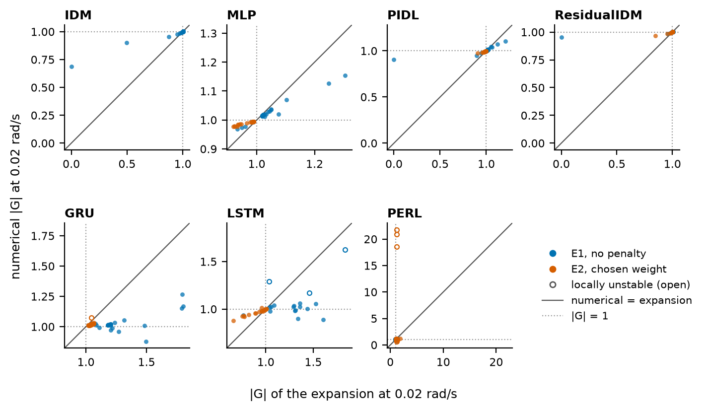

Figure `lowfreq_expansion`: Low-frequency expansion of the gain (D115). Fold-0 runs of E1 (no penalty) and of the chosen E2 weight (D85; idm: E1 only) on follownet_highd, seed 0: at every grid speed with an equilibrium, the numerical gain |G| of the audit (stability.json) at the lowest audit frequency 0.02 rad/s (y) against the expansion |G| = sqrt(max(0, 1 - ω² M / f_s²)), M = f_v² + 2 f_v f_dv - 2 f_s, from the stored partial derivatives (memoryless view for GRU, LSTM and PERL) (x); open markers: equilibria that are not locally stable in the memoryless view (no stationary response). Solid line: numerical = expansion; dotted: |G| = 1 (points in the upper left and lower right quadrants have a different sign of |G| - 1). Speeds whose rollout at that frequency was clipped, stopped or collided are left out (16 of 324). Numbers at the three lowest frequencies: table lowfreq_expansion. ([PDF](supplement/figures/lowfreq_expansion.pdf)).

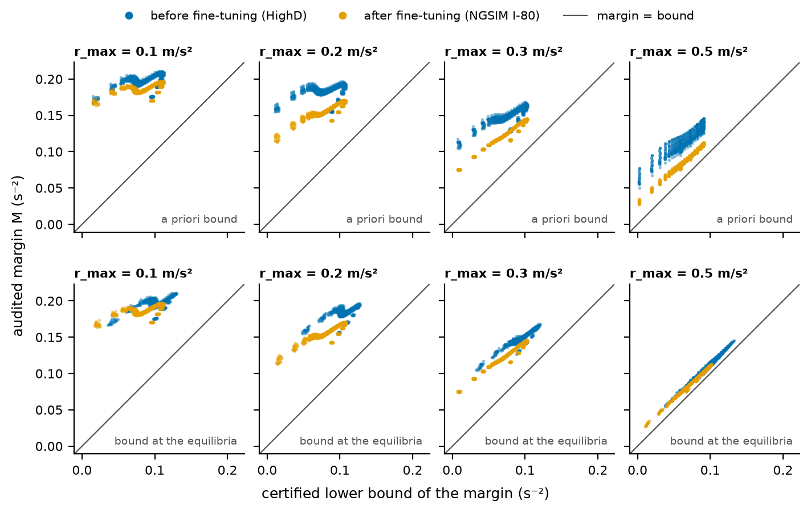

Figure `certificate_tightness`: Tightness of the certificate of E4 (D116): per grid speed of every run of the certified hybrid (ResidualIDM with the margin core and the certified budget; e4_stable and e4_stable_r{0.1, 0.2, 0.5} on HighD before fine-tuning, e4_stable_ft and e4_stable_ft_r{0.1, 0.2, 0.5} on NGSIM I-80 after; 5 folds x 5 seeds each) the audited margin M of the hybrid (analytic criterion of the audit; y) against the certified lower bound of certificate.json (x). Columns: residual amplitude r_max; top row: the a priori bound (every speed with an equilibrium), bottom row: the bound at the anchored equilibria. Line: margin = bound; a point below it would violate the certificate (0 of 10068 points). Table certificate_tightness: slack per r_max, stage and bound. ([PDF](supplement/figures/certificate_tightness.pdf)).

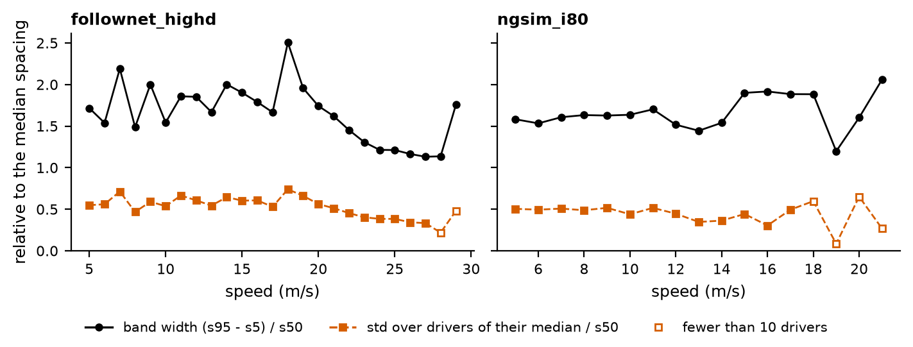

Figure `band_width`: The price of a common equilibrium (D123 part a): per grid speed, the relative width (s95 - s5) / s50 of the spacing band of the data (D78: quantiles of the near-steady samples, |dv| < 0.5 m/s, |a| < 0.3 m/s², within 0.5 m/s of the speed; all events of the set, speeds with at least 200 samples) and the standard deviation over the drivers with at least 20 near-steady samples at that speed of their median near-steady spacing, divided by s50 (open squares: fewer than 10 drivers). Left: follownet_highd, right: ngsim_i80. follownet_highd has no driver ids: every 15-s event is its own driver (D19). Numbers: table band_width. ([PDF](supplement/figures/band_width.pdf)).

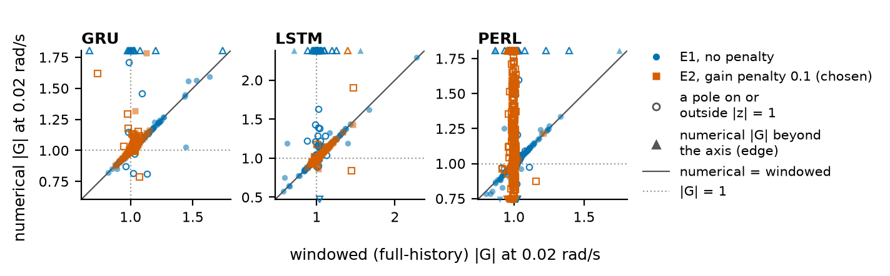

Figure `full_history_gain`: Full-history linearisation of the recurrent laws against the audit (M9). Every grid speed with an equilibrium of every E1 run (no penalty) and E2 run (gain penalty, chosen weight 0.1) of GRU, LSTM and PERL on follownet_highd (five folds x five seeds): the gain of the follower speed at 0.02 rad/s, the lowest audit frequency, from the numerical rollout of the audit (y) against the gain |G(e^(iω dt))| of the linearised two-vehicle loop with the whole 30-state history (x; the history Jacobian of the network, semi-implicit Euler at 0.1 s, transfer_windowed). Filled markers: all 31 closed-loop poles inside the unit circle; open markers: a pole on or outside it (the loop is not locally stable, the rollout grows instead of settling and the two gains need not agree; 900 of 3717 points). Axes per panel over the range of its windowed gains; 252 numerical gains above the upper limit and 54 below the lower one are drawn on the edge as triangles. Solid line: numerical = windowed; dotted: |G| = 1. Where all poles are inside and the rollout is not clipped, stopped or collided, |numerical - windowed| has median / 90 % quantile (E1) GRU 8e-05 / 9e-04, LSTM 1e-04 / 2e-03, PERL 4e-05 / 1e-03. 21 of these 2815 points (E1 and E2) differ by more than 0.05; their rollouts are not sinusoidal (fit residual of the audit 0.07 or more, against a median of 1e-03 elsewhere): a finite-amplitude response, the gap moving by |1 - G| A / ω with A / ω = 10 m at A = 0.2 m/s and 0.02 rad/s. Share of the speeds with all poles inside, E1 / E2 (mean over the runs): GRU 0.96 / 0.74, LSTM 0.90 / 0.98, PERL 0.86 / 0.12. The combined arm (D110) and the intervals: table full_history (runs/_tables/m9). ([PDF](supplement/figures/full_history_gain.pdf)).

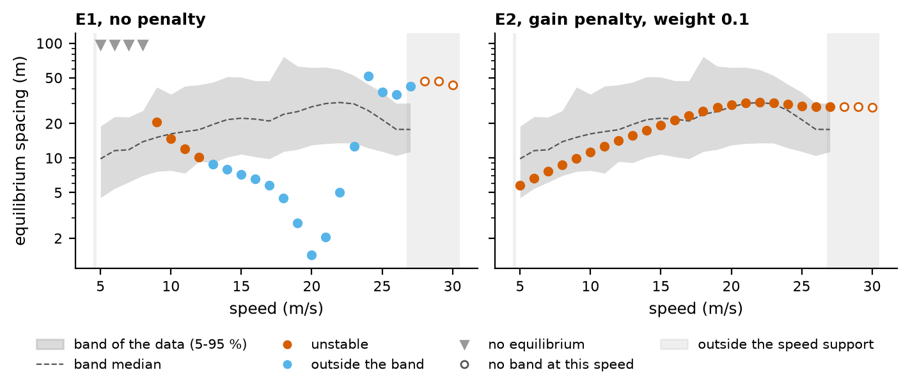

Figure `stability_map_gru`: Equilibria of the GRU of fold 0 (follownet_highd, seed 0) on the speed grid: E1, no penalty (e1) and E2, gain penalty, weight 0.1 (e2_gain_w0.1), one panel each. Grey strip: spacing band of the training data of the fold (5-95 % quantiles of the near-steady samples, D78; linear between the grid speeds), dashed: its median (metrics.json); points: the equilibrium of every grid speed (searched inside the band where the speed has one, D79), coloured by the status of the audit with the numerical rule (gain above 1.02): stable or unstable inside the band, outside the band (the first equilibrium of 1-200 m), none (no equilibrium: triangle at the top of the panel); open markers: speeds without band; shaded: speeds outside the 1-99 % speed range of the training data. Log spacing axis. Speeds by status over both panels: none 4, unstable 33, outside 15. ([PDF](supplement/figures/stability_map_gru.pdf)).

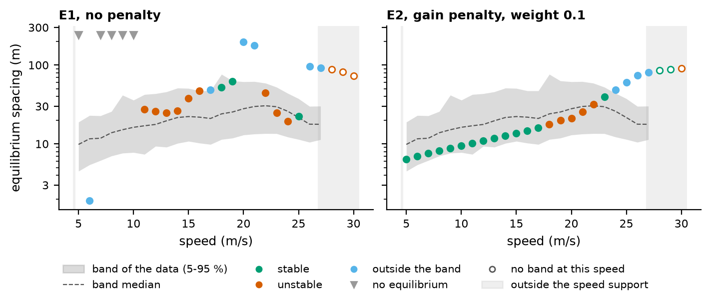

Figure `stability_map_lstm`: Equilibria of the LSTM of fold 0 (follownet_highd, seed 0) on the speed grid: E1, no penalty (e1) and E2, gain penalty, weight 0.1 (e2_gain_w0.1), one panel each. Grey strip: spacing band of the training data of the fold (5-95 % quantiles of the near-steady samples, D78; linear between the grid speeds), dashed: its median (metrics.json); points: the equilibrium of every grid speed (searched inside the band where the speed has one, D79), coloured by the status of the audit with the numerical rule (gain above 1.02): stable or unstable inside the band, outside the band (the first equilibrium of 1-200 m), none (no equilibrium: triangle at the top of the panel); open markers: speeds without band; shaded: speeds outside the 1-99 % speed range of the training data. Log spacing axis. Speeds by status over both panels: none 5, outside 10, unstable 18, stable 19. ([PDF](supplement/figures/stability_map_lstm.pdf)).

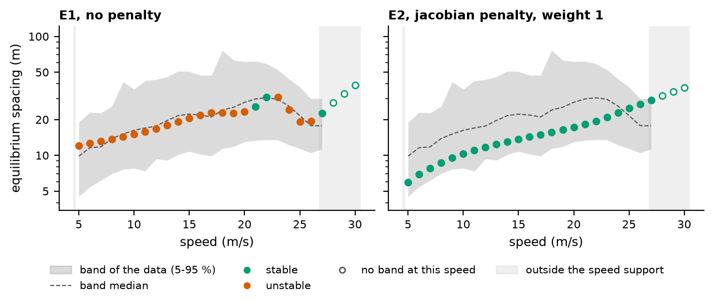

Figure `stability_map_mlp`: Equilibria of the MLP of fold 0 (follownet_highd, seed 0) on the speed grid: E1, no penalty (e1) and E2, jacobian penalty, weight 1 (e2_jacobian_w1), one panel each. Grey strip: spacing band of the training data of the fold (5-95 % quantiles of the near-steady samples, D78; linear between the grid speeds), dashed: its median (metrics.json); points: the equilibrium of every grid speed (searched inside the band where the speed has one, D79), coloured by the status of the audit with the numerical rule (gain above 1.02): stable or unstable inside the band, outside the band (the first equilibrium of 1-200 m), none (no equilibrium: triangle at the top of the panel); open markers: speeds without band; shaded: speeds outside the 1-99 % speed range of the training data. Log spacing axis. Speeds by status over both panels: unstable 20, stable 32. ([PDF](supplement/figures/stability_map_mlp.pdf)).

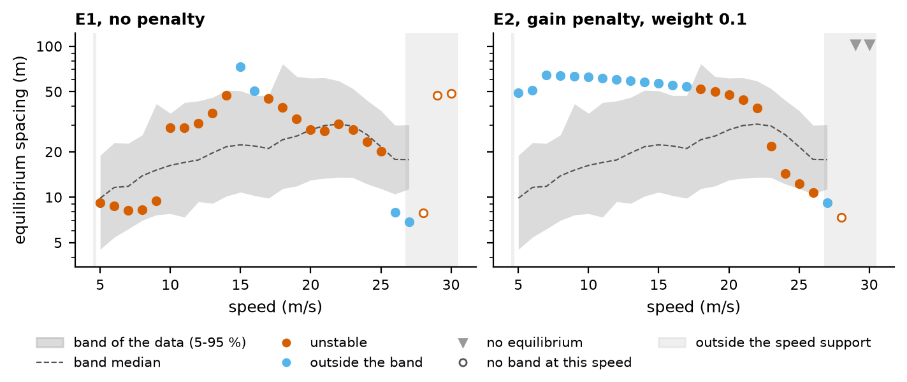

Figure `stability_map_perl`: Equilibria of the PERL of fold 0 (follownet_highd, seed 0) on the speed grid: E1, no penalty (e1) and E2, gain penalty, weight 0.1 (e2_gain_w0.1), one panel each. Grey strip: spacing band of the training data of the fold (5-95 % quantiles of the near-steady samples, D78; linear between the grid speeds), dashed: its median (metrics.json); points: the equilibrium of every grid speed (searched inside the band where the speed has one, D79), coloured by the status of the audit with the numerical rule (gain above 1.02): stable or unstable inside the band, outside the band (the first equilibrium of 1-200 m), none (no equilibrium: triangle at the top of the panel); open markers: speeds without band; shaded: speeds outside the 1-99 % speed range of the training data. Log spacing axis. Speeds by status over both panels: unstable 32, outside 18, none 2. ([PDF](supplement/figures/stability_map_perl.pdf)).

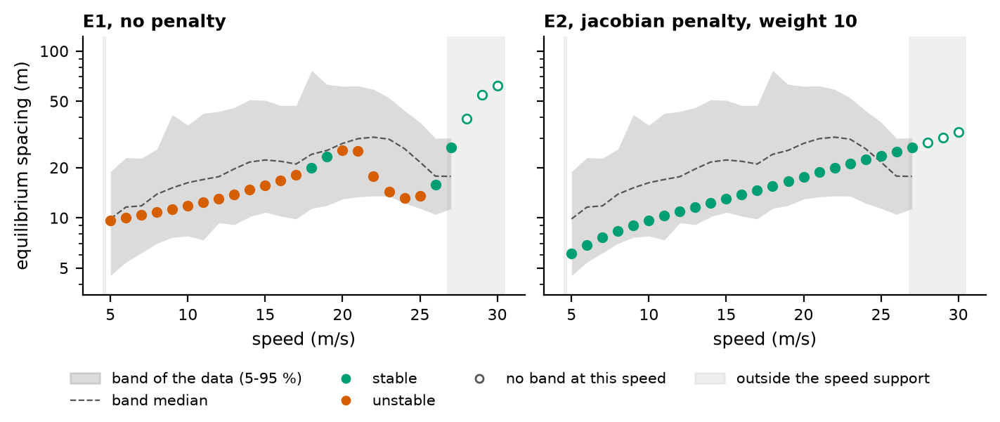

Figure `stability_map_pidl`: Equilibria of the PIDL of fold 0 (follownet_highd, seed 0) on the speed grid: E1, no penalty (e1) and E2, jacobian penalty, weight 10 (e2_jacobian_w10), one panel each. Grey strip: spacing band of the training data of the fold (5-95 % quantiles of the near-steady samples, D78; linear between the grid speeds), dashed: its median (metrics.json); points: the equilibrium of every grid speed (searched inside the band where the speed has one, D79), coloured by the status of the audit with the numerical rule (gain above 1.02): stable or unstable inside the band, outside the band (the first equilibrium of 1-200 m), none (no equilibrium: triangle at the top of the panel); open markers: speeds without band; shaded: speeds outside the 1-99 % speed range of the training data. Log spacing axis. Speeds by status over both panels: unstable 19, stable 33. ([PDF](supplement/figures/stability_map_pidl.pdf)).

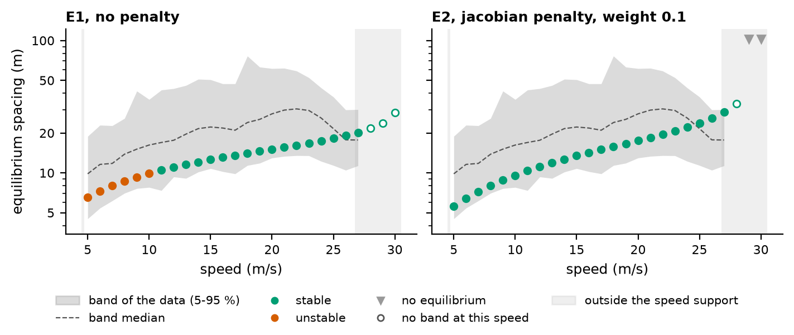

Figure `stability_map_residual_idm`: Equilibria of the ResidualIDM of fold 0 (follownet_highd, seed 0) on the speed grid: E1, no penalty (e1) and E2, jacobian penalty, weight 0.1 (e2_jacobian_w0.1), one panel each. Grey strip: spacing band of the training data of the fold (5-95 % quantiles of the near-steady samples, D78; linear between the grid speeds), dashed: its median (metrics.json); points: the equilibrium of every grid speed (searched inside the band where the speed has one, D79), coloured by the status of the audit with the numerical rule (gain above 1.02): stable or unstable inside the band, outside the band (the first equilibrium of 1-200 m), none (no equilibrium: triangle at the top of the panel); open markers: speeds without band; shaded: speeds outside the 1-99 % speed range of the training data. Log spacing axis. Speeds by status over both panels: unstable 6, stable 44, none 2. ([PDF](supplement/figures/stability_map_residual_idm.pdf)).

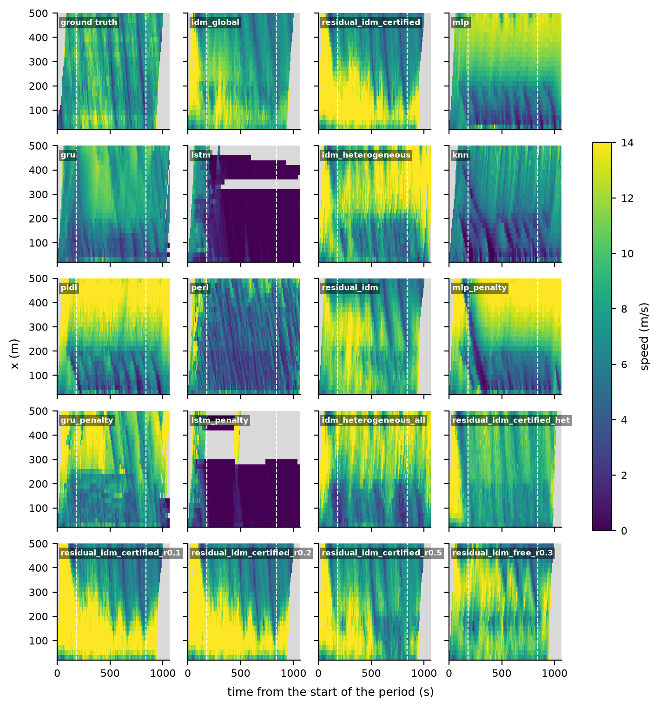

Figure `contours_i80_p0`: Speed fields of I-80, period 0 (scenario i80_p0): x-t Edie speed of 20 m x 2 s cells over the lanes 1, 2, 3, 4, 5, 6 together (as the wave field of the metrics, raw cells), one colour scale 0-14 m/s (the 99 % quantile of the ground truth), cells without a vehicle grey; dashed: the analysis window 180-840 s. Panels: the ground truth (first panel) and every law with a run of seed 0 (19): idm_global, residual_idm_certified, mlp, gru, lstm, idm_heterogeneous, knn, pidl, perl, residual_idm, mlp_penalty, gru_penalty, lstm_penalty, idm_heterogeneous_all, residual_idm_certified_het, residual_idm_certified_r0.1, residual_idm_certified_r0.2, residual_idm_certified_r0.5, residual_idm_free_r0.3.

Notes: corridor i80_p0: not drawn (the variants of the controlled ablation, design.ablation_laws): idm_core_margin, idm_margin_i80, residual_idm_margin_free_r0.3. corridor i80_p0: no seed0 run of idm_global_p0, residual_idm_certified_p0, mlp_p0, gru_p0. ([PDF](supplement/figures/contours_i80_p0.pdf)).

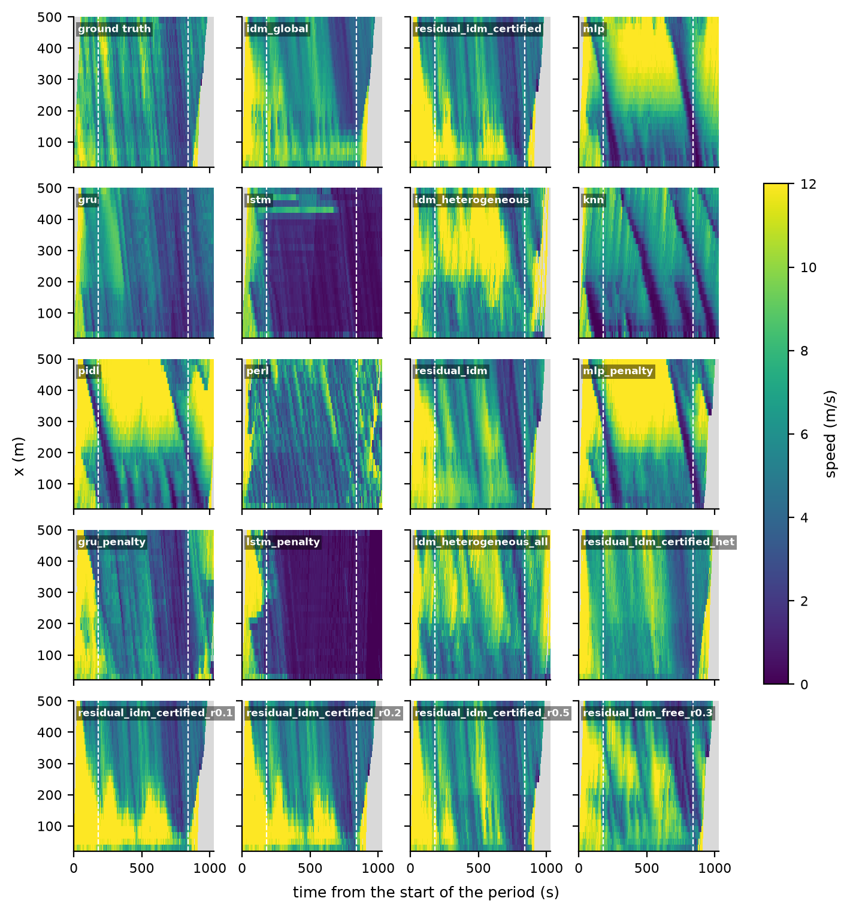

Figure `contours_i80_p1`: Speed fields of I-80, period 1 (scenario i80_p1): x-t Edie speed of 20 m x 2 s cells over the lanes 1, 2, 3, 4, 5, 6 together (as the wave field of the metrics, raw cells), one colour scale 0-12 m/s (the 99 % quantile of the ground truth), cells without a vehicle grey; dashed: the analysis window 180-840 s. Panels: the ground truth (first panel) and every law with a run of seed 0 (19): idm_global, residual_idm_certified, mlp, gru, lstm, idm_heterogeneous, knn, pidl, perl, residual_idm, mlp_penalty, gru_penalty, lstm_penalty, idm_heterogeneous_all, residual_idm_certified_het, residual_idm_certified_r0.1, residual_idm_certified_r0.2, residual_idm_certified_r0.5, residual_idm_free_r0.3.

Notes: corridor i80_p1: not drawn (the variants of the controlled ablation, design.ablation_laws): idm_core_margin, idm_margin_i80, residual_idm_margin_free_r0.3. corridor i80_p1: 23 laws, 19 panels: left out idm_global_p0, residual_idm_certified_p0, mlp_p0, gru_p0. ([PDF](supplement/figures/contours_i80_p1.pdf)).

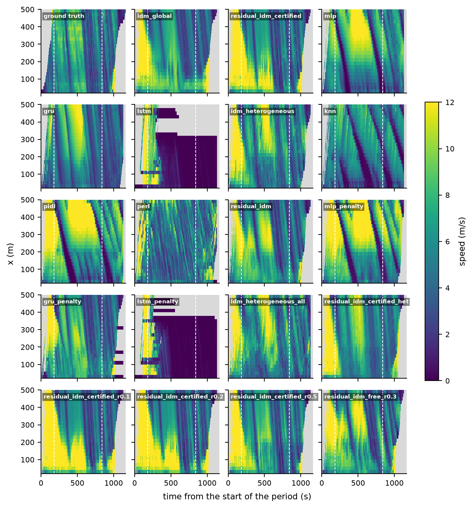

Figure `contours_i80_p2`: Speed fields of I-80, period 2 (scenario i80_p2): x-t Edie speed of 20 m x 2 s cells over the lanes 1, 2, 3, 4, 5, 6 together (as the wave field of the metrics, raw cells), one colour scale 0-12 m/s (the 99 % quantile of the ground truth), cells without a vehicle grey; dashed: the analysis window 180-840 s. Panels: the ground truth (first panel) and every law with a run of seed 0 (19): idm_global, residual_idm_certified, mlp, gru, lstm, idm_heterogeneous, knn, pidl, perl, residual_idm, mlp_penalty, gru_penalty, lstm_penalty, idm_heterogeneous_all, residual_idm_certified_het, residual_idm_certified_r0.1, residual_idm_certified_r0.2, residual_idm_certified_r0.5, residual_idm_free_r0.3.

Notes: corridor i80_p2: not drawn (the variants of the controlled ablation, design.ablation_laws): idm_core_margin, idm_margin_i80, residual_idm_margin_free_r0.3. corridor i80_p2: 23 laws, 19 panels: left out idm_global_p0, residual_idm_certified_p0, mlp_p0, gru_p0. ([PDF](supplement/figures/contours_i80_p2.pdf)).

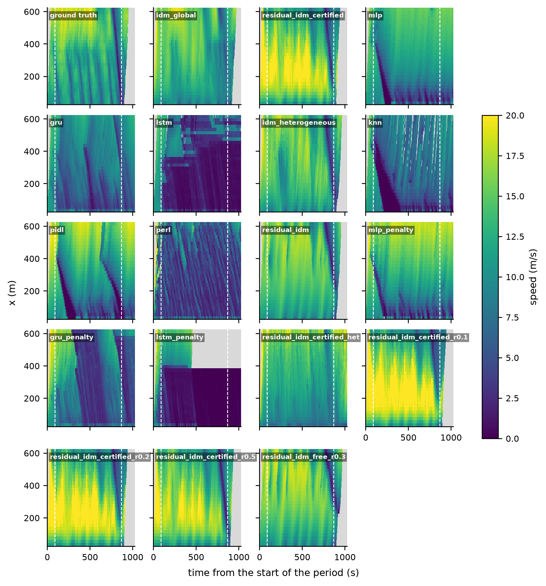

Figure `contours_us101_p0`: Speed fields of US-101, period 0 (scenario us101_p0): x-t Edie speed of 20 m x 2 s cells over the lanes 1, 2, 3, 4, 5 together (as the wave field of the metrics, raw cells), one colour scale 0-20 m/s (the 99 % quantile of the ground truth), cells without a vehicle grey; dashed: the analysis window 90-870 s. Panels: the ground truth (first panel) and every law with a run of seed 0 (18): idm_global, residual_idm_certified, mlp, gru, lstm, idm_heterogeneous, knn, pidl, perl, residual_idm, mlp_penalty, gru_penalty, lstm_penalty, residual_idm_certified_het, residual_idm_certified_r0.1, residual_idm_certified_r0.2, residual_idm_certified_r0.5, residual_idm_free_r0.3.

Notes: corridor us101_p0: not drawn (the variants of the controlled ablation, design.ablation_laws): idm_core_margin, idm_margin_i80, residual_idm_margin_free_r0.3. ([PDF](supplement/figures/contours_us101_p0.pdf)).

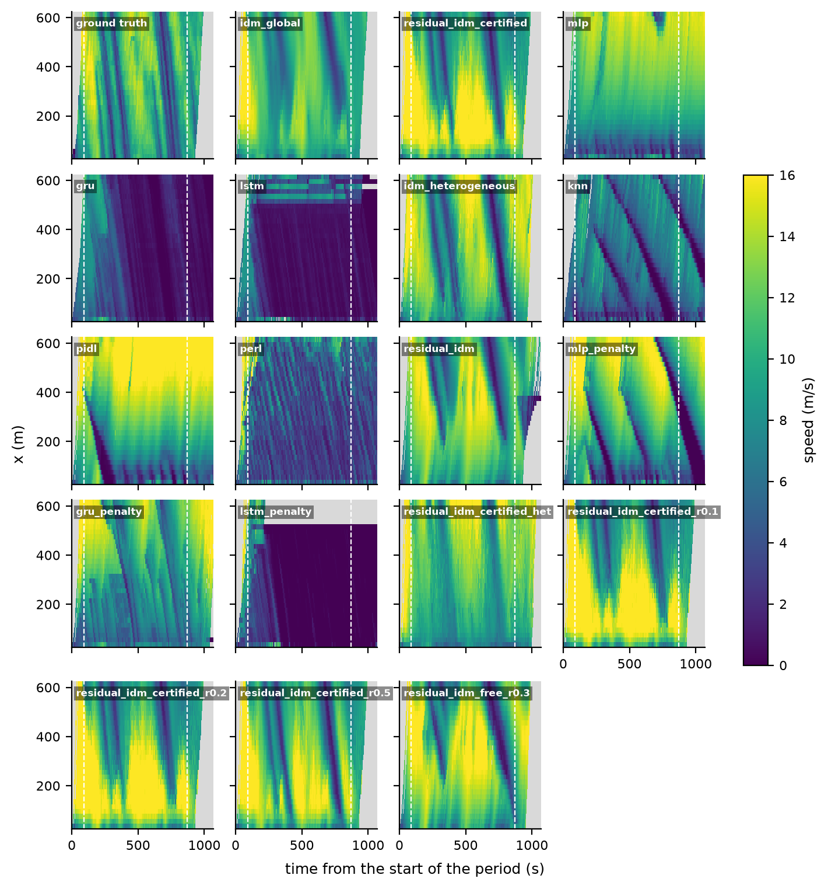

Figure `contours_us101_p1`: Speed fields of US-101, period 1 (scenario us101_p1): x-t Edie speed of 20 m x 2 s cells over the lanes 1, 2, 3, 4, 5 together (as the wave field of the metrics, raw cells), one colour scale 0-16 m/s (the 99 % quantile of the ground truth), cells without a vehicle grey; dashed: the analysis window 90-870 s. Panels: the ground truth (first panel) and every law with a run of seed 0 (18): idm_global, residual_idm_certified, mlp, gru, lstm, idm_heterogeneous, knn, pidl, perl, residual_idm, mlp_penalty, gru_penalty, lstm_penalty, residual_idm_certified_het, residual_idm_certified_r0.1, residual_idm_certified_r0.2, residual_idm_certified_r0.5, residual_idm_free_r0.3.

Notes: corridor us101_p1: not drawn (the variants of the controlled ablation, design.ablation_laws): idm_core_margin, idm_margin_i80, residual_idm_margin_free_r0.3. ([PDF](supplement/figures/contours_us101_p1.pdf)).

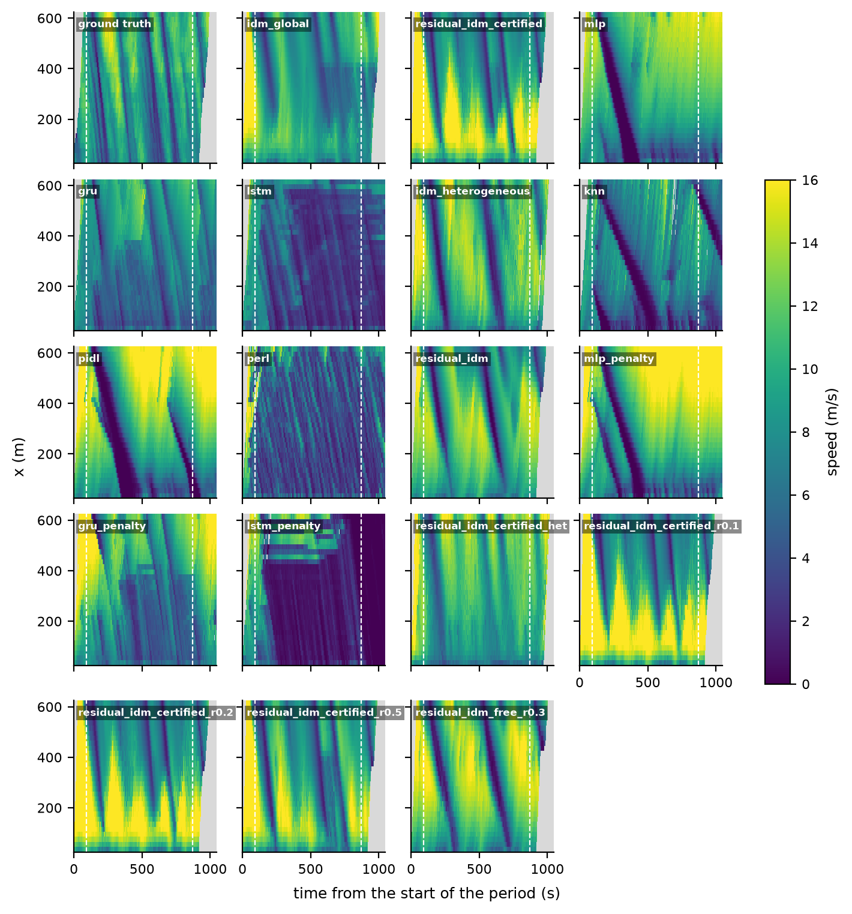

Figure `contours_us101_p2`: Speed fields of US-101, period 2 (scenario us101_p2): x-t Edie speed of 20 m x 2 s cells over the lanes 1, 2, 3, 4, 5 together (as the wave field of the metrics, raw cells), one colour scale 0-16 m/s (the 99 % quantile of the ground truth), cells without a vehicle grey; dashed: the analysis window 90-870 s. Panels: the ground truth (first panel) and every law with a run of seed 0 (18): idm_global, residual_idm_certified, mlp, gru, lstm, idm_heterogeneous, knn, pidl, perl, residual_idm, mlp_penalty, gru_penalty, lstm_penalty, residual_idm_certified_het, residual_idm_certified_r0.1, residual_idm_certified_r0.2, residual_idm_certified_r0.5, residual_idm_free_r0.3.

Notes: corridor us101_p2: not drawn (the variants of the controlled ablation, design.ablation_laws): idm_core_margin, idm_margin_i80, residual_idm_margin_free_r0.3. ([PDF](supplement/figures/contours_us101_p2.pdf)).

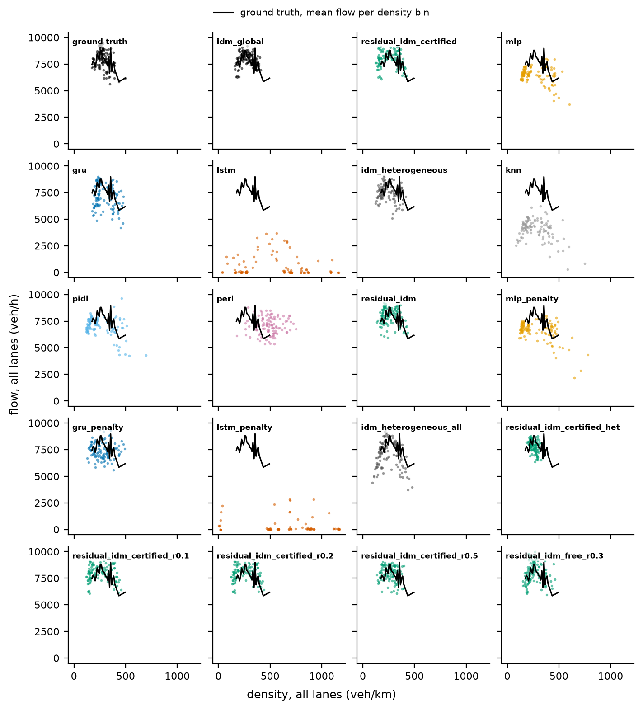

Figure `fd_i80_p0`: Fundamental diagrams of I-80, period 0 (scenario i80_p0): flow against density of the Edie cells (100 m x 30 s, all lanes together, the section 20-500 m and the analysis window 180-840 s, as the metrics of M5); black line on every panel: the mean flow of the ground truth per density bin of 10 veh/km (bin centres). Panels: the ground truth first, then every law with a run of seed 0 (19): idm_global, residual_idm_certified, mlp, gru, lstm, idm_heterogeneous, knn, pidl, perl, residual_idm, mlp_penalty, gru_penalty, lstm_penalty, idm_heterogeneous_all, residual_idm_certified_het, residual_idm_certified_r0.1, residual_idm_certified_r0.2, residual_idm_certified_r0.5, residual_idm_free_r0.3.

Notes: corridor i80_p0: not drawn (the variants of the controlled ablation, design.ablation_laws): idm_core_margin, idm_margin_i80, residual_idm_margin_free_r0.3. corridor i80_p0: no seed0 run of idm_global_p0, residual_idm_certified_p0, mlp_p0, gru_p0. ([PDF](supplement/figures/fd_i80_p0.pdf)).

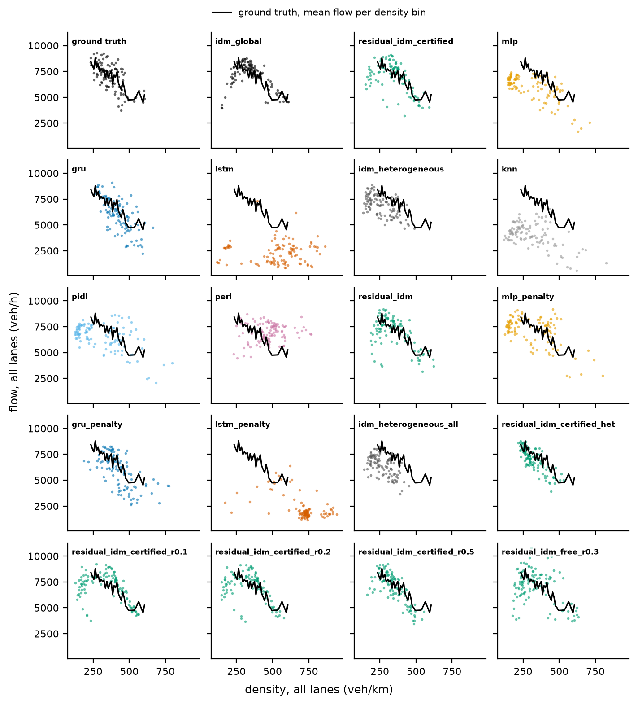

Figure `fd_i80_p1`: Fundamental diagrams of I-80, period 1 (scenario i80_p1): flow against density of the Edie cells (100 m x 30 s, all lanes together, the section 20-500 m and the analysis window 180-840 s, as the metrics of M5); black line on every panel: the mean flow of the ground truth per density bin of 10 veh/km (bin centres). Panels: the ground truth first, then every law with a run of seed 0 (19): idm_global, residual_idm_certified, mlp, gru, lstm, idm_heterogeneous, knn, pidl, perl, residual_idm, mlp_penalty, gru_penalty, lstm_penalty, idm_heterogeneous_all, residual_idm_certified_het, residual_idm_certified_r0.1, residual_idm_certified_r0.2, residual_idm_certified_r0.5, residual_idm_free_r0.3.

Notes: corridor i80_p1: not drawn (the variants of the controlled ablation, design.ablation_laws): idm_core_margin, idm_margin_i80, residual_idm_margin_free_r0.3. corridor i80_p1: 23 laws, 19 panels: left out idm_global_p0, residual_idm_certified_p0, mlp_p0, gru_p0. ([PDF](supplement/figures/fd_i80_p1.pdf)).

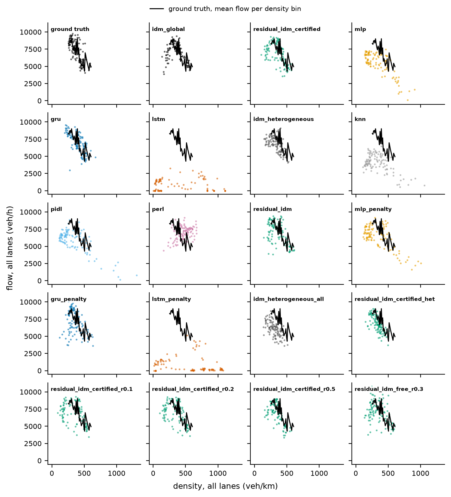

Figure `fd_i80_p2`: Fundamental diagrams of I-80, period 2 (scenario i80_p2): flow against density of the Edie cells (100 m x 30 s, all lanes together, the section 20-500 m and the analysis window 180-840 s, as the metrics of M5); black line on every panel: the mean flow of the ground truth per density bin of 10 veh/km (bin centres). Panels: the ground truth first, then every law with a run of seed 0 (19): idm_global, residual_idm_certified, mlp, gru, lstm, idm_heterogeneous, knn, pidl, perl, residual_idm, mlp_penalty, gru_penalty, lstm_penalty, idm_heterogeneous_all, residual_idm_certified_het, residual_idm_certified_r0.1, residual_idm_certified_r0.2, residual_idm_certified_r0.5, residual_idm_free_r0.3.

Notes: corridor i80_p2: not drawn (the variants of the controlled ablation, design.ablation_laws): idm_core_margin, idm_margin_i80, residual_idm_margin_free_r0.3. corridor i80_p2: 23 laws, 19 panels: left out idm_global_p0, residual_idm_certified_p0, mlp_p0, gru_p0. ([PDF](supplement/figures/fd_i80_p2.pdf)).

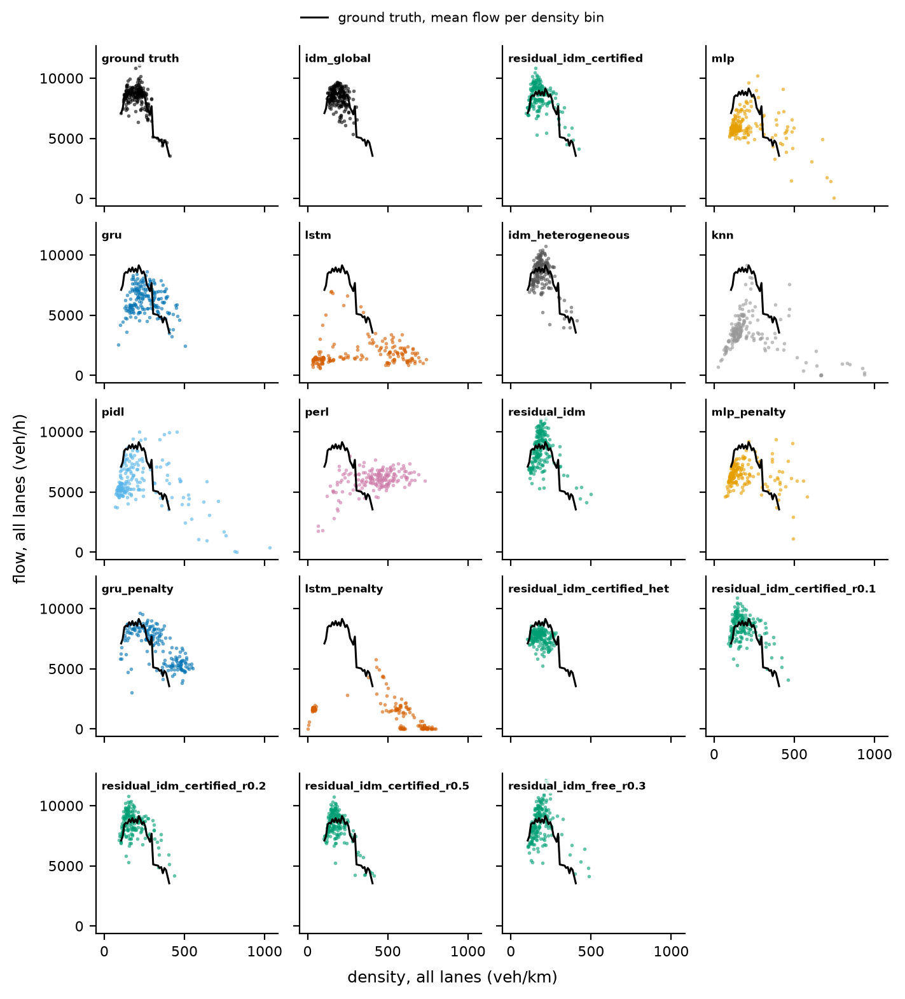

Figure `fd_us101_p0`: Fundamental diagrams of US-101, period 0 (scenario us101_p0): flow against density of the Edie cells (100 m x 30 s, all lanes together, the section 25-640 m and the analysis window 90-870 s, as the metrics of M5); black line on every panel: the mean flow of the ground truth per density bin of 10 veh/km (bin centres). Panels: the ground truth first, then every law with a run of seed 0 (18): idm_global, residual_idm_certified, mlp, gru, lstm, idm_heterogeneous, knn, pidl, perl, residual_idm, mlp_penalty, gru_penalty, lstm_penalty, residual_idm_certified_het, residual_idm_certified_r0.1, residual_idm_certified_r0.2, residual_idm_certified_r0.5, residual_idm_free_r0.3.

Notes: corridor us101_p0: not drawn (the variants of the controlled ablation, design.ablation_laws): idm_core_margin, idm_margin_i80, residual_idm_margin_free_r0.3. ([PDF](supplement/figures/fd_us101_p0.pdf)).

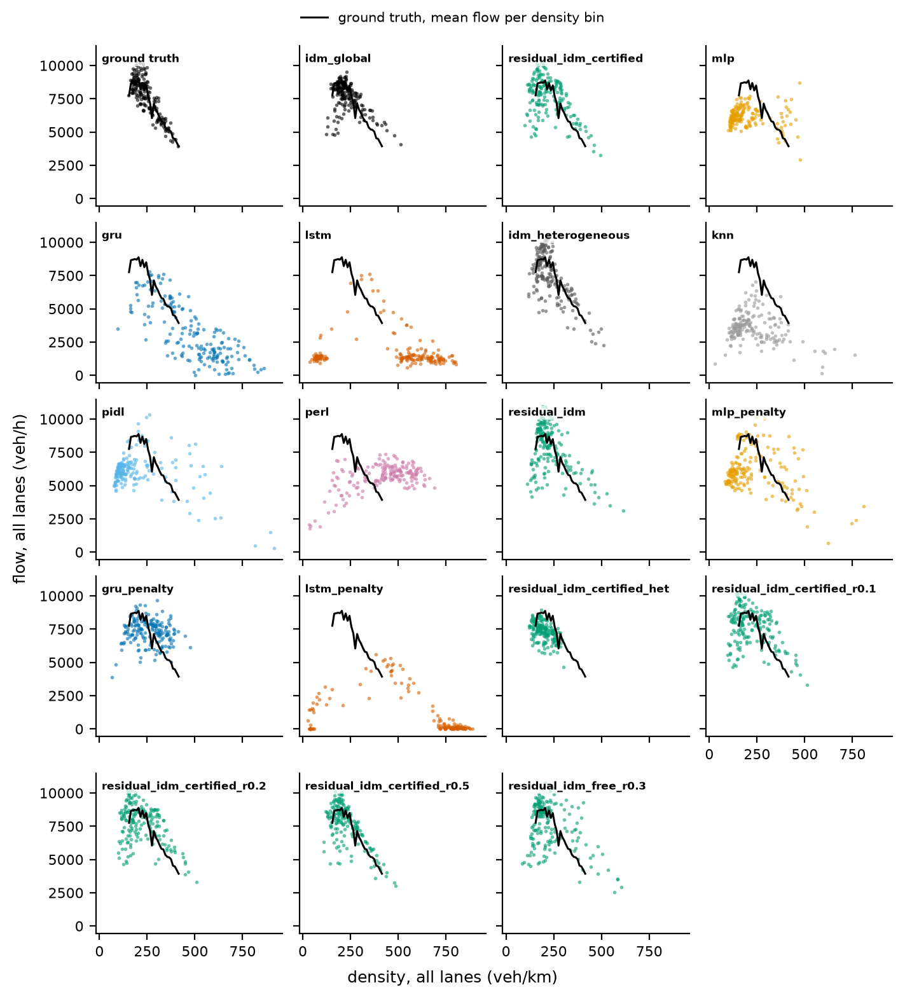

Figure `fd_us101_p1`: Fundamental diagrams of US-101, period 1 (scenario us101_p1): flow against density of the Edie cells (100 m x 30 s, all lanes together, the section 25-640 m and the analysis window 90-870 s, as the metrics of M5); black line on every panel: the mean flow of the ground truth per density bin of 10 veh/km (bin centres). Panels: the ground truth first, then every law with a run of seed 0 (18): idm_global, residual_idm_certified, mlp, gru, lstm, idm_heterogeneous, knn, pidl, perl, residual_idm, mlp_penalty, gru_penalty, lstm_penalty, residual_idm_certified_het, residual_idm_certified_r0.1, residual_idm_certified_r0.2, residual_idm_certified_r0.5, residual_idm_free_r0.3.

Notes: corridor us101_p1: not drawn (the variants of the controlled ablation, design.ablation_laws): idm_core_margin, idm_margin_i80, residual_idm_margin_free_r0.3. ([PDF](supplement/figures/fd_us101_p1.pdf)).

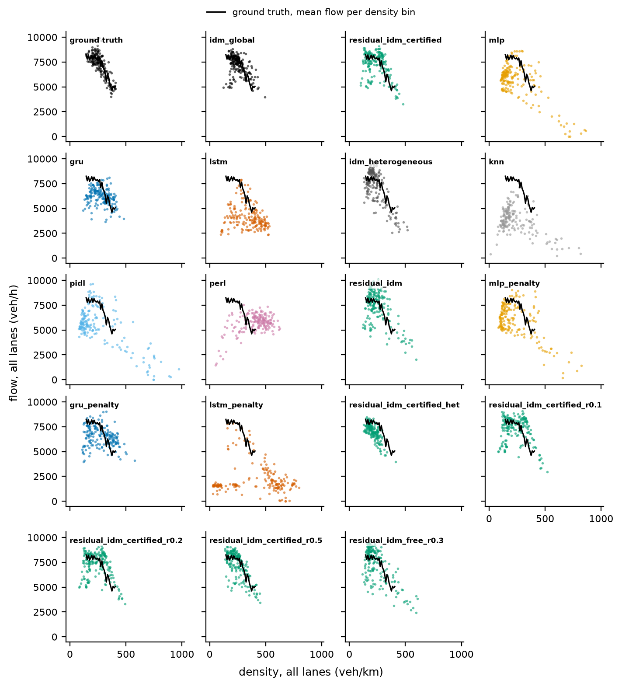

Figure `fd_us101_p2`: Fundamental diagrams of US-101, period 2 (scenario us101_p2): flow against density of the Edie cells (100 m x 30 s, all lanes together, the section 25-640 m and the analysis window 90-870 s, as the metrics of M5); black line on every panel: the mean flow of the ground truth per density bin of 10 veh/km (bin centres). Panels: the ground truth first, then every law with a run of seed 0 (18): idm_global, residual_idm_certified, mlp, gru, lstm, idm_heterogeneous, knn, pidl, perl, residual_idm, mlp_penalty, gru_penalty, lstm_penalty, residual_idm_certified_het, residual_idm_certified_r0.1, residual_idm_certified_r0.2, residual_idm_certified_r0.5, residual_idm_free_r0.3.

Notes: corridor us101_p2: not drawn (the variants of the controlled ablation, design.ablation_laws): idm_core_margin, idm_margin_i80, residual_idm_margin_free_r0.3. ([PDF](supplement/figures/fd_us101_p2.pdf)).


## Notes on missing inputs

None.
